# Power BI Desktop 中的彙總

使用 Power BI 的**彙總**能以過去不可能的方式啟用巨量資料互動式分析。 **彙總**可以大幅降低解除鎖定制定決策之大型資料集的成本。

下列清單提供使用**彙總**的優點：

* **查詢巨量資料效能**：當使用者與 Power BI 報表中的視覺效果進行互動時，系統會將 DAX 查詢提交至資料集。 在彙總層級快取資料，使用一小部分詳細資料層級所需的資源來提升查詢速度。 使用其他方式則可能無法將巨量資料解除鎖定。
* **資料重新整理最佳化** - 在彙總層級快取資料，以減少快取大小和重新整理次數。 加快提供使用者資料的時間。
* **達到平衡的架構** - 允許 Power BI 記憶體內部快取處理彙總的查詢，這很有效率。 限制 DirectQuery 模式中傳送至資料來源的查詢，有利保持並行限制。 通過的查詢通常會經過篩選 (交易式層級的查詢)，資料倉儲和巨量資料系統一般能正常處理它們。

### 資料表層級的儲存體
資料表層級的儲存體通常搭配彙總功能使用。 如需詳細資訊，請參閱 [Power BI Desktop 的儲存模式](desktop-storage-mode.md)一文。

### 資料來源類型
彙總可搭配資料來源代表維度模型，例如資料倉儲、資料超市，以及 Hadoop 型巨量資料來源。 本文描述每種資料來源類型在 Power BI 中的一般建模差異。

所有的 Power BI Import 和 (非多維度的) DirectQuery 來源都使用彙總。

## 以關聯性為基礎的彙總

以關聯性為基礎的**彙總**通常會搭配維度模型使用。 來自資料倉儲和資料超市的 Power BI 資料集類似具有維度資料表與事實資料表間關聯性的星狀/雪花式結構描述。

請考慮下列模型，它來自單一資料來源。 假設所有資料表都使用 DirectQuery 開始。 **銷售**事實資料表包含數十億筆資料列。 將 **Sales** 的儲存模式設定成 **Import** 供快取，會耗用大量的記憶體和管理額外負荷。

相反地，我們會建立 **Sales Agg** 資料表作為彙總資料表。 它的資料粒度比 **Sales** 更高，因此包含的資料列更少。 資料列數目應該等於 **SalesAmount** 的總和，這是 **CustomerKey**、**DateKey** 以及 **ProductSubcategoryKey** 的組合。 它沒有數十億，可能只有數百萬筆資料列，更容易管理。

假設下列維度資料表最常用於高商業價值的查詢。 這些資料表可以使用「一對多」  (或「多對一」  ) 關聯性來篩選 **Sales Agg**。

* 地理位置
* 客戶
* 日期
* 產品子類別
* 產品類別

下圖顯示此模型。

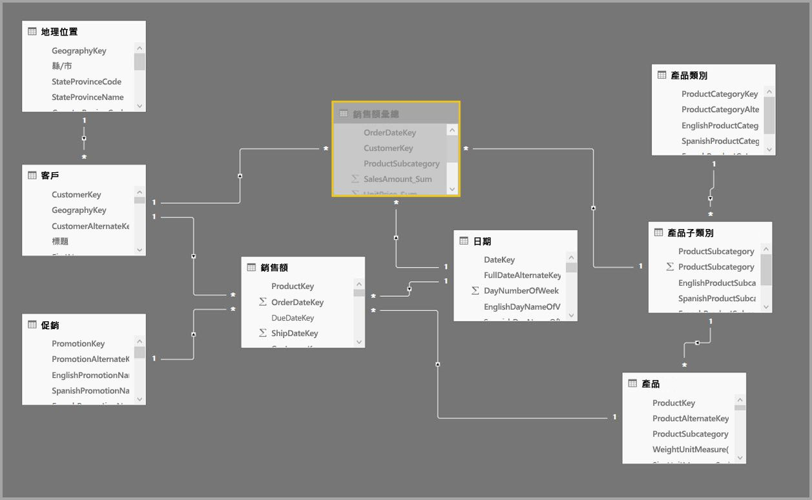

> [!NOTE]
> **Sales Agg** 資料表不過是另一份資料表，所以它可以各種方式靈活載入。 例如，在來源資料庫中可使用 ETL/ELT 程序執行彙總，或由資料表 [M 運算式](https://msdn.microsoft.com/query-bi/m/power-query-m-reference)執行彙總。 它可以使用包含或不含 [Power BI Premium 中的累加式重新整理](service-premium-incremental-refresh.md) 的 Import 儲存模式，或可為 DirectQuery 且使用[資料行存放區索引](https://docs.microsoft.com/sql/relational-databases/indexes/columnstore-indexes-overview)來最佳化快速查詢。 此彈性可讓已平衡的架構分散查詢負載，避免瓶頸。

### 儲存模式 
讓我們繼續正在使用的範例。 我們將 **Sales Agg** 的儲存模式設定為 **Import** 以加速查詢。

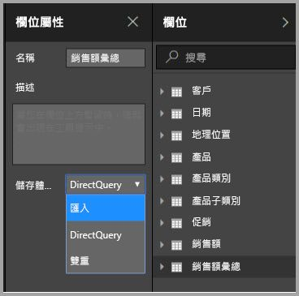

當我們這麼做時，下列對話方塊會出現，讓我們知道相關的維度資料表可以設定為儲存模式 **Dual**。 

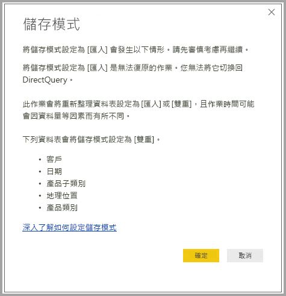

將其設定為 **Dual** 可讓相關的維度資料表作為 Import 或 DirectQuery，視子查詢而定。

* 查詢 Import 的 **Sales Agg** 資料表彙總計量，從記憶體內部快取傳回來自相關雙重資料表的屬性群組。
* 查詢 DirectQuery 的 **Sales** 資料表彙總計量，以 DirectQuery 模式傳回來自相關雙重資料表的屬性群組。 包含依作業分組的查詢邏輯會向下傳遞至來源資料庫。

如需 **Dual** 儲存模式的詳細資訊，請參閱[儲存模式](desktop-storage-mode.md)一文。

### 強與弱關聯性
根據關聯性叫用彙總需要強關聯性。

強關聯性包含下列組合，其中兩個資料表都是來自「單一來源」  。

| 位於*多邊的資料表 | 位於單  邊的資料表 |
| ------------- |----------------------| 
| 雙重          | 雙重                 | 
| 匯入        | 匯入或雙重       | 
| DirectQuery   | DirectQuery 或雙重  | 

只有在兩個資料表都是匯入的情況下，才會將「跨來源」  關聯性視為強。 多對多關聯性一律視為弱。

對於不依靠關聯性的「跨來源」  彙總叫用，請參閱下節有關以分組方式資料行為基礎的彙總。

### 無法定址彙總資料表
具有資料集唯讀存取權的使用者無法查詢彙總資料表。 這可避免與 RLS 搭配使用時的安全性疑慮。 取用者和查詢參考的是詳細資料資料表，而不是彙總資料表；他們甚至不需要知道彙總資料表的存在。

基於這個理由，**Sales Agg** 資料表應該是隱藏的。 如果不是，當您按一下 [全部套用] 按鈕時，[管理彙總] 對話方塊即會將它設為隱藏。

### [管理彙總] 對話方塊
接下來我們要定義彙總。 以滑鼠右鍵按一下資料表，選取 **Sales Agg** 資料表的 [管理彙總]  操作功能表。

![[管理彙總] 功能表選取項目](media/desktop-aggregations/aggregations_06.jpg)

[管理彙總]  對話方塊隨即出現。 **Sales Agg** 資料表的每個資料行都會顯示一筆資料列，我們可以在此指定彙總行為。 提交至 Power BI 資料集的查詢 (資料集名為 **Sales**)，會在內部重新導向至 **Sales Agg** 資料表。 資料集的取用者甚至不需要知道 **Sales Agg** 資料表的存在。

![[管理彙總] 對話方塊](media/desktop-aggregations/aggregations_07.jpg)

下表顯示 **Sales Agg** 資料表的彙總。

#### 摘要函式

[摘要] 下拉式清單提供下列值供您選取。
* 計數
* GroupBy
* 最大值
* 最小值
* 加總
* 計數表格列

#### 驗證

下列值得注意的驗證會由對話方塊強制執行：

* 除了計數和計數資料表資料列摘要函式之外，選取的詳細資料資料行必須和彙總資料行具有相同資料類型。 計數和計數資料表資料列僅供整數彙總資料行使用，資料類型不用相符。
* 不允許鏈結彙總涵蓋三份或更多的資料表。 例如，**資料表 B** 參考**資料表 C** 的彙總，您不可能在指向 B 的**資料表 A** 上設定彙總。
* 不允許重複彙總有兩個項目使用同一摘要函式，且參考相同的詳細資料資料表/資料行。
* 詳細資料表必須是 DirectQuery，不能是 Import。

這類驗證大部分都是透過停用下拉式清單中的值，並在工具提示中顯示說明文字來強制執行，如下圖所示。

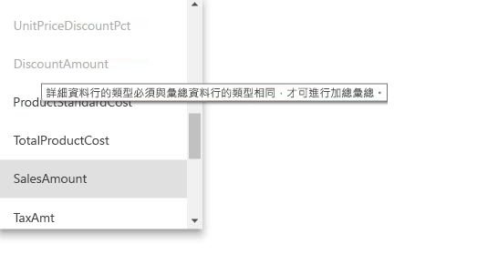

### 依資料行分組

在此範例中，三個 GroupBy 項目都是選用的，它們不會影響彙總行為 (除了 DISTINCTCOUNT 範例查詢，如下一張圖所示)。 它們主要是為了可讀性而包含在內。 沒有這些 GroupBy 項目，仍會根據關聯性叫用彙總。 這和使用無關聯性彙總是不同的行為，本文稍後的巨量資料範例會說明此行為。

### 非作用中的關聯性
系統不支援依非作用中關聯性所使用的外部索引鍵資料行進行群組，且不支援依賴 USERELATIONSHIP 函式來進行彙總叫用。

### 偵測查詢叫用或遺漏彙總

如需如何偵測查詢是從記憶體內部快取傳回 (儲存引擎) 或由使用 SQL Profiler 之 DirectQuery (發送到資料來源) 傳回的詳細資訊，請參閱[儲存模式](desktop-storage-mode.md)一文。 該程序也可用來偵測是否叫用彙總。

此外，SQL Profiler 會提供下列擴充事件。

    Query Processing\Aggregate Table Rewrite Query

下列 JSON 程式碼片段示範使用彙總時的事件輸出範例。

* **matchingResult** 顯示彙總已用於子查詢。
* **dataRequest** 顯示子查詢所使用的分組方式資料行和彙總資料行。
* **mapping** 顯示彙總資料表中已對應的資料行。

### 查詢範例
下列查詢叫用彙總，因為 *Date* 資料表中的資料行為可以叫用彙總的資料粒度。 會使用 **SalesAmount** 的 **Sum** 彙總。

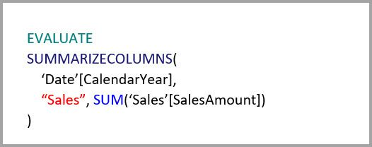

下列查詢不會叫用彙總。 儘管要求 **SalesAmount** 的加總，它仍會對 **Product** 資料表中的資料行作業以執行分組，其資料粒度不可以叫用彙總。 如果您觀察模型中的關聯性，會發現產品子類別可以有多個 **Product** 資料列，而查詢無法判斷要彙總哪些產品。 在此情況下，查詢會還原為 DirectQuery，並將 SQL 查詢提交至資料來源。

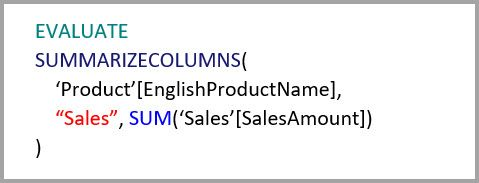

彙總不只是執行簡單加總的簡易計算。 它也可以提供複雜的計算。 就概念而言，複雜的計算會細分為每一個 SUM、MIN、MAX 和 COUNT 的子查詢，並評估每一個子查詢，以判斷能否叫用彙總。 因為查詢方案最佳化之故，並非所有情況都適用此邏輯，但通常皆適用。 下列範例會叫用彙總：

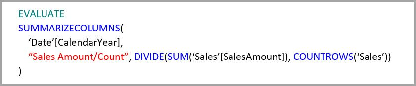

COUNTROWS 函式可以受益於彙總。 下列查詢會叫用彙總，因為 **Sales** 資料表已定義 **Count** 資料表資料列的彙總。

AVERAGE 函式可以受益於彙總。 下列查詢會叫用彙總，因為 AVERAGE 會在內部摺疊成除以 COUNT 的 SUM。 因為 **UnitPrice** 資料行已定義 SUM 和 COUNT 的彙總，所以會叫用彙總。

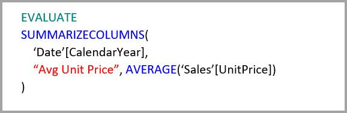

在某些情況下，DISTINCTCOUNT 函式可受益於彙總。 下列查詢會叫用彙總，因為 **CustomerKey** 有 GroupBy 項目，可維護彙總資料表中 **CustomerKey** 的差異。 約有 2百萬 至 5 百萬個相異值會影響查詢效能，這項技術仍受限於此效能閾值。 不過，它在有數十億筆資料列的詳細資料資料表，和資料行中有 2 百萬至 5 百萬個相異值的案例中很有幫助。 在此情況下，相異計數的執行速度會比掃描數十億筆資料列的資料表快，即使它已快取到記憶體中。

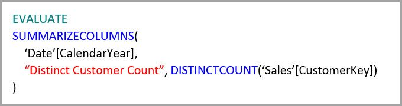

### RLS
資料列層級安全性 (RLS) 運算式應篩選彙總資料表和詳細資料資料表，才能正常運作。 遵循範例之後，**Geography** 資料表上的 RLS 運算式將會生效，因為 Geography 位於 **Sales** 資料表和 **Sales Agg** 資料表兩者的關聯性篩選端。 不論查詢是否叫用彙總資料表，都會成功套用 RLS 查詢。

**Product** 資料表上的 RLS 運算式只會篩選 **Sales** 資料表，而非 **Sales Agg** 資料表。 不建議如此使用。 如果查詢是由使用此角色來存取資料集的使用者所提交，則不會因為彙總叫用而受益。 由於彙總資料表是詳細資料資料表中相同資料的另一種表示法，所以從彙總資料表回答查詢是不安全的，因為無法套用 RLS 篩選。

**Sales Agg** 資料表本身的 RLS 運算式只會篩選彙總資料表，而非詳細資料資料表。 這是不允許的。

## 以分組方式資料行為基礎的彙總 

Hadoop 巨量資料模型的特性不同於維度模型。 為避免聯結大型的資料表，它們通常不依賴關聯性。 維度屬性通常是反正規化為事實資料表。 這類的巨量資料模型可以使用以分組方式資料行為基礎的**彙總**，解除鎖定進行互動式分析。

下表包含要彙總的 **Movement** 數值資料行。 所有其他資料行都是用於分組的屬性。 它包含 IoT 資料和大量的資料列。 儲存模式為 DirectQuery。 對彙總整個資料集之資料來源的查詢，會因為數量龐大而變慢。

為對此資料集啟用互動式分析，我們新增依大部分屬性分組的彙總資料表，但會排除高基數屬性，例如經度和緯度。 這可大幅減少資料列數目，並小到足以鬆散地放入記憶體內部快取。 **Driver Activity Agg** 的儲存模式是 Import。

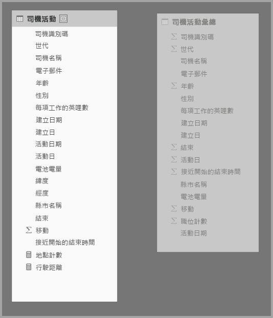

接下來，我們要在 [管理彙總]  對話方塊中定義彙總對應。 **Driver Activity Agg** 資料表的每個資料行都會顯示一筆資料列，我們可以在此指定彙總行為。

![Driver Activity Agg 資料表的 [管理彙總] 對話方塊](media/desktop-aggregations/aggregations_11.jpg)

下表顯示 **Driver Activity Agg** 資料表的彙總。

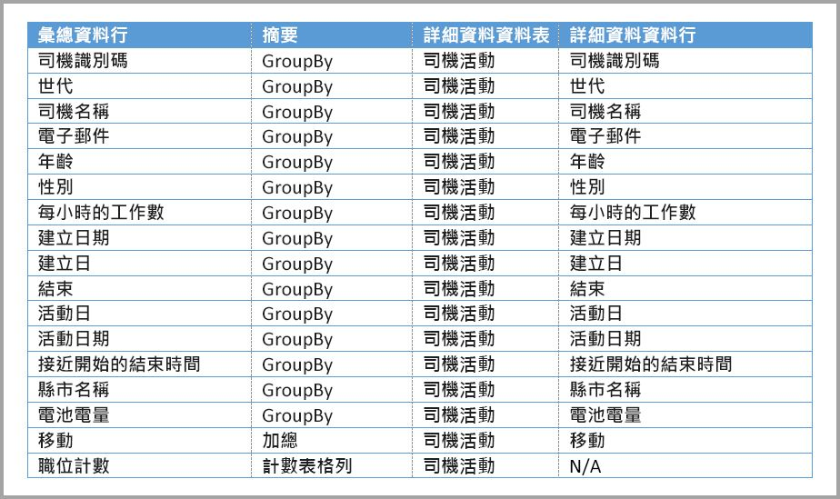

### 依資料行分組

在此範例中，**GroupBy** 項目**不是選用的**，沒有它們就不會叫用彙總。 使用以關聯性為基礎的彙總是不同行為，本文前面提供的維度模型範例已說明此行為。

### 查詢範例

下列查詢會叫用彙總，因為彙總資料表涵蓋 **Activity Date** 資料行。 計數資料表資料列彙總是由 COUNTROWS 函式使用。

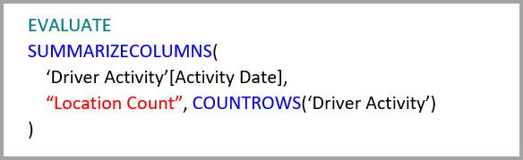

特別是在事實資料表中包含篩選屬性的模型，最好使用計數資料表資料列彙總。 假如使用者未明確要求，Power BI 可以使用 COUNTROWS 將查詢提交至資料集。 例如，[篩選條件] 對話方塊會顯示每個值的資料列計數。

![[篩選條件] 對話方塊](media/desktop-aggregations/aggregations_12.jpg)

### RLS

針對以關聯性為基礎的彙總，上述相同的 RLS 規則 (關於 RLS 運算式是否可以篩選彙總資料表、詳細資料資料表或兩者) 也適用於以 [群組依據] 資料行為基礎的彙總。 在此範例中，**Driver Activity** 資料表的 RLS 運算式可以用來篩選 **Driver Activity Agg** 資料表，因為詳細資料資料表已涵蓋彙總資料表中的所有 [群組依據] 資料行。 反之，**Driver Activity Agg** 資料表上的 RLS 篩選無法套用到 **Driver Activity** 資料表，因此不允許此篩選。

## 彙總優先順序

彙總優先順序可讓單一子查詢考慮多份彙總資料表。

請考慮下列範例。 這是包含多個 DirectQuery 來源的[複合模型](desktop-composite-models.md)。

* **Driver Activity Agg2** Import 資料表是很高的資料粒度，因為屬性分組少，基數又低。 資料列數目可低至數千筆，所以可輕鬆放入記憶體內部快取。 這些屬性正好為高設定檔執行儀表板所用，因此參考它們的查詢速度應該盡可能快。
* **Driver Activity Agg** 資料表是 DirectQuery 模式下的中繼彙總資料表。 它包含 Azure SQL DW 中 10 億多筆的資料列，並已使用資料行存放區索引在來源端進行最佳化。
* **Driver Activity** 資料表是 DirectQuery，包含上兆筆來自巨量資料系統之 IoT 資料的資料列。 它提供鑽研查詢，在受控制的篩選內容中檢視個別的 IoT 讀數。

> [!NOTE]
> 只有在彙總資料表來自 SQL Server、Azure SQL 或 Azure SQL DW 來源時，才支援對詳細資料資料表使用不同資料來源的 DirectQuery 彙總資料表。

此模型的記憶體磁碟使用量相對較小，但它會解除鎖定大型資料集。 它代表平衡的架構，因為它會將查詢負載分散到根據強度使用它們的架構元件中。

**Driver Activity Agg2** 的 [管理彙總]  對話方塊顯示的 [優先順序]  欄位為 10，這比 **Driver Activity Agg** 高，這表示使用彙總的查詢會先考慮它。 資料粒度不在 **Driver Activity Agg2** 回答範圍內的子查詢會改考慮 **Driver Activity Agg**。 兩份彙總資料表皆無法回答的詳細資料查詢，會被導向至 **Driver Activity**。

**Detail Table** 資料行中指定的資料表是 **Driver Activity**，不是 **Driver Activity Agg**，因為不允許鏈結彙總 (請參閱本文前面的[驗證](#validations))。

![[管理彙總] 對話方塊](media/desktop-aggregations/aggregations_14.jpg)

下表顯示 **Driver Activity Agg 2** 資料表的彙總。

## 結合關聯性之以分組方式資料行為基礎的彙總

您甚至可以結合本文前面所述的兩種彙總技術。 以關聯性為基礎的**彙總**根據可能需要將反正規化的維度資料表分割成多份資料表。 如果這對某些維度資料表而言太過昂貴或不實用，您可在彙總資料表中為其他人使用的特定維度和關聯性複寫所需屬性。

下列模型複寫 **Sales Agg** 資料表的*月份*、*季度*、*半年度*和*年度*。 **Sales Agg** 和 **Date** 資料表之間沒有任何關聯性。 **客戶**和**產品子類別**有關聯性。 **Sales Agg** 的儲存模式是 Import。

下表顯示在 **Sales Agg** 資料表的 [管理彙總]  對話方塊中設定的項目。 **Date** 為詳細資料資料表的 GroupBy 項目，其一定要為按 Date 屬性分組的查詢叫用彙總。 如同上一個範例，因為有關聯性，所以 CustomerKey 和 ProductSubcategoryKey 的 GroupBy 項目不會影響彙總叫用 (DISTINCTCOUNT 同樣不在此列)。

### 查詢範例

下列查詢會叫用彙總，因為 CalendarMonth 是由彙總資料表提供，而且 CategoryName 可透過一對多關聯性存取。 使用 **SalesAmount** 的 Sum 彙總。

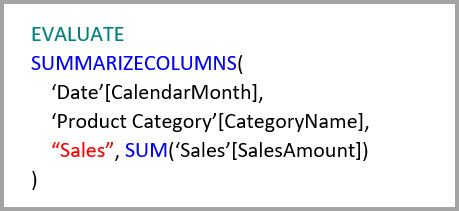

下列查詢不會叫用彙總，因為彙總資料表不涵蓋 CalendarDay。

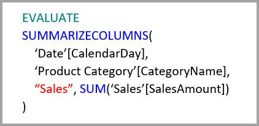

下列時間智慧查詢不會叫用彙總，因為 DATESYTD 函式會產生 CalendarDay 值資料表，但彙總資料表不提供此資料表。

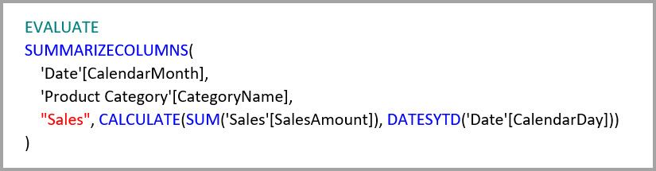

## 快取應該保持同步

如果記憶體內部快取與來源資料不同步，結合 DirectQuery 和 Import 及/或 Dual 儲存模式的**彙總**，可能會傳回不同的資料。 查詢執行不會嘗試掩飾資料問題，例如篩選 DirectQuery 結果以符合快取值。 這些功能已最佳化效能，而且只應以不危及您能力的方式使用來滿足商務需求。 您應該最了解自己的資料流程，請據此進行設計。 如有必要，可使用一些現有技術，在來源處理這類問題。

## 後續步驟

下列文章會詳細說明複合模型與 DirectQuery。

* [Power BI Desktop 中的複合模型](desktop-composite-models.md)
* [Power BI Desktop 中的多對多關聯性](desktop-many-to-many-relationships.md)
* [Power BI Desktop 中的儲存模式](desktop-storage-mode.md)

DirectQuery 文章：

* [使用 Power BI 中的 DirectQuery](desktop-directquery-about.md)
* [Power BI 中 DirectQuery 支援的資料來源](desktop-directquery-data-sources.md)