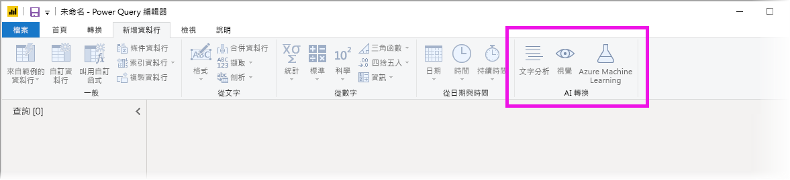
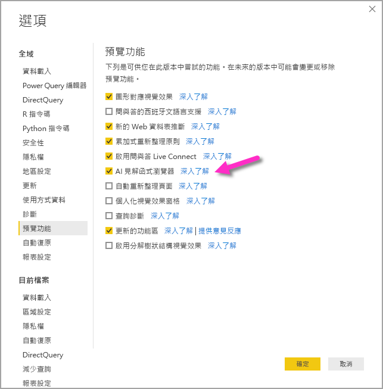
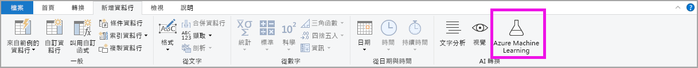

# 使用 Power BI Desktop 中的 AI 見解 (預覽)

在 Power BI 中，您可以使用 AI 見解來存取預先定型的機器學習模型集合，以增強您的資料準備工作。 您可以在 [Power Query 編輯器]  中存取 AI 見解，其相關聯的特徵和功能可通過 [Power Query 編輯器]  中的 [首頁]  和 [加入資料行]  索引標籤存取。 

本文說明來自 Azure 認知服務的文字分析和 Vision 功能。 本文中還有一部分說明 Azure Machine Learning 的 Power BI 中可用的自訂功能。

## 如何啟用 AI 見解

Power BI 中的 AI 見解是預覽功能，必須啟用。 若要啟用它，選取 [檔案] > [選項及設定] > [選項]  ，然後從左側資料行選取 [預覽功能]  。 右窗格中為 [AI 見解函式瀏覽器]  選取項目。 核取 [AI 見解函式瀏覽器]  旁的方塊，以啟用預覽功能。 您必須重新啟動 Power BI Desktop，預覽功能變更才會生效。

## 使用文字分析和 Vision

您可以使用 Power BI 中的文字分析和 Vision，從 [Azure 認知服務](https://azure.microsoft.com/services/cognitive-services/)套用不同的演算法，在 Power Query 中豐富您的資料。

目前支援的服務如下：

* [情感分析](https://docs.microsoft.com/azure/cognitive-services/text-analytics/how-tos/text-analytics-how-to-sentiment-analysis)
* [關鍵片語擷取](https://docs.microsoft.com/azure/cognitive-services/text-analytics/how-tos/text-analytics-how-to-keyword-extraction)
* [語言偵測](https://docs.microsoft.com/azure/cognitive-services/text-analytics/how-tos/text-analytics-how-to-language-detection)
* [影像標記](https://docs.microsoft.com/azure/cognitive-services/computer-vision/concept-tagging-images)。 

轉換會在 Power BI 服務上執行，且不需要 Azure 認知服務 訂用帳戶。 

> [!IMPORTANT]
> 
> 使用文字分析或視覺功能需要 Power BI Premium。

### 在 Premium 容量上啟用文字分析和視覺

Premium 容量節點 EM2、A2 或 P1 和更新版本支援認知服務。 容量的個別 AI 工作負載用來執行認知服務。 這些功能的公開預覽期間 (2019 年 6 月前) 預設會停用此工作負載。 在 Power BI 中使用認知服務之前，必須在管理入口網站的**容量設定**中啟用 AI 工作負載。 您可以在**工作負載**區段中開啟 **AI 工作負載**，並定義您希望此工作負載使用的最大記憶體數量。 建議的記憶體限制為 20%。 超出此限制會讓查詢變慢。

### 可用的函式

本節描述 Power BI 的認知服務中可用的函式。

#### 偵測語言

語言偵測函式會評估文字輸入，並針對每個欄位，傳回語言名稱和 ISO 識別碼。 此函式用於收集未知語言之任意文字的資料行。 此函式預期以文字格式的資料作為輸入。

文字分析最多可辨識 120 種語言。 如需詳細資訊，請參閱[支援的語言](https://docs.microsoft.com/azure/cognitive-services/text-analytics/text-analytics-supported-languages)。

#### 擷取關鍵片語

**關鍵片語擷取**函式會評估非結構化的文字，並針對每個文字欄位，傳回關鍵片語的清單。 此函式需要文字欄位作為輸入，並接受選擇性的輸入作為**文化特性資訊**。

關鍵片語擷取在您為其提供更大的文字區塊來處理時，其效果最佳。 這與情感分析相反，後者在較小的文字區塊效果更佳。 若要從這兩項作業獲得最佳結果，請考慮據此重新建構輸入。

#### 情感評分

**情感評分**函式會評估文字輸入，並為每個文件傳回情感分數，範圍從 0 (負面) 到 1 (正面)。 此函式用於偵測在社交媒體、客戶評論和討論區論壇方面的正面和負面情感。

文字分析會使用機器學習服務的分類演算法來產生 0 到 1 之間的情感分數。 分數接近 1 時，表示正面情感，分數接近 0 時，則表示負面情感。 此模型是使用具有情感關聯的大量文字內文預先定型的。 目前無法提供您自己的定型資料。 此模型會在文字分析期間使用技術的組合，包括文字處理、part-of-speech 分析、文字放置，以及文字關聯。 如需有關演算法的詳細資訊，請參閱[文字分析簡介](https://blogs.technet.microsoft.com/machinelearning/2015/04/08/introducing-text-analytics-in-the-azure-ml-marketplace/)。

情感分析是針對整個輸入欄位進行的，而不是擷取文字中特定實體的情感。 在實務上，當文件包含一個或兩個句子，而不是大型文字區塊時，精確度評分有提高的趨勢。 在客觀性評估階段，此模型會判斷整體的輸入欄位是客觀的還是包含情感的。 大部分客觀的輸入欄位不會進展到情感偵測階段，進而導致分數為 .50，而不會進行進一步的處理。 對於在管線中繼續的輸入欄位，下一個階段會產生高於或低於 .50 的分數，端視輸入欄位中偵測到的情感程度而定。

目前，情感分析支援英文、德文、西班牙文和法文。 其他語言目前為預覽版。 如需詳細資訊，請參閱[支援的語言](https://docs.microsoft.com/azure/cognitive-services/text-analytics/text-analytics-supported-languages)。

#### 標記影像

**標記影像**函式會根據超過兩千個可辨識的物體、生物、景象及動作，傳回標記。 當標記模稜兩可或不是常識時，輸出會提供「提示」  ，以釐清標記在已知設定前後關聯中的意涵。 標記不是按照分類組織的，而且不存在任何繼承階層。 一系列的內容標記會形成影像「描述」  的基礎，以完整句子的格式，顯示為人類可讀取的語言。

上傳影像或指定影像 URL 之後，電腦視覺演算法會根據物體、生物和影像中識別的動作，輸出標記。 標記不限於主體 (例如在前景的人)，但也包含環境 (室內或戶外)、傢俱、工具、植物、動物、配件、小工具等等。

此函式需要影像 URL 或 base-64 欄位作為輸入。 目前，影像標記支援英文、西班牙文、日文、葡萄牙文及簡體中文。 如需詳細資訊，請參閱[支援的語言](https://docs.microsoft.com/rest/api/cognitiveservices/computervision/tagimage/tagimage#uri-parameters)。

### 叫用 Power Query 中的文字分析或視覺函式

若要使用文字分析或視覺函式豐富您的資料，請開啟 [Power Query 編輯器]  。 這個範例會逐步解說如何評分文字的情感。 您可以使用相同的步驟來擷取關鍵片語、偵測語言，以及標記影像。

選取 [首頁]  或 [加入資料行]  功能區中的 [文字分析]  按鈕。 系統將提示您登入。

登入之後，請在快顯視窗中選取您想要使用的函式以及您想要轉換的資料直行。

Power BI 會選取要在其中執行函式的 Premium 容量，並將結果傳回 Power BI Desktop。 選取的容量僅用於應用程式中的文字分析和視覺函式，並在 Power BI Desktop 中重新整理。 發佈報表之後，將在報表發佈至的工作區的 Premium 容量上執行重新整理。 您可以在快顯視窗左下角的下拉式清單中，變更用於所有認知服務的容量。

**Cultureinfo** 是選擇性的輸入，可指定文字的語言。 此欄位為 ISO 代碼。 您可以使用資料行作為 Cultureinfo 的輸入，或靜態欄位。 在此範例中，整個資料行的語言指定為英文 (en)。 如果您將此欄位留空，Power BI 會先自動偵測語言，然後再套用函式。 接下來，選取 [套用]  。

第一次在新的資料來源上使用 AI 見解時，系統會提示您設定資料的隱私權等級。

> [!NOTE]
> Power BI 中的資料集重新整理只適用於隱私權層級設為 [公用] 或 [組織] 的資料來源。

叫用函式之後，結果會以新的資料行加入至資料表中。 轉換也會加入為查詢中套用的步驟。

在影像標記和關鍵片語擷取的案例中，結果可能會傳回多個值。 在原始資料列的複本上，會傳回每個個別的結果。

### 使用文字分析或視覺函式發佈報表

在 Power Query 中編輯並於 Power BI Desktop 中執行重新整理時，文字分析和視覺會使用 Power Query 編輯器中選取的 Premium 容量。 將報表發佈至 Power BI 之後，它會使用其發佈所在之工作區的 Premium 容量。

已套用文字分析和視覺函式的報表應該發佈至不在 Premium 容量上的工作區，否則重新整理資料集將會失敗。

### 管理 Premium 容量的影響

下列各節說明如何管理文字分析和視覺對容量的影響。

#### 選取容量

報表作者可以選取要在其上執行 AI 見解的 Premium 容量。 根據預設，Power BI 會選取使用者可存取的第一個建立的容量。

#### 使用容量計量應用程式監視

Premium 容量擁有者可以使用 [Power BI Premium 容量計量應用程式](service-admin-premium-monitor-capacity.md)，監視文字分析和視覺函式對容量的影響。 該應用程式提供您容量中 AI 工作負載健康情況的詳細計量。 最上方的圖表顯示 AI 工作負載的記憶體耗用量。 Premium 容量管理員可設定每個容量的 AI 工作負載的記憶體限制。 當記憶體使用量達到記憶體限制時，您可以考慮提高記憶體限制，或將部分工作區移至不同的容量。

### 比較 Power Query 和 Power Query Online

Power Query 和 Power Query Online 中使用的文字分析和視覺函式都相同。 體驗之間的唯一差異如下：

* Power Query 具有文字分析、視覺和 Azure Machine Learning 的個別按鈕。 在 Power Query Online 中，這些會合併在一個功能表中。
* 在 Power Query 中，報表作者可以選取用來執行函式的 Premium 容量。 這在 Power Query Online 中不需要這麼做，因為資料流程已經在特定容量上。

### 文字分析的考量與限制

使用文字分析時，需牢記幾個考量與限制。

* 支援累加式重新整理，但是在使用 AI 見解的查詢上使用時，可能會造成效能問題。
* 不支援 Direct Query。

## 使用 Azure ML

許多組織使用 **Machine Learning** 模型來取得關於其業務的更好的見解與預測。 在您的報告與儀表板和其他分析中，能夠從這些模型視覺化及叫用見解的能力有助於傳播這些見解給最需要它的企業使用者。 Power BI 可讓您輕鬆使用直覺的點按手勢，整合來自 Azure Machine Learning 託管模型的見解。

若要使用此功能，資料科學家可以使用 Azure 入口網站將對 Azure ML 模型的存取權授與 BI 分析師。 接著，在每個工作階段開頭，Power Query 會探索使用者有權存取的所有 Azure ML 模型並將它們公開為動態 Power Query 函式。 使用者接著可以透過從 Power Query 編輯器中的功能區存取函式，或透過直接叫用 M 函式，來叫用那些函式。 Power BI 也會在針對一組資料列叫用 Azure ML 模型時自動分存取要求分批，以獲得更好的效能。

Power BI Desktop、Power BI 資料流程與 Power BI 服務中的 Power Query Online 都支援此功能。

若要深入了解資料流程，請參閱 [Power BI 中的自助資料準備](service-dataflows-overview.md)。

若要深入了解 Azure Machine Learning，請參閱下列文章：

- 概觀：[什麼是 Azure Machine Learning 服務？](https://docs.microsoft.com/azure/machine-learning/service/overview-what-is-azure-ml)
- Azure Machine Learning 的快速入門與教學課程：[Azure Machine Learning 文件](https://docs.microsoft.com/azure/machine-learning/)

### 授與 Azure ML 模型的存取權

若要從 Power BI 存取 Azure ML 模型，使用者必須有對 Azure 訂用帳戶的**讀取**存取權。 此外，它們必須具有下列各項：

- 針對 Machine Learning Studio (傳統) 模型，需要有對 Machine Learning Studio (傳統) Web 服務的**讀取**存取權
- 針對 Machine Learning 模型，需要有對 Machine Learning 工作區的**讀取**存取權

本節中的步驟說明如何將對 Azure ML 上裝載之模型的存取權授與 Power BI 使用者，以便他們能以 Power Query 函式形式存取此模型。 如需進一步的詳細資料，請參閱[使用 RBAC 與 Azure 入口網站管理存取權](https://docs.microsoft.com/azure/role-based-access-control/role-assignments-portal)。

1. 登入 [Azure 入口網站](https://portal.azure.com/)。
2. 移至 [訂用帳戶]  頁面。 您可以透過 Azure 入口網站左側瀏覽功能表中的 [所有服務]  清單找到 [訂用帳戶]  頁面。
3. 選取您的訂用帳戶
4. 選取 [存取控制 (IAM)]  ，然後選取 [新增]  按鈕。
5. 選取 [讀者]  做為 [角色]。 選取您希望為其授與對 Azure ML 模型之存取權的 Power BI 使用者。
6. 選取 [儲存] 
7. 重複步驟三到六，將**讀者**存取權授與特定 Machine Learning Studio (傳統) Web 服務「或」  託管模型的 Machine Learning 工作區使用者。

### 針對 Machine Learning 模型的結構描述探索

資料科學家主要使用 Python 開發甚至是部署其 Machine Learning 的機器學習模型。 不同於 Machine Learning Studio (傳統) 是協助自動化為模型建立結構描述檔案的工作，在 Machine Learning 的案例中，資料科學家必須明確使用 Python 產生結構描述檔案。

此結構描述檔案必須包含在 Machine Learning 模型的部署 Web 服務中。 若要自動產生 Web 服務的結構描述，您必須為部署模型在項目指令碼中提供輸入/輸出的範例。 請參閱[使用 Azure Machine Learning 部署模型中的選擇性自動產生 Swagger 架構](https://docs.microsoft.com/azure/machine-learning/how-to-deploy-and-where#optional-define-model-web-service-schema)服務文件上的子節。 連結包含產生結構描述陳述式的範例項目指令碼。

具體而言，項目指令碼中的 _@input\_schema_ 與 _@output\_schema_ 函式會參考_input\_sample_ 與 _output\_sample_ 中的輸入和輸出範例格式，並在部署期間使用這些範例來產生 Web 服務的 OpenAPI (Swagger) 規格。

這些透過更新項目指令碼來產生結構描述的指示也必須套用到使用 Azure Machine Learning SDK 時，透過自動化機器學習服務實驗建立的模型。

> [!NOTE]
> 使用 Azure Machine Learning 視覺化介面建立的模型目前不支援產生結構描述，但會在後續的版本中支援。
> 
### 在 Power Query 中叫用 Azure ML 模型

您可以直接從 Power Query 編輯器叫用任何您已獲授與存取權的 Azure ML 模型。 若要存取 Azure ML 模型，請選取 Power Query 編輯器中 [首頁]  或 [加入資料行]  功能區中的 [Azure Machine Learning]  按鈕。

您擁有存取權的所有 Azure ML 模型會在這裡列為 Power Query 函式。 此外，Azure ML 模型的輸入參數會自動對應為對應之 Power Query 函式的參數。

若要叫用 Azure ML 模型，您可以從下拉式清單中指定任何所選實體的資料行作為輸入。 您也可以將資料行圖示切換至 [輸入] 對話方塊的左側，以指定要當作輸入使用的常數值。

選取 [確定]  來檢視 Azure ML 模型的輸出作為實體資料表中新資料行的預覽。 您也將看到模型叫用作為查詢套用的步驟。

若模型傳回多個輸出參數，它們會分組為輸出資料行中的記錄。 您可以展開資料行，在不同的資料行中產生個別的輸出參數。

### Azure ML 的考量與限制

下列考量和限制適用於 Power BI Desktop 中的 Azure ML。

* 使用 Azure Machine Learning 視覺化介面建立的模型目前不支援產生結構描述。 後續的版本中預期會支援。
* 支援累加式重新整理，但是在使用 AI 見解的查詢上使用時，可能會造成效能問題。
* 不支援 Direct Query。

## 後續步驟

此文章提供將 Machine Learning 整合到 Power BI Desktop 的概觀。 下列文章可能也很有趣而且實用。

- [教學課程：在 Power BI 中叫用 Machine Learning Studio (傳統) 模型](service-tutorial-invoke-machine-learning-model.md)
- [教學課程：在 Power BI 中使用認知服務](service-tutorial-use-cognitive-services.md)
- [Power BI 中的認知服務](service-cognitive-services.md)
- [Power BI 中的 Azure Machine Learning 整合](service-machine-learning-integration.md)
- [使用應用程式監視 Premium 容量](service-admin-premium-monitor-capacity.md)
- [Premium 容量計量應用程式中的 AI 計量](https://powerbi.microsoft.com/blog/ai-metrics-now-available-in-power-bi-premium-capacity-metrics-app/)
