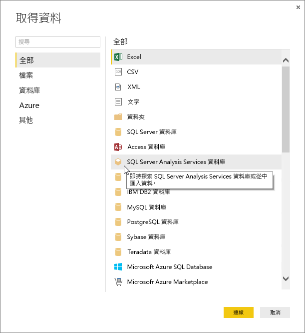
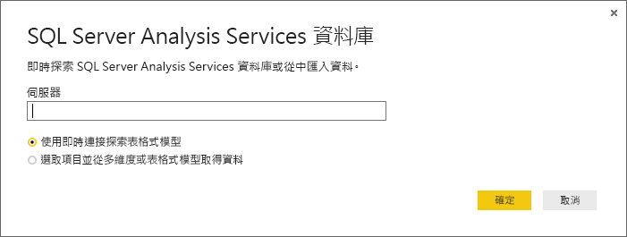
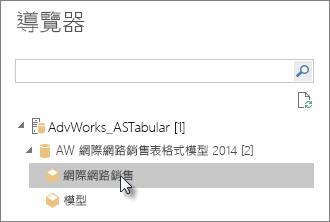
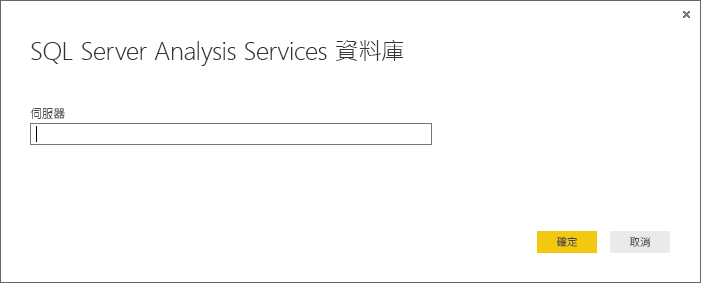

# 使用 Power BI Desktop 中的 Analysis Services 表格式資料
Power BI Desktop 提供兩種方法，讓您連接到 SQL Server Analysis Services 表格式模型並從中取得資料：使用即時連接進行瀏覽，或選取項目並匯入 Power BI Desktop。

以下將進一步說明。

**使用即時連接進行瀏覽** - 使用即時連接時，表格式模型或檢視方塊中的資料表、資料行和量值等項目，都會出現在 Power BI Desktop 的 [欄位] 清單中。 您可以使用 Power BI Desktop 的進階視覺效果和報表工具，以全新且高度互動的方式來瀏覽表格式模型。

即時連接時，不會從表格式模型匯入任何資料到 Power BI Desktop。 每當您與某個視覺效果互動時，Power BI Desktop 會查詢表格式模型並計算您所看到的結果。 您所檢視的資料一律為最新資料。 請記住，表格式模型非常安全。 您對於所連接之表格式模型的權限會決定出現在 Power BI Desktop 中的項目。

當您在 Power BI Desktop 中建立動態報表時，您可以將其發佈到 Power BI 網站以與他人共用。 當您透過即時連接將 Power BI Desktop 檔案發佈到您的 Power BI 網站時，系統管理員必須安裝及設定內部部署資料閘道。 如需深入了解，請參閱[內部部署資料閘道](service-gateway-onprem.md)。

**選取項目並匯入 Power BI Desktop** - 當您使用這個選項進行連接時，您可以選取表格式模型或檢視方塊中的資料表、資料行和量值等項目，再將其載入 Power BI Desktop 模型。 您可以使用 Power BI Desktop 的進階 [查詢編輯器]，進一步成形為您想要的樣子。 您可以使用 Power BI Desktop 的模型化功能，進一步建立資料模型。 Power BI Desktop 與表格式模型之間不需要維持即時連接。 您可以接著離線瀏覽 Power BI Desktop 模型，或發佈到 Power BI 網站。

## 連接到表格式模型
1. 在 Power BI Desktop 的 [常用]  索引標籤上，按一下 [取得資料] 。
   
   
2. 按一下 [SQL Server Analysis Services 資料庫] ，然後按一下 [連接] 。
   
   
3. 輸入伺服器名稱並選取連接模式。 
   
   
4. 這個步驟取決於您選取的連接模式：

* 如果您要即時連接，請在 [導覽器] 中，選取一個表格式模型或檢視方塊。
  
  
* 如果您選擇「選取項目並取得資料」，請在 [導覽器] 中，選取一個表格式模型或檢視方塊。 您可以進一步只選擇要載入的特定資料表或資料行。 若要將資料成形再載入，請按一下 [編輯] 以開啟 [查詢編輯器]。 當您完成時，按一下 [載入] 以將資料匯入 Power BI Desktop。

## 常見問題集
**問︰**我需要內部部署資料閘道嗎？

**答：** 不一定。 如果您使用 Power BI Desktop 即時連接到表格式模型，但不想發佈到 Power BI 網站，則不需要閘道。 相反地，若您想要發佈到 Power BI 網站，就需要資料閘道，以確保 Power BI 服務與您內部部署 Analysis Services 伺服器之間的通訊安全。 安裝資料閘道之前，請先諮詢您的 Analysis Services 伺服器管理員。

若選擇要選取項目並取得資料，因為表格式模型資料會直接匯入您的 Power BI Desktop 檔案，所以不需要任何閘道。

**問：** 從 Power BI 服務即時連接到表格式模型，與從 Power BI Desktop 即時連接有何不同？

**答：**當您從 Power BI 服務中的網站即時連接到表格式模型，再連接到組織內部部署的 Analysis Services 資料庫時，需要內部部署資料閘道，以確保兩者之間的通訊安全。 當您從 Power BI Desktop 即時連接到表格式模型時，由於所要連接的 Power BI Desktop 和 Analysis Services 伺服器都是在組織內部執行，因此不需要閘道。 但您若要將 Power BI Desktop 檔案發佈到您的 Power BI 網站，就需要閘道。

**問：** 如果我建立即時連接，是否可以連接到同一個 Power BI Desktop 檔案中的另一個資料來源？

**答：** 否。 您無法瀏覽即時資料並連接到同一個檔案中的另一種資料來源類型。 如果您已經匯入資料或連接到 Power BI Desktop 檔案中的不同資料來源，則必須建立新檔案以進行即時瀏覽。

**問：** 如果我建立即時連接，是否可以在 Power BI Desktop 中編輯模型或查詢？

**答：**您可以在 Power BI Desktop 中建立報告等級量值，但瀏覽即時資料時，將會停用所有其他查詢和模型化功能。

**問：** 如果我建立即時連接，它是否安全？

**回答：** 可以。 您目前的 Windows 認證會用來連接到 Analysis Services 伺服器。 當您即時瀏覽時，無法使用「基本」認證，或者使用 Power BI 服務或 Power BI Desktop 中的預存認證。

**問：** 我在 [導覽器] 中看到模型和檢視方塊。 有何不同？

**答：** 檢視方塊是表格式模型的特定檢視。 根據獨特資料分析需求，它可能只會包含特定資料表、資料行或量值。 表格式模型至少一定會包含一個檢視方塊，該檢視方塊可能包含模型中的所有項目。 如果您不確定該選取哪個項目，請洽詢您的系統管理員。

## 在初始連接之後變更伺服器名稱
建立具有即時連接瀏覽的 Power BI Desktop 檔案之後，可能會有些情況需要您將連接切換至其他伺服器。 例如，如果您在連接到開發伺服器時，以及在發佈到 Power BI 服務之前建立 Power BI Desktop 檔案，您會想要將連接切換至實際執行伺服器。

1. 從功能區選取 [編輯查詢]。
   
   
2. 輸入新的伺服器名稱。
   
   

