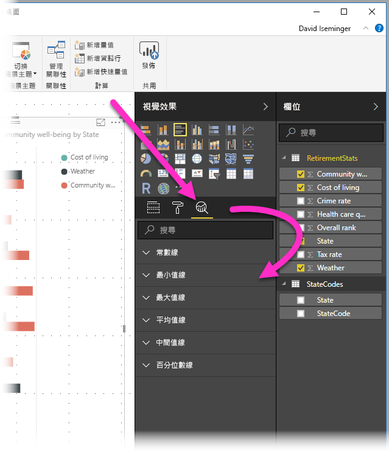
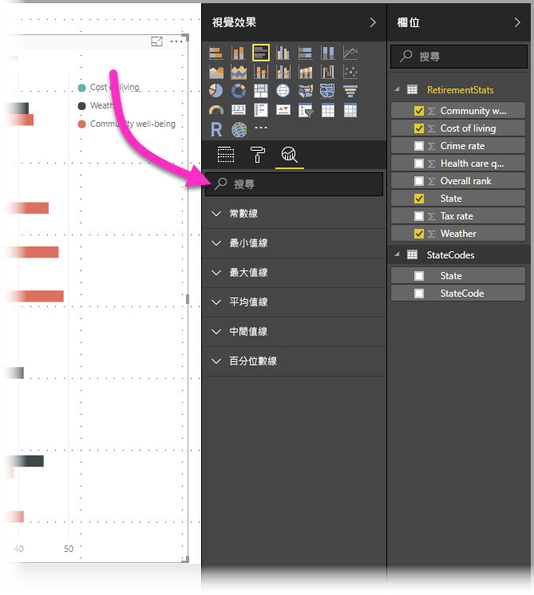
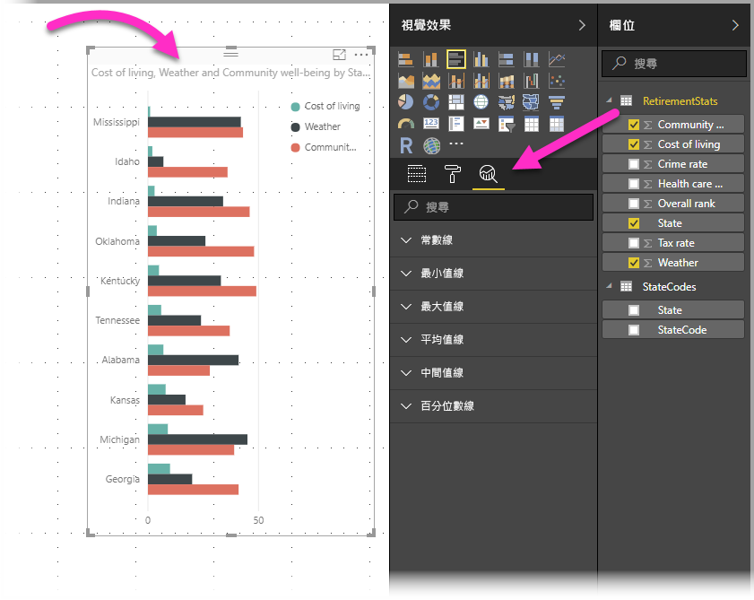
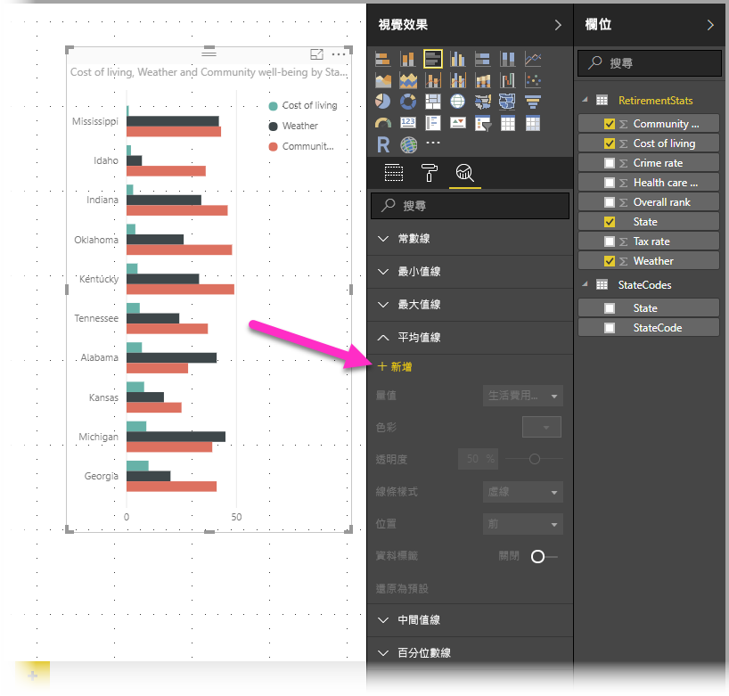
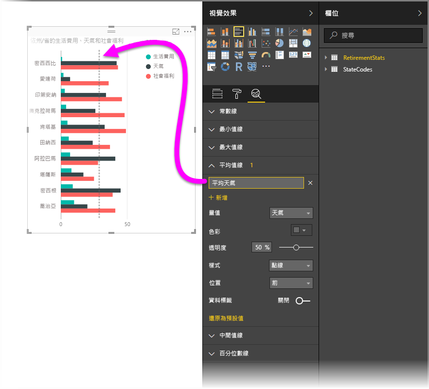
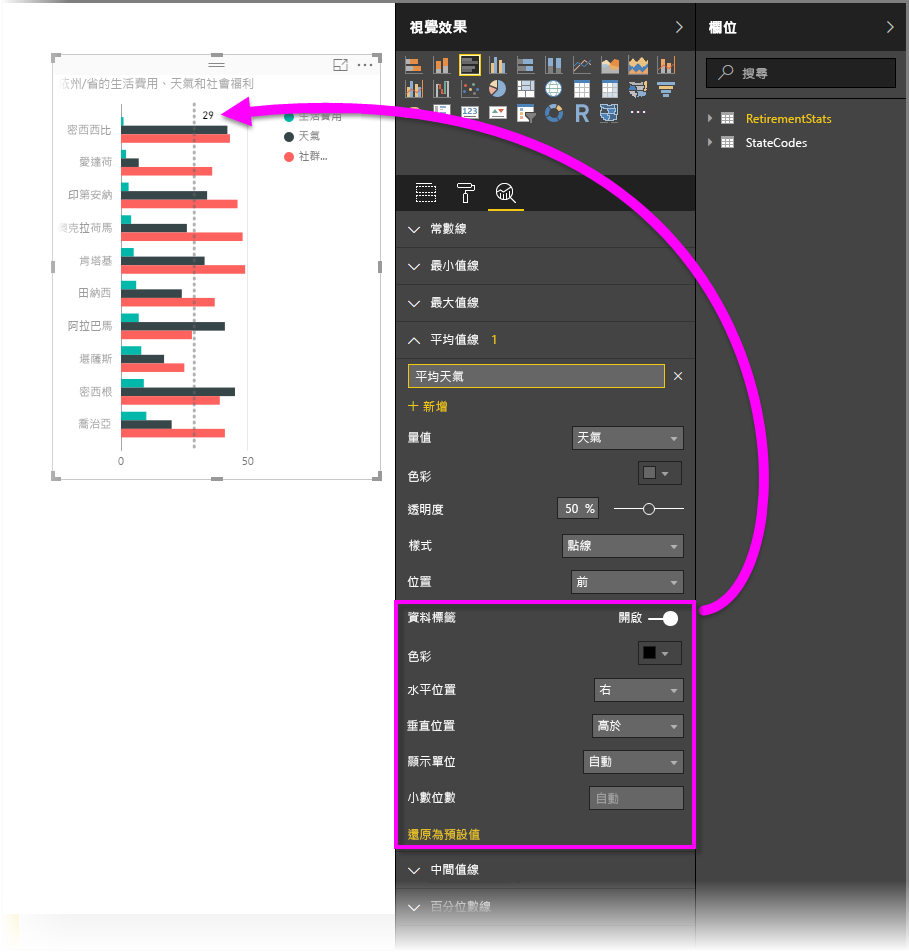
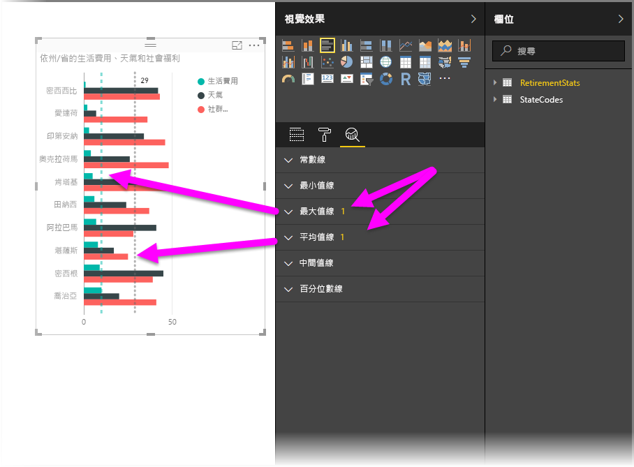
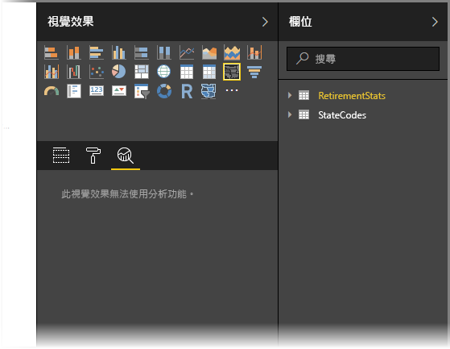
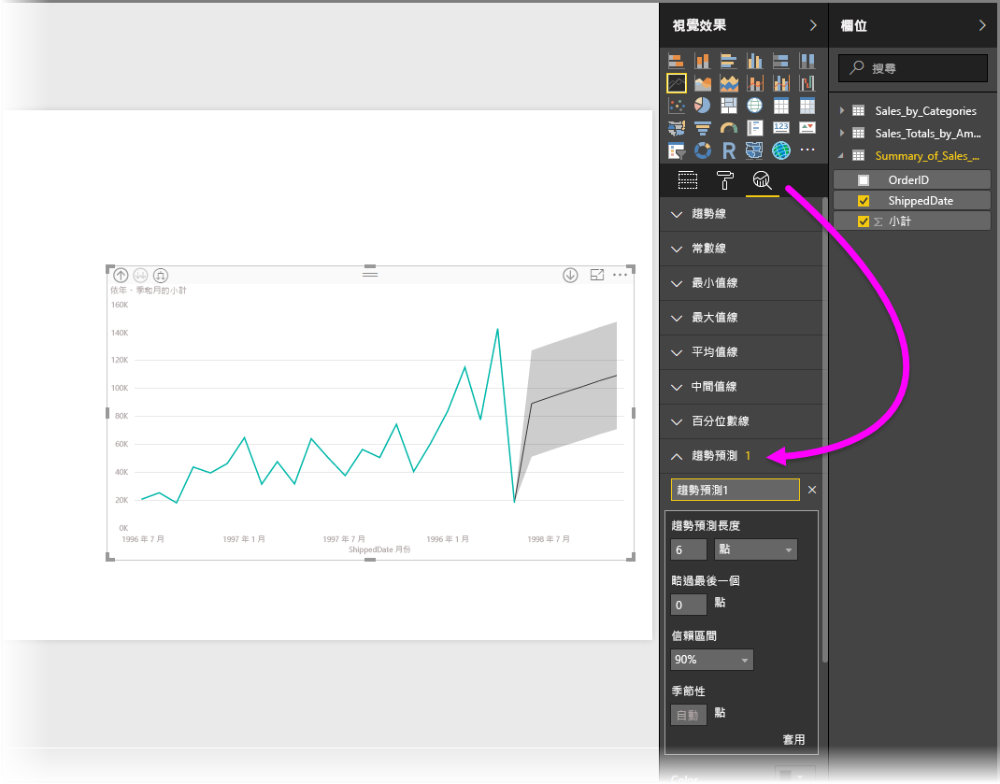

# 使用 Power BI Desktop 中的 [分析] 窗格
有了 **Power BI Desktop** 的 [分析] 窗格，您就可以將動態「參考線」新增至視覺效果，為重要的趨勢或深入解析提供焦點。 [分析] 窗格位於 Power BI Desktop 的 [視覺效果] 區域中。

> [!NOTE]
> [分析] 窗格只會在您選取了 Power BI Desktop 畫布上的視覺效果時顯示。

## 在分析窗格內進行搜尋
從 2018 年 2 月發行的 **Power BI Desktop** (2.55.5010.201 版或更新版本) 開始，您可以在 [分析] 窗格內進行搜尋，此窗格是 [視覺效果] 窗格的一個子區段。 如下圖所示，選取 [分析] 窗格之後，就會出現搜尋方塊。

## 使用 [分析] 窗格
透過 [分析] 窗格，您可以建立下列類型的動態參考線 (並非所有線都是用於所有視覺效果類型)：

* X 軸常數線
* Y 軸常數線
* 最小值線
* 最大值線
* 平均值線
* 最小值線
* 中間值線

下列章節示範可以如何在視覺效果中使用 [分析] 窗格及動態參考線。

若要檢視視覺效果可用的動態參考線，請遵循下列步驟：

1. 選取或建立視覺效果，然後從 [視覺效果] 區段選取**分析**圖示。
   
   
2. 針對您要建立的線類型選取向下箭號，以展開其選項。 在這個案例中，我們選取 [平均值線]。
   
   
3. 若要建立新的線，請選取 [+ 新增]。 您接著可以為線指定名稱，方法是按兩下文字方塊，然後鍵入名稱。
   
   您可以對線使用各種選項，例如選取其「色彩」、「透明度」、「樣式」及「位置」(相對於視覺效果的資料項目)，以及是否要包含標籤。 重要的是，您可以選取要以視覺效果中的哪個 [量值] 為依據，方法是選取 [量值] 下拉式清單，其中已自動填入視覺效果中的資料項目。 在這個案例中，我們選取 [天氣] 作為量值，加上 [平均天氣] 的標籤，然後自訂其他幾個選項，如下所示。
   
   
4. 如果您希望資料標籤出現，請將 [資料標籤] 滑桿移為開啟。 當您這樣做時，即取得資料標籤的其他所有選項，如下圖所示。
   
   
5. 請注意顯示在 [分析] 窗格中，[平均值線] 項目旁的數字。 這告訴您視覺效果上目前有多少條動態線及其類型。 如果我們針對「生活花費」新增 [最大值線]，您就會看到 [分析] 窗格顯示我們也對這個視覺效果套用了 [最大值線] 動態參考線。
   
   

如果您選取的視覺效果無法套用動態參考線 (在這個案例中為 [地圖] 視覺效果)，您就會在選取 [分析] 窗格時看到下列內容。

透過 [分析] 窗格，您可以藉由建立動態參考線，醒目提示您感興趣的各種深入解析。

我們正在規劃更多功能，包括讓視覺效果有更多動態參考線可以套用，因此請時常回來查看新功能。

## 套用預測
使用**預測**功能的方法為選取視覺效果，然後展開 [分析] 窗格的 [預測] 區段。 您可以指定多個輸入以修改預測，例如「預測長度」、「信賴區間」等。 下圖顯示已套用預測的基本線條視覺效果，但您可以發揮想像力 (並隨意嘗試「預測」功能) 以了解可以如何將其套用至模型。

## 限制
使用動態參考線的能力取決於使用的視覺效果類型。 下表顯示目前有哪些視覺效果可以使用哪種動態線：

下列視覺效果可以完整使用動態線：

* 區域圖
* 折線圖
* 散佈圖
* 群組直條圖
* 群組橫條圖

下列視覺效果只可從 [分析] 窗格使用「常數線」：

* 堆疊區域圖
* 堆疊橫條圖
* 堆疊直條圖
* 100% 堆疊橫條圖
* 100% 堆疊直條圖

下列視覺效果目前只有「趨勢線」選項：

* 非堆疊折線圖
* 群組直條圖

最後，非笛卡兒視覺效果目前無法從 [分析] 窗格套用動態線，例如：

* 矩陣圖
* 圓形圖
* 環圈圖
* 資料表

唯有在 **Power BI Desktop** 中使用匯入的資料時，或是在執行 **Analysis Service 2016** 或更新版本、**Azure Analysis Services** 或 Power BI 服務上之資料集的伺服器上即時連線到模型時，才能使用百分位數線。 

## 後續步驟
您可以使用 Power BI Desktop 執行各種作業。 如需有關其功能的詳細資訊，請參閱下列資源：

* [Power BI Desktop 的新功能](desktop-latest-update.md)
* [下載 Power BI Desktop](desktop-get-the-desktop.md)
* [開始使用 Power BI Desktop](desktop-getting-started.md)
* [Power BI Desktop 的查詢概觀](desktop-query-overview.md)
* [Power BI Desktop 中的資料類型](desktop-data-types.md)
* [使用 Power BI Desktop 合併資料並使其成形](desktop-shape-and-combine-data.md)
* [Power BI Desktop 中的常見查詢工作](desktop-common-query-tasks.md)    

