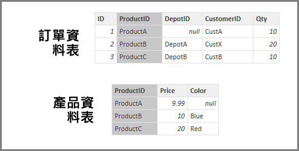

# Power BI Desktop 中的採用參考完整性設定
使用 **DirectQuery** 連接到資料來源時，您可以使用 [採用參考完整性] 選項來允許對資料來源執行更有效率的查詢。 這項功能對於基礎資料有幾項需求，而且只有在使用 **DirectQuery** 時才能存取。

設定 [採用參考完整性] 可讓資料來源的查詢使用 **INNER JOIN** 陳述式 (而不是 **OUTER JOIN**)，進而改善查詢效率。

## 採用參考完整性的使用需求
這是進階設定，只有在使用 **DirectQuery** 連接到資料時才能啟用。 [採用參考完整性] 必須符合下列需求才能正常運作：

* 關聯性中 [從] 資料行內的資料一律不得為 *Null* 或「空白」
* [從] 資料行中的每個值必須對應到 [至] 資料行中

在此情況下，[從] 資料行可以是「一對多」關聯性中的「多」，或是「一對一」關聯性中第一個資料表的資料行。

## 採用參考完整性的使用範例
下列範例示範 [採用參考完整性] 用於資料連線時的運作方式。 此範例會連接到包含 **Orders** 資料表、**Products** 資料表和 **Depots** 資料表的資料來源。

1. 下圖顯示 **Orders** 資料表和 **Products** 資料表，請注意 **Orders[ProductID]** 和 **Products[ProductID]** 之間存在參考完整性。 **Orders** 資料表中的 **[ProductID]** 資料行永遠不可為 *Null* ，而且每個值也都會出現在 **Products** 資料表中。 因此，您應該設定 [採用參考完整性]，以取得更有效率的查詢 (使用此設定不會變更以視覺化方式顯示的值)。
   
   
2. 在下圖中，請注意 **Orders[DepotID]** 和 **Depots[DepotID]** 之間不存在參考完整性，因為某些 *Orders* 的 **DepotID** 為 *Null* 。 因此，您「不」應該設定 [採用參考完整性]。
   
   
3. 最後，下列資料表中的 **Orders[CustomerID]** 和 **Customers[CustID]** 之間沒有參考完整性；**CustomerID** 包含 *Customers* 資料表中不存在的某些值 (在本例中為 *CustX*)。 因此，您「不」應該設定 [採用參考完整性]。
   
   

## 設定採用參考完整性
若要啟用這項功能，請選取 [採用參考完整性] 旁的核取方塊，如下圖所示。

選取時，此設定會向資料驗證，以確保沒有 *Null* 或不相符的資料列。 不過，如果有非常大量的值，此驗證並無法保證沒有參考完整性問題。

此外，驗證發生於編輯關聯性時，因此「不會」反映資料的任何後續變更。

## 如果您不正確地設定 [採用參考完整性]，會發生什麼情況？
如果您在資料中有參考完整性問題時設定了 [採用參考完整性]，不會產生錯誤。 但會導致資料中出現明顯的不一致情況。 例如，在如上所述的 **Depots** 資料表關聯性案例中，會產生：

* 顯示 *Order Qty* 總計的視覺效果顯示值為 40
* 顯示 *Order Qty by Depot City* 總計的視覺效果顯示總值只有 *30* ，因為不包含 **DepotID** 為 *Null* 的 Order ID 1。

## 後續步驟
深入了解 [DirectQuery](desktop-use-directquery.md)

取得有關 [Power BI 中的關聯性](desktop-create-and-manage-relationships.md)的詳細資訊

深入了解 [Power BI Desktop 中的關聯性檢視](desktop-relationship-view.md)。

