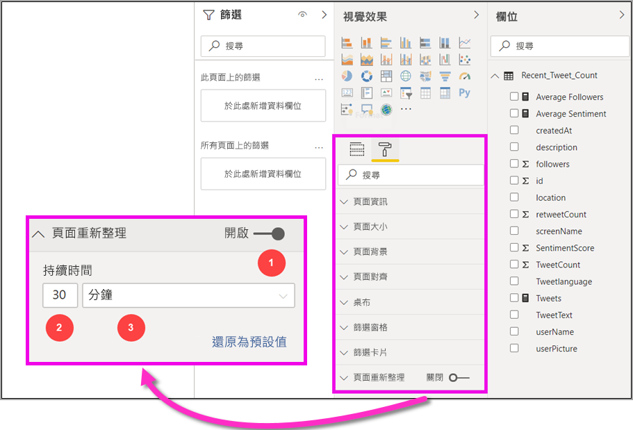

# Power BI Desktop 自動重新整理頁面 (預覽)

當監視重大事件時，請務必在來源資料更新後立即重新整理資料。 例如，在製造業中，知道機器何時運作不正常或即將運作不正常非常重要。

Power BI 中的「自動重新頁面整理 (APR)」功能可讓您的作用中報表頁面以預先定義的步調查詢 [DirectQuery 來源](https://docs.microsoft.com/power-bi/desktop-directquery-about)的新資料。

## 使用自動頁面重新整理

針對此預覽版本，您必須啟用 Power BI Desktop 中的自動頁面重新整理功能。 請前往 [檔案] > [選項及設定]  > [選項]  ，然後從左側窗格選取 [預覽功能]  。 選取 [自動頁面重新整理]  旁的核取方塊以啟用此功能。 自動頁面重新整理僅適用於 DirectQuery 資料來源。

若要使用自動頁面重新整理，請選取您想要啟用重新整理的報表頁面。 在 [視覺效果]  窗格中，選取 [格式化]  圖示 (油漆滾筒)，然後在窗格底部附近尋找 [頁面重新整理]  。 

下圖顯示 [頁面重新整理]  卡片。 接下來的幾個段落會說明編號元素的解釋：

1.  自動頁面重新整理滑桿 - 開啟或關閉頁面重新整理
2.  頁面重新整理間隔值 - 重新整理間隔的數值
3.  頁面重新整理間隔單位 - 頁面重新整理的間隔單位

您可以在這裡開啟頁面重新整理，並選取重新整理持續時間。 預設值為 30 分鐘，最小重新整理間隔為一秒)。 您的報表將會在您設定的間隔開始重新整理。 

## 決定頁面重新整理間隔

啟用自動頁面重新整理時，Power BI Desktop 會持續將查詢傳送至您的 DirectQuery 來源。 傳送查詢與取得傳回的資料之間會有延遲，因此，如果要縮短重新整理間隔，您應該確認查詢已在設定的間隔內成功傳回查詢的資料。 如果未在間隔內傳回資料，會發生視覺效果更新頻率比所設定更新頻率長的情況。

最佳做法是，重新整理間隔至少應符合您預期的新資料抵達速率：

* 如果新資料每隔 20 分鐘抵達來源，則您的重新整理間隔不得少於 20 分鐘。 

* 如果新資料每秒抵達，則間隔應該設定為一秒。 

針對低重新整理間隔 (例如一秒)，您也應該考慮直接查詢資料來源的類型、您的查詢在其上建立的負載、報表檢視者與容量資料中心之間的距離等等。 

您可以使用 Power BI Desktop 中的效能分析器來預估此設定，這可讓您確認每個視覺查詢是否都有足夠的時間傳回來源的結果，以及時間花費在何處。 根據效能分析器的結果，您可以調整並變更資料來源，也可以在您的報表中試驗其他視覺效果和量值。

下圖顯示效能分析器中 DirectQuery 的結果：

讓我們考慮一些關於此資料來源的其他特性。 

1.  資料會以兩秒的速率抵達。 
2.  效能分析器會顯示大約 4.9 秒 (4688 毫秒) 的最大查詢 + 顯示時間。 
3.  資料來源設定為每秒處理大約 1000 個並行查詢。 
4.  您預期會有大約 10 個使用者同時檢視報表。

因此，會產生下列結果：

* **5 個視覺效果 x 10 個使用者 = 大約 50 個查詢**

此計算產生的負載超過資料來源可支援的負載。 資料會以兩秒的速率抵達，因此這應該是您的重新整理頻率。 不過，由於查詢需要大約五秒的時間才能完成，因此我們應該將它設定為超過五秒。 

另請注意，當您將報表發行至服務時，此結果可能會不同，因為報表將會使用裝載在雲端中的 Analysis Services 執行個體。 您可以據以調整您的重新整理頻率。 

為考慮查詢與重新整理計時，Power BI 只會在所有剩餘的重新整理查詢都完成時才執行下一個重新整理查詢。 因此，即使您的重新整理間隔比查詢處理所需的時間短，Power BI 也只會在剩餘的查詢完成後再次重新整理。 

接下來，讓我們看看您可以如何以容量管理員身分偵測並診斷效能問題。 您也可以參閱此文章稍後的＜自動頁面重新整理常見問題集＞  一節，以取得有關效能與疑難排解的進一步問題與解答。

## Power BI 服務中的自動頁面重新整理

您也可以為已在 Power BI Desktop 中撰寫的報表設定自動頁面重新整理間隔，並將其發行至 Power BI 服務。 

Power BI 服務中報表的自動頁面重新整理是使用與 Power BI Desktop 中的設定類似的步驟所設定。 下圖顯示 Power BI 服務的 [頁面重新整理]  設定：

1.  自動頁面重新整理滑桿 - 開啟或關閉頁面重新整理
2.  頁面重新整理間隔值 - 重新整理間隔的數值，必須是整數
3.  頁面重新整理間隔單位 - 頁面重新整理的間隔單位

### 頁面重新整理間隔

Power BI 服務中允許的頁面重新整理間隔會受報表的工作區類型影響。 這適用於下列所有報表：

* 將報表發行至已啟用自動頁面重新整理的工作區
* 編輯工作區中已有的頁面重新整理間隔
* 直接在服務中建立報表

Power BI Desktop 沒有重新整理間隔的限制；其重新整理間隔可以每秒一次。 不過，當報表發行至 Power BI 服務時，就會套用特定限制，我們將在下列各節中說明。

### 重新整理間隔的限制

在 Power BI 服務中，根據如工作區或是否使用進階版服務等因素，可能適用自動頁面重新整理限制。

為了釐清其運作方式，讓我們從[容量與工作區](whitepaper-powerbi-premium-deployment.md#capacities)的一些背景開始著手

**容量**是核心 Power BI 概念，代表用來裝載及傳遞 Power BI 內容的一組資源 (儲存體、處理器與記憶體)。 容量為「共用」或「專用」。 **共用的容量**會與其他 Microsoft 客戶共用，而**專用容量**完全認可給單一客戶。 專用容量會在[進階版容量](whitepaper-powerbi-premium-deployment.md#capacities) 一文中說明。

在共用的容量中，工作負載是在與其他客戶共用的計算資源上執行。 由於容量必須共用資源，因此會有限制，以確保公平使用  ，例如設定最大模型大小 (1 GB) 與每日重新整理頻率上限 (每天 8 次)。

Power BI **工作區**位於容量內，而且它們代表安全性、共同作業和部署容器。 每個 Power BI 使用者都有個人工作區，稱為**我的工作區**。 可建立額外的工作區來啟用共同作業和部署，這些工作區稱為**應用程式工作區**。 根據預設，工作區 (包括個人工作區) 是在**共用容量**中建立的。

以下是這兩個工作區案例的一些詳細資料：

**共用工作區** - 針對一般工作區 (不屬於進階版容量的工作區)，自動頁面重新整理的最小間隔為 30 分鐘 (允許的最低間隔)。

**進階工作區**  - 進階工作區中的自動頁面重新整理可用性取決於您的進階版系統管理員為 Power BI Premium 容量設定的工作負載設定。 有兩個變數可能會影響您設定自動頁面重新整理的能力：

 1. *功能開啟/關閉* ：如果您的容量管理員已決定停用此功能，您將無法在已發行的報表中設定任何類型的頁面重新整理。

 2. *最小重新整理間隔*：啟用此功能時，您的容量管理員必須設定最小的重新整理間隔。 如果您的間隔低於最小值，則 Power BI 服務會覆寫您的間隔，以遵循容量管理員所設定的最小間隔。

下表描述可使用此功能的更多詳細資料，以及每個容量類型與[儲存模式](whitepaper-powerbi-premium-deployment.md#model-storage-modes)的限制

| 儲存模式 | 專用容量 | 共用容量 |
| --- | --- | --- |
| 直接查詢 | **支援** – 是。  **最小重新整理間隔** – 1 秒  **容量管理員覆寫** – 是。 | **支援** – 是。  **最小重新整理間隔** – 30 分鐘  **容量管理員覆寫** – 否。 |
| 匯入 | **支援** – 否。  **最小重新整理間隔** – N/A。  **容量管理員覆寫** – N/A。 | **支援** – 否。  **最小重新整理間隔** – N/A。  **容量管理員覆寫** – N/A。 |
| 混合模式 (DQ + 其他) | **支援** – 是。  **最小重新整理間隔** – 1 秒  **容量管理員覆寫** – 是。 | **支援** – 是。  **最小重新整理間隔** – 30 分鐘  **容量管理員覆寫** – 否。 |
| Live Connect AS | **支援** – 否。  **最小重新整理間隔** – N/A。  **容量管理員覆寫** – N/A。 | **支援** – 否。  **最小重新整理間隔** – N/A。  **容量管理員覆寫** – N/A。 |
| Live Connect PBI | **支援** – 否。  **最小重新整理間隔** – N/A。  **容量管理員覆寫** – N/A。 | **支援** – 否。  **最小重新整理間隔** – N/A。  **容量管理員覆寫** – N/A。 |

> [!NOTE]
> 從 Power BI Desktop 發行將已啟用自動頁面重新整理的報表發行到服務時，您必須在 [資料集設定] 功能表中提供 DirectQuery 資料來源的認證。

## 考量與限制

在 Power BI Desktop 或 Power BI 服務中使用自動頁面重新整理時，有幾件事要謹記在心。

* 自動頁面重新整理不支援匯入、LiveConnect 與推送儲存模式。  
* 支援至少有一個 DirectQuery 資料來源的複合模型。
* Power BI Desktop 沒有重新整理間隔的限制；其重新整理間隔可以短到每秒一次。 當報表發行至 Power BI 服務時，就會套用特定限制，如此文件先前所述。

### 效能診斷

自動頁面重新整理適用於監視案例，以及探索快速變更的資料。 不過，有時候這可能會造成容量或資料來源的過度負載。

為防止資料來源發生過度負載，Power BI 具有下列保護措施：

1. 所有自動頁面重新整理查詢都會以**較低的**優先順序執行，以確保互動式查詢 (例如頁面載入與交叉篩選視覺效果) 的優先順序較高。
2. 若您的查詢在下一個重新整理循環之前尚未完成，Power BI 不會發出新的重新整理查詢，直到先前的查詢完成為止。 例如，如果您有一秒的重新整理間隔，而且查詢平均需要四秒才能完成，Power BI 實際上只會每四秒發出一次查詢。

您仍然會在兩個區域中遇到效能瓶頸：

1. **容量：** 查詢會先叫用進階版容量，這會摺疊並評估從報表視覺效果產生的 DAX 查詢並評估為來源查詢。
2. **直接查詢資料來源：** 接著會針對來源執行上一個步驟中的已轉譯查詢。 這會是您的 SQL Server、SAP Hana 來源等等。

使用可供系統管理員存取的[進階版計量應用程式](service-admin-premium-monitor-capacity.md)，您可以將低優先順序查詢所使用的容量視覺化。

低優先順序查詢是由自動頁面重新整理查詢與模型重新整理查詢所組成。 目前無法區分來自自動頁面重新整理與模型重新整理查詢的負載。

若您注意到您的容量使用低優先順序查詢而超載，您可以採取幾個動作：

1. 要求較大的進階版 SKU。
2. 連絡報表擁有者，並要求降低重新整理間隔。
3. 在容量管理員入口網站中，您可以：
  1. 關閉該容量的自動頁面重新整理
  2. 提高最小重新整理間隔，這會影響該容量的所有報表。

### 常見問題集

此節提供常見的問題和解答 

1. 我是報表作者。 我將報表重新整理間隔定義為在電腦上 1 秒，但在發行之後，我的報表未在服務中重新整理。

    * 檢查是否已為頁面開啟自動頁面重新整理。 由於此設定是針對每頁，因此您必須確定已針對報表中想要重新整理的每個頁面開啟此設定。
    * 檢查您是否已上傳至具有附加進階版容量的工作區，如果不是，您的重新整理間隔將會鎖定在 30 分鐘。
    * 若您的報表位於進階版工作區，請連絡您的系統管理員，確認他們已針對附加的容量啟用此功能。 此外，請確定容量的最小重新整理間隔不超過您的報表設定。

2. 我是容量管理員。我變更了自動頁面重新整理間隔設定，但它們並未反映出來。 換句話說，報表仍以非預期速率進行重新整理，或即使我已開啟，也不會重新整理。

    * 在容量管理 UI 中進行的自動頁面重新整理設定變更，最多需要 5 分鐘的時間才能傳播至報表。
    * 除了開啟容量的自動頁面重新整理之外，您還需要為您要看到它的報表頁面開啟它。

3. 我的報表是以混合模式 (DQ + 匯入) 運作。 並非所有視覺效果都會重新整理。

    * 若您的視覺效果參考匯入資料表，這就是預期的情況。 匯入不支援自動頁面重新整理。
    * 請參閱此節中的問題 1。

4. 我的報表在服務中重新整理成功，然後突然停止。

    * 請嘗試重新整理頁面，以查看問題是否自行解決。
    * 請連絡您的容量管理員，因為他們可能已關閉該功能或引發最小重新整理間隔 (請參閱問題 2)

5. 我是報表作者。 我的視覺效果未依我指定的步調重新整理。 它們以較低的速率重新整理。

    * 若您的查詢花費較長的時間執行，您的重新整理間隔將會延遲。 自動頁面重新整理會等待所有查詢完成執行，然後再執行新的查詢。
    * 您的容量管理員設定的最小重新整理間隔，可能高於您為報表所設定的。 請連絡您的容量管理員，並要求將它降低。

6. 自動頁面重新整理查詢是否由快取提供？

    * 否，所有自動頁面重新整理查詢都會跳過任何已快取的資料。

## 後續步驟

如需詳細資訊，請參閱下列文章：

* [使用 Power BI 中的 DirectQuery](desktop-directquery-about.md)
* [使用效能分析器檢查報表元素效能](desktop-performance-analyzer.md)
* [部署及管理 Power BI Premium 容量](whitepaper-powerbi-premium-deployment.md)
* [Power BI Desktop 中的資料來源](desktop-data-sources.md)
* [使用 Power BI Desktop 合併資料並使其成形](desktop-shape-and-combine-data.md)
* [在 Power BI Desktop 中連接至 Excel 活頁簿](desktop-connect-excel.md)   
* [直接將資料輸入 Power BI Desktop 中](desktop-enter-data-directly-into-desktop.md)   
