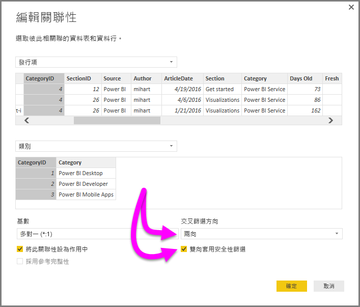

# 在 Power BI Desktop 中使用 DirectQuery 雙向交叉篩選

在篩選資料表以建立適當的資料檢視時，報表建立者 (和製造資料模型者) 在決定如何將篩選套用至報表上也面臨挑戰。資料表的篩選內容為關聯性的其中一端所持有，而其他相關聯的項目則不具有其內容，通常需要複雜的 DAX 公式才能取得所需的結果。

有了雙向交叉篩選，報表建立者 (和製造資料模型者) 現在就可在使用相關資料表時，對篩選的套用方式具備更充分的掌控，讓這些篩選得以套用至資料表關聯性的 *兩端* 。 這可以藉由將篩選內容傳播至資料表關聯性另一端的第二個關聯資料表來完成。

## 雙向交叉篩選的詳細技術白皮書
有份[詳細的技術白皮書](https://download.microsoft.com/download/2/7/8/2782DF95-3E0D-40CD-BFC8-749A2882E109/Bidirectional%20cross-filtering%20in%20Analysis%20Services%202016%20and%20Power%20BI.docx)可供使用，其解釋了 Power BI Desktop 中的雙向交叉篩選 (該技術白皮書另涵蓋 SQL Server Analysis Services 2016，此兩者都有相同的行為)。

* 下載 [Power BI Desktop 的雙向交叉篩選](https://download.microsoft.com/download/2/7/8/2782DF95-3E0D-40CD-BFC8-749A2882E109/Bidirectional%20cross-filtering%20in%20Analysis%20Services%202016%20and%20Power%20BI.docx)技術白皮書

## 啟用 DirectQuery 的雙向交叉篩選

若要啟用交叉篩選，在關聯性的 [編輯關聯性]  對話方塊中，必須選取下列項目︰

* [交互篩選方向]  必須設為 [兩者] 
* [雙向套用安全性篩選]  也必須選取

  

> [!NOTE]
> 在建立 Power BI Desktop 中的交叉篩選 DAX 公式時，使用 UserPrincipalName  (這通常和使用者登入名稱相同，例如 joe@contoso.com) 而不是 UserName  。 因此，您可能需要建立將 *UserName* (或例如 EmployeeID) 對應至 *UserPrincipalName* 的相關資料表。

如需詳細資訊，以及雙向交叉篩選如何運作的範例，請參閱本文稍早所提到的[技術白皮書](https://download.microsoft.com/download/2/7/8/2782DF95-3E0D-40CD-BFC8-749A2882E109/Bidirectional%20cross-filtering%20in%20Analysis%20Services%202016%20and%20Power%20BI.docx)。

