# 在 Power BI Desktop 中使用書籤來共用見解並建立故事
在 Power BI Desktop 中使用「書籤」  ，可協助您擷取目前設定的報表頁面檢視 (包括視覺效果的篩選和狀態)。 之後，您可藉由選取儲存的書籤來返回該狀態。 

您也可以建立書籤集合，依想要的順序加以排列，並在稍後於簡報中逐步執行每個書籤，以醒目提示一系列見解，或您想要透過視覺效果和報表述說的故事。 

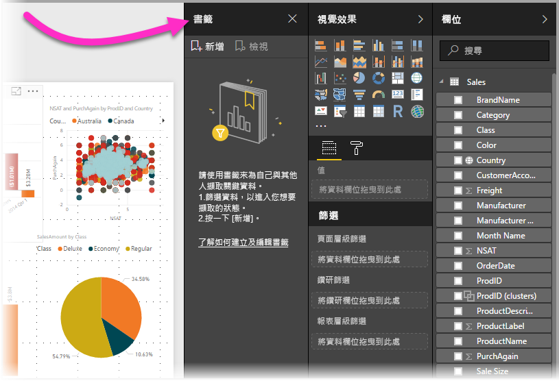

書籤有許多用途。 例如，您可以使用書籤來持續追蹤自己的報表建立進度 (可輕易新增、刪除和重新命名書籤)，也可以建立書籤來建置依序逐步執行書籤之類的 PowerPoint 簡報，以便透過報表述說故事。 

> [!TIP]
> 如需在 Power BI 服務中使用個人書籤的資訊，請參閱 [Announcing personal bookmarks in the Power BI Service](https://powerbi.microsoft.com/blog/announcing-personal-bookmarks-in-the-power-bi-service/) (在 Power BI 服務中宣告個人書籤)。 

## 使用書籤
若要使用書籤，請選取 Power BI Desktop 功能區中的 [檢視]  索引標籤，然後選取 [書籤] 窗格  。 

![開啟 [書籤] 窗格](media/desktop-bookmarks/bookmarks_03.png)

當您建立書籤時，下列項目會與書籤一起儲存：

* 目前頁面
* 篩選
* 交叉分析篩選器，包括交叉分析篩選器類型 (例如，下拉式清單或清單) 和交叉分析篩選器狀態
* 視覺效果選取狀態 (例如交叉醒目提示篩選條件)
* 排序次序
* 鑽研位置
* 物件的可見度 (透過使用 [選取]  窗格)
* 任何可見物件的焦點或**聚焦**模式

以您想要在書籤中顯示的方式來設定報表頁面。 將報表頁面和視覺效果排列成您想要的方式之後，從 [書籤]  窗格中選取 [新增]  以新增書籤。 

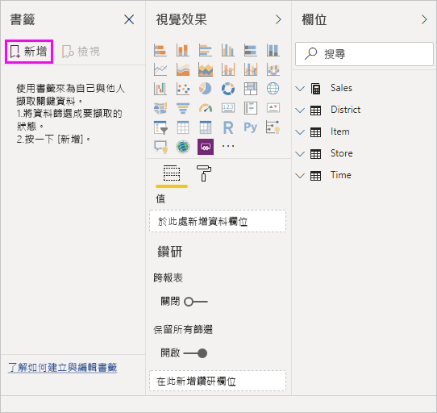

Power BI Desktop 會建立書籤，並為其提供泛型名稱。 您可以選取書籤名稱旁的省略符號，然後從出現的功能表中選取一個動作，以輕鬆地 [重新命名]  、[刪除]  或 [更新]  書籤。

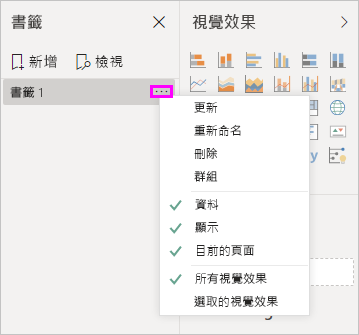

建立書籤之後，請在 [書籤]  窗格中進行選取以顯示該書籤。 

您也可以選取每個書籤是否都會套用 [資料]  屬性 (如篩選和交叉分析篩選器)、[顯示]  屬性 (例如聚焦和其可見度)，以及新增書籤時所呈現可見頁面的 [目前頁面]  。 當使用書籤在報表檢視或視覺效果選取項目之間切換時，這些功能很有用；在這種情況下，建議您關閉資料屬性，讓該篩選不會在使用者選取書籤來切換檢視時重設。 

若要進行這類變更，請選取書籤名稱旁的省略符號，然後選取或取消選取 [資料]  、[顯示]  和其他控制項旁的核取記號。 

## 排列書籤
當建立書籤時，您可能會發現所建立順序不同於想要呈現給對象的順序。 沒問題，您可以輕鬆地重新排列書籤的順序。

- 在 [書籤]  窗格中，拖放書籤以變更其順序。 

   書籤之間的黃色列可指定所拖曳的書籤將要放置的位置。

   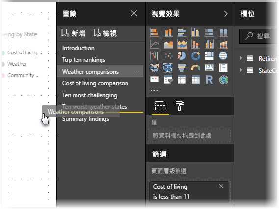

當使用書籤的 [檢視]  功能時，書籤的順序可能會很重要，如下一節所述。

## 以投影片放映書籤
當您想要依序呈現一組書籤時，您可以從 [書籤]  窗格中選取 [檢視]  以開始投影片放映。

在 [檢視]  模式中，有一些需要注意的功能。

   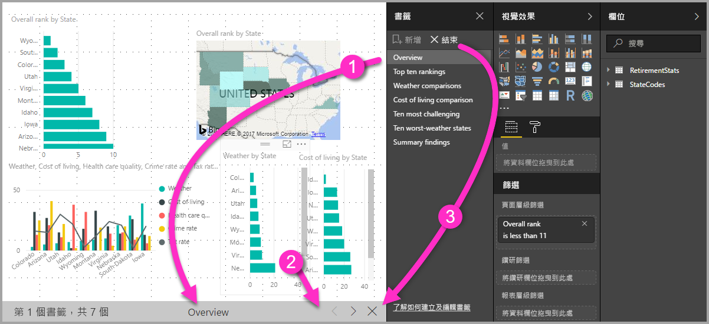

1. 書籤的名稱會出現在畫布底部的書籤標題列中。

2. 書籤標題列的箭號可讓您移至下一個或上一個書籤。

3. 您可以從 [書籤]  窗格中選取 [結束]  ，或選取書籤標題列中的 **X** 來結束 [檢視]  模式。 

當在 [檢視]  模式中，您可以關閉 [書籤]  窗格 (藉由選取該窗格上的 **X**)，以為簡報提供更多空間。 所有視覺效果在 [檢視]  模式中都是互動式，並可用於交叉醒目提示，就如同直接與其互動一樣。 

## 可見度：使用 [選取範圍] 窗格
與 [書籤]  窗格相關，[選取範圍]  窗格提供目前頁面上的所有物件清單，可讓您選取物件並指定該物件是否為可見。 

![啟用 [選取] 窗格](media/desktop-bookmarks/bookmarks_08.png)

在 [選取範圍]  窗格中，您可以選取物件，並藉由選取物件右側的眼睛圖示來切換物件目前是否可見。 

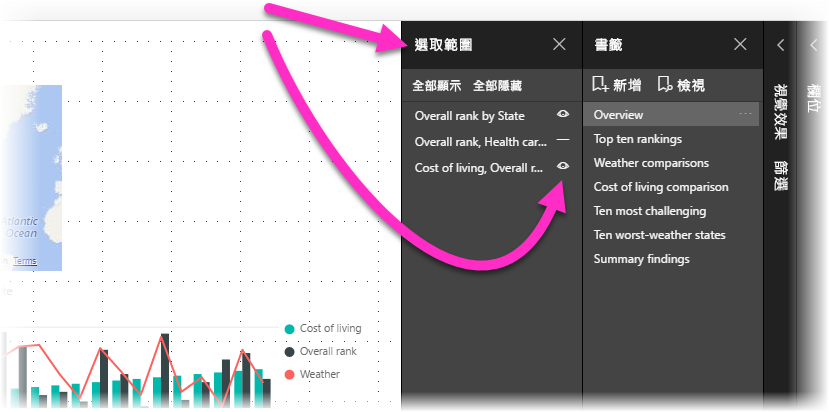

在新增書籤之後，也會根據每個物件在 [選取範圍]  窗格中的設定來儲存其可見度狀態。 

請務必注意，不論是否可見，交叉分析篩選器都會繼續篩選報表頁面。 因此，您可以使用不同交叉分析篩選器設定來建立許多不同書籤，然後在不同書籤中以不同方式來顯示各個報表頁面 (並醒目提示不同的見解)。

## 圖案和影像的書籤
您也可以將圖案和影像連結至書籤。 透過這項功能，當選取物件時，即會顯示與該物件建立關聯的書籤。 當使用按鈕時，這項功能特別有用。 如需詳細資訊，請參閱[使用 Power BI 中的按鈕](desktop-buttons.md)。 

將書籤指派給物件： 

1. 在報表畫布中選取物件。 然後，從顯示的 [格式化圖案]  窗格中，將 [動作]  滑桿切換至 [開啟]  。

2. 展開 [動作]  區段。 在 [類型]  下，選取 [書籤]  。

3. 在 [書籤]  下，選取書籤。

   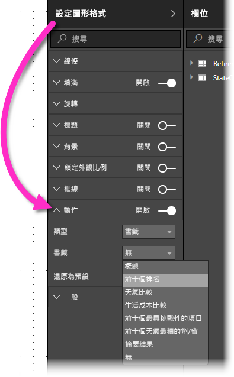

您可以使用物件連結書籤執行各式各樣有趣的作業。 您可以在報表頁面上建立視覺目錄，或提供不同方式 (例如視覺效果類型) 來檢視相同資訊。

當處於編輯模式時，請按 **Ctrl** 鍵並選取連結來進入該連結。 當未處於編輯模式時，請選取物件以進入連結。 

## 書籤群組

從 2018 年 8 月開始的 Power BI Desktop 版本，已可建立及使用書籤群組。 書籤群組即為一組書籤的集合，可用以指定何者可顯示及整理為群組。 

建立書籤群組： 
1. 按 **Ctrl** 鍵，然後選取要包含在群組中的書籤。 

2. 選取所選書籤旁的省略符號，然後從出現的功能表中選取 [群組]  。

   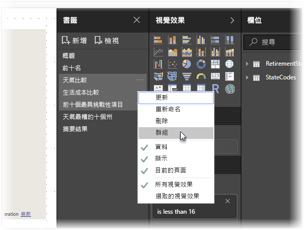

Power BI Desktop 會自動將群組命名為「群組 1」  。 您可以選取此名稱旁的省略符號，並選取 [重新命名]  ，然後將其重新命名為想要的任何名稱。

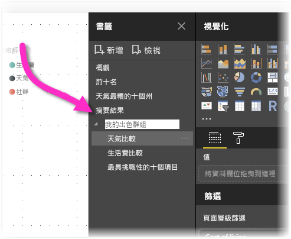

如同任何書籤群組，展開書籤群組的名稱只會展開或摺疊該組書籤，而不是書籤本身。 

當使用書籤的 [檢視]  功能時，會套用下列詳細資料：

* 當您從書籤選取 [檢視]  時，若所選書籤位於群組中，則只有*該群組中*的書籤才顯示在檢視工作階段中。 

* 若所選書籤並非群組，或位於頂層 (例如書籤群組的名稱)，即會播放整個報表的所有書籤，包括任何群組中的書籤。 

將書籤取消群組： 
1. 選取群組中的任何書籤，並選取省略符號。 

2. 從顯示的功能表中選取 [取消群組]  。

   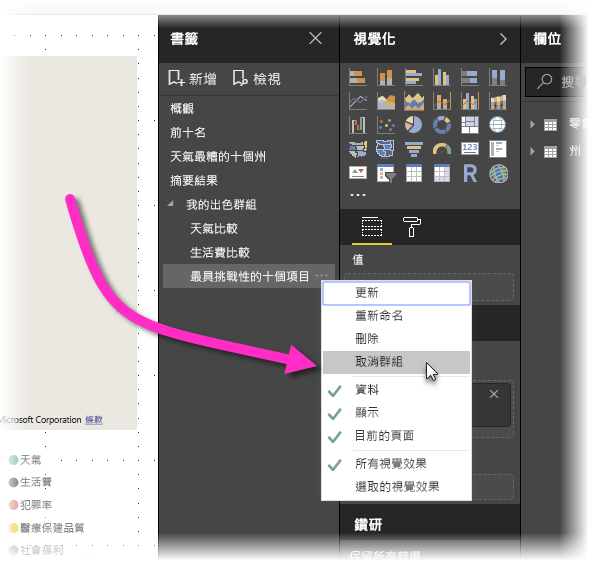

   為群組中的任一書籤選取 [取消群組]  時，會從群組移出所有書籤；這會刪除該群組，但不會刪除書籤本身。 

從群組中移除單一書籤： 
1. 將群組中的所有成員 [取消群組]  ，這會刪除整個群組。 

2. 按 **Ctrl** 鍵並選取每個書籤，然後再次選取 [群組]  以在新群組中選取想要的成員。 

## 使用聚焦
隨書籤發行的另一項功能是「聚焦」  。 使用聚焦，您可以提高對特定圖表的注意力；例如，在 [檢視]  模式中呈現您的書籤時。

讓我們來比較聚焦模式與焦點模式，看看這兩種模式有何不同：

1. 使用焦點模式時，您會選取視覺效果的**焦點模式**圖示，這會使視覺效果填滿整個畫布。

2. 使用聚焦時，您可以從視覺效果的省略符號選取 [聚焦]  ，以其原始大小醒目提示某個視覺效果，這會導致頁面上的所有其他視覺效果淡化成近乎透明。 

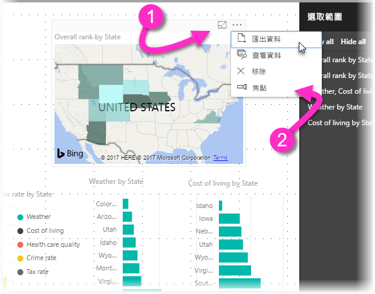

當您選取上圖中視覺效果的**焦點模式**圖示時，頁面會如下所示：

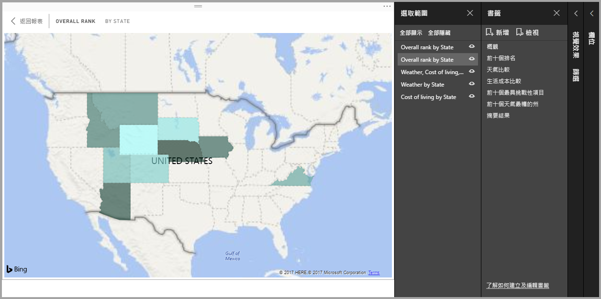

相反地，當您從視覺效果的省略符號功能表中選取 [聚焦]  時，頁面看起來如下所示：

如果在新增書籤時選取焦點或聚焦模式，則書籤中會保留該模式。

## Power BI 服務中的書籤
當將至少含有一個書籤的報表發佈至 Power BI 服務時，您可以在 Power BI 服務中檢視這些書籤並與其互動。 當報表中有可用的書籤時，您可以藉由選取 [檢視]   > [選取窗格]  或 [檢視]   > [書籤窗格]  來顯示 [選取]  和 [書籤]  窗格。 

![在 Power BI 服務中檢視 [書籤窗格] 和 [選取窗格]](media/desktop-bookmarks/bookmarks_14.png)

在 Power BI 服務中，[書籤]  窗格的運作方式就像是在 Power BI Desktop 中一樣，包括能夠選取 [檢視]  以類似投影片放映的方式來依序顯示書籤。

請使用灰色書籤標題列 (而不是黑色箭號) 來瀏覽書籤。 (黑色箭號可讓您移至報表頁面，而不是書籤。)

## 啟用書籤預覽 (2018 年 3 月之前的版本)
從 Power BI Desktop 的 2018 年 3 月版本開始，正式推出書籤。 

我們建議您升級至最新版本。 但如果您的 Power BI Desktop 版本比該版舊，則可以嘗試 Power BI Desktop 自 2017 年 10 月版開始的書籤功能，以及 Power BI 服務中啟用書籤的報表。 

啟用預覽書籤功能： 

1. 選取 [檔案]   > [選項及設定]   > [選項]   > [預覽功能]  ，然後選取 [書籤]  。 

   ![啟用 [選項] 視窗中的 [書籤]](media/desktop-bookmarks/bookmarks_02.png)

2. 重新啟動 Power BI Desktop，以啟用書籤的預覽版本。

## 限制與考量
在本版的書籤功能中，有幾項限制和考量要留意。

* 大部分的自訂視覺效果都可以和書籤搭配使用。 不過，如果在使用書籤和自訂視覺效果時遇到問題，請連絡該自訂視覺效果的建立者，並請他們將書籤的支援新增到其視覺效果。 
* 如果在建立書籤之後將視覺效果新增至報表頁面，則視覺效果就會以其預設狀態顯示。 亦即，如果您在先前建立書籤的頁面中引進交叉分析篩選器，則交叉分析篩選器就會以其預設狀態運作。
* 在建立書籤後移動視覺效果的結果會自動反映在書籤中。 

## 後續步驟
如需類似功能或與書籤互動的詳細資訊，請參閱下列文章：

* [在 Power BI Desktop 中使用鑽研](desktop-drillthrough.md)
* [以焦點模式顯示儀表板磚或報表視覺效果](consumer/end-user-focus.md)

