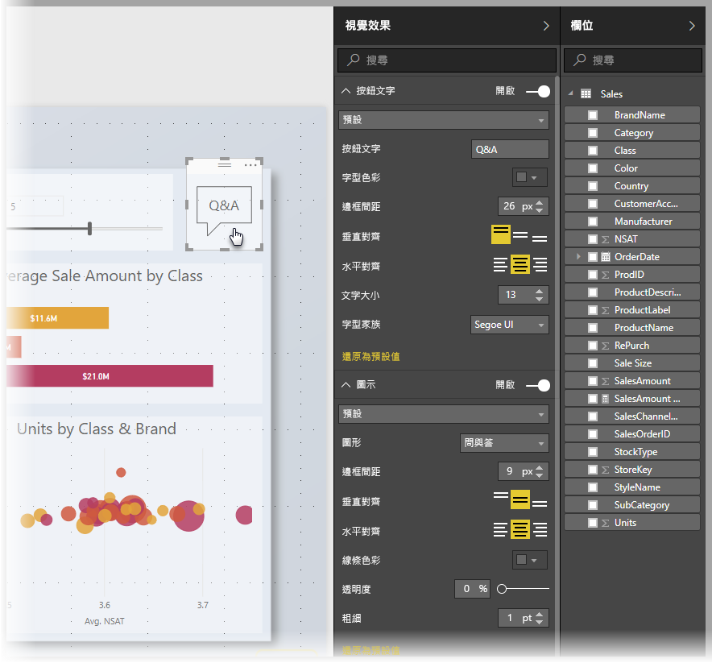
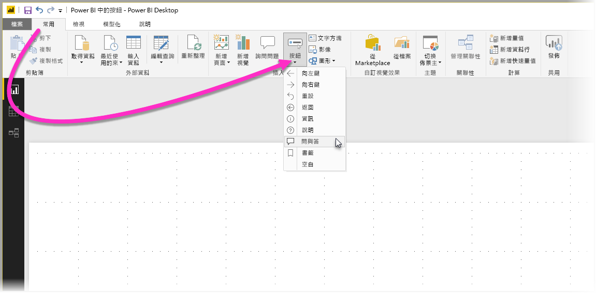
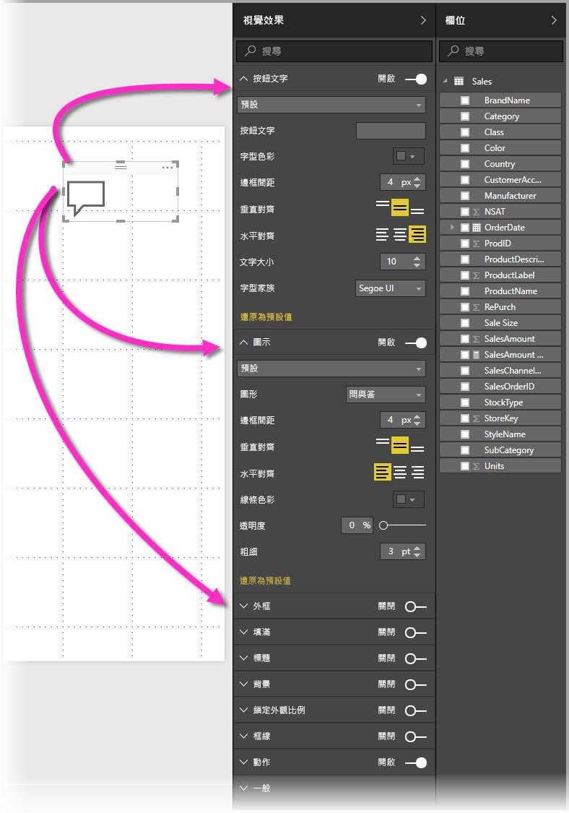
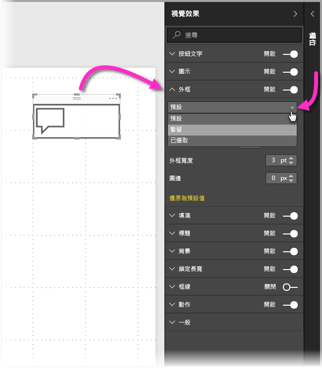

# 使用 Power BI 中的按鈕
使用 Power BI Desktop 中的**按鈕**可讓您製作行為類似應用程式的報表與儀表板，進而打造出互動式環境，讓使用者能夠以滑鼠瀏覽及點選 Power BI 內容，並進行深入互動。 您可在 **Power BI Desktop** 中為報表新增按鈕，並將這些報表共用或發佈至 Power BI 服務來建立能為使用者提供行為類似應用程式的儀表板。

您在 **Power BI Desktop**中所建立的按鈕可用於發佈在 **Power BI 服務**中的報表或儀表板。

## 在報表中建立按鈕
若要在 **Power BI Desktop**報表中建立按鈕，請在 [首頁] 功能區選取 [按鈕]，下拉式功能表會隨即出現，您可從其中的選項集合選取想要的按鈕，如下圖所示。 

在您建立按鈕並在報表畫布上加以選取後，[視覺效果] 窗格會顯示許多自訂按鈕的方式以符合您的需求。 例如，您可在 [視覺效果] 窗格切換 [按鈕文字] 卡片，來開啟或關閉該功能。 您也可以變更按鈕圖示、按鈕填滿、標題、使用者在報表或儀表板中按下該按鈕時所採取的動作，以及其他屬性。

## 設定按鈕在閒置、滑鼠在其上暫留、或是受到選取時的屬性

Power BI 中的按鈕有三種狀態：預設 (當滑鼠未在其上暫留，或其為受選取時的顯示方式)、滑鼠在其上暫留、受到選取 (通常稱之為「受到點選」)。 [視覺效果] 中的多數卡片，均可根據這些狀態個別修改，為自訂按鈕提供足夠的彈性。

[視覺效果] 窗格中的以下卡可讓您根據按鈕的三個狀態，來修改按鈕的格式或行為：

* 按鈕文字
* 圖示
* 外框
* 填滿

若要選取按鈕在各狀態的顯示方式，請展開這些卡中的其中一個，並選取顯示在卡上方的下拉式清單。 在下圖中，您可看見 [外框] 卡已展開，且下拉式清單已受到選取並顯示三種狀態：

## 選取按鈕的動作

您可選取使用者在 Power BI 中選取按鈕時所要採取的動作。 您可從 [視覺效果] 窗格的 [動作] 存取按鈕動作的選項。

按鈕動作的選項為：

* 上一步
* 書籤
* 問與答

選取 [返回] 會將使用者返回報表的上一頁。 這對於向下切入頁面而言特別有用。

選取 [書籤] 會顯示已為目前報表定義之書籤的相關報表頁面。 您可[深入了解 Power BI 中的書籤](desktop-bookmarks.md)。 

從下拉式清單選取 [問與答] 會顯示 [問與答總管] 視窗。 

部分按鈕會具有自動選取的預設動作。 例如，[問與答] 按鈕會自動將 [問與答] 選作預設動作。 您可參閱[此部落格文章](https://powerbi.microsoft.com/blog/power-bi-desktop-april-2018-feature-summary/#Q&AExplorer)來深入了解 [問與答總管]。

您可對欲使用的按鈕使用「CTRL + 按一下」，來嘗試或測試為報表建立的按鈕。 

## 後續步驟
如需類似功能或與按鈕互動的詳細資訊，請參閱下列文章：

* [在 Power BI Desktop 中使用鑽研](desktop-drillthrough.md)
* [以焦點模式顯示儀表板磚或報表視覺效果](service-focus-mode.md)
* [在 Power BI 中使用書籤來共用深入解析並建立故事](desktop-bookmarks.md)

