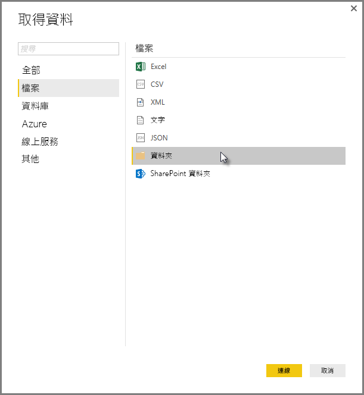
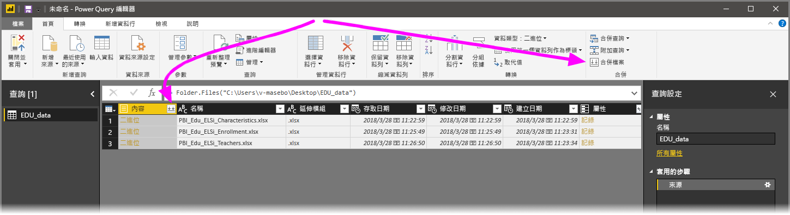
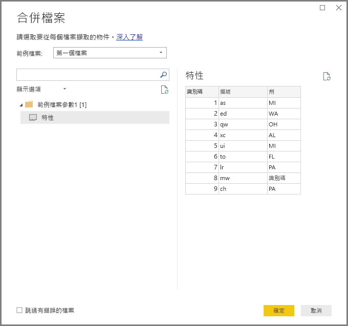
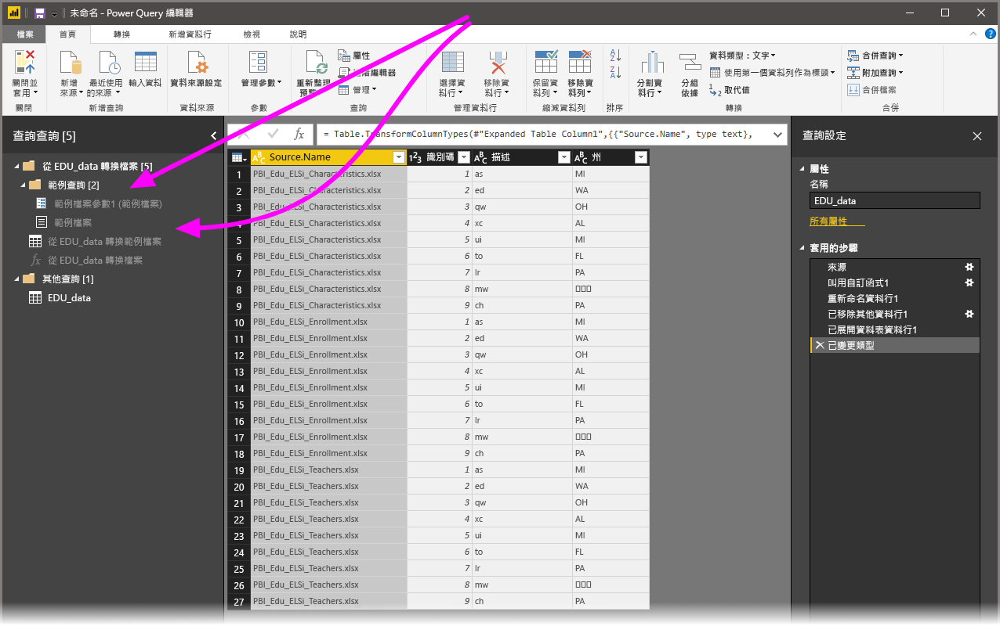

# 在 Power BI Desktop 中合併檔案 (二進位檔)
將多個具有相同結構描述的檔案合併成單一邏輯資料表，是一種將資料匯入 **Power BI Desktop** 中的強大方法。 這個便利又熱門的方法在 **Power BI Desktop** 的 2016 年 11 月版本 (及後續版本) 中獲得了便利性及擴充能力的提升，如本文所述。

若要開始進行合併同一個資料夾中檔案的流程，請選取 [取得資料] > [檔案] > [資料夾]  。

## 先前的合併檔案 (二進位檔) 行為
在 **Power BI Desktop** 的 2016 年 11 月版本之前，此功能稱為**合併二進位檔**，而您可以使用**合併二進位檔**轉換來合併特定檔案類型，但有下列限制：

* 在檔案合併成單一資料表之前，並不是每一個個別檔案都會轉換。 因此，您通常需要合併檔案，然後在編輯程序中篩選資料列，以篩選出「標頭值」  。
* [合併二進位檔案]  轉換僅適用於「文字」  或 *CSV* 檔案，而不適用於其他支援的檔案格式，例如 Excel 活頁簿、JSON 檔案等。

客戶要求更直覺式的**合併二進位檔**作業，因此我們加強了轉換功能並重新命名為**合併檔案**。

## 目前的合併檔案行為
**Power BI Desktop** 現在能夠更有效率地處理**合併檔案 (二進位檔)** 。 您一開始可以從 [查詢編輯器]  中的 [常用]  功能區索引標籤或資料行本身選取 [合併檔案]  。

**合併檔案**轉換現在的行為如下：

* **合併檔案**轉換會分析每個輸入檔，並判斷要使用的正確檔案格式，例如「文字」  或「Excel 活頁簿」  或 *JSON* 檔案。
* 轉換可讓您從第一個檔案 (例如「Excel 活頁簿」  ) 選取要擷取的特定物件。
  
  
* **合併檔案**接著會自動執行下列查詢：
  
  * 建立在單一檔案中執行所有必要擷取步驟的範例查詢。
  * 建立「函數查詢」  ，以將檔案/二進位檔案輸入參數化成「範例查詢」  。 範例查詢和函數查詢會建立連結，因此範例查詢的變更會反映在函數查詢中。
  * 將「函數查詢」  套用到具有輸入二進位檔案 (例如「資料夾」  ) 的原始查詢，使其在每個資料列上對二進位檔案輸入套用函數查詢，然後將產出的資料擷取展開為頂層資料行。
    
    

透過**合併檔案**的新行為，只要所有檔案的檔案類型和結構相同 (例如相同的資料行)，您就可以輕鬆將其全部合併到指定的資料夾中。

此外，您可以藉由修改自動建立的「範例查詢」  輕鬆套用額外轉換或擷取步驟，而不需要花費心力修改或建立額外的「函數查詢」  步驟。 對「範例查詢」  所進行的任何變更都會在已連結的「函數查詢」  中自動產生。

## 後續步驟
您可以使用 Power BI Desktop 連接至各式各樣的資料。 如需有關資料來源的詳細資訊，請參閱下列資源︰

* [Power BI Desktop 是什麼？](desktop-what-is-desktop.md)
* [Power BI Desktop 中的資料來源](desktop-data-sources.md)
* [使用 Power BI Desktop 合併資料並使其成形](desktop-shape-and-combine-data.md)
* [連接至 Power BI Desktop 中的 CSV 檔案](desktop-connect-csv.md)   
* [直接將資料輸入 Power BI Desktop 中](desktop-enter-data-directly-into-desktop.md)   

