# Power BI Desktop 中的常見查詢工作
當使用 Power BI Desktop 的 [查詢編輯器]  視窗時，有很多常用的工作。 本文將示範這些常見工作，並提供其他資訊的連結。 

這裡示範的常見查詢工作如下所示：

* 連接到資料
* 資料成形及合併
* 將資料列分組
* 樞紐資料行
* 建立自訂資料行
* 查詢公式

我們將使用幾個資料連線來完成這些工作。 如果您想要自行逐步執行這些工作，可以下載或連接至資料。

第一個資料連線是 Excel 活頁簿。 另一個則是 Web 資源 (這也會在其他 Power BI Desktop 說明內容中使用)，可以從這裡存取：

[*http://www.bankrate.com/finance/retirement/best-places-retire-how-state-ranks.aspx*](http://www.bankrate.com/finance/retirement/best-places-retire-how-state-ranks.aspx)

連接至這兩個資料來源所需的步驟是常見查詢工作的開始位置。

## 連接到資料
若要連接至 Power BI Desktop 中的資料，請從功能區上的 [主資料夾]  索引標籤選取 [取得資料]  按鈕。 Power BI Desktop 會呈現一個功能表，其中具有最常見的資料來源。 如需 Power BI Desktop 可連接的資料來源完整清單，請選取功能表底部的 [其他...]  按鈕。 如需詳細資訊，請參閱 [Power BI Desktop 中的資料來源](https://docs.microsoft.com/en-us/power-bi/desktop-data-sources).

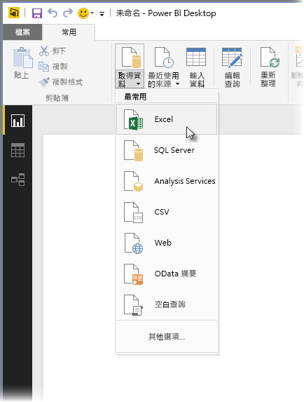

若要開始，請選取 [Excel]  並瀏覽至活頁簿，然後選取它。 查詢會檢查活頁簿，然後在 [導覽器]  視窗中呈現它找到的資料。

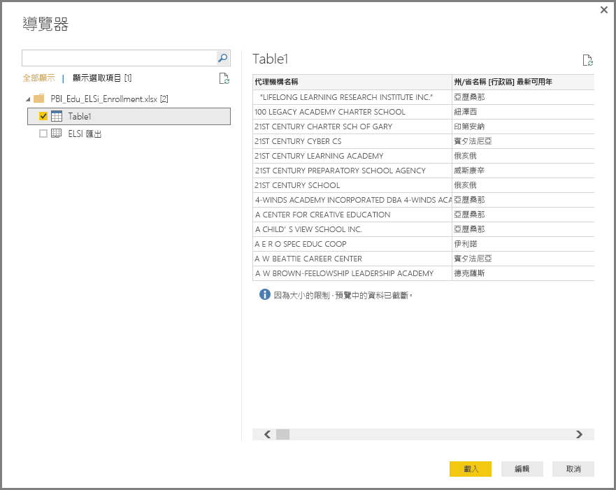

您可以選取 [編輯]  來調整 (或 *塑造* ) 資料，然後才將它載入到 Power BI Desktop。 載入之前先編輯查詢特別適用於處理大型資料集時，在載入之前先行削減。 我們想要這麼做，因此我們選取 [編輯] 。

連接到不同類型的資料也一樣簡單。 我們也想要連接到 Web 資源。 選取 [取得資料] **\> [其他...]**，然後選取 [其他]**\> [Web]**。

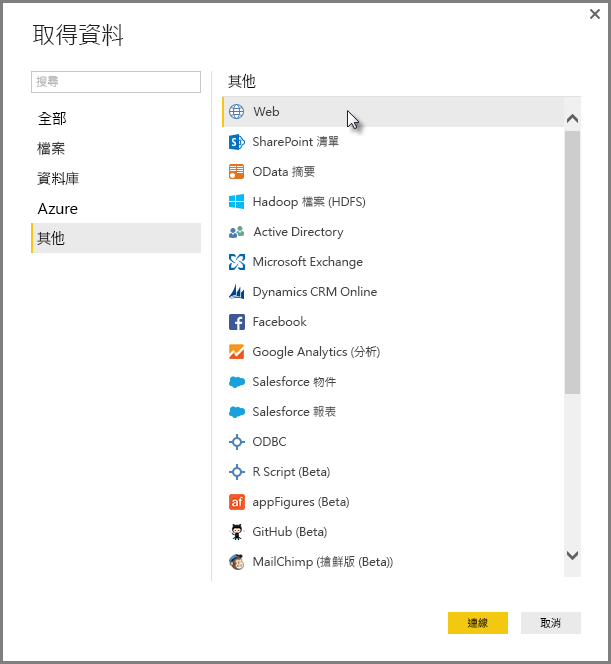

[從 Web]  視窗隨即出現，您可以在這裡輸入網頁的 URL。

選取 [確定] ，然後像之前一樣，Power BI Desktop 會檢查活頁簿並在 [導覽器]  視窗中呈現它找到的資料。

其他資料連線也很類似。 如果需要驗證才能建立資料連線，Power BI Desktop 會提示您輸入適當的認證。

如需連接至 Power BI Desktop 資料的逐步示範，請參閱[連接至 Power BI Desktop 中的資料](https://docs.microsoft.com/en-us/power-bi/desktop-connect-to-data).

## 資料成形及合併
您可以輕鬆地使用查詢編輯器塑造及合併資料。 本節包含一些範例，說明如何塑造資料。 如需塑造與合併資料的更完整示範，請參閱**[使用 Power BI Desktop 塑造及合併資料](https://docs.microsoft.com/en-us/power-bi/desktop-shape-and-combine-data)**。

在上一節中，我們連接到兩組資料 – Excel 活頁簿和 Web 資源。 一旦載入到查詢編輯器中，我們就會看到下列畫面，其中包含來自所選取網頁的查詢 (從 [查詢] 窗格內列出的可用查詢中取得，位於 [查詢編輯器] 視窗左邊)。

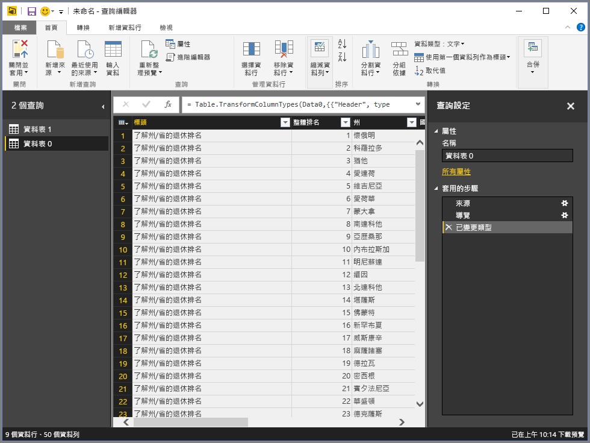

塑造資料時，您會將資料來源轉換成符合您需求的格式。 在此情況下，我們不需要標題為「標頭」 的第一欄，因此我們會將它移除。

在 **查詢編輯器**中，許多命令位於功能區和內容相關性的按一下滑鼠右鍵功能表中。 例如，當您以滑鼠右鍵按一下「標頭」資料行時，出現的功能表可讓您移除該資料行。 您也可以選取該資料行，然後從功能區選取 [移除資料行] 按鈕。

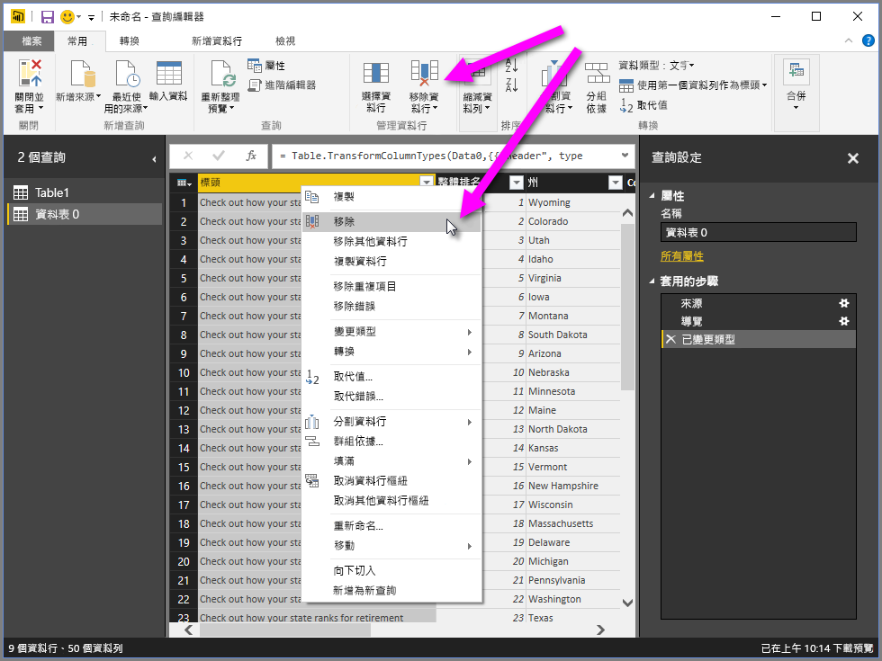

有許多其他方式可讓您在此查詢中使資料成形；您可以移除從頂端或底部算起的任何資料列數；您可以加入資料行、分割資料行、取代值及執行其他成形工作，以指示查詢編輯器將資料處理成所要的樣子。

## 將資料列分組
在查詢編輯器中，您可以將多個資料列的值分組成單一值。 這適用於彙總提供的產品數、總銷售額或學生人數。

在此範例中，我們將分組教育註冊資料集中的資料列。 資料來自 Excel 活頁簿，並且已在查詢編輯器中加以成形，以便只取得我們需要的資料行、將資料表重新命名，並執行一些其他轉換。

讓我們找出每一州有多少機構 (這包括學區和其他教育機構，例如地區服務區等等)。 我們選取 *「州名縮寫」* 資料行，然後選取 [ **轉換** ] 索引標籤中的 [ **Group By** ] 按鈕或功能區的 [ **主資料夾** ] 索引標籤 ([**Group By** ] 位於兩個索引標籤中)。

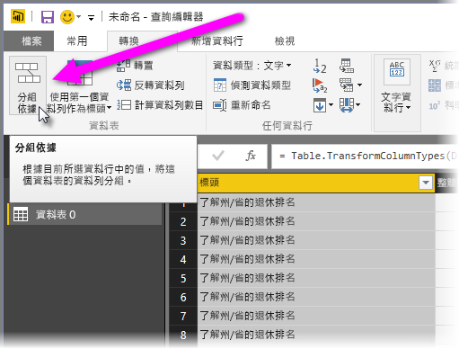

[分組...] 視窗隨即出現。 當查詢編輯器將資料列分組時，它會建立新的資料行，其中放入**分組**結果。 您可以以下列方式調整**分組**作業：

1. 分組：這是要進行分組的資料行。查詢編輯器會選擇所選取的資料行，但您可以在此視窗中將它變更為資料表中的任何資料行。
2. *新的資料行名稱* – 查詢編輯器會建議新的資料行名稱，這是根據它會套用至要分組之資料行的作業，但您可以隨意命名新的資料行。
3. *作業* – 您在這裡指定查詢編輯器套用的作業。
4. 新增群組和加入彙總：這些選項會在選取 [進階] 選項之後出現。 您可以對多個資料行執行群組作業 (**分組**動作)，以及執行多個彙總，這些全都位於 [分組] 視窗內，且全都在單一作業中。 查詢編輯器會建立新的資料行 (根據您在此視窗中的選項)，針對多個資料行進行操作。 

選取 [加入群組] 或 [加入彙總] 按鈕，即可將多個群組或彙總加入至**分組**作業。 您可以藉由選取 **...** 圖示並選取 [刪除] 來移除群組或彙總，因此，請試試看會是什麼樣子。
   
   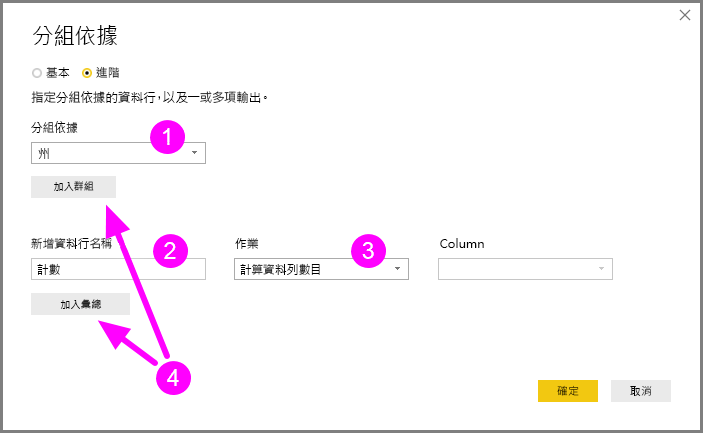

當我們選取 [確定] 時，查詢會執行 **Group By** 作業，並傳回結果。 哇，看看它：俄亥俄、德州、伊利諾和加州現在各有超過一千個機構！

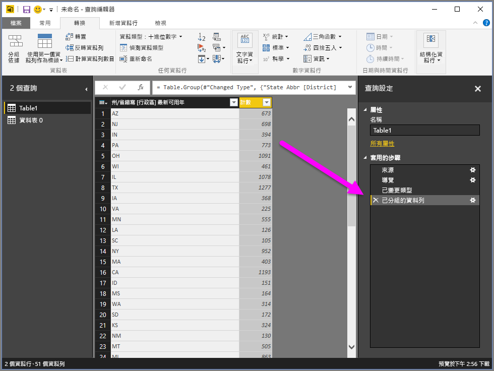

使用查詢編輯器，您隨時都可以選取剛完成之步驟旁的 **X** ，移除最後一個塑造作業。 因此請放心試驗，如果您不喜歡結果就重做步驟，直到查詢編輯器將資料塑造成您要的樣子。

## 樞紐資料行
使用 Power BI Desktop，您可以對資料行進行樞紐分析，並建立資料表來包含資料行中每個唯一值的彙總值。 例如，如果您需要知道在每個產品類別中有多少不同的產品，您可以快速建立資料表，精確地完成此項作業。

以下舉例說明。 下列「產品」  資料表已經塑造成只會顯示每個 (名稱) 唯一的產品，以及每項產品所屬的類別。 若要建立新的資料表，顯示每個類別裡的產品計數 (根據 *CategoryName* 資料行)，請選取資料行，然後從功能區上的 [轉換]  索引標籤選取 [樞紐資料行]  。

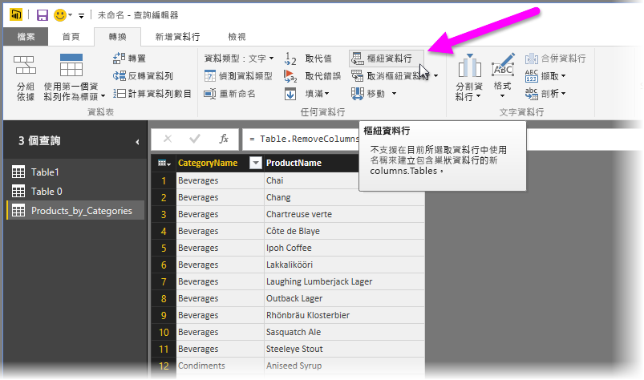

[樞紐資料行] 視窗隨即出現，讓您知道哪些資料行的值將用來建立新的資料行 (1)，以及展開 [進階選項] (2) 時，可以選取將套用至彙總值 (3) 的函數。

當您選取 [確定] 時，查詢會根據 [樞紐資料行]  視窗所提供的轉換指示，顯示資料表。

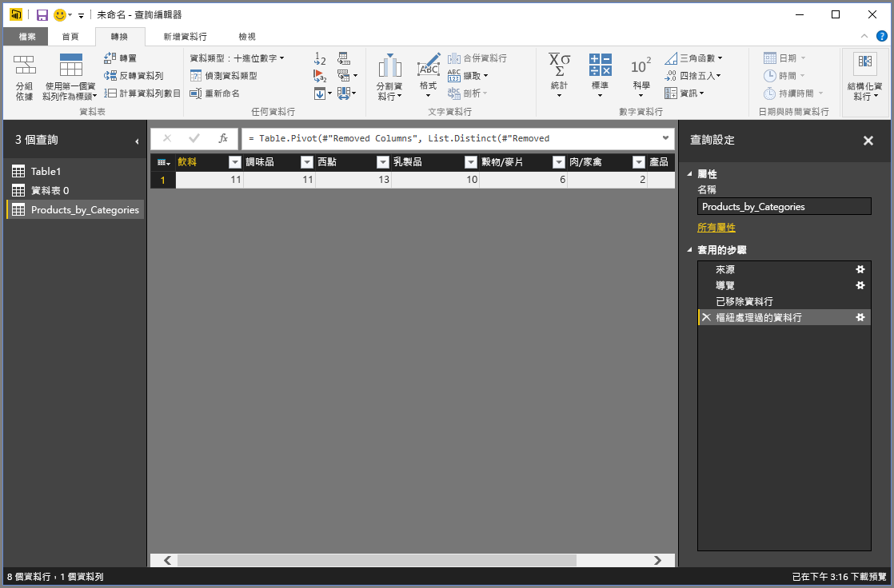

## 建立自訂資料行
在查詢編輯器中，您可以建立自訂公式，對資料表中的多個資料行進行操作，然後將這類公式的結果放入新的 (自訂) 資料行。 查詢編輯器可讓您輕鬆地建立自訂的資料行。

在查詢編輯器中，從功能區上的 [加入資料行] 索引標籤，選取 [自訂資料行]。

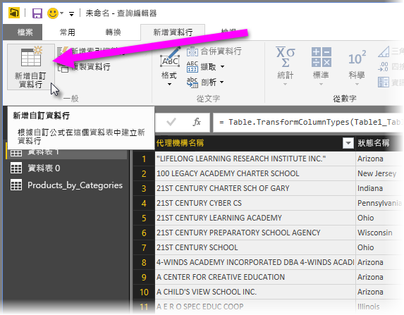

下列視窗隨即出現。 在下列範例中，我們會建立稱為「ELL 百分比」  的自訂資料行，它會計算英語學習者 (ELL) 佔總學生人數的百分比。

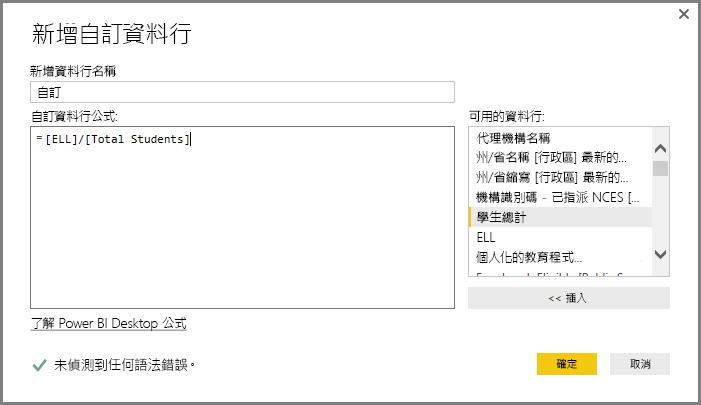

類似於查詢編輯器中套用的任何其他步驟，如果新的自訂資料行未提供您尋找的資料，您可以選取 [加入的自訂]  步驟旁邊的 **X** ，將步驟從 [查詢設定]  窗格的 [套用的步驟]  區段刪除。

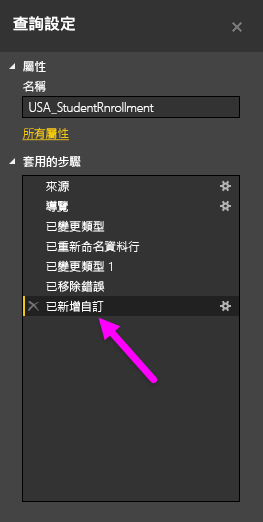

## 查詢公式
您可以編輯查詢編輯器產生的步驟，而且您可以建立自訂公式來取得對於連接和塑造資料的精確控制。 每當查詢編輯器在資料上執行動作時，與動作相關聯的公式會顯示在 [公式列] 。 若要檢視 [公式列] ，請選取功能區 [檢視]  索引標籤中 [公式列]  旁的核取方塊。

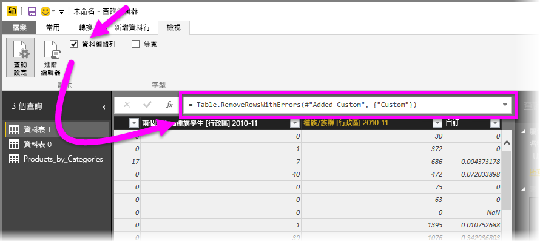

查詢編輯器會將每個查詢的所有套用步驟保留為您可以檢視或修改的文字。 您可以使用 [進階編輯器] 檢視或修改任何查詢的文字，當您從功能區的 [檢視]  索引標籤選取 [進階編輯器]  時便會顯示。

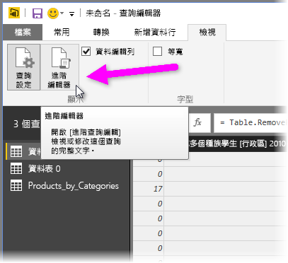

以下就來看看 [進階編輯器]，其中顯示與 **USA\_StudentEnrollment** 查詢相關聯的查詢步驟。 這些步驟是以 Power Query 公式語言建立，這個語言常稱為 **M**。如需資訊，請參閱[深入了解 Power Query 公式](https://support.office.com/article/Learn-about-Power-Query-formulas-6bc50988-022b-4799-a709-f8aafdee2b2f?ui=en-US&rs=en-US&ad=US)。 若要檢視語言規格本身，請參閱 [Microsoft Power Query for Excel 公式語言規格](http://go.microsoft.com/fwlink/?linkid=320633) \(英文\)。

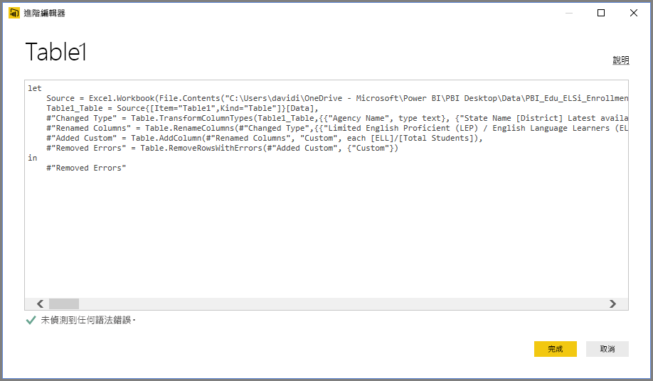

Power BI Desktop 提供一組廣泛的公式類別。 如需詳細資訊和查詢編輯器的所有公式的完整參考，請瀏覽 [Power Query 公式類別](https://support.office.com/en-in/article/Power-Query-formula-categories-125024ec-873c-47b9-bdfd-b437f8716819).

查詢編輯器的公式類別如下所示：

* 數字
  * 常數
  * 資訊
  * 轉換和格式化
  * 格式
  * 捨入
  * 作業
  * 隨機
  * 三角函數
  * 位元組
* 文字
  * 資訊
  * 文字比較
  * 擷取
  * 修改
  * 成員資格
  * 轉換
* 邏輯
* 日期
* 時間
* Datetime
* DateTimeZone
* 持續時間
* 記錄
  * 資訊
  * 轉換
  * 選取項目
  * 序列化
* 清單
  * 資訊
  * 選取項目
  * 轉換
  * 成員資格
  * 集作業
  * 排序
  * 平均值
  * 新增
  * 數字
  * 產生器
* 資料表
  * 建構資料表
  * 轉換
  * 資訊
  * 資料列作業
  * 資料行作業
  * 成員資格
* 值
* 算術運算
* 參數類型
* 中繼資料
* 存取資料
* URI
* 二進位格式
  * 讀取數字
* 二進位
* 線條
* 運算式
* 函數
* 錯誤
* 比較子
* 分隔器
* 合併子
* 取代子
* 類型

## 後續步驟
您可以使用 Power BI Desktop 執行各種作業。 如需有關其功能的詳細資訊，請參閱下列資源：

* [開始使用 Power BI Desktop](desktop-getting-started.md)
* [Power BI Desktop 的查詢概觀](desktop-query-overview.md)
* [Power BI Desktop 中的資料來源](desktop-data-sources.md)
* [連接至 Power BI Desktop 中的資料](desktop-connect-to-data.md)
* [使用 Power BI Desktop 合併資料並使其成形](desktop-shape-and-combine-data.md)

