# 在資料表中使用條件式格式設定 

使用 Power BI Desktop 中資料表的條件式格式設定，您可以依據欄位值，指定自訂的資料格色彩，包括色彩漸層。 您也可以使用資料橫條或 KPI 圖示，或以作用中網頁連結的形式表示儲存格值。 您可以將條件式格式設定套用到任何文字或資料欄位，只要以具有數值、色彩名稱或十六進位代碼或 Web URL 值的欄位上的格設定式為依據即可。 

若要套用條件式格式設定，請在 Power BI Desktop 中選取 [資料表]  或 [矩陣]  視覺效果。 在 [視覺效果]  窗格的 [欄位]  區段中，以滑鼠右鍵按一下或選取您想要格式化的  [值] 區中欄位旁的向下箭號。 選取 [條件式格式設定]  ，然後選取要套用的格式設定類型。

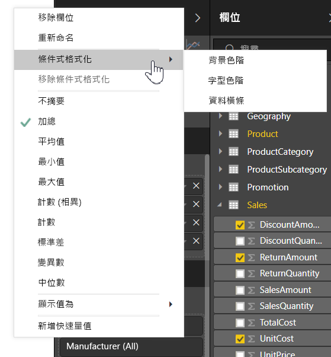

> [!NOTE]
> 條件式格式設定會覆寫您套用至有條件格式化儲存格的任何自訂背景或字型色彩。

若要從視覺效果中移除條件式格式設定，從欄位的下拉式功能表中選取 [移除條件式格式設定]  ，然後選取要移除的格式設定類型。

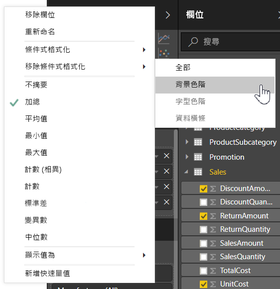

下列各節會描述每個條件式格式設定選項。 您可以在單一資料表資料行中結合一個以上的選項。

## 格式化背景或字型色彩

若要格式化儲存格背景或字型色彩，請針對欄位選取 [條件式格式設定]  ，然後從下拉式功能表中選取 [背景色彩]  或 [字型色彩]  。 

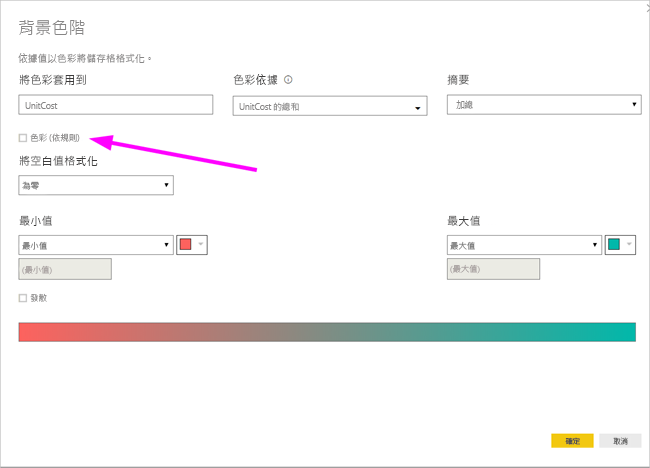

[背景色彩]  或 [字型色彩]  對話方塊隨即開啟，內含您要在標題中格式化的欄位名稱。 選取條件式格式化選項之後，請選取 [確定]  。 

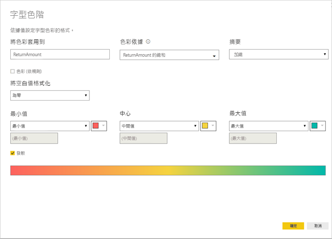

[背景色彩]  和 [字型色彩]  選項都相同，但會分別影響儲存格背景色彩和字型色彩。 您可以將相同或不同條件式格式設定套用至欄位的字型色彩和背景色彩。 如果您讓欄位的字型和背景具有相同色彩，則字型會混合成背景，所以資料表資料行只會顯示色彩。

## 依色階上色

若要依色階格式化儲存格背景或字型色彩，請在 [背景色彩]  或 [字型色彩]  對話方塊的 [格式化依據]  欄位中，選取 [色階]  。 在 [依據欄位]  底下，選取格式設定所要依據的欄位。 您可以依據目前的欄位，或依據模型中任何具有數值或色彩資料的欄位來設定格式。 

在 [摘要]  下，指定您想要用於所選欄位的彙總類型。 在 [預設格式設定]  中，選取要套用至空白值的格式設定。 

在 [最小值]  和 [最大值]  下，選擇要依據最低和最高欄位值，還是依據您輸入的自訂值套用色彩配置。 下拉並選取您要套用至最小值和最大值的色樣。 選取 [發散]  核取方塊，以同時指定 [中心]  值和色彩。 

在 [可負擔性]  資料行上使用色階背景格式設定的範例資料表如下所示：

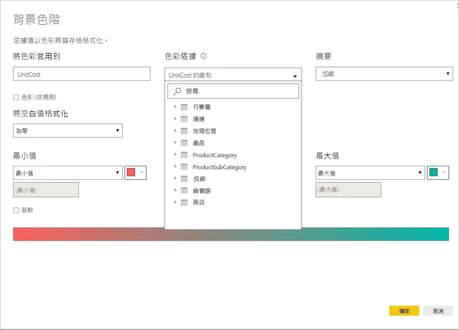

在 [可負擔性]  資料行上使用色階字型格式設定的範例資料表如下所示：

## 依規則上色

若要依規則格式化儲存格背景或字型色彩，請在 [背景色彩]  或 [字型色彩]  對話方塊的 [格式化依據]  欄位中，選取 [規則]  。 同樣地，[依據欄位]  會顯示要作為格式設定依據的欄位，而 [摘要]  會顯示欄位的彙總類型。 

在 [規則]  下，輸入一或多個值範圍，並為每個範圍設定一個色彩。 每個值範圍都有「如果值」  條件、「和」  值條件以及一個色彩。 每個值範圍中的儲存格背景或字型都會以指定的色彩上色。 下列範例具有三個規則：

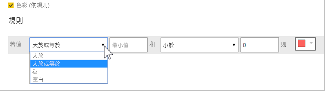

在 [可負擔性]  資料行上使用規則型背景色彩格式設定的範例資料表如下所示：

## 依色彩值上色

如果您有具有色彩名稱或十六進位值資料的欄位或量值，您可以使用條件式格式設定，自動將這些色彩套用到資料行的背景或字型色彩。 您也可以使用自訂邏輯，將色彩套用到字型或背景。

欄位可以使用 CSS 色彩規格中所列的任何色彩值 (位於 [https://www.w3.org/TR/css-color-3/](https://www.w3.org/TR/css-color-3/))。 這些色彩值可以包括：
- 3、6 或 8 位數的十六進位代碼，例如 #3E4AFF。 請確認您在代碼的開頭包含了 # 符號。 
- RGB 或 RGBA 值，例如 RGBA(234, 234, 234, 0.5)。
- HSL 或 HSLA 值，例如 HSLA(123, 75%, 75%, 0.5)。
- 色彩名稱，例如綠色、天藍或粉桃紅。 

下表具有與每個狀態相關聯的色彩名稱： 

若要依據欄位值來格式化 [色彩]  資料行，請選取 [色彩]  欄位的 [條件式格式設定]  ，然後選取 [背景色彩]  或 [字型色彩]  。 

在 [背景色彩]  或 [字型色彩]  對話方塊中，從 [格式化依據]  下拉式欄位中選取 [欄位值]  。

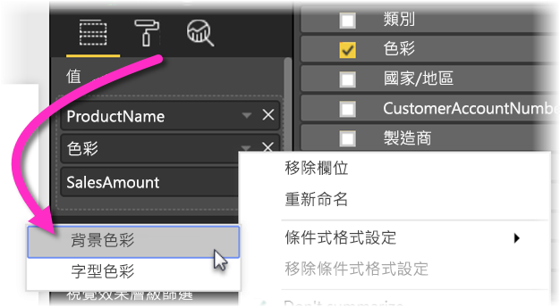

在 [色彩]  欄位上使用色彩欄位值型**背景色彩**格式設定的範例資料表如下所示：

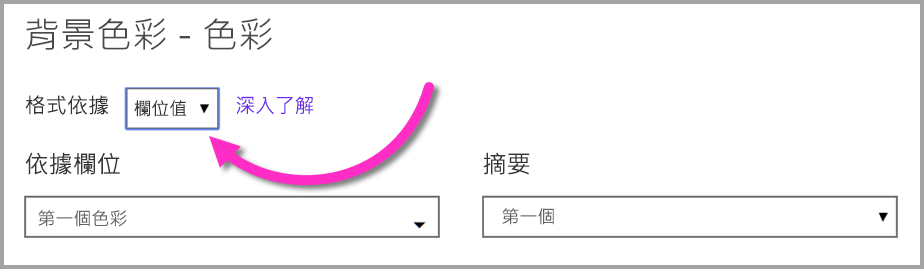

如果您也使用 [欄位值]  來格式化資料行的 [字型色彩]  ，則結果會是 [單色]  資料行中的純色：

## 依據計算的色彩

您可以建立依據您所選的商務邏輯條件輸出不同值的 DAX 計算。 建立 DAX 公式通常比在條件式格式設定對話方塊中建立多項規則更快速。 

例如，下列 DAX 公式會依據現有的 [可負擔性]  資料行值，將十六進位色彩值套用到新的 [可負擔性等級]  資料行：

若要套用色彩，請針對 [可負擔性]  資料行選取 [背景色彩]  或 [字型色彩]  條件式格式設定，並以 [可負擔性等級]  資料行的 [欄位值]  上的格式設定為依據。 

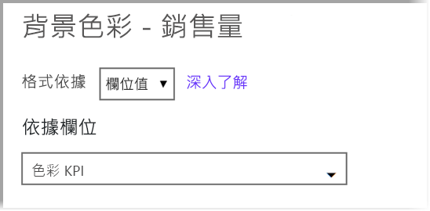

[可負擔性]  背景色彩是以計算的 [可負擔性等級]  為依據的範例資料表如下所示：

只要運用您的想像力和一點 DAX，即可建立更多變化。

## 新增資料橫條

若要顯示以儲存格值為依據的資料橫條，請選取 [可負擔性]  欄位的 [條件式格式設定]  ，然後從下拉式功能表中選取 [資料橫條]  。 

在 [資料橫條]  對話方塊中，預設未核取 [只顯示橫條]  選項，因此資料表儲存格會顯示橫條與實際值。 若只要顯示資料橫條，請選取 [只顯示橫條]  核取方塊。

您可以指定 [最小值]  和 [最大值]  、資料橫條色彩和方向，以及軸色彩。 

將資料橫條套用至 [可負擔性]  資料行時，範例資料表如下所示：

## 新增圖示

若要顯示以儲存格值為依據的圖示，請選取欄位的 [條件式格式設定]  ，然後從下拉式功能表中選取 [圖示]  。 

在 [圖示]  對話方塊的 [格式化依據]  底下，選取 [規則]  或 [欄位值]  。 

若要依據規則進行格式化，請選取 [依據欄位]  、[摘要]  方法、[圖示版面配置]  、[圖示對齊]  、圖示 [樣式]  ，以及一或多個 [規則]  。 在 [規則]  下，輸入一或多個具有 [如果值]  條件及 [和]  值條件的規則，然後選取要套用到每個規則的圖示。 

若要依據欄位值進行格式化，請選取 [依據欄位]  、[摘要]  方法、[圖示版面配置]  和 [圖示對齊]  。

下列範例會依據三個規則來新增圖示：

選取 [確定]  。 依據規則將圖示套用至 [可負擔性]  資料行時，範例資料表如下所示：

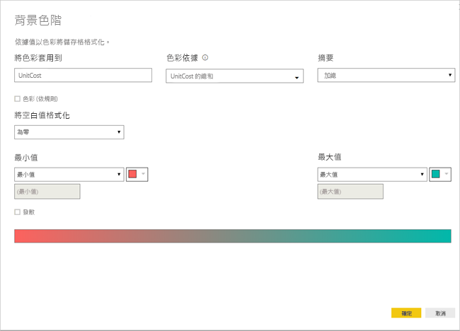

## 格式化為 Web URL

如果您有包含網站 URL 的資料行或量值，您可以使用條件式格式設定，將這些 URL 套用到欄位成為作用中連結。 例如，下表有一個 [網站]  資料行，其中包含每個狀態的網站 URL：

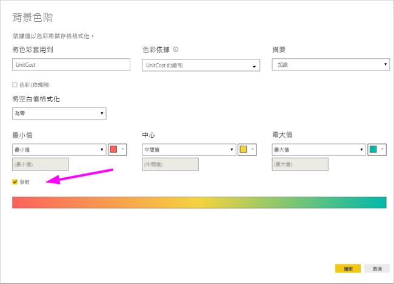

若要將每個狀態名稱顯示為其網站的即時連結，請選取 [狀態]  欄位 [條件式格式設定]  ，然後選取 [Web URL]  。 在 [Web URL]  對話方塊的 [依據欄位]  底下，選取 [網站]  ，然後選取 [確定]  。 

將 [Web URL]  格式設定套用到 [狀態]  欄位時，每個狀態名稱都是其網站的作用中連結。 下列範例資料表已將 [Web URL]  格式設定套用到 [狀態]  資料行，以及將條件式 [資料橫條]  和 [背景格式設定]  套用到 [可負擔性]  資料行。 

## 考量與限制
使用條件式表格格式設定時，請牢記幾個考量事項：

- 條件式格式設定只會套用到「資料表」或「矩陣」視覺效果的值，而不會套用到任何小計、總計或 [總計]  資料列。 
- 任何沒有分組的資料表都會顯示為不支援條件式格式化的單一資料列。
- 如果您的資料包含 NaN  值，您就無法套用具有自動最大/最小值的漸層格式設定，或套用具有百分比規則的規則型格式設定。 NaN 表示「不是數字」，最常見的原因是除以零錯誤。 您可以使用 [DIVIDE() DAX 函式](https://docs.microsoft.com/dax/divide-function-dax)來避免這些錯誤。
- 條件式格式設定需要將彙總或量值套用到值。 這就是您為何會在 [依值上色]  範例中看到「First」或「Last」的原因。 如果您要針對分析服務多維度 Cube 建立報表，除非 Cube 擁有者已建立可提供值的量值，否則您將無法使用屬性進行條件式格式設定。

## 後續步驟

如需色彩格式設定的詳細資訊，請參閱 [Power BI 色彩格式設定的秘訣和訣竅](visuals/service-tips-and-tricks-for-color-formatting.md)  

