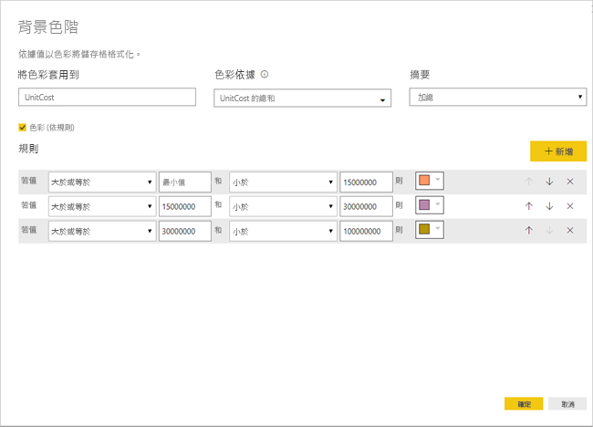

# 設定資料表格式化的條件 
設定資料表格式化的條件時，您可以根據資料格值或根據其他值或欄位 (包括漸層色彩) 來指定自訂資料格色彩。 您也可以使用資料橫條來顯示資料格的值。 

若要存取條件式格式設定，請在 Power BI Desktop [視覺效果]  窗格的 [欄位]  集區，選取您要格式化的 [值]  集區中，值旁邊的向下箭號 (或以滑鼠右鍵按一下欄位)。 您只能管理 [欄位]  集區之 [值]  區域中的欄位條件式格式設定。

下列各節將逐一描述這些條件式格式設定選項。 一或多個選項可以組合在一個資料表資料行中。

> [!NOTE]
> 套用至資料表時，條件式格式設定會覆寫套用至條件式設定資料格之格式的任何自訂資料表樣式。

若要從視覺效果移除條件式格式設定，只要以滑鼠右鍵再按一次欄位，選取 [移除條件式格式設定]  ，然後選取要移除的格式設定類型即可。

## 背景色階

選取 [條件式格式設定]  然後選取 [背景色階]  ，下列對話方塊隨即開啟。

您可以從您的資料模型選取色彩依據的欄位，方法為設定 該欄位的[色彩依據]  。 此外，您可以使用**摘要**值指定所選欄位的彙總類型。 在 [將色彩套用到]  欄位中指定要上色的欄位，以便您可以追蹤。您可以將設定格式化的條件套用至文字和日期欄位，只要您選擇數值作為格式設定基礎。

若要針對指定的值範圍使用離散色彩值，請選取 [依規則上色]  。 若要使用色彩頻譜，請將 [依規則上色]  保留未核取狀態。 

### 依規則上色

當您選取 [依規則上色]  時，您可以輸入一或多個值範圍，每個都具有一個設定色彩。  每個值範圍都以「如果值」  條件、「和」  值條件以及一個色彩開始。

每個範圍中含有值的資料表資料格都會以指定色彩填滿。 下圖有三個規則。

範例資料表現在如下所示：

### 最小到最大色彩

您可以設定 [最小]  和 [最大]  值以及其色彩。 如果您選取 [發散]  方塊，您也可以設定選擇性的「中間」值  。

![[發散] 按鈕](media/desktop-conditional-table-formatting/table-formatting-1-diverging.png)

範例資料表現在如下所示：

## 字型色階

選取 [條件式格式設定]  然後選取 [字型色階]  ，下列對話方塊隨即開啟。 此對話方塊類似於 [背景色階]  對話方塊，但會變更字型色彩，而不是資料格背景色彩。

範例資料表現在如下所示：

## 資料橫條

選取 [條件式格式設定]  然後選取 [資料橫條]  ，下列對話方塊隨即開啟。 

根據預設，未核取 [只顯示橫條]  選項，因此資料表資料格會顯示橫條與實際值兩者。

如果 [只顯示橫條]  選項已核取，則資料表資料格只會顯示橫條。

## 依欄位值指定格式色彩

您可以使用指定色彩的量值或資料行，搭配文字值或十六進位碼，將該色彩套用至資料表或矩陣視覺效果之字型色彩的背景。 您也可以建立指定欄位的自訂邏輯，並讓該邏輯將所需的色彩套用至字型或背景。

例如，在下表中，每個產品型號都有相關聯的色彩。 

若要根據其欄位值來格式化該資料格，請選取 [條件式格式設定]  對話方塊，方法是以滑鼠右鍵按一下該視覺效果的 [色彩]  資料行，然後在本例中從功能表選取 [背景色彩]  。 

![從功能表選取 [背景色彩]](media/desktop-conditional-table-formatting/conditional-table-formatting_02.png)

在顯示的對話方塊中，選取 [格式化依據]  下拉式清單區域中的 [欄位值]  ，如下列影像所示。

您可以針對字型色彩重複該程序，而視覺效果中的結果會是 [色彩]  資料行中的單色，如下列畫面所示。

您也可以建立以商務邏輯為基礎的 DAX 計算，來根據您偏好的條件輸出不同的十六進位碼。 這通常比在 [條件式格式設定] 對話方塊中建立多項規則更容易。 請考慮下列範例影像中的 *ColorKPI* 欄位。

然後，您可以透過下列方式來設定 [背景色彩]  的欄位值。

然後，您可以取得類似下列矩陣的結果。

只要運用您的想像力和一點 DAX，您還可以建立更多版本。

您可以使用 [https://www.w3.org/TR/css-color-3/](https://www.w3.org/TR/css-color-3/) 的 CSS 色彩規格中所列出任何值來為視覺效果設定色彩：
* 3、6 或 8 位數的十六進位代碼，例如 #3E4AFF。 請確認您在代碼的開頭包含了 # 符號。 "3E4AFF" 是無法接受的格式。 
* RGB 或 RGBA 值，例如 RGBA(234, 234, 234, 0.5)
* HSL 或 HSLA 值，例如 HSLA(123, 75%, 75%, 0.5)
* 色彩名稱，例如 Green、SkyBlue、PeachPuff 

## 考量與限制
使用條件式表格格式設定時，請牢記幾個考量事項：

* 條件式表格格式設定只會套用到**矩陣**視覺效果的值，而不會套用到任何小計或總計。 
* 條件式格式設定不會套用至 [Total] \(總計\)**總計**資料列。
* 任何沒有分組的資料表都會顯示為不支援條件式格式化的單一資料列。
* 若您使用具有自動最大/最小值的漸層格式，或以規則為基礎的格式設定百分比規則，當您的資料包含 NaN 值時，就無法套用條件式格式化。 NaN 表示「不是數字」，最常見的原因是除以零錯誤。 您可以使用 [DIVIDE() DAX 函式](https://docs.microsoft.com/dax/divide-function-dax)來避免這些錯誤。

## 後續步驟
如需詳細資訊，請參閱下列文章：  

* [在 Power BI 中色彩格式設定的秘訣和訣竅](visuals/service-tips-and-tricks-for-color-formatting.md)  

