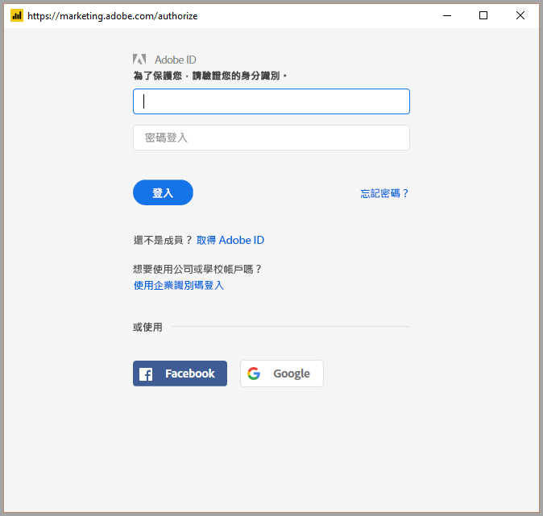

# 在 Power BI Desktop 中連線至 Adobe Analytics 
在 **Power BI Desktop** 中，您可以連線至 **Adobe Analytics** 並使用基礎資料，就像 Power BI Desktop 中的任何其他資料來源。 

## 連線到 Adobe Analytics 資料
若要連線至 **Adobe Analytics** 資料，請從 Power BI Desktop 的 [首頁] 功能區選取 [取得資料]。 從左邊的類別選取 [線上服務]，您就會看到 **Adobe Analytics 連接器**。

在出現的 [Adobe Analytics] 視窗中，選取 [登入] 按鈕，然後提供您的認證來登入您的 Adobe Analytics 帳戶。 Adobe 的登入視窗隨即出現，如下圖所示。

收到提示時，請放入您的使用者名稱和密碼。 一旦建立連線，您就可以在 Power BI 的 [導覽器] 對話方塊中預覽並選取多個維度和量值，建立單一的表格式輸出。 您也可以為所選項目提供所需的任何必要輸入參數。 

您可以**載入**選取的資料表，將整個資料表帶入 **Power BI Desktop** 中，也可以**編輯**查詢以開啟**查詢編輯器**，以便您篩選並縮小搜尋範圍到一組您想要使用的資料，然後將該組精簡的資料載入 **Power BI Desktop** 中。

## 後續步驟
您可以使用 Power BI Desktop 連接至各式各樣的資料。 如需有關資料來源的詳細資訊，請參閱下列資源︰

* [開始使用 Power BI Desktop](desktop-getting-started.md)
* [Power BI Desktop 中的資料來源](desktop-data-sources.md)
* [使用 Power BI Desktop 合併資料並使其成形](desktop-shape-and-combine-data.md)
* [在 Power BI Desktop 中連接至 Excel 活頁簿](desktop-connect-excel.md)   
* [直接將資料輸入 Power BI Desktop 中](desktop-enter-data-directly-into-desktop.md)   

