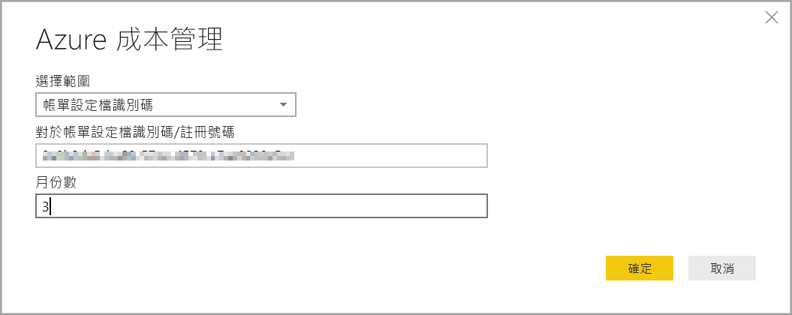
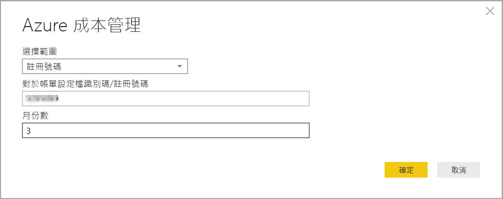

# 在 Power BI Desktop 中使用 Azure 成本管理連接器建立視覺效果和報表

您可以使用適用於 Power BI Desktop 的 Azure 成本管理連接器，來提供功能強大、自訂視覺效果與報表，協助您更了解您的 Azure 支出。 Azure 成本管理連接器目前支援具有 [Microsoft 客戶合約](https://azure.microsoft.com/pricing/purchase-options/microsoft-customer-agreement/)或 [Enterprise 合約 (EA)](https://azure.microsoft.com/pricing/enterprise-agreement/) 的客戶。  

Azure 成本管理連接器會使用 OAuth 2.0 來向 Azure 進行驗證，並識別要使用連接器的使用者。 在此程序中產生的權杖會在特定期間內有效。 Power BI 會保留權杖以供下次登入使用。 OAuth 2.0 是在幕後進行的程序標準，以確保這些權限的處理安全。 若要連線，您必須使用 Enterprise 合約的[企業系統管理員](https://docs.microsoft.com/azure/billing/billing-understand-ea-roles)帳戶，或 Microsoft 客戶合約的[計費帳戶擁有者](https://docs.microsoft.com/azure/billing/billing-understand-mca-roles)。 

> [!NOTE]
> 此連接器取代先前可用的 [Azure 使用量見解和 Azure 成本管理搶鮮版 (Beta)](desktop-connect-azure-consumption-insights.md) 連接器。 使用先前連接器建立的任何報表都必須使用此連接器重新建立。

## 使用 Azure 成本管理來連線

若要在 Power BI Desktop 中使用 **Azure 成本管理連接器**，請採取下列步驟：

1.  在 [常用]  功能區中，選取 [取得資料]  。
2.  從資料類別清單選取 [Azure]  。
3.  選取 [Azure 成本管理]  。

    

4. 在出現的對話方塊中，輸入 **Microsoft 客戶合約**的 **帳單設定檔識別碼**，或 **Enterprise 合約 (EA)** 的**註冊號碼**。 

## 連線到 Microsoft 客戶合約帳戶 

若要與 **Microsoft 客戶合約**帳戶連線，您可以從 Azure 入口網站取得您的**帳單設定檔識別碼**：

1.  在 [Azure 入口網站](https://portal.azure.com/)中，瀏覽到 [成本管理 + 計費]  。
2.  選取您的帳單設定檔。 
3.  在功能表的 [設定]  下，選取側邊欄中的 [屬性]  。
4.  在 [帳單設定檔]  下，複製**識別碼**。 
5.  針對 [選擇範圍]  ，請選取 [帳單設定檔識別碼]  並貼上上一個步驟中的帳單設定檔識別碼。 
6.  輸入月份數，然後選取 [確定]  。

    

7.  出現提示時，請使用您的 Azure 使用者帳戶與密碼登入。 

## 連線到 Enterprise 合約帳戶

若要與 Enterprise 合約 (EA) 帳戶連線，您可以從 Azure 入口網站取得您的註冊識別碼：

1.  在 [Azure 入口網站](https://portal.azure.com/)中，瀏覽到 [成本管理 + 計費]  。
2.  選取您的計費帳戶。
3.  在 [概觀]  功能表上，複製**帳單帳戶識別碼**。
4.  針對 [選擇範圍]  ，請選取 [註冊號碼]  並貼上上一個步驟中的帳單帳戶識別碼。 
5.  輸入月份數，然後選取 [確定]  。

    

6.  出現提示時，請使用您的 Azure 使用者帳戶與密碼登入。 

## 透過連接器提供的資料

成功驗證之後，[導覽器]  視窗隨即出現，其中包含下列可用資料表：

| **資料表** | **描述** |
| --- | --- |
| **結餘摘要** | Enterprise 合約 (EA) 結餘的摘要。 |
| **帳單事件** | 新發票、點數購買等的事件記錄檔。僅限 Microsoft 客戶合約。 |
| **Budgets** | 預算詳細資料，讓您檢視實際成本或現有預算目標的使用情況。 |
| **費用** | Azure 使用量、市場費用和分別計費費用的月份層級摘要。 僅限 Microsoft 客戶合約。 |
| **整批點數** | 所提供帳單設定檔 Azure 整批購買點數的詳細資料。 僅限 Microsoft 客戶合約。 |
| **價位表** | 所提供帳單設定檔或 EA 註冊的適用計量費率。 |
| **RI 費用** | 過去 24 個月與您保留執行個體相關聯的費用。 |
| **RI 建議 (共用)** | 根據您所有訂用帳戶上，過去 7、30 或 60 天使用量趨勢所提供的保留執行個體購買建議。 |
| **RI 建議 (單一)** | 根據您單一訂用帳戶上，過去 7、30 或 60 天使用量趨勢所提供的保留執行個體購買建議。 |
| **RI 使用量詳細資料** | 您現有保留執行個體過去一個月的使用詳細資料。 |
| **RI 使用量摘要** | 每日 Azure 保留使用量百分比。 |
| **使用量詳細資料** | 所指定帳單設定檔 (在 EA 註冊上) 的取用量明細和估計費用。 |
| **使用量詳細資料攤銷** | 所指定帳單設定檔 (在 EA 註冊上) 的取用量明細和估計攤銷費用。 |

您可以選取資料表來查看預覽對話方塊。 您可以透過選取資料表名稱旁邊的方塊來選取一或多個資料表，然後選取 [載入]  。

當您選取 [載入]  時，資料會載入到 Power BI Desktop。 

您選取的資料載入後，資料表與欄位會顯示在 [欄位]  窗格中。

## 後續步驟

您可以使用 Power BI Desktop 連線到許多不同的資料來源。 如需詳細資訊，請參閱下列文章：

* [Power BI Desktop 是什麼？](desktop-what-is-desktop.md)
* [Power BI Desktop 中的資料來源](desktop-data-sources.md)
* [使用 Power BI Desktop 合併資料並使其成形](desktop-shape-and-combine-data.md)
* [在 Power BI Desktop 中連接至 Excel 活頁簿](desktop-connect-excel.md)   
* [直接將資料輸入 Power BI Desktop 中](desktop-enter-data-directly-into-desktop.md)   
