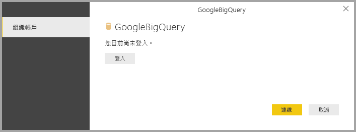

# <a name="connect-to-a-google-bigquery-database-in-power-bi-desktop"></a>在 Power BI Desktop 中連線到 Google BigQuery 資料庫
在 Power BI Desktop 中，您可以連線到 Google **BigQuery** 資料庫並使用基礎資料，如同 Power BI Desktop 中的任何其他資料來源。

## <a name="connect-to-google-bigquery"></a>連線到 Google BigQuery
若要連線到 Google **BigQuery** 資料庫，請從 Power BI Desktop 的 [首頁]  功能區選取 [取得資料]  。 從左側類別中選取 [資料庫]  ，然後您會看到 **Google BigQuery**。

![Google BigQuery 的 [取得資料] 對話方塊](media/desktop-connect-bigquery/connect_bigquery_01.png)

在出現的 [Google BigQuery]  視窗中，登入您的 Google BigQuery 帳戶，然後選取 [連線]  。



登入後，您就會看到下列視窗指出您已通過驗證。 


成功連接後，[導覽器]  視窗隨即出現，並顯示伺服器上可用的資料，您可以從中選取一或多個要匯入 **Power BI Desktop** 並在其中使用的項目。


## <a name="considerations-and-limitations"></a>考量與限制
使用 Google **BigQuery** 連接器時，有幾項限制和考量必須注意：

* Google BigQuery 連接器可以在 Power BI Desktop 和 Power BI 服務中使用。 在 Power BI 服務中，連接器可透過 Power BI 到 Google BigQuery 的雲端對雲端連線進行存取。

您可以將 Power BI 與 Google BigQuery **計費專案**搭配使用。 根據預設，Power BI 會使用針對使用者所傳回清單中的第一個專案。 若要在計費專案與 Power BI 搭配使用時自訂計費專案的行為，請採取下列步驟：

 * 在 Source 步驟的基礎 M 中指定下列選項，這可以使用 Power BI Desktop 中的 **Power Query 編輯器**來自訂：

    ```Source = GoogleBigQuery.Database([BillingProject="Include-Billing-Project-Id-Here"])```

## <a name="next-steps"></a>後續步驟
您可以使用 Power BI Desktop 連接至各式各樣的資料。 如需有關資料來源的詳細資訊，請參閱下列資源︰

* [Power BI Desktop 是什麼？](desktop-what-is-desktop.md)
* [Power BI Desktop 中的資料來源](desktop-data-sources.md)
* [使用 Power BI Desktop 合併資料並使其成形](desktop-shape-and-combine-data.md)
* [在 Power BI Desktop 中連接至 Excel 活頁簿](desktop-connect-excel.md)   
* [直接將資料輸入 Power BI Desktop 中](desktop-enter-data-directly-into-desktop.md)   

