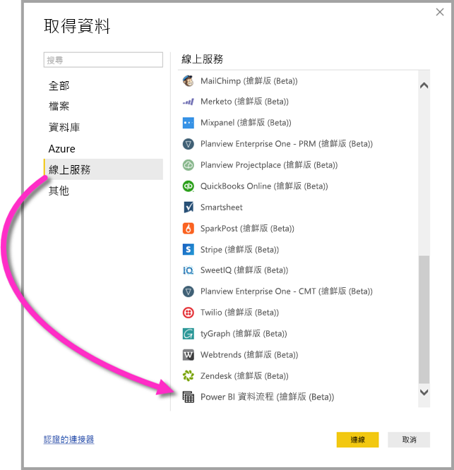

# 在 Power BI Desktop (搶鮮版 (Beta)) 中連線到 Power BI 資料流程所建立的資料
在 **Power BI Desktop** 中，您可以連線至 **Power BI 資料流程**建立的資料，就像連線到 Power BI Desktop 中的任何其他資料來源一樣。

**Power BI 資料流程 (搶鮮版 (Beta))** 連接器可讓您在 Power BI 服務中連線到資料流程所建立的實體。 

## 考量與限制

若要使用這個搶鮮版 (Beta) 的 **Power BI 資料流程連接器**，您必須執行最新版的 **Power BI Desktop**。 您可以隨時[下載 Power BI Desktop](desktop-get-the-desktop.md) 將它安裝在您的電腦上，以確保您擁有最新的版本。  

> [!NOTE]
> 舊版的 Power BI 資料流程連接器會要求您下載 .MEZ 檔案，並將它放在資料夾中。 目前的 **Power BI Desktop** 版本隨附 Power BI 資料流程連接器，因此該檔案不再是必要檔案，而可能導致與隨附的連接器版本產生衝突。 如果您以手動方式該 .MEZ 檔案放到資料夾中，就「必須」  從 [文件] > [Power BI Desktop] > [自訂連接器]  資料夾中刪除已下載的 .MEZ 檔案，以避免產生衝突。 

## Desktop 效能
**Power BI Desktop** 會在其安裝所在的電腦上本機執行。 資料流程的擷取效能取決於各種因素。 這些因素包括資料的大小、您電腦的 CPU 和 RAM、網路頻寬、與資料中心的距離，以及其他因素。

您可以改善資料流程的資料擷取效能。 例如，如果針對 **Power BI Desktop** 擷取的資料大小太大而無法在您的電腦上進行管理，您可以在資料流程中使用連結和計算實體來彙總資料 (在資料流程內)，並且只擷取預先備妥的彙總資料。 使用該方式，就只會在資料流程中線上執行大型資料的處理，而不是在 **Power BI Desktop** 的執行中執行個體內本機執行。 該方法讓 Power BI Desktop 能夠擷取較少量的資料，並讓資料流程的體驗能夠持續迅速回應。

## 考量與限制

大部分資料流程位於 Power BI 服務租用戶中。 但是，**Power BI Desktop** 使用者無法存取儲存在 Azure Data Lake Storage Gen2 帳戶中的資料流程，除非他們是資料流程的擁有者，或已獲得資料流程之 CDM 資料夾的明確授權。 請考慮下列情況：

1.  Anna 建立新的工作區，並將其設定成在組織的 Data Lake 中儲存資料流程。
2.  Ben 是 Anna 所建立之工作區的成員，他想要使用 Power BI Desktop 和資料流程連接器，從 Anna 建立的資料流程取得資料。
3.  Ben 會收到錯誤，這是因為其未作為授權使用者新增至該資料流程在 Data Lake 中的 CDM 資料夾。

    

若要解決此問題，Ben 必須被授與 CDM 資料夾及其檔案的讀者權限。 若要深入了解如何授與 CDM 資料夾的存取權，請參閱[此文章](https://go.microsoft.com/fwlink/?linkid=2029121) \(英文\)。

## 後續步驟
您可以使用 Power BI 資料流程來執行各式各樣有趣的作業。 如需詳細資訊，請檢閱下列來源：

* [使用資料流程的自助資料準備](service-dataflows-overview.md)
* [建立 Power BI 中的資料流程](service-dataflows-create-use.md)
* [在 Power BI Premium 中使用計算實體 (預覽)](service-dataflows-computed-entities-premium.md)
* [搭配內部部署資料來源使用資料流程 (預覽)](service-dataflows-on-premises-gateways.md)
* [適用於 Power BI 資料流程的開發人員資源 (預覽)](service-dataflows-developer-resources.md)

如需有關與 Azure Data Lake Storage Gen2 整合的詳細資訊，請參閱下列文章：

* [資料流程與 Azure Data Lake 的整合 (預覽)](service-dataflows-azure-data-lake-integration.md)
* [設定工作區資料流程設定 (預覽)](service-dataflows-configure-workspace-storage-settings.md)
* [新增 CDM 資料夾成為 Power BI 資料流程 (預覽)](service-dataflows-add-cdm-folder.md)
* [連接 Azure Data Lake Storage Gen2 來儲存資料流程 (預覽)](service-dataflows-connect-azure-data-lake-storage-gen2.md)

以下還提供了一些與 **Power BI Desktop** 相關的文章，您可能會覺得它們很實用：

* [Power BI Desktop 中的資料來源](desktop-data-sources.md)
* [使用 Power BI Desktop 合併資料並使其成形](desktop-shape-and-combine-data.md)
* [直接將資料輸入 Power BI Desktop 中](desktop-enter-data-directly-into-desktop.md)   

