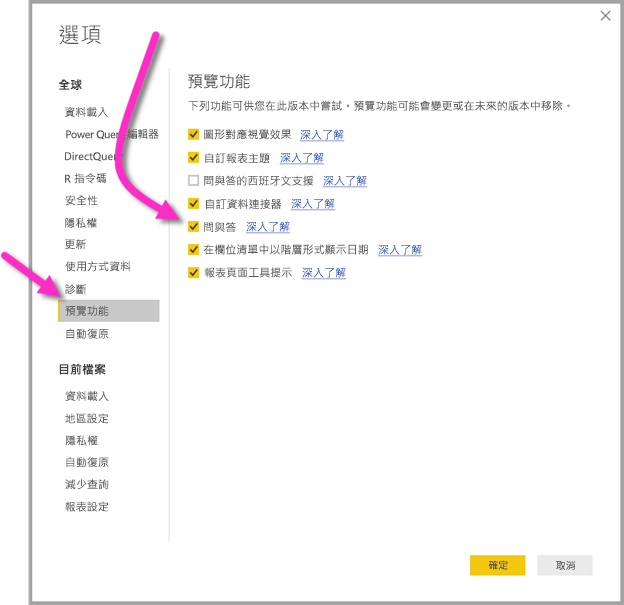

# 連線到 Power BI Desktop (預覽) 中 Power BI 資料流程所建立的資料
在 **Power BI Desktop** 中，您可以連線至 **Power BI 資料流程**建立的資料，就像連線到 Power BI Desktop 中的任何其他資料來源一樣。

**Power BI 資料流程 (預覽)** 連接器可讓您連線到 Power BI 服務資料流程所建立的實體。 由於資料流程處於預覽狀態，因此您必須採取幾個步驟，才能在您的系統上使用資料流程連接器。 

## 下載並啟用 Power BI 資料流程連接器 (預覽)

您必須下載 **Power BI 資料流程**連接器的複本，然後將它複製到您電腦上的特定位置。 在即將推出的 Power BI Desktop 每月更新中，連接器會自動包含在資料連接器清單中，屆時就不需要這些步驟。

您可在此位置下載 **Power BI 資料流程連接器**：[Power BI 資料流程連接器](https://visuals.azureedge.net/cds-analytics/PublicPreview/CDSA.mez)

執行下列步驟在您的電腦上使用 **Power BI 資料流程**連接器 (預覽)：

1. 下載 .MEZ 檔案的複本 (資料連接器檔案)。 私人預覽客戶會直接從 Microsoft 收到 MEZ 檔案的下載資訊。

2. 將下載的資料連接器檔案放入您電腦的下列資料夾中：**文件 > Power BI Desktop > 自訂連接器資料夾**

3. 在 Power BI Desktop 中選取 [檔案] > [選項及設定] > [選項]，然後從左側窗格選取 [預覽功能]。

    

4. 如未選取，請選取 [自訂資料連接器] 方塊。 

5. 重新啟動 **Power BI Desktop** 以顯示連接器。

## 使用 Power BI 資料流程連接器 (預覽)
一旦重新啟動 **Power BI Desktop**，連接器就會顯示為可用的資料來源。 若要連線到資料集區，請選取 [取得資料] > [線上服務] > [Power BI 資料流程 (beta)]，如下圖所示：

## 考量與限制

若要使用此預覽版本的 **Power BI 資料流程連接器**，您必須執行最新版的 **Power BI Desktop**。 您可以隨時[下載 Power BI Desktop](desktop-get-the-desktop.md) 將它安裝在您的電腦上，以確保您擁有最新的版本。  

注意：當 Power BI 資料流程連接器出現在 **Power BI Desktop** 即將推出的每月更新中時，您「必須」從您的 [文件] > [Power BI Desktop] > [自訂連接器] 資料夾中刪除此下載的 .MEZ 檔案，以避免衝突。 

## 後續步驟
您可以使用 Power BI 資料連線以及您覺得有用的 **Power BI Desktop** 相關發行項，從事各式各樣有趣的事情：

* [Power BI Desktop 中的資料來源](desktop-data-sources.md)
* [使用 Power BI Desktop 合併資料並使其成形](desktop-shape-and-combine-data.md)
* [直接將資料輸入 Power BI Desktop 中](desktop-enter-data-directly-into-desktop.md)   

