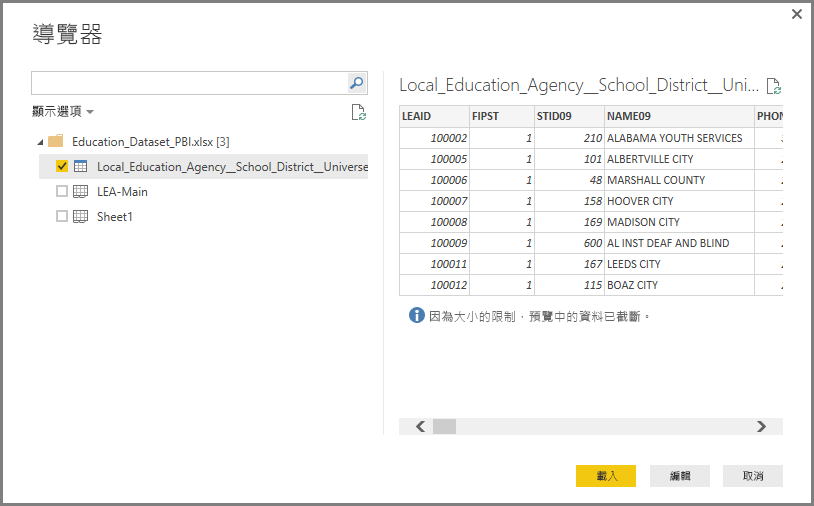

# 在 Power BI Desktop 中連接至 Excel
從 Power BI Desktop 連接至 Excel 活頁簿很容易，本文將逐步引導您執行這些步驟。

在 Power BI Desktop 中，從 [主資料夾]  功能區選取 [取得資料] > [Excel]。

從出現的 [開啟] 對話方塊中選取您的活頁簿。

Power BI Desktop 會顯示 [導覽] 視窗中活頁簿其他資料元素上的資料表。 當您在左窗格中選取資料表時，資料的預覽會出現在右窗格中。

您可以選取 [載入] 按鈕以匯入資料，或著如果您想要在將其送回 Power BI Desktop 之前使用 [查詢編輯器] 編輯資料，請選取 [編輯] 按鈕。

當您載入資料時，Power BI Desktop 會顯示 [載入] 視窗，並顯示與載入資料相關聯的活動。  

完成時，Power BI Desktop 會顯示 [欄位] 窗格中從 Excel 活頁簿匯入的資料表和欄位，就在桌面的右側。

這樣就大功告成了！

您現在可以在 Power BI Desktop 中使用從 Excel 活頁簿匯入的資料來建立視覺效果、報表，或與其他任何您可能想要連接或匯入的資料進行互動，例如其他 Excel 活頁簿、資料庫其他資料來源。

## 後續步驟
您可以使用 Power BI Desktop 連接至各式各樣的資料。 如需有關資料來源的詳細資訊，請參閱下列資源︰

* [Power BI Desktop 是什麼？](desktop-what-is-desktop.md)
* [Power BI Desktop 中的資料來源](desktop-data-sources.md)
* [使用 Power BI Desktop 合併資料並使其成形](desktop-shape-and-combine-data.md)
* [連接至 Power BI Desktop 中的 CSV 檔案](desktop-connect-csv.md)   
* [直接將資料輸入 Power BI Desktop 中](desktop-enter-data-directly-into-desktop.md)   

