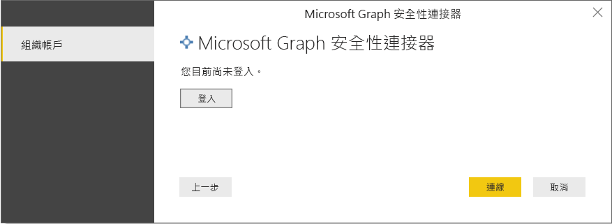

# 連線至 Power BI Desktop 的 Microsoft Graph 安全性

您可以使用 Power BI Desktop 來連線至使用 Microsoft Graph 安全性 Power BI 連接器的 Microsoft Graph 安全性 API。 這可以讓您建置儀表板和報表，深入了解與安全性相關的[警示](https://docs.microsoft.com/graph/api/resources/alert?view=graph-rest-1.0)和[安全分數](https://docs.microsoft.com/graph/api/resources/securescores?view=graph-rest-beta)。 [Microsoft Graph 安全性 API](https://aka.ms/graphsecuritydocs) 會與 Microsoft 和生態系統合作夥伴的[多個安全性解決方案](https://aka.ms/graphsecurityalerts)連線，以便輕鬆與警示建立關聯、提供豐富內容資訊的存取權並簡化自動化。 這可讓組織能夠快速深入了解並在其安全性產品間採取行動，同時降低建置與維護多項整合的成本和複雜度。

## 與 Microsoft Graph 安全性連接器連線的必要條件

* 若要使用 Microsoft Graph 安全性連接器，您必須擁有「明確指定的」 Azure Active Directory (AD) 租用戶系統管理員同意，這是 [Microsoft Graph 安全性驗證需求](https://aka.ms/graphsecurityauth)的一部分。 此同意需要 Microsoft Graph 安全性 Power BI 連接器的應用程式識別碼和名稱，您可以在 [Azure 入口網站](https://portal.azure.com)中找到：

   | 屬性 | 值 |
   |----------|-------|
   | **應用程式名稱** | `MicrosoftGraphSecurityPowerBIConnector` |
   | **應用程式識別碼** | `cab163b7-247d-4cb9-be32-39b6056d4189` |
   |||

   若要授與連接器同意，您的 Azure AD 租用戶系統管理員可以採用下列任一步驟：

   * [授與 Azure AD 應用程式的租用戶系統管理員同意](https://docs.microsoft.com/azure/active-directory/develop/v2-permissions-and-consent)。

   * 邏輯應用程式第一次執行時，您的應用程式可以透過[應用程式同意體驗](https://docs.microsoft.com/azure/active-directory/develop/application-consent-experience)，向 Azure AD 租用戶系統管理員要求同意。
   
* 用於登入來與 Microsoft Graph 安全性 Power BI 連接器連線的使用者帳戶，必須是 Azure AD 中安全性讀取者的受限系統管理員角色成員 (可以是安全性讀取者或安全性系統管理員)。 請遵循[將 Azure AD 角色指派給使用者](https://docs.microsoft.com/graph/security-authorization#assign-azure-ad-roles-to-users)一節中的步驟。 

## 使用 Microsoft Graph 安全性連接器

請遵循下列步驟使用 **Microsoft Graph 安全性**連接器：

1. 在 Power BI Desktop 的 [常用] 功能區上， 選取 [取得資料]-> [更多...]。
2. 在左側的類別中選取 [線上服務]，
3. 按一下 [Microsoft Graph 安全性搶鮮版 (Beta)]。

    
    
4. 在顯示的 [Microsoft Graph 安全性] 視窗中選取 Microsoft Graph API 版本以進行查詢。 選項為 v1.0 和搶鮮版 (Beta)。

    
    
5. 出現提示時，登入您的 Azure Active Directory 帳戶。 此帳戶必須擁有在必要條件一節中所述的**安全性讀取者**角色。

    
    
6. 如果您是租用戶系統管理員，**且**尚未同意必要條件中的 Microsoft Graph 安全性 Power BI 連接器 (應用程式)，您會看到下列對話方塊。 請務必選取「代表貴組織同意」。

    
    
7. 登入後，您就會看到下列視窗指出您已通過驗證。 選取 [連接]。

    
    
8. 一旦您成功連線，[導覽] 視窗隨即出現 (如下所示)，並會針對您在先前步驟中選取的版本，在 [Microsoft Graph 安全性 API](https://aka.ms/graphsecuritydocs) 中顯示警示等可用實體。 在 **Power BI Desktop** 中選取一或多個實體來匯入並使用。 按一下 [載入] 以取得步驟 10 中所述的結果檢視。

   
    
9. 如果您希望對 Microsoft Graph 安全性 API 進行進階查詢，請選取 [指定自訂 Microsoft Graph 安全性 URL 以篩選結果] 函式。 這可讓您使用存取 API 所需的權限對 Microsoft Graph 安全性 API 進行 [OData.Feed](https://docs.microsoft.com/power-bi/desktop-connect-odata) 查詢。

   > [!NOTE]
   > 用於下列範例 serviceUri 的是 `https://graph.microsoft.com/v1.0/security/alerts?$filter=Severity eq 'High'`。 請參閱[支援 Graph 的 ODATA 查詢參數](https://docs.microsoft.com/graph/query-parameters)來建置查詢，以進行篩選、排序或擷取最近的大部分結果。

   
    
   選取 [叫用] 時，OData.Feed 函式會呼叫會開啟查詢編輯器的 API，以便您篩選並精簡要使用的資料集，接著將精簡的資料集載入 Power BI Desktop。

10. 下圖顯示您查詢 Microsoft Graph 安全性實體的結果視窗。

   
    

您現在可以在 Power BI Desktop 中使用從 Microsoft Graph 安全性連接器匯入的資料來建立視覺效果、報表，或與其他任何您可能想要連接或匯入的資料進行互動，例如其他 Excel 活頁簿、資料庫或任何其他資料來源。

## 後續步驟
* 在 [Microsoft Graph 安全性 GitHub Power BI 範例存放庫](https://aka.ms/graphsecuritypowerbiconnectorsamples)上使用此連接器來查看 Power BI 範例和範本。

* 在 [Microsoft Graph 安全性 Power BI 連接器部落格文章](https://aka.ms/graphsecuritypowerbiconnectorblogpost)查看部分使用者案例和其他資訊。

* 您可以使用 Power BI Desktop 連接至各式各樣的資料。 如需有關資料來源的詳細資訊，請參閱下列資源︰

    * [Power BI Desktop 是什麼？](desktop-what-is-desktop.md)
    * [Power BI Desktop 中的資料來源](desktop-data-sources.md)
    * [使用 Power BI Desktop 合併資料並使其成形](desktop-shape-and-combine-data.md)
    * [在 Power BI Desktop 中連接至 Excel 活頁簿](desktop-connect-excel.md)
    * [直接將資料輸入 Power BI Desktop 中](desktop-enter-data-directly-into-desktop.md)
