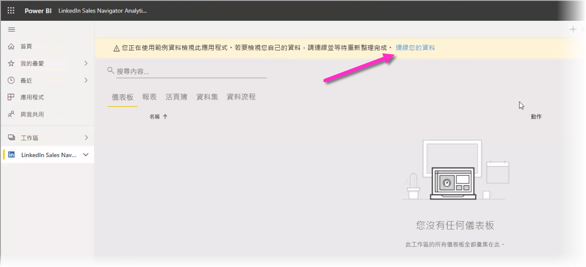
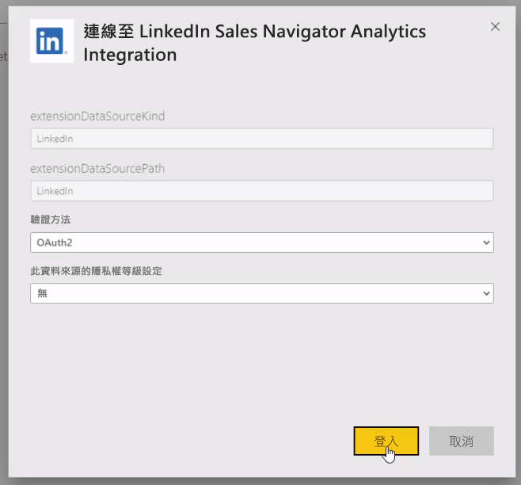

# 在 Power BI Desktop 中連線到 LinkedIn Sales Navigator

在 **Power BI Desktop** 中，您可以連線到 **LinkedIn Sales Navigator** 以協助尋找並建置關聯性 (就像 Power BI Desktop 中的任何其他資料來源一樣)，並建立有關進度的現成報表。

![LinkedIn Sales Navigator [使用方式] 索引標籤](media/desktop-connect-linkedin-sales-navigator/linkedin-sales-navigator-01.png)

若要使用 **LinkedIn Sales Navigator** 連線到 LinkedIn 資料，您需要具備 LinkedIn Sales Navigator Enterprise 方案，而且必須是 Sales Navigator 合約上的系統管理員或報告使用者。

下列影片提供使用 **LinkedIn Sales Navigator** 範本應用程式的快速導覽和教學課程，[此文章稍後](#using-the-linkedin-sales-navigator-template-app)將對其進行詳細說明。 

> [!VIDEO https://www.youtube.com/embed/ZqhmaiORLw0]

## 連線至 LinkedIn Sales Navigator

若要連線至 **LinkedIn Sales Navigator** 資料，請從 Power BI Desktop 的 [常用]  功能區選取 [取得資料]  。 在左側的類別中選取 [線上服務]  ，然後進行捲動，直到您看到 [LinkedIn Sales Navigator (Beta)]  為止。

我們將建議您連線到仍在開發中的協力廠商連接器。 

選取 [繼續]  時，系統會提示您指定所需的資料。

在出現的 [LinkedIn Sales Navigator]  視窗中，從第一個下拉式選取器中選取要傳回的資料 ([所有連絡人]  或 [選取的連絡人]  )。 您接著可以指定開始和結束日期，以將接收到的資料限制為特定的時間範圍。

當您提供資訊之後，Power BI Desktop 就會連線到與您的 LinkedIn Sales Navigator 合約相關聯的資料。 使用您透過網站用來登入 LinkedIn Sales Navigator 的相同電子郵件地址。 

當您成功連線時，系統會提示您從 [導覽器]  視窗選取 LinkedIn Sales Navigator 合約中的資料。

您可以使用 LinkedIn Sales Navigator 資料，來建立所需的任何報表。 為了方便起見，您還可以下載已提供範例資料的 LinkedIn Sales Navigator .PBIX 檔案，讓您能夠熟悉資料和報表，而不需從頭開始。

您可以從下列位置下載 PBIX 檔案：
* [適用於 LinkedIn Sales Navigator 的 PBIX](service-template-apps-samples.md)

除了 PBIX 檔案，LinkedIn Sales Navigator 還有一個您也可以下載並使用的範本應用程式。 下一節將詳細說明此範本應用程式。

## 使用 LinkedIn Sales Navigator 範本應用程式

若要盡可能輕鬆使用 **LinkedIn Sales Navigator**，您可以使用此[範本應用程式](service-template-apps-overview.md)，從 LinkedIn Sales Navigator 資料自動建立現成的報表。

當您下載應用程式時，可以選擇是否要連線到您的資料，或使用範例資料來探索應用程式。 當您探索範例資料之後，可隨時返回並連線到自己的 LinkedIn Sales Navigator 資料。 

您可以從下列連結取得 **LinkedIn Sales Navigator** 範本應用程式：
* [LinkedIn Sales Navigator 範本應用程式](https://appsource.microsoft.com/product/power-bi/pbi-contentpacks.linkedin_navigator-preview?flightCodes=17ad4c68-fbc5-4925-a351-139fd384ec33) \(英文\)

此範本應用程式提供四個索引標籤，有助於分析和共用您的資訊：

* 使用量
* 搜尋
* InMail
* SSI

[使用方式]  索引標籤會顯示您的整體 LinkedIn Sales Navigator 資料。

![LinkedIn Sales Navigator [使用方式] 索引標籤](media/desktop-connect-linkedin-sales-navigator/linkedin-sales-navigator-12.png)

[搜尋]  索引標籤可讓您更深入探索搜尋結果：

![LinkedIn Sales Navigator [搜尋] 索引標籤](media/desktop-connect-linkedin-sales-navigator/linkedin-sales-navigator-13.png)

[InMail]  提供 InMail 使用方式的見解，包括已傳送的 InMails 數量、接受率及其他實用資訊：

![LinkedIn Sales Navigator [InMail] 索引標籤](media/desktop-connect-linkedin-sales-navigator/linkedin-sales-navigator-14.png)

[SSI]  索引標籤可為您的 Social Selling Index (SSI) 提供其他詳細資料：

![LinkedIn Sales Navigator [SSI] 索引標籤](media/desktop-connect-linkedin-sales-navigator/linkedin-sales-navigator-15.png)

若要從範例資料移到自己的資料，請選取右上角的 [編輯應用程式]  (鉛筆圖示)，然後從出現的畫面中選取 [連接您的資料]  。

您可以從該處連接自己的資料，並選取要載入多少天的資料。 您最多可以載入 365 天的資料。 您將需要使用您透過網站用來登入 LinkedIn Sales Navigator 的相同電子郵件地址，再次登入。 

範本應用程式接著會使用您的資料，重新整理應用程式中的資料。 您也可以設定排程的重新整理，因此，應用程式中的資料會與您的重新整理頻率所指定的一樣。 

一旦資料更新之後，您就可以看到已填入自己資料的應用程式。

## 取得說明

如果在連線至資料時遇到問題，請透過 https://www.linkedin.com/help/sales-navigator 連絡 LinkedIn Sales Navigator 支援。 

## 後續步驟
您可以使用 Power BI Desktop 連接至各式各樣的資料。 如需有關資料來源的詳細資訊，請參閱下列資源︰

* [Power BI Desktop 是什麼？](desktop-what-is-desktop.md)
* [Power BI Desktop 中的資料來源](desktop-data-sources.md)
* [使用 Power BI Desktop 合併資料並使其成形](desktop-shape-and-combine-data.md)
* [在 Power BI Desktop 中連接至 Excel 活頁簿](desktop-connect-excel.md)   
* [直接將資料輸入 Power BI Desktop 中](desktop-enter-data-directly-into-desktop.md)   

