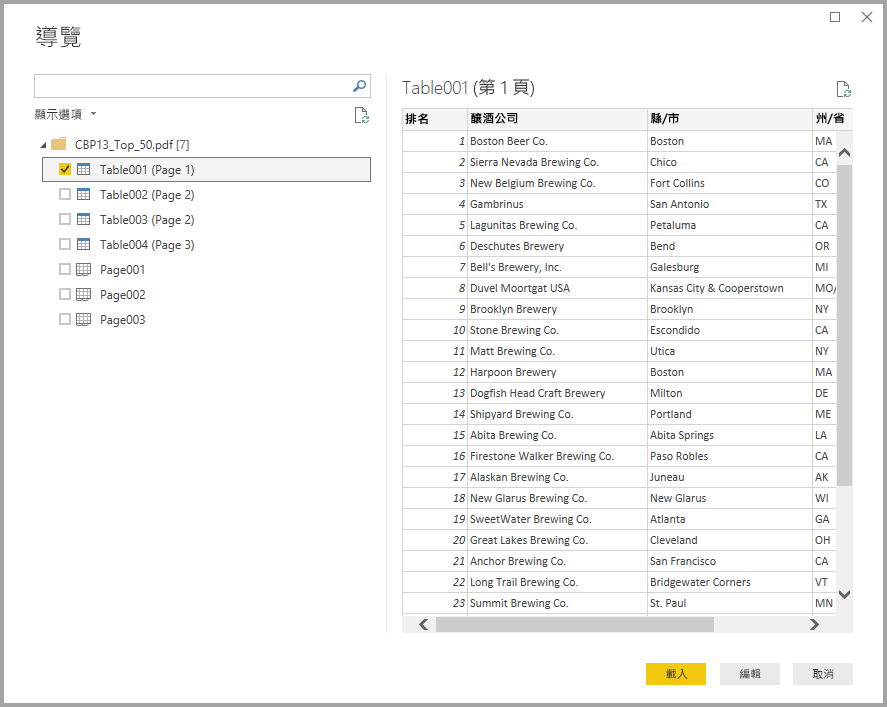

# 在 Power BI Desktop 中連線到 PDF 檔案 (預覽)
在 Power BI Desktop 中，您可以連線至 **PDF 檔案**並使用此檔案內附的資料，如同使用 Power BI Desktop 中的任何其他資料來源。

下列各節描述如何連線到 **PDF 檔案**、選取資料，並將該資料帶入 **Power BI Desktop**。

## 啟用 PDF 連接器
PDF 連接器在 **Power BI Desktop** 中為預覽階段，必須啟用。 若要啟用 PDF 連接器，請選取 [檔案] > [選項及設定] > [選項] > [預覽功能]，然後選取 [Get data from PDF files] \(取得 PDF 檔案中的資料\) 旁的核取方塊。 

![從 [選項] > [預覽功能] 啟用 PDF 連接器](media/desktop-connect-pdf/connect-pdf_01.png)

完成選取後，必須重新啟動 **Power BI Desktop**。

當您第一次使用 **PDF (beta)** 連接器時，您會收到警告，表示 PDF 連接器仍處於開發階段，未來可能有所變更。 選取 [繼續] 使用連接器。

一律建議升級為最新版本的 **Power BI Desktop**，您可以從[取得 Power BI Desktop](desktop-get-the-desktop.md) 中的連結取得。 

## 連線到 PDF 檔案
若要連線至 **PDF** 檔案，請從 Power BI Desktop 的 [首頁] 功能區選取 [取得資料]。 從左側類別中選取 [檔案]，您就會看到 **PDF (搶鮮版 (Beta))**。

![從 [取得資料] 選取 [PDF]](media/desktop-connect-pdf/connect-pdf_01.png)

系統會提示您提供想要使用的 PDF 檔案位置。 一旦您提供檔案位置及 PDF 檔案載入後，[導覽器] 視窗隨即出現，並顯示檔案中可用的資料，您可以從中選取一或多個要匯入 **Power BI Desktop** 並在其中使用的項目。

選取在 PDF 檔案中所探索項目旁的核取方塊，在右窗格中顯示它們。 當您準備匯入時，請選取 [載入] 按鈕將資料帶入 **Power BI Desktop**。

從 2018 年 11 月推出的 **Power BI Desktop** 版本開始，您可以將 [起始頁] 和 [結束頁] 指定為 PDF 連線的選擇性參數。 您也可以使用下列格式，以 M 公式語言指定這些參數：

`Pdf.Tables(File.Contents("c:\sample.pdf"), [StartPage=10, EndPage=11])`

## 後續步驟
您可以使用 Power BI Desktop 連接至各式各樣的資料。 如需有關資料來源的詳細資訊，請參閱下列資源︰

* [Power BI Desktop 是什麼？](desktop-what-is-desktop.md)
* [Power BI Desktop 中的資料來源](desktop-data-sources.md)
* [使用 Power BI Desktop 合併資料並使其成形](desktop-shape-and-combine-data.md)
* [在 Power BI Desktop 中連接至 Excel 活頁簿](desktop-connect-excel.md)   
* [直接將資料輸入 Power BI Desktop 中](desktop-enter-data-directly-into-desktop.md)   

