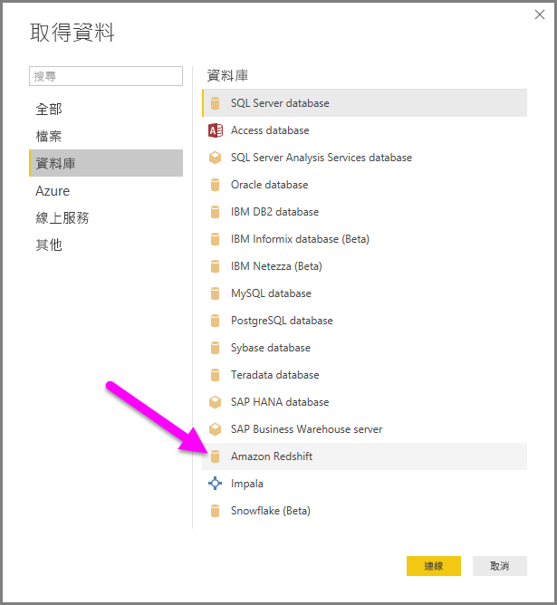

# 在 Power BI Desktop 中連線至 Amazon Redshift
在 **Power BI Desktop** 中，您可以連接至 **Amazon Redshift** 資料庫並使用基礎資料，就像 Power BI Desktop 中的任何其他資料來源。

## 連接到 Amazon Redshift 資料庫
若要連線至 **Amazon Redshift** 資料庫，請從 Power BI Desktop 的 [首頁] 功能區選取 [取得資料]。 從左側類別中選取 [資料庫]，您就會看到 [Amazon Redshift]。

在出現的 Amazon Redshift 視窗中，將您的 **Amazon Redshift** 伺服器及資料庫名稱鍵入或貼上方塊中。 在 [伺服器] 欄位中，使用者可以用下列格式指定連接埠作為其一部分︰*ServerURL:Port*

收到提示時，請放入您的使用者名稱和密碼。

成功連接後，[導覽器] 視窗隨即出現，並顯示伺服器上可用的資料，您可以從中選取一或多個要匯入 **Power BI Desktop** 並在其中使用的項目。

當您在 [導覽器] 視窗完成選取後，就可以 [匯入] 或 [編輯] 資料。

* 如果選擇 [載入] 資料，系統會提示您要使用 [匯入] 或 [DirectQuery] 模式載入資料。 如需詳細資訊，請查看這篇[說明 DirectQuery 的文章](desktop-use-directquery.md)。
* 如果選擇 [編輯] 資料，**Query Editor**隨即顯示，您可以從中將各種轉換及篩選條件套用到資料，其中有多種適用於基礎 **Amazon Redshift** 本身 (如受支援)。

## 後續步驟
您可以使用 Power BI Desktop 連接至各式各樣的資料。 如需有關資料來源的詳細資訊，請參閱下列資源︰

* [開始使用 Power BI Desktop](desktop-getting-started.md)
* [Power BI Desktop 中的資料來源](desktop-data-sources.md)
* [使用 Power BI Desktop 合併資料並使其成形](desktop-shape-and-combine-data.md)
* [在 Power BI Desktop 中連接至 Excel 活頁簿](desktop-connect-excel.md)   
* [直接將資料輸入 Power BI Desktop 中](desktop-enter-data-directly-into-desktop.md)   

