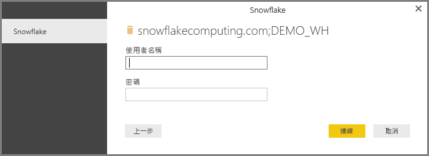

# 在 Power BI Desktop 中連接到 Snowflake
在 Power BI Desktop 中，您可以連接至 **Snowflake** 運算倉儲並使用基礎資料，就像 Power BI Desktop 中的任何其他資料來源。 

> [!NOTE]
> 您還「必須」使用符合 **Power BI Desktop** 安裝的 32 位元或 64 位元架構，在使用 **Snowflake** 連接器的電腦上安裝 **Snowflake ODBC 驅動程式**。 只要遵循下列連結並[下載適當的 Snowflake ODBC 驅動程式](http://go.microsoft.com/fwlink/?LinkID=823762)即可。
> 
> 

## 連接至 Snowflake 運算倉儲
若要連接到 **Snowflake** 運算倉儲，請從 Power BI Desktop 的 [首頁] 功能區選取 [取得資料]。 從左側類別中選取 [資料庫]，然後您會看到 **Snowflake**。

在顯示的 [Snowflake] 視窗中，將您的 Snowflake 伺服器名稱鍵入或貼上方塊中，然後選取 [確定]。 請注意，您可以選擇直接將資料 [匯入] Power BI 中，也可以使用 [DirectQuery]。 您可以深入了解[如何使用 DirectQuery](desktop-use-directquery.md)。

收到提示時，請放入您的使用者名稱和密碼。

> [!NOTE]
> 一旦您在特定 **Snowflake** 伺服器放入使用者名稱和密碼，Power BI Desktop 便會在後續連接嘗試中使用與其相同的認證。 您可以前往 **[檔案] > [選像和設定] > [資料來源設定]** 修改認證。
> 
> 

成功連接後，[導覽器] 視窗隨即出現，並顯示伺服器上可用的資料，您可以從中選取一或多個要匯入 **Power BI Desktop** 並在其中使用的項目。

您可以**載入**選取的資料表，將整個資料表帶入 **Power BI Desktop** 中，也可以**編輯**查詢以開啟**查詢編輯器**，以便您篩選並縮小搜尋範圍到一組您想要使用的資料，然後將該組精簡的資料載入 **Power BI Desktop** 中。

## 後續步驟
您可以使用 Power BI Desktop 連接至各式各樣的資料。 如需有關資料來源的詳細資訊，請參閱下列資源︰

* [Power BI Desktop 是什麼？](desktop-what-is-desktop.md)
* [Power BI Desktop 中的資料來源](desktop-data-sources.md)
* [使用 Power BI Desktop 合併資料並使其成形](desktop-shape-and-combine-data.md)
* [在 Power BI Desktop 中連接至 Excel 活頁簿](desktop-connect-excel.md)   
* [直接將資料輸入 Power BI Desktop 中](desktop-enter-data-directly-into-desktop.md)   

