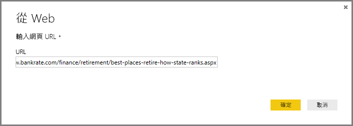
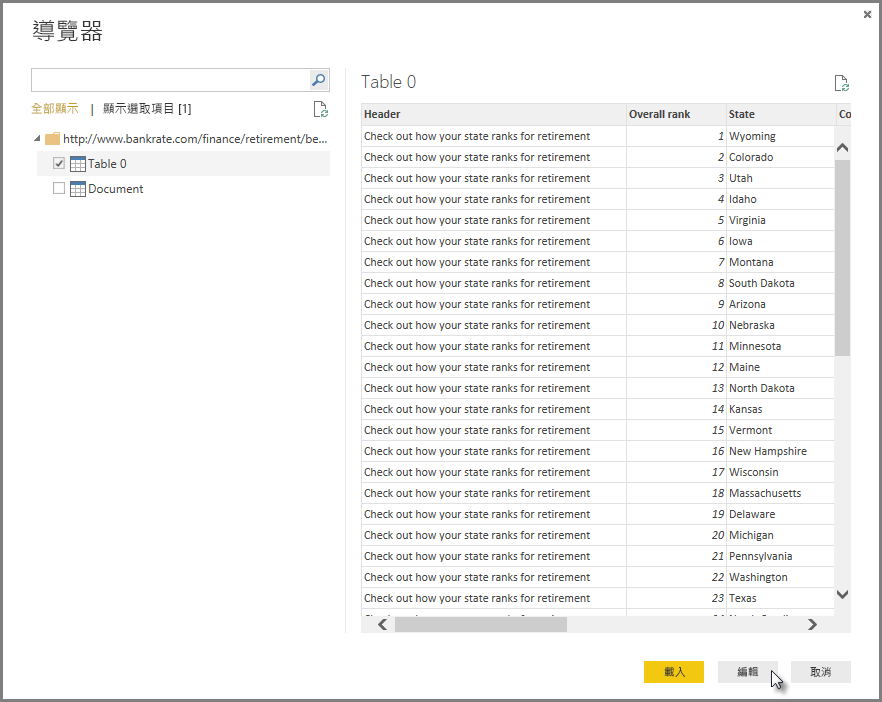
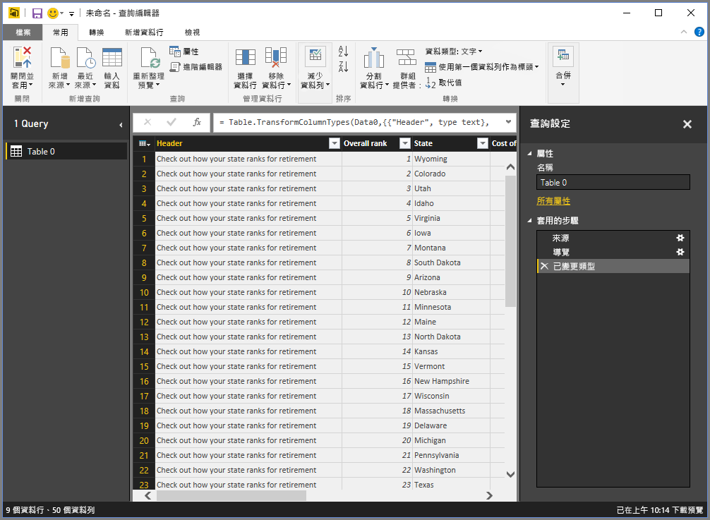
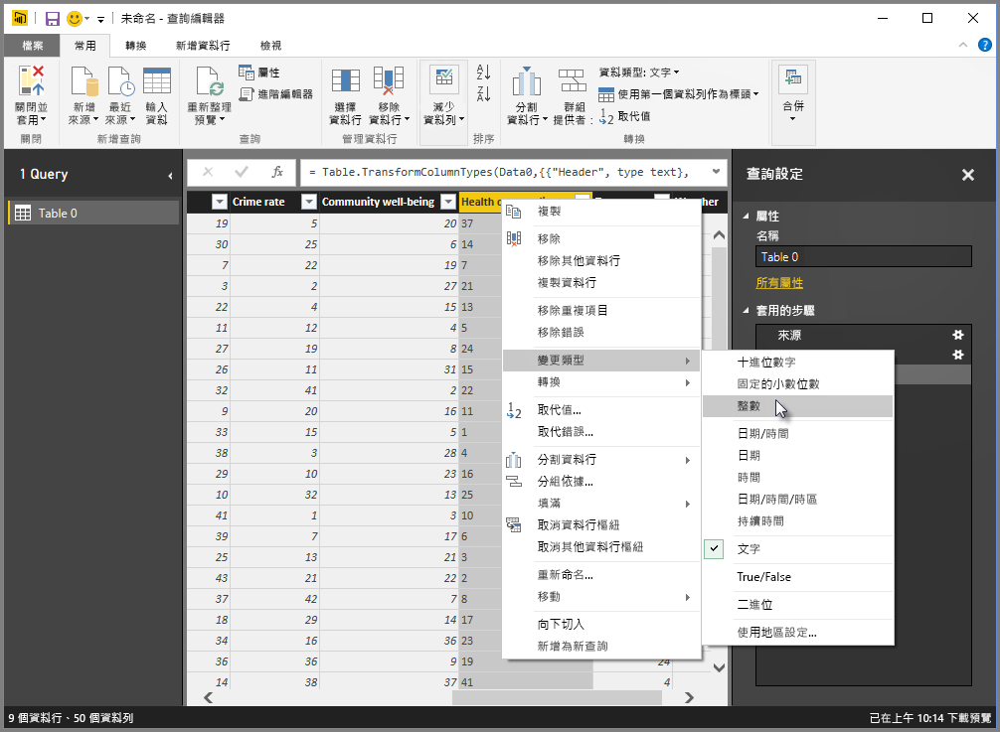
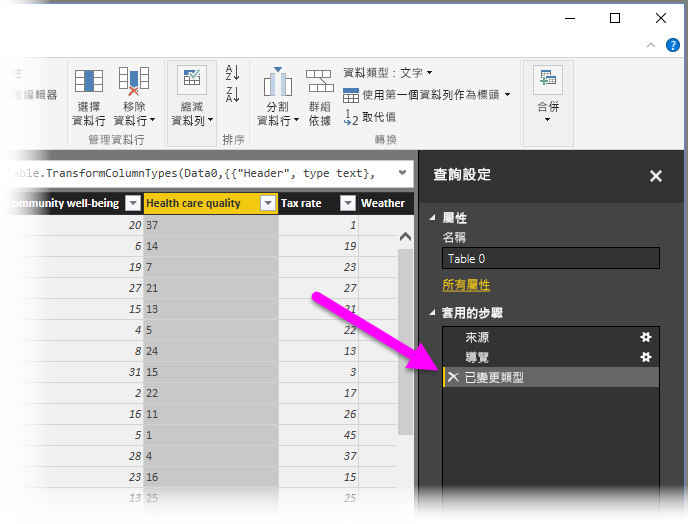
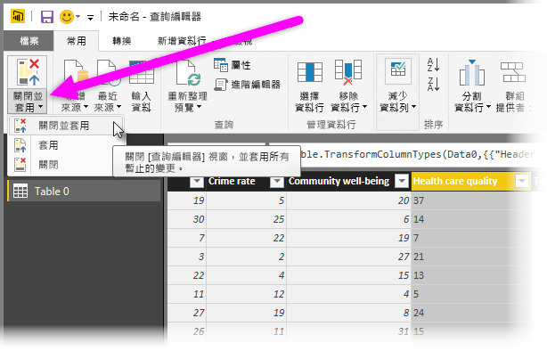
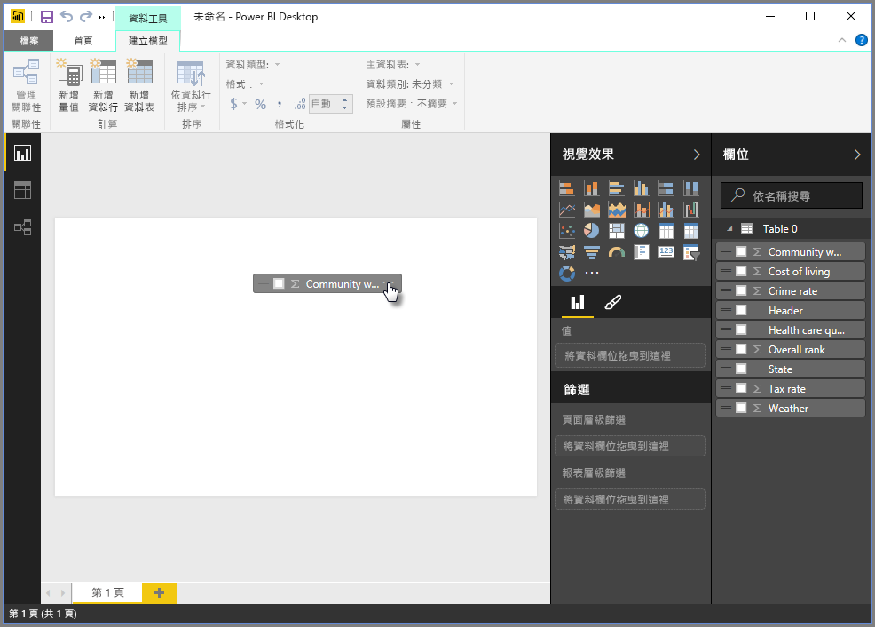
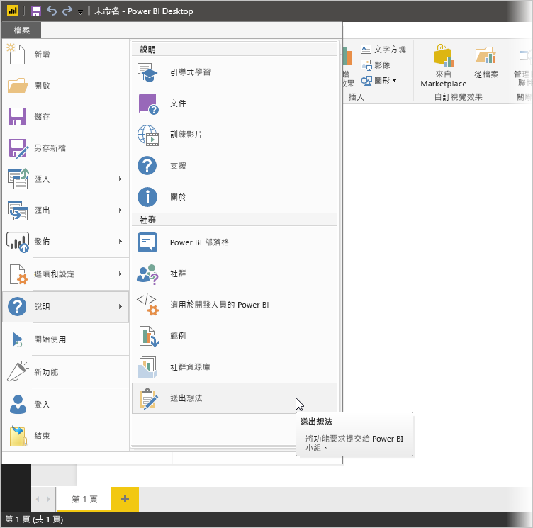

# 連接至 Power BI Desktop 中的資料
透過 Power BI Desktop，您可以輕鬆地連接到持續擴展的資料世界。 如果您沒有 Power BI Desktop，您可以[下載](http://go.microsoft.com/fwlink/?LinkID=521662)並加以安裝。

Power BI Desktop 中有「各式各樣」  的可用資料來源。 下圖顯示如何藉由依序選取 **檔案** 功能區 > [取得資料] > **其他\> 來連接到資料**.

在本例中，我們將連接到 **Web** 資料來源。

想像您即將退休 - 您想要住在有很多陽光、稅制合理且具備良好健康照護的地方。 或者… 也許您是資料分析師，您想要該資訊來協助您的客戶 – 像是協助您的雨衣製造客戶以 *經常* 下雨的地方為銷售目標.

無論如何，您都可以在下列 Web 資源中找到這些主題的相關有趣資料：

[*http://www.bankrate.com/finance/retirement/best-places-retire-how-state-ranks.aspx*](http://www.bankrate.com/finance/retirement/best-places-retire-how-state-ranks.aspx)

請選取 **取得資料 \>Web**，然後輸入位址。

當您選取 [確定] 時，Power BI Desktop 的 [查詢]  功能就會開始運作。 Power BI Desktop 會連絡 Web 資源，[導覽器]  視窗會傳回它在該網頁找到的結果。 在本例中，它找到一個資料表 (資料表 0) 和整份文件。 我們對資料表有興趣，因此我們從清單中選取它。 [導覽器]  視窗會顯示預覽。

此時我們可以從視窗的底部選取 [編輯]  ，先編輯查詢再載入資料表，或者我們可以載入資料表。

如果我們選取 [ **編輯**]，即會載入資料表並啟動 [查詢編輯器]。 此時會顯示 **查詢設定** 窗格 (若未顯示，可依序從功能區選取 **檢視**，然後選取 **[顯示]\> 查詢設定**，以便顯示**查詢設定** 窗格)。 以下是其外觀。

所有分數都是文字而非數字，我們需要使用數字。 沒問題，只要以滑鼠右鍵按一下資料行標頭，然後選取 **變更類型\> [整數]** 加以變更即可。 若要選擇多個資料行，請先選取一個資料行，然後按住 **SHIFT** 鍵並選取其他相鄰的資料行，然後以滑鼠右鍵按一下資料行標頭，即可變更所有選取的資料行。 使用 **CTRL** 鍵選擇不相鄰的資料行。

在 [查詢設定] 中，[套用的步驟]  會反映任何已做的變更。 當您對資料進行其他變更時，[查詢編輯器] 會將這些變更記錄到 [套用的步驟]  區段中，您可以視需要在此進行調整、重新瀏覽、重新排列或刪除。

資料表載入後仍可進行其他變更，但目前到此為止即可。 完成時，我們會從 [常用] 功能區選取 [關閉並套用]，Power BI Desktop 會套用我們的變更並關閉 [查詢編輯器]。

載入資料模型之後，即可在 Power BI Desktop 的 [報表]  檢視中，將欄位拖曳到畫布上以開始建立視覺效果。

當然，這是具有單一資料連接的簡單模型；大多數 Power BI Desktop 報表會連接到不同的資料來源、依您的需求成形並具有關聯性，以產生豐富的資料模型。 

### 後續步驟
您可以使用 Power BI Desktop 執行各種作業。 如需有關其功能的詳細資訊，請參閱下列資源：

* [開始使用 Power BI Desktop](desktop-getting-started.md)
* [Power BI Desktop 的查詢概觀](desktop-query-overview.md)
* [Power BI Desktop 中的資料來源](desktop-data-sources.md)
* [使用 Power BI Desktop 合併資料並使其成形](desktop-shape-and-combine-data.md)
* [Power BI Desktop 中的常見查詢工作](desktop-common-query-tasks.md)   

想要提供意見反應嗎？ 太好了 – 使用 Power BI Desktop 的 [Submit an Idea] (送出想法) 功能表項目或瀏覽 [Community Feedback](http://community.powerbi.com/t5/Community-Feedback/bd-p/community-feedback) (社群意見應)。 我們期待您的留言！

