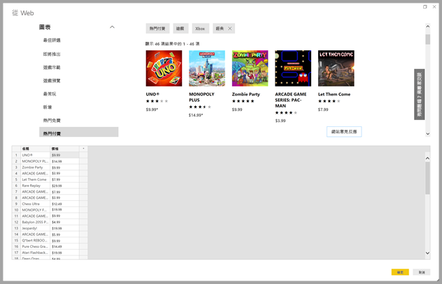
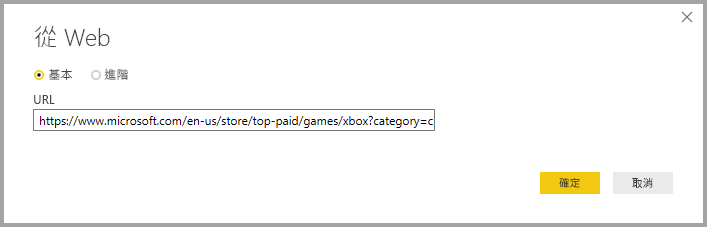
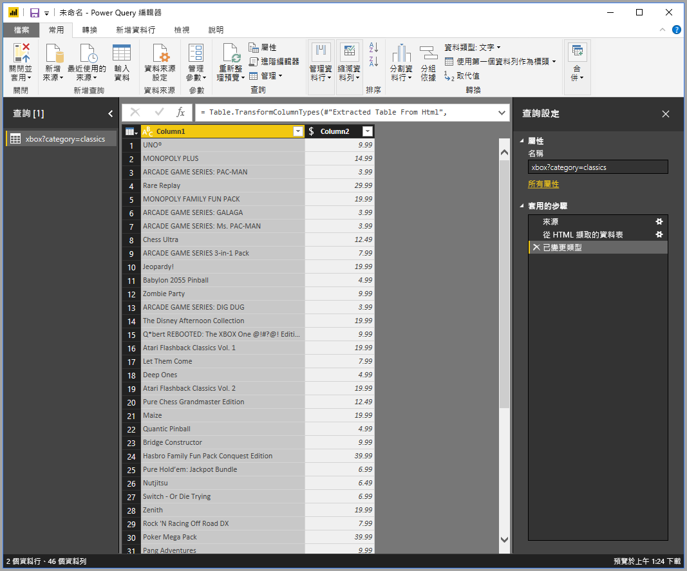

# 提供範例以取得網頁資料

從網頁取得資料讓使用者輕鬆就能從網頁擷取資料，並將該資料匯入 *Power BI Desktop*。 不過，網頁上資料通常不在可輕鬆擷取的整齊資料表中。 即使資料是結構化且一致的，但從這類頁面取得資料可能還是很困難。

有一個解決方案。 您可以使用「藉由範例從 Web 取得資料」  功能，在連接器對話方塊中提供一或多個範例，以便向 Power BI Desktop 顯示您想要擷取的資料。 Power BI Desktop 會收集頁面上符合您範例的其他資料。 使用此解決方案，您可以從網頁擷取各種資料，包括在表格中的資料*和*其他非表格的資料。

圖形中的價格僅供舉例說明之用。

## 使用「藉由範例從 Web 取得資料」

從 [常用]  功能區功能表中，選取 [取得資料]  。 在出現的對話方塊中，從左側窗格的類別中選取 [其他]  ，然後選取 [Web]  。 選取 [連線]  以繼續。

![從 [取得資料] 選取 [Web]](media/desktop-connect-to-web-by-example/web-by-example_03.png)

針對所要擷取資料的網頁，在 [從 Web]  中輸入網頁的 URL。 在本文中，我們會使用 Microsoft Store 網頁，並顯示此連接器的運作方式。

如果您想要按照本文操作，可以使用我們在本文中使用的 [Microsoft 市集 URL](https://www.microsoft.com/store/top-paid/games/xbox?category=classics)：

    https://www.microsoft.com/store/top-paid/games/xbox?category=classics

當您選取 [確定]  時，就會出現 [導覽器]  對話方塊，其中會顯示所有自動偵測到的網頁資料表。 在下圖中顯示的情況中找不到任何資料表。 請選取 [使用範例新增資料表]  來提供範例。

![[導覽器] 視窗](media/desktop-connect-to-web-by-example/web-by-example_05.png)

[使用範例新增資料表]  提供一個互動式視窗，您可以在其中預覽網頁的內容。 請針對您要擷取的資料輸入其範例值。

在此範例中，我們會擷取頁面上每個遊戲的 [名稱]  和 [價格]  。 我們可以為每個資料行指定幾個來自頁面的範例，藉以完成這項工作。 當您輸入範例時，*Power Query* 會使用智慧型資料擷取演算法來擷取符合範例項目模式的資料。

> [!NOTE]
> 值的建議只包含長度小於或等於 128 個字元的值。

當您滿意從網頁擷取的資料時，請選取 [確定]  以移至 Power Query 編輯器。 您可以套用更多轉換或塑造資料，例如將此資料與來源的其他資料合併。

之後，您可以建立視覺效果，或是在建立您的 Power BI Desktop 報表時使用網頁資料。

## 後續步驟

您可以使用 Power BI Desktop 連接至各式各樣的資料。 如需有關資料來源的詳細資訊，請參閱下列資源︰

* [在 Power BI Desktop 中從範例新增資料行](desktop-add-column-from-example.md)
* [從 Power BI Desktop 連線至網頁](desktop-connect-to-web.md)
* [Power BI Desktop 中的資料來源](desktop-data-sources.md)
* [在 Power BI Desktop 中塑造及合併資料](desktop-shape-and-combine-data.md)
* [在 Power BI Desktop 中連接至 Excel 活頁簿](desktop-connect-excel.md)
* [連接至 Power BI Desktop 中的 CSV 檔案](desktop-connect-csv.md)
* [直接將資料輸入 Power BI Desktop 中](desktop-enter-data-directly-into-desktop.md)
