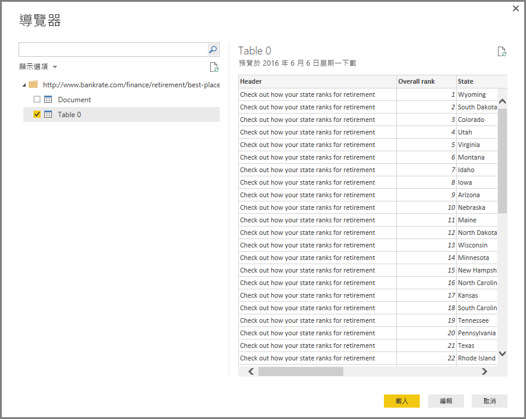

# 從 Power BI Desktop 連接至網頁
您可以連接至網頁並將其資料匯入 Power BI Desktop，以在您的視覺效果和資料模型中使用。

在 Power BI Desktop 中，從 [主資料夾]  功能區選取 [取得資料] > [Web]。

對話方塊隨即出現，並詢問您要從中匯入資料的網頁 URL。

您輸入 (或貼上) URL 之後，選取 [確定]。 Power BI Desktop 會連接至該網頁上，然後在 [導覽] 視窗中顯示網頁的可用資料。 當您選取其中一個可用的資料元素，例如整個網頁的資料表，[導覽] 視窗會在視窗的右側顯示該資料的預覽。

您可以選擇 [編輯] 按鈕，其會啟動 [查詢編輯器]，供您在匯入 Power BI Desktop 之前在網頁上修改或轉換資料。 或著您可以選取 [載入] 按鈕，然後匯入您在左窗格中選取的所有資料元素。

當我們選取 [載入] 時，Power BI Desktop 會匯入選取的項目，並使其能夠在 [欄位] 窗格中使用，其會出現在 Power BI Desktop 中 [報表] 檢視的右側。

這樣就可以連接到網頁，並將其資料帶入 Power BI Desktop。

您可以從這裡將這些欄位拖曳到報表畫布上，並建立您想要的所有視覺效果。 您也可以從該網頁使用此資料，就像使用任何其他資料一樣：您可以加以修改、可以在模型中建立該資料與其他資料來源之間的關聯性，或是以您喜歡的方式建立您想要的 Power BI 報表。

若要查看連接至網頁的深入探討，請看看 [Power BI Desktop 入門指南](desktop-getting-started.md)。

### 後續步驟
您可以使用 Power BI Desktop 連接至各式各樣的資料。 如需有關資料來源的詳細資訊，請參閱下列資源︰

* [Power BI Desktop 中的資料來源](desktop-data-sources.md)
* [使用 Power BI Desktop 合併資料並使其成形](desktop-shape-and-combine-data.md)
* [在 Power BI Desktop 中連接至 Excel 活頁簿](desktop-connect-excel.md)   
* [連接至 Power BI Desktop 中的 CSV 檔案](desktop-connect-csv.md)   
* [直接將資料輸入 Power BI Desktop 中](desktop-enter-data-directly-into-desktop.md)   

