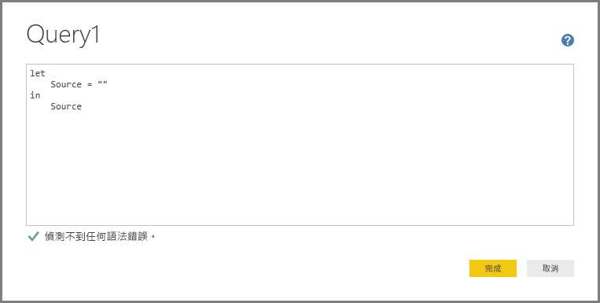
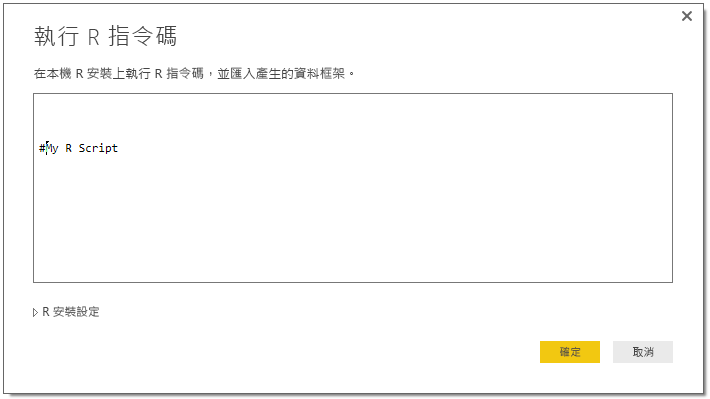

# 在 Power BI Desktop 中使用泛型介面連接到資料
您可以使用內建資料連接器，在 **Power BI Desktop** 中連接到多種不同的資料來源，連接器會顯示在 [取得資料] 視窗中，從 **Access 資料庫**到 **Zendesk** 資源皆涵蓋在內。 您也可以使用 **Power BI Desktop** 內建的泛型介面 (例如 **ODBC** 或 **REST API**) 連接到「其他」各式各樣的資料來源，這還能進一步擴充您的連線選項。

## Power BI Desktop 資料介面
**Power BI Desktop** 包含一系列資料連接器，專為連接到特定資料來源而打造，而且數量持續增加。 例如，如果在您選取 [取得資料] > [更多...] \(如上圖所示) 時，顯示的視窗中出現了其他資料來源，**SharePoint 清單**資料連接器會在 **SharePoint 清單**專用的連線順序期間提供特定欄位和支援資訊。

此外，**Power BI Desktop** 還可讓您使用下列其中一個泛型資料介面，連接到 [取得資料] 清單中未明確指出的資料來源：

* **ODBC**
* **OLE DB**
* **OData**
* **REST API**
* **R 指令碼**

在這些泛型介面所提供的連線視窗中提供適當參數，您在 **Power BI Desktop** 中能夠存取及使用的資料來源就會大幅增長。

在下列章節中，您可以找到可透過這些泛型介面存取的資料來源清單。

找不到想在 **Power BI Desktop** 使用的資料來源嗎？ 請[讓我們知道](https://ideas.powerbi.com/)，好讓我們將其新增到意見和要求清單中。

## 可透過 ODBC 存取的資料來源
**Power BI Desktop** 中的 **ODBC** 連接器讓您只要指定**資料來源名稱 (DSN)** 或「連接字串」，即可從任何協力廠商 ODBC 驅動程式匯入資料。 您也可以選擇指定要對 ODBC 驅動程式執行的 SQL 陳述式。

下列清單詳列了幾個 **Power BI Desktop**可以使用泛型 **ODBC** 介面來連接的資料來源範例。

| Power BI Desktop 泛型連接器 | 外部資料來源 | 連結取得詳細資訊 |
| --- | --- | --- |
| ODBC |Cassandra |[Cassandra ODBC 驅動程式](http://www.simba.com/drivers/cassandra-odbc-jdbc/) |
| ODBC |Couchbase DB |[Couchbase 和 Power BI](https://powerbi.microsoft.com/en-us/blog/visualizing-data-from-couchbase-server-v4-using-power-bi/) |
| ODBC |DynamoDB |[DynamoDB ODBC 驅動程式](http://www.simba.com/drivers/dynamodb-odbc-jdbc/) |
| ODBC |Google BigQuery |[BigQuery ODBC 驅動程式](http://www.simba.com/drivers/bigquery-odbc-jdbc/) |
| ODBC |Hbase |[Hbase ODBC 驅動程式](http://www.simba.com/drivers/hbase-odbc-jdbc/) |
| ODBC |Hive |[Hive ODBC 驅動程式](http://www.simba.com/drivers/hive-odbc-jdbc/) |
| ODBC |IBM Netezza |[IBM Netezza 資訊](https://www.ibm.com/support/knowledgecenter/SSULQD_7.2.1/com.ibm.nz.datacon.doc/c_datacon_plg_overview.html) |
| ODBC |Presto |[Presto ODBC 驅動程式](http://www.simba.com/drivers/presto-odbc-jdbc/) |
| ODBC |Project Online |[Project Online 文章](desktop-project-online-connect-to-data.md) |
| ODBC |Progress OpenEdge |[Progress OpenEdge ODBC 驅動程式部落格文章](https://na01.safelinks.protection.outlook.com/?url=https%3A%2F%2Fwww.progress.com%2Fblogs%2Fconnect-microsoft-power-bi-to-openedge-via-odbc-driver&data=02%7C01%7CMatt.Masson%40microsoft.com%7C5e63742e6c454308b58a08d4034b5923%7C72f988bf86f141af91ab2d7cd011db47%7C1%7C0%7C636137069555329811&sdata=gSu2Rq3vZ0uBVOgjaXxd8Y3uBf%2B8DidX6PG33jwAduY%3D&reserved=0) |

## 可透過 OLE DB 存取的資料來源
**Power BI Desktop** 中的 **OLE DB** 連接器讓您只要指定「連接字串」，即可從任何協力廠商 OLE DB 驅動程式匯入資料。 您也可以選擇指定要對 OLE DB 驅動程式執行的 SQL 陳述式。

下列清單詳列了幾個 **Power BI Desktop**可以使用泛型 **OLE DB** 介面來連接的資料來源範例。

| Power BI Desktop 泛型連接器 | 外部資料來源 | 連結取得詳細資訊 |
| --- | --- | --- |
| OLE DB |SAS OLE DB |[OLE DB 的 SAS 提供者](https://support.sas.com/downloads/package.htm?pid=648) |
| OLE DB |Sybase OLE DB |[OLE DB 的 Sybase 提供者](http://infocenter.sybase.com/help/index.jsp?topic=/com.sybase.infocenter.dc35888.1550/doc/html/jon1256941734395.html) |

## 可透過 OData 存取的資料來源
**Power BI Desktop** 中的 **OData** 連接器讓您只要鍵入或貼上 **OData** URL，即可從任何 **OData** URL 匯入資料。 您可以在 [OData 摘要] 視窗提供的文字方塊中鍵入或貼上連結，以新增多個 URL 部分。

下列清單詳列了幾個 **Power BI Desktop**可以使用泛型 **ata** 介面來連接的資料來源範例。

| Power BI Desktop 泛型連接器 | 外部資料來源 | 連結取得詳細資訊 |
| --- | --- | --- |
| OData |即將推出 |請盡快回來掌握 OData 資料來源新消息 |

## 可透過 REST API 存取的資料來源
您可以使用 **REST API** 連接到資料來源，藉此使用支援 **REST** 的各種資料來源中的資料。

下列清單詳列了幾個 **Power BI Desktop**可以使用泛型 **REST API** 介面來連接的資料來源範例。

| Power BI Desktop 泛型連接器 | 外部資料來源 | 連結取得詳細資訊 |
| --- | --- | --- |
| REST API |Couchbase DB |[Couchbase REST API 資訊](https://powerbi.microsoft.com/en-us/blog/visualizing-data-from-couchbase-server-v4-using-power-bi/) |

## 可透過 R 指令碼存取的資料來源
您可以使用 **R 指令碼**存取資料來源，然後在 **Power BI Desktop** 中使用該資料。

下列清單詳列了幾個 **Power BI Desktop**可以使用泛型 **R 指令碼**介面來連接的資料來源範例。

| Power BI Desktop 泛型連接器 | 外部資料來源 | 連結取得詳細資訊 |
| --- | --- | --- |
| R Script |SAS 檔案 |[CRAN 提供的 R 指令碼指導](https://cran.r-project.org/doc/manuals/R-data.html) |
| R Script |SPSS 檔案 |[CRAN 提供的 R 指令碼指導](https://cran.r-project.org/doc/manuals/R-data.html) |
| R Script |R 統計檔案 |[CRAN 提供的 R 指令碼指導](https://cran.r-project.org/doc/manuals/R-data.html) |

## 後續步驟
您可以使用 Power BI Desktop 連接至各式各樣的資料來源。 如需有關資料來源的詳細資訊，請參閱下列資源︰

* [開始使用 Power BI Desktop](desktop-getting-started.md)
* [Power BI Desktop 中的資料來源](desktop-data-sources.md)
* [使用 Power BI Desktop 合併資料並使其成形](desktop-shape-and-combine-data.md)
* [在 Power BI Desktop 中連接至 Excel 活頁簿](desktop-connect-excel.md)   
* [直接將資料輸入 Power BI Desktop 中](desktop-enter-data-directly-into-desktop.md)   

