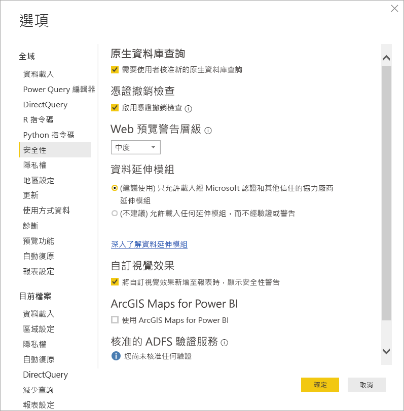
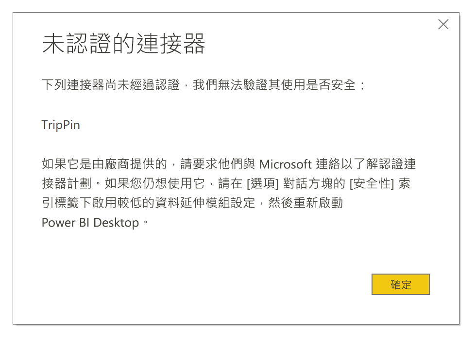

# Power BI 中的連接器擴充性

在 Power BI 中，客戶和開發人員可以擴充資料來源，以使用許多方式進行連接，例如使用現有的連接器和一般資料來源 (例如 ODBC、OData、Oledb、Web、CSV、XML、JSON)。 除了這些資料來源，開發人員還可以建立資料延伸模組 (稱為**自訂連接器**)，並認證連接器使其成為**認證的連接器**。

目前，使用**自訂連接器**的功能是透過功能切換來啟用。 在我們將此功能從搶鮮版 (Beta) 移至正式運作之前，我們已新增一個功能表，可讓您安全地控制想要允許在系統上執行的自訂程式碼層級：所有自訂連接器，或僅限 [取得資料] 對話方塊中由 Microsoft 認證及散發的連接器。

## 自訂連接器

**自訂連接器**可包含各種可能性，從對您商務不可或缺的小型 API，到 Microsoft 尚未發行連接器的大型企業專屬服務。 許多連接器都是由廠商自行散發，如果您需要特定資料連接器，請連絡廠商。

若要使用**自訂連接器**，請將它們放在 *\[Documents]\\Power BI Desktop\\Custom Connectors* 資料夾，並調整安全性設定，如下一節所述。

您不需要調整安全性設定來使用**認證的連接器**。

## 資料延伸模組安全性

若要變更資料延伸模組安全性設定，請在 **Power BI Desktop** 中，選取 [檔案] > [選項和設定] > [選項] > [安全性]。

在 [資料延伸模組] 下，您可以從兩種安全性層級中選取：

* (建議) 僅允許認證的延伸模組載入
* (不建議) 允許任何延伸模組載入而不警告

如果您計劃使用**自訂連接器**，或是您或協力廠商已開發並散發的連接器，您必須選取 [(不建議) 允許任何延伸模組載入而不警告]。 除非您絕對信任您的自訂連接器，否則我們不建議使用該安全性設定，因為裡面的程式碼可以處理認證 (包括透過 HTTP 傳送它們)，並忽略隱私權等級。

在 [(建議)] 安全性設定中，如果您的系統上有自訂連接器，則會顯示錯誤，指出連接器由於安全性而無法載入。

若要解決錯誤並使用這些連接器，您必須將安全性設定變更為如前所述的 [(不建議)] 設定，然後重新啟動 **Power BI Desktop**。

## 認證的連接器

資料延伸模組的有限子集會視為 [已認證]，而且這類認證的連接器可透過　[取得資料] 對話方塊使用，但仍會由建立連接器的協力廠商開發人員負責維護和支援。 雖然 Microsoft 會散發這些連接器，但我們並不負責其效能或功能的持續性。

如果您想要認證自訂連接器，請要求您的廠商連絡 dataconnectors@microsoft.com。
