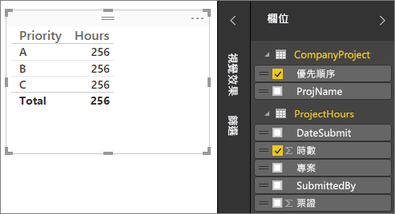
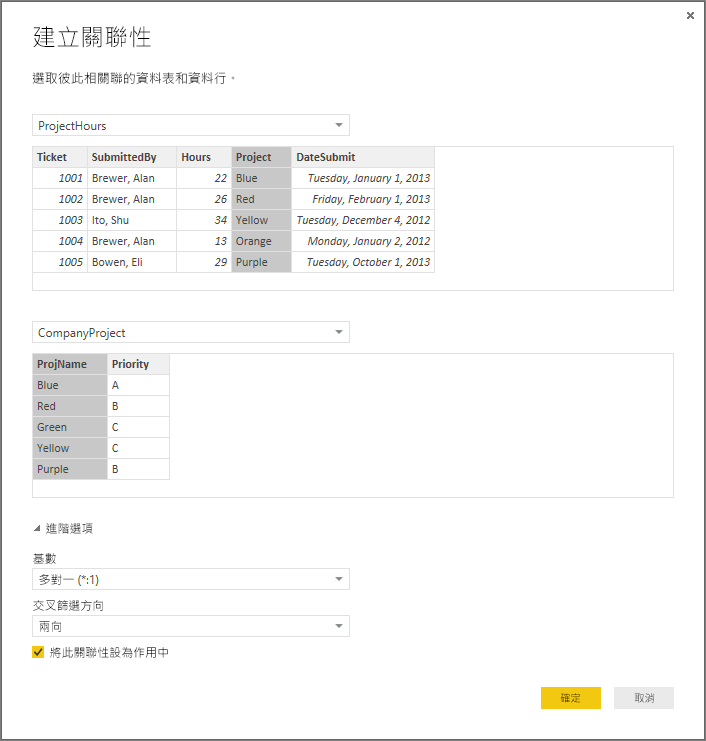
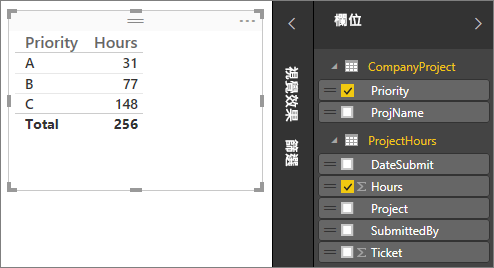
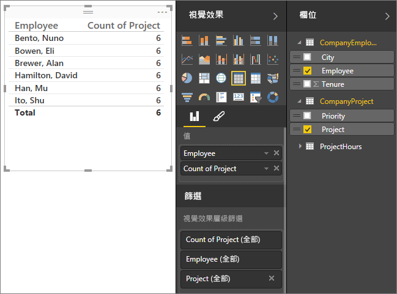
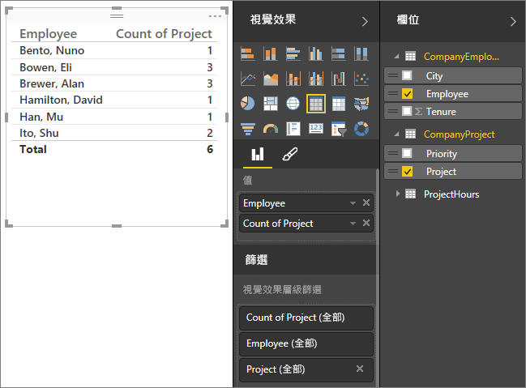
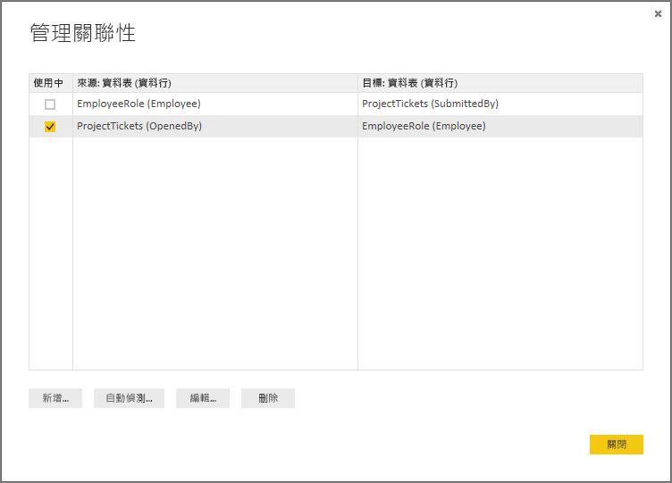
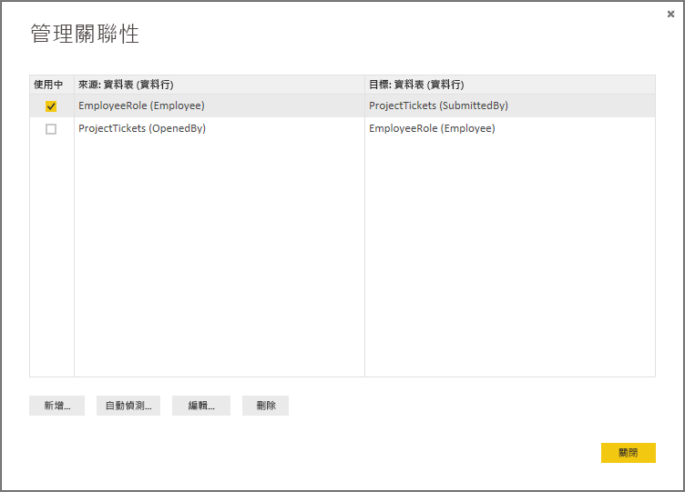

# 在 Power BI Desktop 中建立和管理關聯性
當您匯入多個資料表時，您可能想要使用所有資料表中的資料來進行一些分析。 這些資料表之間必須有關聯性，才能正確地計算結果，並在報表中顯示正確資訊。 Power BI Desktop 可讓您輕鬆地建立這些關聯性。 事實上，在大多數情況下，您不必執行任何動作，[自動偵測] 功能會為您完成這項作業。 不過，在某些情況下，您可能必須自行建立關聯性，或可能需要對關聯性進行一些變更。 不論是哪種情況，請務必了解 Power BI Desktop 中的關聯性，以及如何建立和編輯關聯性。

## 在載入期間自動偵測
如果您同時查詢兩個或多個資料表，Power BI Desktop 會在載入資料時，嘗試為您尋找並建立關聯性。 系統會自動設定基數、交叉篩選方向和作用中屬性。 Power BI Desktop 會查看您要查詢之資料表中的資料行名稱，以判斷是否有任何可能的關聯性。 如果有，則會自動建立這些關聯性。 如果 Power BI Desktop 不太確定是否有相符項目，則不會自動建立關聯性。 您仍然可以使用 [管理關聯性] 對話方塊來建立或編輯關聯性。

## 使用自動偵測建立關聯性
在 **常用** 索引標籤上，按一下 **管理關聯性**\>**自動偵測**。

## 以手動方式建立關聯性
1. 在 **常用** 索引標籤上，按一下 **管理關聯性**\> **新增**。
2. 在 [建立關聯性] 對話方塊中，選取第一個資料表下拉式清單中的資料表，然後選取您要用於關聯性的資料行。
3. 在第二個資料表下拉式清單中，選取您要用於關聯性的其他資料表，然後選取您要使用的其他資料行，再按一下 [確定] 。

根據預設，Power BI Desktop 會自動為您的新關聯性設定基數 (方向)、交叉篩選方向和作用中屬性；不過，您可以視需要變更這些項目。 如需詳細資訊，請參閱本文後段的＜了解其他選項＞一節。

## 編輯關聯性
1. 在 [常用]  索引標籤上，按一下 [管理關聯性] 。
2. 在 [管理關聯性]  對話方塊中，選取關聯性，然後按一下 [編輯] 。

## 設定其他選項
您可在建立或編輯關聯性時設定其他選項。  預設會根據最佳猜測，自動設定其他選項。 根據資料行中的資料，每個關聯性可能會有不同的選項。

## 基數
**多對一 (\*:1)**- 這是最常見的預設類型。 這表示一個資料表中的資料行可以有特定值的多個執行個體，而其他相關資料表 (通常稱為查閱資料表) 只能有特定值的一個執行個體。

**一對一 (1:1)** - 這表示一個資料表中的資料行只能有特定值的一個執行個體，而其他相關資料表只能有特定值的一個執行個體。

如需何時變更基數的詳細資訊，請參閱本文後段的＜了解其他選項＞一節。

## 交叉篩選方向
**雙向** - 這是最常見的預設方向。 這表示用於篩選時，兩個資料表會視為一個資料表。  這適用於周圍有一些查閱資料表的單一資料表。  例如，以下是具有部門之查閱資料表的銷售實際值資料表。  這通常稱為星型結構描述組態 (一個具有多個查閱資料表的中央資料表)。不過，如果您有兩個或多個資料表也有查閱資料表 (並共用一些資料表)，則不會想要使用 [雙向] 設定。  延續上一個範例，在這種情況下，您也會有一個預算銷售資料表，來記錄每個部門的目標預算。  而部門資料表會同時連接到銷售與預算資料表。  請避免針對這種組態使用 [雙向] 設定。

**單向** - 這表示已連接的資料表中的篩選選項會套用至彙總值的所在資料表。 如果您匯入 Excel 2013 或更早版本的 Power Pivot 資料模型，所有關聯性都會是單向。 

如需何時變更交叉篩選方向的詳細資訊，請參閱本文後段的＜了解其他選項＞一節。

## 將這個關聯性設為作用中
核取時，表示這個關聯性會做為作用中的預設關聯性。  如果兩個資料表之間有多個關聯性，作用中的關聯性可讓 Power BI Desktop 自動建立包含兩個資料表的視覺效果。

如需何時將特定關聯性設為作用中的詳細資訊，請參閱本文後段的＜了解其他選項＞一節。

## 了解關聯性
當您透過關聯性將兩個資料表連接在一起之後，您可以使用這兩個資料表中的資料，就像是單一資料表一樣；您不需要擔心關聯性細節，也不需要先將這些資料表簡維成單一資料表，再進行匯入。  在許多情況下，Power BI Desktop 可自動為您建立關聯性，因此可能甚至不需要您自行建立這些關聯性。 不過，如果 Power BI Desktop 不太確定兩個資料表之間是否應該有關聯性，則不會自動建立關聯性。 在該情況下，您必須建立關聯性。   

以下將進行一些教學課程，讓您更了解關聯性在 Power BI Desktop 中的運作方式。

>[!TIP]
>您可以自行完成這個課程。 將下面的 [專案時數] 資料表複製到 Excel 工作表，選取所有資料格，然後按一下 **插入**\>**資料表**。 在 [建立資料表]  對話方塊中，直接按一下 [確定] 。 然後在 [資料表名稱] 中輸入「專案時數」 。 對 [公司專案] 資料表執行相同的動作。 您可以接著使用 Power BI Desktop 中的 [取得資料]  匯入資料。 選取您的活頁簿和資料表做為資料來源。

第一個資料表 [專案時數] 是工作票證記錄，記錄特定人員在特定專案上工作的時數。  

**專案時數**

| **票證** | **提交者** | **時數** | **專案** | **提交日期** |
| ---:|:--- | ---:|:--- | ---:|
| 1001 |Brewer, Alan |22 |藍色 |1/1/2013 |
| 1002 |Brewer, Alan |26 |紅色 |2/1/2013 |
| 1003 |Ito, Shu |34 |黃色 |12/4/2012 |
| 1004 |Brewer, Alan |13 |橙色 |1/2/2012 |
| 1005 |Bowen, Eli |29 |紫色 |10/1/2013 |
| 1006 |Bento, Nuno |35 |綠色 |2/1/2013 |
| 1007 |Hamilton, David |10 |黃色 |10/1/2013 |
| 1008 |Han, Mu |28 |橙色 |1/2/2012 |
| 1009 |Ito, Shu |22 |紫色 |2/1/2013 |
| 1010 |Bowen, Eli |28 |綠色 |10/1/2013 |
| 1011 |Bowen, Eli |9 |藍色 |10/15/2013 |

第二個資料表 [公司專案] 是指派優先順序 A、 B 或 C 的專案清單。 

**公司專案**

| **專案名稱** | **優先順序** |
| --- | --- |
| 藍色 |A |
| 紅色 |B |
| 綠色 |C |
| 黃色 |C |
| 紫色 |B |
| 橙色 |C |

請注意，每個資料表都有一個專案資料行。 每個項目的命名方式均略有不同，但其值使各項目看似相同。 這很重要，稍後我們將回頭說明。

將兩個資料表匯入模型之後，讓我們來建立報表。 我們想要取得的第一個項目是依專案優先順序提交的時數，因此我們從 [欄位] 選取 [優先順序]  和 [時數]  。

 

如果看一下報表畫布中的資料表，您會看到每個專案的時數為 **256.00** ，這也是總計。 顯然不正確。 為什麼？ 這是因為如果兩個資料表之間沒有關聯性，則無法計算其中一個資料表中的值 ([專案] 資料表中的 [時數])，以另一個資料表中的值 ([公司專案] 資料表中的 [優先順序]) 交叉篩選後的總和。

接下來，讓我們來建立這兩個資料表之間的關聯性。

還記得我們在這兩個資料表中看到具有專案名稱且其值類似的資料行嗎？ 我們將使用這兩個資料行來建立資料表之間的關聯性。

為什麼選擇這兩個資料行？ 如果看一下 [專案時數] 資料表中的 [專案] 資料行，我們會看到 [藍色]、[紅色]、[黃色]、[橙色] 等值。 事實上，我們看到多個資料列具有相同值。 我們實際上會對專案套用許多色彩值。

如果看一下 [公司專案] 資料表中的 [專案名稱] 資料行，我們只會看到專案的唯一色彩值。 這個資料表中的每個色彩值都是唯一的，這很重要，因為如此便可建立兩個資料表之間的關聯性。 在這種情況下，這是多對一關聯性。 在多對一關聯性中，其中一個資料表中的至少一個資料行必須包含唯一值。 某些關聯性有一些其他選項，但我們會於稍後再做討論，現在先讓我們建立兩個資料表之 [專案] 資料行之間的關聯性。

### 建立新的關聯性
1. 按一下 [管理關聯性] 。
2. 在 [管理關聯性] 中，按一下 [新增] 。 這會開啟 [建立關聯性] 對話方塊，我們可以從中選取資料表、資料行，以及關聯性所需的所有其他設定。
3. 在第一個資料表中，選取 [專案時數] ，然後選取 [專案]  資料行。 這是關聯性中代表「多」的一側。
4. 在第二個資料表中，選取 [公司專案] ，然後選取 [專案名稱]  資料行。 這是關聯性中代表「一」的一側。  
5. 在 [建立關聯性]  對話方塊和 [管理關聯性]  對話方塊中，直接按一下 [確定]  。

實際上，這種建立關聯性的做法比較困難。 您可以直接按一下 [管理關聯性] 對話方塊中的 [自動偵測] 按鈕。 事實上，如果兩個資料行有相同的名稱，在載入資料時，[自動偵測] 就會事先為您完成這項作業。 但這樣做哪裡還有挑戰？

現在，讓我們再看一下報表畫布中的資料表。

 

現在看起來比較好，不是嗎？

當我們依優先順序加總時數時，Power BI Desktop 會尋找 [公司專案] 查閱資料表中唯一色彩值的每個執行個體，然後在 [公司專案] 資料表中尋找這些值的每個執行個體，並計算每個唯一值的總和。

這其實很簡單，只要有了 [自動偵測]，您甚至可能不必進行這麼多動作。

## 了解其他選項
透過 [自動偵測] 或以手動方式建立關聯性後，Power BI Desktop 會根據您資料表中的資料來自動設定進階選項。 您可在 [建立/編輯關聯性] 對話方塊的底部設定這些其他關連性屬性。

 

如前所述，這些項目通常會自動設定，不勞您費心；不過在幾種情況下，建議您自行設定這些選項。

## 資料的未來更新需要不同的基數
一般而言，Power BI Desktop 可自動為關聯性決定最佳基數。  如果您知道資料在未來會變更，因此需要覆寫自動設定，則可以在 [基數] 控制項中加以選取。 以下是需要選取不同基數的範例。

下面的 [公司專案優先順序] 資料表列出所有公司專案及其優先順序。 [專案預算] 資料表顯示已核准預算的一組專案。

**專案預算**

| **核准的專案** | **BudgetAllocation** | **AllocationDate** |
|:--- | ---:| ---:|
| 藍色 |40,000 |12/1/2012 |
| 紅色 |100,000 |12/1/2012 |
| 綠色 |50,000 |12/1/2012 |

**公司專案優先順序**

| **專案** | **優先順序** |
| --- | --- |
| 藍色 |A |
| 紅色 |B |
| 綠色 |C |
| 黃色 |C |
| 紫色 |B |
| 橙色 |C |

如果在 [公司專案優先順序] 資料表中的 [專案] 資料行與 [專案預算] 資料表中的 [已核准的專案] 資料行之間，建立如下所示的關聯性：

 

[基數] 會自動設定為 [一對一 (1:1)]，而交叉篩選會設定為 \[雙向] \(如圖所示)。  這是因為對於 Power BI Desktop 而言，這兩個資料表的最佳組合實際上會如下所示：

| **專案** | **優先順序** | **BudgetAllocation** | **AllocationDate** |
|:--- | --- | ---:| ---:|
| 藍色 |A |40,000 |12/1/2012 |
| 紅色 |B |100,000 |12/1/2012 |
| 綠色 |C |50,000 |12/1/2012 |
| 黃色 |C |  |  |
| 紫色 |B |  |  |
| 橙色 |C |  |  |

由於合併資料表的 [專案] 資料行沒有重複的值，因此兩個資料表之間有一對一關聯性。 因為每個值只會出現一次，所以 [專案] 資料行是唯一的；因此，您可以直接合併兩個資料表中的資料列，而不會有任何重複項目。

但假設您知道資料將會在下次重新整理時變更。 重新整理後的 [專案預算] 資料表版本現在會有額外的資料列 [藍色] 和 [紅色]：

**專案預算**

| **核准的專案** | **BudgetAllocation** | **AllocationDate** |
| --- | ---:| ---:|
| 藍色 |40,000 |12/1/2012 |
| 紅色 |100,000 |12/1/2012 |
| 綠色 |50,000 |12/1/2012 |
| 藍色 |80,000 |6/1/2013 |
| 紅色 |90,000 |6/1/2013 |

 這表示這兩個資料表的最佳組合現在實際上會如下所示： 

| **專案** | **優先順序** | **BudgetAllocation** | **AllocationDate** |
| --- | --- | ---:| ---:|
| 藍色 |A |40,000 |12/1/2012 |
| 紅色 |B |100,000 |12/1/2012 |
| 綠色 |C |50,000 |12/1/2012 |
| 黃色 |C |  |  |
| 紫色 |B |  |  |
| 橙色 |C |  |  |
| 藍色 |A |80000 |6/1/2013 |
| 紅色 |B |90000 |6/1/2013 |

在這個新的合併資料表中，[專案] 資料行有重複的值。  重新整理資料表之後，兩個原始資料表將不會有一對一關聯性。 在這種情況下，由於我們知道這些未來更新會導致 [專案] 資料行有重複項目，因此我們想要將 [基數] 設定為 [多對一 (\*:1)]，其中 [專案預算] 具有多個，而 [公司專案優先順序] 則有一個。

## 調整一組複雜之資料表及關聯性的交叉篩選方向
大多數關聯性的交叉篩選方向會設定為 [雙向]。  不過，在某些較罕見的情況下，您可能需要將此設定為非預設值，例如從舊版 Power Pivot 匯入模型時，每個關聯性會設定為單向。 

[雙向] 設定可讓 Power BI Desktop 將已連接的資料表整個視為單一資料表。  不過，在某些情況下，Power BI Desktop 無法將關聯性的交叉篩選方向設定為 [雙向]，而且也會保留一組明確的預設值以供報告使用。 如果關聯性的交叉篩選方向未設定為 [雙向]，通常是因為這會造成模稜兩可的情況。  如果預設交叉篩選設定不適合您，請嘗試設定為特定資料表或 [雙向]。

單向交叉篩選適用於許多情況。  事實上，如果您已從 Excel 2013 或更早版本的 Power Pivot 匯入模型，所有關聯性都會設定為單向。  單向表示已連接的資料表中的篩選選項會套用至執行彙總工作的所在資料表。  有時候，了解交叉篩選可能有點困難，因此以下舉例說明。

 

透過單向交叉篩選，如果您建立彙總專案時數的報表，則可以選擇依 [公司專案] 中的 [優先順序] 或 [公司員工] 中的 [城市] 來進行彙總 (或篩選)。   不過，如果您想要計算每個專案的員工數目 (較不常見的問題)，這並不適用。 您會得到一個其值完全相同的資料行。  在下列範例中，兩個關聯性的交叉篩選方向設定為單向，也就是朝向 [專案時數] 資料表：

 

篩選規格會從 \[公司專案] 流向 \[公司員工] \(如下圖所示)，但不會向上流至 \[公司員工]。  不過，如果您將交叉篩選方向設定為 [雙向]，則可運作。  [雙向] 設定可讓篩選規格向上流至 [員工]。

 

當交叉篩選方向設定為 [雙向] 時，報表現在看起來正確無誤：

 

雙向交叉篩選適用於類似上述模式的資料表關聯性模式。 這最常稱為星型結構描述，如下所示：

 

交叉篩選方向不適用於資料庫中經常出現的較泛型模式，如下圖所示：

 

如果您有類似如下具有迴圈的資料表模式，則交叉篩選可能會建立一組模稜兩可的關聯性。 例如，如果您加總資料表 X 中的欄位，然後選擇依資料表 Y 中的欄位進行篩選，則不確定篩選會經由頂端資料表，還是底部資料表。 這種模式的一個常見範例是資料表 X 為具有實際值資料的銷售資料表，而資料表 Y 則包含預算資料。 而中間的資料表則是這兩個資料表所使用的查閱資料表，例如 [部門] 或 [地區]。 

就像是作用中/非作用中的關聯性，如果會在報表中造成模稜兩可的情況，則 Power BI Desktop 不允許將關聯性設定為 [雙向]。 您有幾種不同的方法可解決這個問題，以下是最常見的兩個方法：

* 刪除關聯性或將關聯性標示為非作用中，可減輕模稜兩可的情況。 然後您可以將關聯性的交叉篩選設定為 [雙向]。
* 將資料表帶入兩次 (第二次使用不同的名稱) 以刪除迴圈。  這會使關聯性的模式類似星型結構描述。  在星型結構描述中，所有關聯性都可以設定為 [雙向]。

## 作用中的關聯性不正確
當 Power BI Desktop 自動建立關聯性時，有時會遇到兩個資料表之間有多個關聯性的情況。  當發生這種情況時，只有其中一個關聯性會設為作用中。  作用中的關聯性會做為預設關聯性，以便您從兩個不同的資料表選擇欄位時，Power BI Desktop 可為您自動建立視覺效果。  不過，在某些情況下，自動選取的關聯性可能不正確。  您可以使用 [管理關聯性] 對話方塊，將關聯性設定為作用中或非作用中，也可以在 [編輯關聯性] 對話方塊中，設定作用中的關聯性。 

為了確保有預設關聯性，Power BI Desktop 在指定時間，僅允許兩個資料表之間有一個作用中的關聯性。  因此，您必須先將目前的關聯性設定為非作用中，再設定作用中的關聯性。

以下舉例說明。 第一個資料表是 [專案票證]，下一個資料表是 [員工角色]。

**專案票證**

| **票證** | **開啟者** | **提交者** | **時數** | **專案** | **提交日期** |
| ---:|:--- |:--- | ---:|:--- | ---:|
| 1001 |Perham, Tom |Brewer, Alan |22 |藍色 |1/1/2013 |
| 1002 |Roman, Daniel |Brewer, Alan |26 |紅色 |2/1/2013 |
| 1003 |Roth, Daniel |Ito, Shu |34 |黃色 |12/4/2012 |
| 1004 |Perham, Tom |Brewer, Alan |13 |橙色 |1/2/2012 |
| 1005 |Roman, Daniel |Bowen, Eli |29 |紫色 |10/1/2013 |
| 1006 |Roth, Daniel |Bento, Nuno |35 |綠色 |2/1/2013 |
| 1007 |Roth, Daniel |Hamilton, David |10 |黃色 |10/1/2013 |
| 1008 |Perham, Tom |Han, Mu |28 |橙色 |1/2/2012 |
| 1009 |Roman, Daniel |Ito, Shu |22 |紫色 |2/1/2013 |
| 1010 |Roth, Daniel |Bowen, Eli |28 |綠色 |10/1/2013 |
| 1011 |Perham, Tom |Bowen, Eli |9 |藍色 |10/15/2013 |

**員工角色**

| **員工** | **角色** |
| --- | --- |
| Bento, Nuno |專案經理 |
| Bowen, Eli |專案負責人 |
| Brewer, Alan |專案經理 |
| Hamilton, David |專案負責人 |
| Han, Mu |專案負責人 |
| Ito, Shu |專案負責人 |
| Perham, Tom |專案發起人 |
| Roman, Daniel |專案發起人 |
| Roth, Daniel |專案發起人 |

此處實際上有兩個關聯性。 其中一個關聯性介於 [專案票證] 資料表的 [提交者] 與 [員工角色] 資料表的 [員工] 之間，另一個關聯性介於 [專案票證] 資料表的 [開啟者] 與 [員工角色] 資料表的 [員工] 之間。

 

如果我們將這兩個關聯性加入模型 (先加入 [開啟者])，則 [管理關聯性] 對話方塊會顯示 [開啟者] 為作用中：

 

現在，如果我們在報表畫布的資料表視覺效果中，建立使用 [員工角色] 中之 [角色] 和 [員工] 欄位及 [專案票證] 中之 [時數] 欄位的報表，我們只會看到專案發起人，因為他們是開啟專案票證的唯一人員。

 

我們可以變更作用中的關聯性，改為取得 [提交者] 而不是 [開啟者]。 在 [管理關聯性] 中，我們取消核取 [專案票證 (開啟者)] 與 [員工角色 (員工)] 的關聯性，然後核取 [專案票證 (提交者)] 與 [員工角色 (員工)] 的關聯性。

## 在關聯性檢視中查看所有關聯性
您的模型有時會有多個資料表，而且資料表之間的關聯性很複雜。 Power BI Desktop 中的 [關聯性檢視] 以簡單易懂且可自訂的圖表，來顯示您模型中的所有關聯性、其方向和基數。 如需詳細資訊，請參閱 [Power BI Desktop 中的關聯性檢視](desktop-relationship-view.md).

