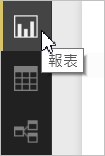

# 建立為 Power BI 手機應用程式最佳化的報表
當您[在 Power BI Desktop 中建立報表](desktop-report-view.md)時，可以建立專用於手機的報表版本，以提升在手機上行動裝置應用程式中使用的體驗。 您可以重新安排視覺效果或調整其大小，也不必全部納入，藉由對手機改造報表獲得最佳體驗。 您還可以建立[回應式視覺效果](#optimize-a-visual-for-any-size)和[回應式交叉分析篩選器](#enhance-slicers-to-to-work-well-in-phone-reports)，以適當調整大小，供您在手機上檢視。 此外，如果您將篩選新增至報表，這些篩選會自動顯示在電話報表中。 您的報表讀者可以看到它們並使用它們來篩選報表。

## 在 Power BI Desktop 中針對手機配置報表頁面
當您[在 Power BI Desktop 中建立報表](desktop-report-view.md)後，即可針對手機加以最佳化。

1. 在 Power BI Desktop 中選取左側導覽列中的 [報表檢視]。
   
    
2. 在 [檢視] 索引標籤上，選取 [手機版面配置]。  
   
    
   
    您會看到空白的手機畫布。 原始報表的所有視覺效果均列於右側 [視覺效果] 窗格中。
3. 若要將視覺效果新增至手機版面配置，請將其從 [視覺效果] 窗格拖曳至手機畫布。
   
    手機報表使用方格版面配置。 當您將視覺效果拖曳至手機畫布時，它們會貼齊該方格。
   
    
   
    您可以將部分或所有主要報表頁面的視覺效果新增至手機報表頁面。 每個視覺效果只能各新增一次。
4. 您可以在方格調整視覺效果的大小，方法如同儀表板及行動儀表板上的磚。
   
   > [!NOTE]
   > 手機報表方格會隨不同大小的手機縮放，因此您的報表在小螢幕及大螢幕手機上都很適合。
   > 
   > 
   
   

## 為任何大小將視覺效果最佳化
您可以將儀表板或報表中的視覺效果設定為「回應式」，不管是什麼樣的螢幕大小，都能以動態方式變更，顯示最多的資料與深入解析。 

視覺效果的大小變更時，Power BI 會排定資料檢視的優先順序，例如自動移除邊框，並將圖例移至視覺效果頂部，如此一來即使視覺效果變小，也能充分表達資訊。

您可以選擇是否要開啟各個視覺效果的回應能力。 請參閱[最佳化視覺效果](desktop-create-responsive-visuals.md)。

## 建立手機報表版面配置的注意事項
* 若是多頁報表，您可以將所有頁面最佳化，也可以只對幾頁執行。 
* 如已定義報表頁面的背景色彩，則手機報表就會有相同的背景色彩。
* 不能只對手機修改格式設定。 格式設定在主要及手機版面配置上是一致的。 例如，字型大小會相同。
* 若要變更視覺效果，例如變更其格式設定、資料集或其他任何屬性，請回到一般報表撰寫模式。
* Power BI 會在行動裝置應用程式中，為手機報表提供預設標題與頁面名稱。 如果您已在報表中建立標題及頁面名稱的文字視覺效果，請考慮不要將其新增至您的手機報表。     

## 從手機版面配置移除視覺效果
* 若要移除視覺效果，請按一下手機畫布上視覺效果右上角的 X，或加以選取後按 [刪除]。
  
   移除此處的視覺效果僅會將其自手機版面配置畫布移除。 而視覺效果與原始報表則不會受到影響。
  
   

## 增強交叉分析篩選器使其在行動報表中正常運作
交叉分析篩選器提供在畫布上篩選報表資料的功能。 在一般報表撰寫模式下設計交叉分析篩選器時，您可以修改部分交叉分析篩選器設定，使其更適用於手機報表：

* 決定報表讀者只能選取一個項目或可以選取多個項目。
* 在交叉分析篩選器周圍加上方塊，讓報表更容易掃描。
* 將交叉分析篩選器設為垂直、水平或回應式。 

如果您將交叉分析篩選器設為回應式，則在變更其大小和形狀時會顯示較多或較少選項。 它可以是高、短、寬或窄。 如果您將它設得夠小，則它只會變成報表頁面上的篩選圖示。 

深入了解如何[建立回應式交叉分析篩選器](power-bi-slicer-filter-responsive.md)。

## 發行手機報表
* 若要發行手機版的報表，請[從 Power BI Desktop 將主要報表發行至 Power BI 服務](desktop-upload-desktop-files.md)，手機版即同時發行。
  
    深入了解 [Power BI 中的共用與權限](service-how-to-collaborate-distribute-dashboards-reports.md)。

## 在手機上檢視最佳化及未最佳化的報表
在手機上的行動裝置應用程式中，Power BI 會自動偵測最佳化及未最佳化的手機報表。 如果有已為手機最佳化的報表，Power BI 手機應用程式會自動以手機報表模式開啟該報表。

如果沒有已為手機最佳化的報表，報表則會以未經過最佳化的橫向檢視開啟。  

使用手機報表時，若將手機橫放，無論報表是否已經過最佳化，都會在未經過最佳化的檢視中，以原始報表版面配置開啟報表。

如果您只將部分頁面最佳化，讀者會在縱向檢視中看到訊息指出報表可以橫向呈現。

報表讀者可以將手機側邊轉向，以橫向模式查看頁面。 深入了解[與為手機最佳化的報表互動](mobile-apps-view-phone-report.md)。

## 後續步驟
* [在 Power BI 中建立儀表板的手機檢視](service-create-dashboard-mobile-phone-view.md)
* [檢視為手機最佳化的 Power BI 報表](mobile-apps-view-phone-report.md)
* [建立適用於任何大小的回應式視覺效果](desktop-create-responsive-visuals.md)
* 有其他問題嗎？ [嘗試在 Power BI 社群提問](http://community.powerbi.com/)

