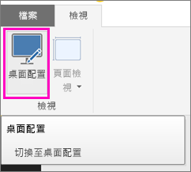
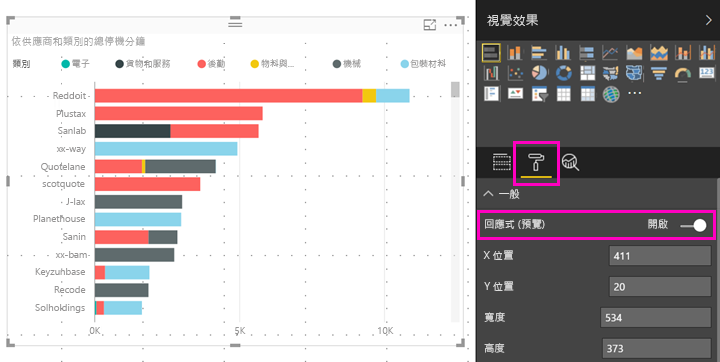

# 針對任何大小最佳化 Power BI 視覺效果
根據預設，當您建立新的報表，視覺效果為「回應式」：不管是什麼樣的螢幕大小，都能以動態方式變更，顯示最多的資料與見解。 對於較舊的報表，您可以設定其視覺效果以動態方式調整大小。

視覺效果的大小變更時，Power BI 會排定資料檢視的優先順序，例如自動移除邊框，並將圖例移至視覺效果頂部，如此一來即使視覺效果變小，也能充分表達資訊。 對於手機上 Power BI 行動應用程式中的視覺效果而言，回應能力特別實用。

任何使用 X 和 Y 軸的視覺效果及交叉分析篩選器都可回應式調整大小。

## 在 Power BI Desktop 中開啟回應能力
1. 在 Power BI Desktop 舊版報表中的 [檢視] 索引標籤上，確定您是在 [桌面配置] 中。
   
    
2. 選取視覺效果，然後在 [視覺效果] 窗格中選取 [格式] 部分。
3. 展開 [一般] > 將 [回應式] 切換為 [開啟]。
   
    
   
     現在，當您[建立已為手機最佳化的報表](desktop-create-phone-report.md)並新增此視覺效果時，它就會適當調整大小。

## 在 Power BI 服務中開啟回應能力
您可以在 Power BI 服務中，開啟舊版報表視覺效果的回應能力。 您必須能夠編輯報表。

1. 在 Power BI 服務的報表中 ([https://powerbi.com](https://powerbi.com))，選取 [編輯報表]。
2. 選取視覺效果，然後在 [視覺效果] 窗格中選取 [格式] 部分。
3. 展開 [一般] > 將 [回應式] 切換為 [開啟]。
   
    
   
     現在，當您[建立此報表的手機檢視](desktop-create-phone-report.md)並新增此視覺效果時，它就會適當調整大小。

## 後續步驟
* [建立為 Power BI 手機應用程式最佳化的報表](desktop-create-phone-report.md)
* [檢視為手機最佳化的 Power BI 報表](mobile-apps-view-phone-report.md)
* 有其他問題嗎？ [嘗試在 Power BI 社群提問](http://community.powerbi.com/)

