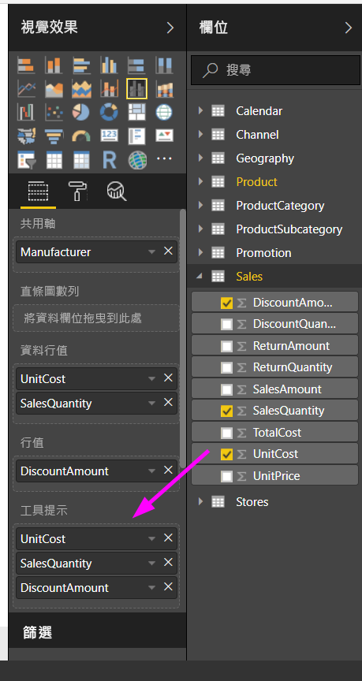
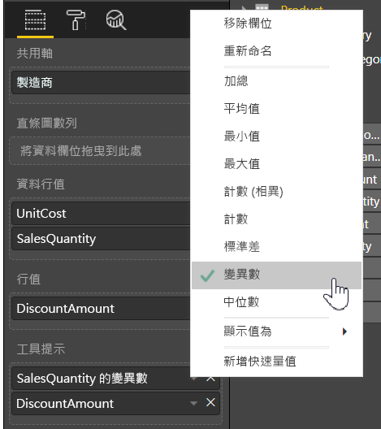

# 在 Power BI Desktop 中自訂工具提示

工具提示很適合用來為視覺效果的資料點提供更多關聯式資訊和詳細資料。 下圖顯示套用至 Power BI Desktop 中圖表的工具提示。

建立視覺效果時，預設的工具提示會顯示資料點的值與類別。 在許多情況下，自訂工具提示資訊很有用。 自訂工具提示為檢視視覺效果的使用者提供額外的上下文與資。 自訂工具提示可讓您指定額外的資料點，以當做工具提示的一部分顯示。

## 如何自訂工具提示

若要建立自訂工具提示，請在 [視覺效果]  窗格的 [欄位]  部分，將欄位拖曳到 [工具提示]  貯體，如下圖所示。 在下圖中，已將三個欄位放入 [工具提示]  貯體。

將工具提示新增到 [工具提示]  之後，當滑鼠暫留在視覺效果的資料點上時，就會顯示這些欄位的值。

## 使用彙總或快速量值來自訂工具提示

您可以透過選取彙總函式或「快速量值」  ，進一步自訂工具提示。 選取 [工具提示]  貯體中欄位旁邊的箭號。 然後，從可用選項中選取項目。

您可以使用資料集中任何可用的欄位，透過許多方式自訂 [工具提示]，以便將資訊與見解快速傳遞給檢視儀表板或報表的使用者。
