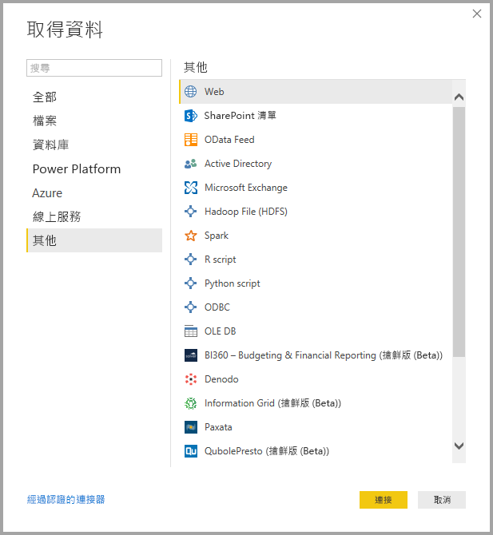
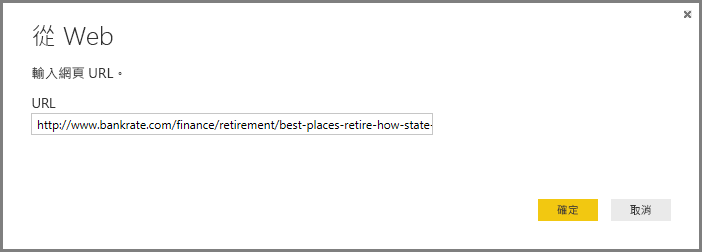
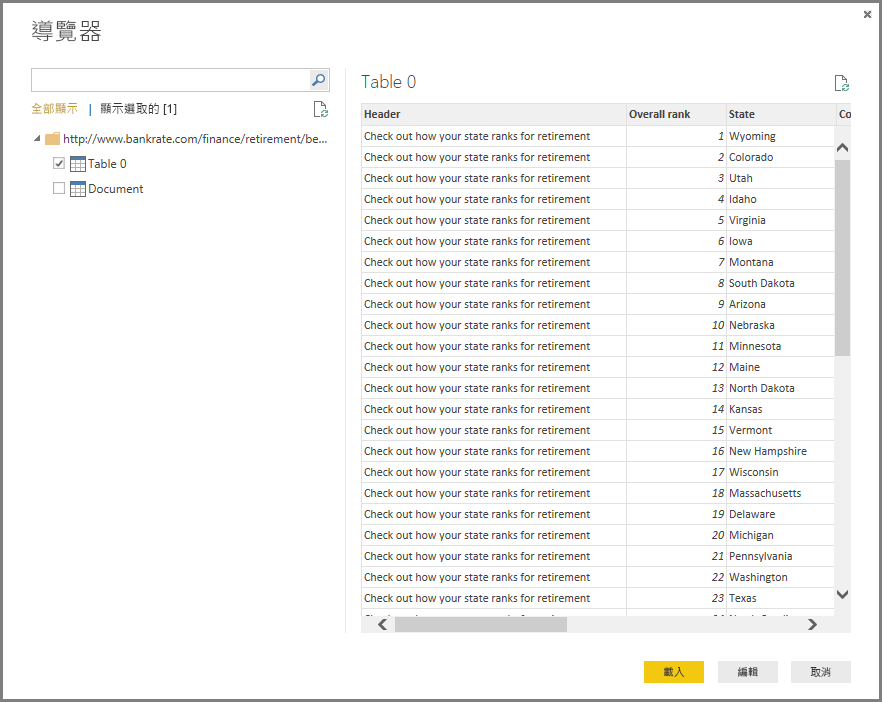

# <a name="data-sources-in-power-bi-desktop"></a>Power BI Desktop 中的資料來源
有了 Power BI Desktop，您可以從許多不同來源連接至資料。 在此頁面底部有可用資料來源的完整清單。

若要連接到資料，請從 [主資料夾]  功能區選取 [取得資料]  。 選取向下箭號，或按鈕上的 [取得資料]  文字，會顯示 [最常見]  資料類型功能表，如下圖所示：


選取 [其他...]  ， 該選項來自 [最常見]  功能表，如此即會顯示 [取得資料]  視窗。 您也可以藉由直接選取 [取得資料]  **圖示按鈕**，叫出 [取得資料]  視窗 (並略過 [最常見]  功能表)。

![[取得資料] 按鈕](media/desktop-data-sources/data-sources-02.png)

> [!NOTE]
> Power BI 小組會持續將可用的資料來源擴充到 **Power BI Desktop** 和 **Power BI 服務**。 因此，您經常會看到舊版工作進行中的資料來源標示為 *Beta* 或「預覽」  。 任何標示為 *Beta* 或「預覽」  的資料來源，受到的支援和功能都有限制，不應該用在生產環境。 

> 此外，任何為 **Power BI Desktop** 標記為「搶鮮版 (Beta)」  或「預覽」  的資料來源都無法在正式推出 (GA) 前於 **Power BI 服務**或其他 Microsoft 服務中使用。

## <a name="data-sources"></a>資料來源
資料類型會組織成下列類別：

* 全部
* 檔案
* 資料庫
* Power BI
* Azure
* 線上服務
* 其他

[全部]  類別包含所有類別的所有資料連線類型。

[檔案]  類別提供下列資料連線：

* Excel
* Text/CSV
* XML
* JSON
* 資料夾
* PDF
* SharePoint 資料夾

下圖顯示 [檔案]  的 [取得資料]  視窗。

![[取得資料] > [檔案]](media/desktop-data-sources/data-sources-03.png)

[資料庫]  類別提供下列資料連線：

* SQL Server 資料庫
* Access 資料庫
* SQL Server Analysis Services 資料庫
* Oracle 資料庫
* IBM DB2 資料庫
* IBM Informix 資料庫 (搶鮮版 (Beta))
* IBM Netezza
* MySQL 資料庫
* PostgreSQL 資料庫
* Sybase 資料庫
* Teradata
* SAP HANA 資料庫
* SAP Business Warehouse 應用程式伺服器
* SAP Business Warehouse 訊息伺服器
* Amazon Redshift
* Impala
* Google BigQuery
* Vertica
* Snowflake
* Essbase
* AtScale cube 搶鮮版 (Beta)
* BI 連接器
* Dremio
* Exasol
* Indexima (搶鮮版 (Beta))
* InterSystems IRIS (搶鮮版 (Beta))
* Jethro (搶鮮版 (Beta))
* Kyligence Enterprise (搶鮮版 (Beta))
* MarkLogic 搶鮮版 (Beta)

> [!NOTE]
> 某些資料庫連接器的啟用方式為選取 **[檔案] > [選項和設定] > [選項]** ，然後選取 [預覽功能]  並啟用該連接器。 如果您沒有看到上述連接器，但想要加以使用，請檢查您的 [預覽功能]  設定。 亦請注意，任何標示為 *Beta* 或「預覽」  的資料來源，受到的支援和功能都有限制，不應該用在生產環境。

下圖顯示 [資料庫]  的 [取得資料]  視窗。

![[取得資料] > [資料庫]](media/desktop-data-sources/data-sources-04.png)

**Power Platform** 類別提供下列資料連線：

* Power BI 資料集
* Power BI 資料流程
* Common Data Service
* Power Platform 資料流程 (搶鮮版 (Beta))

下圖顯示 **Power Platform** 的 [取得資料]  視窗。

![[取得資料] > [Power BI]](media/desktop-data-sources/data-sources-05.png)

[Azure]  類別提供下列資料連線：

* Azure SQL Database
* Azure SQL 資料倉儲
* Azure Analysis Services 資料庫
* Azure Blob 儲存體
* Azure 表格儲存體
* Azure Cosmos DB
* Azure Data Lake Storage Gen2 (搶鮮版 (Beta))
* Azure Data Lake Storage Gen1
* Azure HDInsight (HDFS)
* Azure HDInsight Spark
* HDInsight 互動式查詢
* Azure 資料總管 (Kusto)
* Azure 成本管理 (搶鮮版 (Beta))

下圖顯示 [Azure]  的 [取得資料]  視窗。

![[取得資料] > [Azure]](media/desktop-data-sources/data-sources-06.png)

[線上服務]  類別提供下列資料連線：

* SharePoint Online 清單
* Microsoft Exchange Online
* Dynamics 365 (線上)
* Dynamics NAV
* Microsoft Dynamics 365 Business Central
* Dynamics 365 Business Central (內部部署)
* Microsoft Azure 使用量見解 (搶鮮版 (Beta))
* Azure DevOps (Beta)
* Azure DevOps Server (Beta)
* Salesforce 物件
* Salesforce 報表
* Google Analytics
* Adobe Analytics
* appFigures (搶鮮版 (Beta))
* Data.World - 取得資料集 (搶鮮版 (Beta))
* Facebook
* GitHub (Beta)
* MailChimp (Beta)
* Merketo (Beta)
* Mixpanel (搶鮮版 (Beta))
* Planview Enterprise One - PRM (搶鮮版 (Beta))
* Planview Projectplace (搶鮮版 (Beta))
* QuickBooks Online (搶鮮版 (Beta))
* Smartsheet
* SparkPost (搶鮮版 (Beta))
* Stripe (搶鮮版 (Beta))
* SweetIQ (搶鮮版 (Beta))
* Planview Enterprise One - CMT (搶鮮版 (Beta))
* Twilio (搶鮮版 (Beta))
* tyGraph (Beta)
* Webtrends (Beta)
* Zendesk (搶鮮版 (Beta))
* Dynamics 365 Customer Insights (搶鮮版 (Beta))
* Emigo 資料來源 搶鮮版 (Beta)
* Entersoft 商務套件 (搶鮮版 (Beta))
* 企業 App Store
* Intune 資料倉儲 (搶鮮版 (Beta))
* Microsoft Graph 安全性 搶鮮版 (Beta)
* Quick Base
* TeamDesk (搶鮮版 (Beta))


下圖顯示 [線上服務]  的 [取得資料]  視窗。

![[取得資料] > [線上服務]](media/desktop-data-sources/data-sources-07.png)

[其他]  類別提供下列資料連線：

* Web
* SharePoint 清單
* OData 摘要
* Active Directory
* Microsoft Exchange
* Hadoop 檔案 (HDFS)
* Spark
* R Script
* Python 指令碼
* ODBC
* OLE DB
* BI360 - Budgeting & Financial Reporting (搶鮮版 (Beta))
* Denodo
* Information Grid (搶鮮版 (Beta))
* Paxata 
* QubolePresto (搶鮮版 (Beta))
* Roamler (搶鮮版 (Beta))
* SurveyMonkey 搶鮮版 (Beta)
* Tenforce (Smart)List (搶鮮版 (Beta))
* Workforce Dimensions (搶鮮版 (Beta))
* 空白查詢

下圖顯示 [其他]  的 [取得資料]  視窗。

![[取得資料] > [其他]](media/desktop-data-sources/data-sources-08.png)

> [!NOTE]
> 目前無法連線至使用 Azure Active Directory 保護的自訂資料來源。

## <a name="connecting-to-a-data-source"></a>連接到資料來源
若要連接至資料來源，請從 [取得資料]  視窗選取資料來源，然後選取 [連接]  。 在下圖中，從 [其他]  資料連線類別選取了 [Web]  。



隨即會顯示資料連線類型特有的連線視窗。 如果需要認證，將提示您提供它們。 下圖顯示輸入 URL 以連接到 Web 資料來源。



輸入 URL 或資源連線資訊之後，請選取 [確定]  。 Power BI Desktop 會建立資料來源的連線，並在 [導覽器]  中呈現可用的資料來源。



您可以選取 [導覽器]  窗格底部的 [載入]  按鈕來載入資料，或是選取 [編輯]  按鈕，在載入資料之前先編輯查詢。

這就是連接到 Power BI Desktop 中資料來源的全部資訊！ 嘗試連接到我們持續增加的資料來源，並經常回來查看，我們隨時會增加新的來源。

## <a name="using-pbids-files-to-get-data"></a>使用 PBIDS 檔案來取得資料

PBIDS 檔案是具有特定結構的 Power BI Desktop 檔案，而且具有 .PBIDS 副檔名，以識別它是 Power BI 資料來源檔案。

您可以建立 .PBIDS 檔案以簡化組織中報表建立者的**取得資料**體驗。 建議系統管理員為常用的連線建立這些檔案，以促使新的報表作者使用 PBIDS 檔案。 

當作者開啟 .PBIDS 檔案時，Power BI Desktop 會開啟並提示使用者提供認證來進行驗證，並連線到檔案中指定的資料來源。 [瀏覽] 對話方塊隨即出現，而且使用者必須從該資料來源選取要載入至模型的資料表。 使用者可能也需要選取資料庫 (如果未在 .PBIDS 檔案中指定的話)。 

之後，使用者可以開始建置視覺效果，或重新瀏覽 [最近的來源]  以將一組新的資料表載入模型中。 

目前 .PBIDS 檔案只支援一個檔案中的單一資料來源。 指定一個以上的資料來源會導致錯誤。 

若要建立 .PBIDS 檔案，系統管理員必須指定單一連線的必要輸入，而且可以指定連線模式 (**DirectQuery** 或**匯入**)。 若檔案中缺少 **mode** 或為 Null，則會提示在 Power BI Desktop 中開啟檔案的使用者選取 [DirectQuery] 或 [匯入]。 

### <a name="pbids-file-examples"></a>PBIDS 檔案範例

此節提供一些來自常用資料來源的範例。 .PBIDS 檔案類型只支援 Power BI Desktop 中也支援的資料連線，但有兩個例外：Live Connect 與空白查詢。 

.PBIDS 檔案不  包含驗證資訊與資料表和結構描述資訊。  

下面是數個常見的 .PBIDS 檔案範例，但它們並不完整。 針對其他資料來源，您可以參考[資料來源參考 (DSR) 格式，以取得通訊協定和位址資訊 ](https://docs.microsoft.com/azure/data-catalog/data-catalog-dsr#data-source-reference-specification) \(部分機器翻譯\)。

這些範例只是為了方便起見，它們並不完整，而且不包含 DSR 格式的所有支援連接器。 系統管理員或組織可以使用這些範例作為指南來建立自己的資料來源，他們可以在其中建立及支援自己 的資料來源檔案。 


**Azure AS**
```
{ 
    "version": "0.1", 
    "connections": [ 
    { 
        "details": { 
        "protocol": "analysis-services", 
        "address": { 
            "server": "server-here" 
        }, 
        } 
    } 
    ] 
}
```


 

**資料夾**
```
{ 
  "version": "0.1", 
  "connections": [ 
    { 
      "details": { 
        "protocol": "folder", 
        "address": { 
            "path": "folder-path-here" 
        } 
      } 
    } 
  ] 
} 
```

**OData**
```
{ 
  "version": "0.1", 
  "connections": [ 
    { 
      "details": { 
        "protocol": "odata", 
        "address": { 
            "url": "URL-here" 
        } 
      } 
    } 
  ] 
} 
```
 
**SAP BW**
```
{ 
  "version": "0.1", 
  "connections": [ 
    { 
      "details": { 
        "protocol": "sap-bw-olap", 
        "address": { 
          "server": "server-name-here", 
          "systemNumber": "system-number-here", 
          "clientId": "client-id-here" 
        }, 
      } 
    } 
  ] 
} 
```
 
**SAP Hana**
```
{ 
  "version": "0.1", 
  "connections": [ 
    { 
      "details": { 
        "protocol": "sap-hana-sql", 
        "address": { 
          "server": "server-name-here:port-here" 
        }, 
      } 
    } 
  ] 
} 
```

**SharePoint 清單**

URL 必須指向 SharePoint 網站本身，而不是網站內的清單。 使用者會取得一個導覽器，讓他們能夠從該網站選取一或多個清單，其中每個都成為模型中的資料表。 
```
{ 
  "version": "0.1", 
  "connections": [ 
    { 
      "details": { 
        "protocol": "sharepoint-list", 
        "address": { 
          "url": "URL-here" 
        }, 
       } 
    } 
  ] 
} 
```
 
 
**SQL Server**
```
{ 
  "version": "0.1", 
  "connections": [ 
    { 
      "details": { 
        "protocol": "tds", 
        "address": { 
          "server": "server-name-here", 
          "database": "db-name-here (optional) "
        } 
      }, 
      "options": {}, 
      "mode": "DirectQuery" 
    } 
  ] 
} 
```
 

**文字檔**
```
{ 
  "version": "0.1", 
  "connections": [ 
    { 
      "details": { 
        "protocol": "file", 
        "address": { 
            "path": "path-here" 
        } 
      } 
    } 
  ] 
} 
```
 

**Web**
```
{ 
  "version": "0.1", 
  "connections": [ 
    { 
      "details": { 
        "protocol": "http", 
        "address": { 
            "url": "URL-here" 
        } 
      } 
    } 
  ] 
} 
```
 

**資料流程**
```
{
  "version": "0.1",
  "connections": [
    {
      "details": {
        "protocol": "powerbi-dataflows",
        "address": {
          "workspace":"workspace id (Guid)",
          "dataflow":"optional dataflow id (Guid)",
          "entity":"optional entity name"
        }
       }
    }
  ]
}
```


## <a name="next-steps"></a>後續步驟
您可以使用 Power BI Desktop 執行各種作業。 如需有關其功能的詳細資訊，請參閱下列資源：

* [Power BI Desktop 是什麼？](desktop-what-is-desktop.md)
* [Power BI Desktop 的查詢概觀](desktop-query-overview.md)
* [Power BI Desktop 中的資料類型](desktop-data-types.md)
* [使用 Power BI Desktop 合併資料並使其成形](desktop-shape-and-combine-data.md)
* [Power BI Desktop 中的常見查詢工作](desktop-common-query-tasks.md)    
