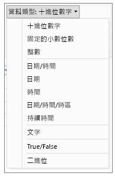
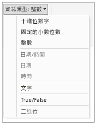

# Power BI Desktop 中的資料類型
本文描述 Power BI Desktop 與資料分析運算式 (DAX) 支援的資料類型。 

當您將資料載入 Power BI Desktop 時，它會嘗試將來源資料行的資料類型轉換成比較能夠支援更有效率的儲存、計算和資料視覺效果的資料類型。 例如，如果您從 Excel 匯入的資料行值沒有小數值，Power BI Desktop 會將整個資料行轉換成比較適合儲存整數的 [整數] 資料類型。

由於某些 DAX 函式具有特殊的資料類型需求，所以這個觀念很重要。 在多數情況下，DAX 會為您隱含地轉換資料類型，但在某些情況下則不會。  例如，如果 DAX 函數需要 [日期] 資料類型，但您資料行的資料類型為 [文字]，DAX 函數將無法正常運作。  因此，為資料行取得正確的資料類型既重要又實用。 本文稍後將說明隱含轉換。

## 判斷及指定資料行的資料類型
在 Power BI Desktop 中，您可以判斷及指定 [查詢編輯器]、[資料檢視] 或 [報表檢視] 中之資料行的資料類型：

**查詢編輯器中的資料類型**

**資料檢視或報表檢視中的資料類型**

[查詢編輯器] 的 [資料類型] 下拉式清單目前有兩種資料類型不在 [資料檢視] 或 [報表檢視] 中：[日期/時間/時區]  和 [持續時間] 。 當您將具有這些資料類型的資料行載入模型，再於 [資料檢視] 或 [報表檢視] 中進行檢視時，具有 [日期/時間/時區] 資料類型的資料行會轉換成 [日期/時間]，而具有 [持續時間] 資料類型的資料行則會轉換成 [十進位數字]。

### 數字類型
Power BI Desktop 支援三種數字類型：

**十進位數字** - 代表 64 位元 (8 位元組) 浮點數。 它是最常見的數字類型，也是您通常認定的數字類型。  雖然其設計是為了處理帶小數值的數字，但也可以處理整數。  [十進位數字] 類型可以處理  -1.79E +308 到 -2.23E -308 的負值、0，以及 2.23E -308 到 1.79E + 308 的正值。 例如，34、34.01 和 34.000367063 等數字都是有效的十進位數字。 [十進位數字] 類型可以表示的最大值長度為 15 位數。  小數分隔符號可出現在數字中的任何位置。 [十進位數字] 類型與 Excel 儲存其數字的方式相對應。

**固定十進位數字** - 小數分隔符號的位置固定。 小數分隔符號右邊一律為 4 位數，並允許 19 位數的有效位數。  它可以表示的最大值為 922,337,203,685,477.5807 (正值或負值)。  [固定十進位數字] 類型在進位可能導致誤差的情況下會很有用。  當您處理其小數值很小的許多數字時，有時候累積起來會使得數字有些誤差。  由於在 [固定十進位數字] 類型中，超過小數分隔符號右邊 4 位數的值會遭到截斷，因此可協助您避免這類錯誤。   如果您熟悉 SQL Server，這種資料類型與 SQL Server 的 Decimal(19,4) 或 Power Pivot 中的 [貨幣資料] 類型相對應。 

**整數** - 代表 64 位元 (8 位元組) 整數值。 由於它是一個整數，因此右邊沒有小數位數。 它允許 19 位數；介於 -9,223,372,036,854,775,808 (-2^63) 到 9,223,372,036,854,775,807 (2^63-1) 之間的正整數或負整數。  它可以代表各種數值資料類型的最大可能數字。  如同 [固定十進位數字] 類型，[整數] 類型在需要控制進位的情況下會很有用。 

### 日期/時間類型
Power BI Desktop 支援 [查詢檢視] 中的五種 [日期/時間] 資料類型，以及 [報表檢視] 和模型中的三種資料類型。   [日期/時間/時區] 和 [持續時間] 會在載入模型期間進行轉換。

**日期/時間** - 代表日期和時間值。  基本上，[日期/時間] 值會儲存為 [十進位數字] 類型。  因此，您實際上可以在這兩種類型之間進行轉換。   日期的時間部分會儲存為整數的小數 1/300 秒 (3.33 毫秒)。  支援介於 1900 到 9999 年之間的日期。

**日期** - 只代表日期 (沒有時間部分)。  轉換成模型時，[日期] 等同於小數值為零的 [日期/時間] 值。

**時間** - 只代表時間 (沒有日期部分)。  轉換成模型時，[時間] 值等同於小數位數左邊沒有位數的 [日期/時間] 值。

**日期/時間/時區** - 代表 UTC 日期/時間。  目前，當載入模型時，它會轉換成 [日期/時間]。

**持續時間** - 代表時間長度。 當載入模型時，它會轉換成 [十進位數字] 類型。  以 [十進位數字] 類型表示時，可從 [日期/時間] 欄位進行加減以得到正確的結果。  以 [十進位數字] 類型表示時，您可以輕鬆地用於視覺效果以顯示大小。

### 文字類型
**文字** - Unicode 字元資料字串。 可以是字串或數字，或以文字格式表示的日期。 最大字串長度為 268,435,456 個 Unicode 字元 (2.56 億個字元) 或 536,870,912 個位元組。

### True/False 類型
**True/False** - True 或 False 布林值。

### 空白/Null 類型
**空白** - 這是 DAX 中表示和取代 SQL Null 的資料類型。 您可以使用 [BLANK](http://msdn.microsoft.com/library/ee634820.aspx) 函數來建立空白，並使用 [ISBLANK](https://msdn.microsoft.com/library/ee634204.aspx) 邏輯函數來測試空白。

### 資料表資料類型
DAX 會在許多函數中使用資料表資料類型，例如彙總與時間智慧計算。 某些函數需要資料表的參考，其他函數則會傳回之後可當做其他函數輸入使用的資料表。 在需要資料表當做輸入的部分函數中，您可以指定評估為資料表的運算式；對於某些函數，則需要基底資料表的參考。 如需特定函數需求的相關資訊，請參閱 [DAX 函數參考](https://msdn.microsoft.com/library/ee634396.aspx).

## DAX 公式中隱含與明確的資料類型轉換
每個 DAX 函數對於當做輸入與輸出使用之資料的類型都有特定需求。 例如，某些函數需要整數做為部分引數並需要日期做為其他引數，其他函數則需要文字或資料表。

如果您指定為引數之資料行中的資料與函數所需的資料類型不相容，在多數情況下，DAX 會傳回錯誤。 不過，可能的話，DAX 會嘗試將資料隱含地轉換成所需的資料類型。 例如：

* 您可以將日期輸入為字串，而且 DAX 將會剖析字串並嘗試將其轉換成其中一種 Windows 日期和時間格式。
* 您可以相加 TRUE + 1 然後得到結果 2，因為 TRUE 會隱含地轉換成數字 1 並執行 1+1 的運算。
* 如果您將兩個資料行中的值相加，且其中一個值恰巧以文字表示 ("12")，而另一個值以數字表示 (12)，DAX 就會將字串隱含地轉換成數字，然後執行加法以得到數值結果。 下列運算式會傳回 44: = "22" + 22。
* 如果您嘗試串連兩個數字，Excel 就會將它們呈現為字串，然後再進行串連。 下列運算式會傳回 "1234": = 12 & 34。

### 隱含資料轉換的資料表
所執行的轉換類型取決於運算子，運算子會在執行要求的運算前，轉換所需的值。 這些資料表會列出運算子，並在資料類型與相交之資料列的資料類型配對時，指出針對資料行中的每個資料類型所執行的轉換。

> [!NOTE]
>  [文字] 資料類型不包含在這些資料表中。 當數字以文字格式表示時，在某些情況下，Power BI 會嘗試判斷數字類型，並以數字表示該類型。
> 
> 

**加 (+)**

| 運算子 (+) | INTEGER | CURRENCY | REAL | 日期/時間 |
| --- | --- | --- | --- | --- |
| INTEGER |INTEGER |CURRENCY |REAL |日期/時間 |
| CURRENCY |CURRENCY |CURRENCY |REAL |日期/時間 |
| REAL |REAL |REAL |REAL |日期/時間 |
| 日期/時間 |日期/時間 |日期/時間 |日期/時間 |日期/時間 |

例如，如果在加法運算中使用實數搭配貨幣資料，兩個值都會轉換為 REAL，因此傳回的結果為 REAL

**減 (-)**

在下表中，資料列標頭是被減數 (左側)，而資料行標頭則是減數 (右側)。

| 運算子 (-) | INTEGER | CURRENCY | REAL | 日期/時間 |
| --- | --- | --- | --- | --- |
| INTEGER |INTEGER |CURRENCY |REAL |REAL |
| CURRENCY |CURRENCY |CURRENCY |REAL |REAL |
| REAL |REAL |REAL |REAL |REAL |
| 日期/時間 |日期/時間 |日期/時間 |日期/時間 |日期/時間 |

例如，如果在減法運算中使用日期搭配其他任何資料類型，兩個值都會轉換成日期，因此傳回值也是日期。

> [!NOTE]
>    資料模型也支援一元運算子 - (負值)，但是這個運算子不會變更運算元的資料類型。
> 
> 

**乘 (*)**

| 運算子 (*) | INTEGER | CURRENCY | REAL | 日期/時間 |
| --- | --- | --- | --- | --- |
| INTEGER |INTEGER |CURRENCY |REAL |INTEGER |
| CURRENCY |CURRENCY |REAL |CURRENCY |CURRENCY |
| REAL |REAL |CURRENCY |REAL |REAL |

例如，如果在乘法運算中結合整數與實數，兩個數字都會轉換為實數，因此傳回值也是 REAL。

**除 (/)**

在下表中，資料列標頭是分子，而資料行標頭則是分母。

| 運算子 (/) (資料列/資料行) | INTEGER | CURRENCY | REAL | 日期/時間 |
| --- | --- | --- | --- | --- |
| INTEGER |REAL |CURRENCY |REAL |REAL |
| CURRENCY |CURRENCY |REAL |CURRENCY |REAL |
| REAL |REAL |REAL |REAL |REAL |
| 日期/時間 |REAL |REAL |REAL |REAL |

例如，如果在除法運算中結合整數與貨幣值，兩個值都會轉換為實數，因此結果也是實數。

### 比較運算子
在比較運算式中，布林值會視為大於字串值，而字串值則視為大於數值或日期/時間值；數值與日期/時間值視為擁有相同的等級。 無論布林值或字串值都不會執行隱含轉換；BLANK 或空白值將視其他比較值的資料類型而定，可能轉換為 0/""/false。

下列 DAX 運算式說明這項行為：

=IF(FALSE()\>"true","Expression is true", "Expression is false")，傳回 "Expression is true"

=IF("12"\>12,"Expression is true", "Expression is false")，傳回 "Expression is true"

=IF("12"=12,"Expression is true", "Expression is false")，傳回 "Expression is false"

針對數值或日期/時間類型所執行的隱含轉換如下表所述：

| 比較運算子 | INTEGER | CURRENCY | REAL | 日期/時間 |
| --- | --- | --- | --- | --- |
| INTEGER |INTEGER |CURRENCY |REAL |REAL |
| CURRENCY |CURRENCY |CURRENCY |REAL |REAL |
| REAL |REAL |REAL |REAL |REAL |
| 日期/時間 |REAL |REAL |REAL |日期/時間 |

### 空白、空字串與零值的處理
在 DAX 中，Null、空白值、空白資料格或遺漏值全都是以相同的新值類型 BLANK 表示。 您也可以使用 BLANK 函數來產生空白，或使用 ISBLANK 函數來測試空白。

空白在運算中的處理方式 (例如加法或串連) 取決於個別的函數。 下表摘要說明 DAX 與 Microsoft Excel 公式中空白處理方式之間的差異。

| 運算式 | DAX | Excel |
| --- | --- | --- |
| BLANK + BLANK |BLANK |0 (零) |
| BLANK + 5 |5 |5 |
| BLANK * 5 |BLANK |0 (零) |
| 5/BLANK |無限 |錯誤 |
| 0/BLANK |NaN |錯誤 |
| BLANK/BLANK |BLANK |錯誤 |
| FALSE OR BLANK |FALSE |FALSE |
| FALSE AND BLANK |FALSE |FALSE |
| TRUE OR BLANK |TRUE |TRUE |
| TRUE AND BLANK |FALSE |TRUE |
| BLANK OR BLANK |BLANK |錯誤 |
| BLANK AND BLANK |BLANK |錯誤 |

