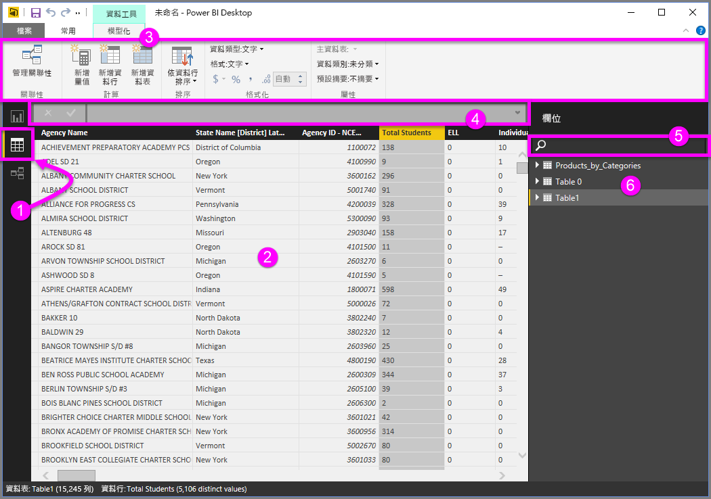

# Power BI Desktop 中的資料檢視
[資料檢視] 可協助您檢查、瀏覽及了解 Power BI Desktop 模型中的資料。 它與您在 [查詢編輯器] 中檢視資料表、資料行和資料的方式不同。 在 [資料檢視] 中，您所看到的資料是載入模型「之後」  的樣子。

當您建立資料模型時，有時會想要在報表畫布上沒有建立視覺效果的情況下，查看資料表或資料行中的實際內容，通常會查看到資料列層級。 特別是當您要建立量值和導出資料行，或需要識別資料類型或資料類別時。

以下將進一步說明。

**1.**資料檢視圖示 - 按一下可進入 [資料檢視]。

**2.**資料格 - 顯示選取的資料表，以及其中的所有資料行和資料列。 [報表檢視] 中的隱藏資料行會呈現灰色。以滑鼠右鍵按一下資料行可取得相關選項。

**3.**模型化功能區 - 管理關聯性；建立計算；變更資料行的資料類型、格式、資料類別。

**4.**公式列 - 輸入量值和導出資料行的 DAX 公式。

**5.**搜尋 - 在模型中搜尋資料表或資料行。

**6.**欄位清單 - 選取要在資料格中檢視的資料表或資料行。

