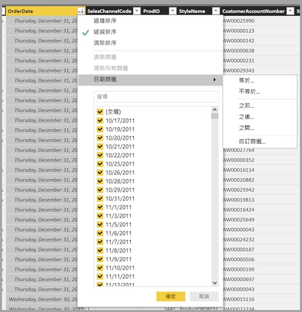

# Power BI Desktop 中的資料檢視
[資料檢視]  可協助您檢查、瀏覽及了解 **Power BI Desktop** 模型中的資料。 它與您在 [查詢編輯器]  中檢視資料表、資料行和資料的方式不同。 在 [資料檢視] 中，您所看到的資料是載入模型「之後」  的樣子。

當您建立資料模型時，有時會想要在報表畫布上沒有建立視覺效果的情況下，查看資料表或資料行中的實際內容，通常會查看到資料列層級。 特別適用於當您要建立量值和導出資料行，或需要識別資料類型或資料類別時。

讓我們探討 [資料檢視]  中找到的某些項目。

1. **資料檢視圖示** – 選取此圖示以進入 [資料檢視]。

2. **資料格** – 這會顯示選取的資料表，以及其中的所有資料行和資料列。 [報表檢視]  中隱藏的資料行會呈現灰色。您可以以滑鼠右鍵按一下資料行的選項。

3. **模型化功能區** - 在這裡您可以管理關聯性；建立計算；變更資料行的資料類型、格式、資料類別。

4. **公式列** – 輸入量值和導出資料行的 DAX 公式。

5. **搜尋** – 在模型中搜尋資料表或資料行。

6. **欄位清單** – 選取要在資料格中檢視的資料表或資料行。

## 資料檢視中的篩選

您也可以在 [資料檢視]  中篩選和排序資料。 每個資料行顯示的圖示會識別排序方向 (若已套用)。

您可以篩選個別值，或依據資料行中的資料使用進階篩選。 

> [!NOTE]
> 當 Power BI 模型在與您目前使用者介面不同的文化特性 (Culture) 中建立時 (例如以美式英文建立模型並以西班牙文檢視)，除了文字欄位以外，[資料檢視] 使用者介面中不會出現搜尋方塊。
