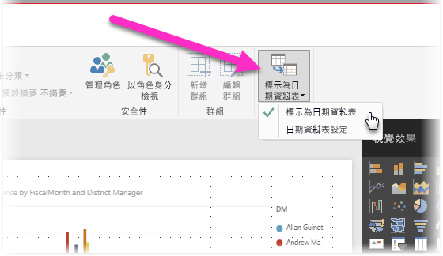
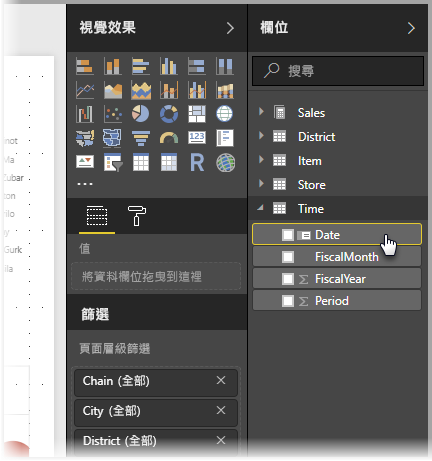
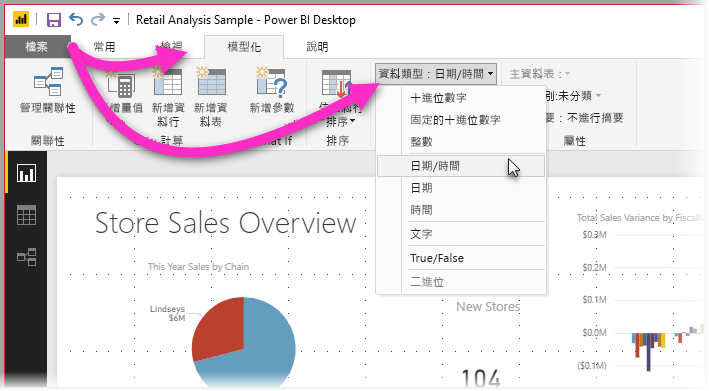

# 在 Power BI Desktop 中設定和使用日期資料表

**Power BI Desktop** 在幕後運作，可自動將資料表識別為**日期資料表**，並代表您為您的模型建立日期階層和其他啟用中繼資料。 當建立如視覺效果、資料表、快速量值、交叉分析篩選器等報告功能時，您就可接著使用那些內建階層。 Power BI Desktop 的運作方式，是代表您建立隱藏的資料表，您可以在之後針對您的報告和 DAX 運算式使用該資料表。

許多資料分析師都偏好建立自己的日期資料表，這並沒有問題。 在 **Power BI Desktop** 中，您可以指定您的模型要用來作為其**日期資料表**的資料表，並接著使用該資料表的日期資料來建立與日期相關的視覺效果、資料表、快速量值等等。 當您指定自己的日期資料表後，您可以控制模型中建立的日期階層，並將它們用於使用您模型之日期資料表的**快速量值**和其他作業中。 

## 設定您自己的日期資料表

若要設定**日期資料表**，請在 [欄位] 窗格中選取您要用來作為日期資料表的資料表，接著以滑鼠右鍵按一下該資料表，並在顯示的功能表中選取 [標記為日期資料表] > [標記為日期資料表]，如下面的影像所示。

您也可以選取資料表，然後從 [模型] 功能區選取 [標記為日期資料表]，如下所示。

當您指定您自己的**日期資料表**後，Power BI Desktop 會針對該資料行和其資料執行下列驗證，以確保其中的資料：

* 包含唯一值
* 不包含 Null 值
* 包含連續的日期值 (從開頭到結尾)
* 如果它是**日期/時間**資料類型，則每個值都有相同的時間戳記

您在兩種可能的案例中會建立您自己的日期資料表，任何一種都是合理的方法：

* 第一個案例是當您使用標準或基本日期資料表和階層時。 這是您的資料中符合先前所述之日期資料表驗證準則的資料表。 

* 第二個案例是您使用來自 Analysis Services 的資料表，例如具有您要用來作為日期資料表之 *dim date* 欄位的資料表。 

一旦您指定日期資料表後，您就可以選取該資料表中哪個資料行是日期資料行。 您可以透過在 [欄位] 窗格中選取資料表，然後以滑鼠右鍵按一下該資料表並選取 [標記為日期資料表] > [日期資料表設定]，以指定要使用的資料行。 下列視窗隨即出現，您可以在其中的下拉式方塊中選取要用來作為日期資料表的資料行。

請務必注意，當您指定自己的日期資料表時，**Power BI Desktop** 不會自動建立階層 (原本將代表您建立到模型中)。 如果您稍後取消選取自己的日期資料表 (而且不再有任何手動設定的日期資料表)，Power BI Desktop 會為您針對資料表中的日期資料行，重新建立自動建立的內建日期資料表。

另請務必注意，當您將資料表標記為日期資料表時，Power BI Desktop 建立的內建 (自動建立的) 日期資料表將會被移除，而您先前以那些內建資料表為基礎建立的任何視覺效果或 DAX 運算式將無法再正常運作。 

## 將日期資料表標記為適當的資料類型

當您指定您自己的**日期資料表**，您務必確定設定正確的資料類型。 您可以將 [資料類型] 設定為**日期/時間**或**日期**。 若要這樣做，請採取下列步驟：

1. 從 [欄位] 窗格選取您的**日期資料表** (如有需要請將它展開)，然後選取要用來作為日期的資料行。
   
     

2. 在 [模型] 索引標籤上，選取 [資料類型:]，然後按一下下拉式箭號以顯示可用的資料類型。

    

3. 為您的資料行指定資料類型。 

## 後續步驟

您可能也會對下列文章感興趣。

* [Power BI Desktop 中的資料類型](desktop-data-types.md)

 