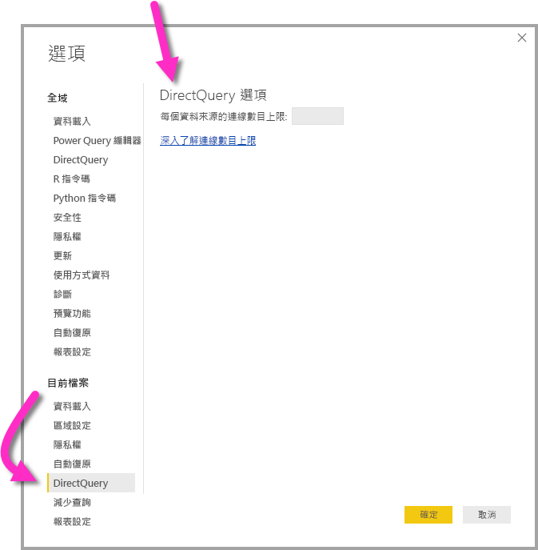

# 使用 Power BI 中的 DirectQuery
您可以在使用 **Power BI Desktop** 或 **Power BI 服務**時連接到各種不同的資料來源，且可以利用不同的方法來進行這些資料連接。 您可以將資料「匯入」  Power BI (這是取得資料的最常見方法)，或直接連接到原始來源存放庫中的資料 (也稱為 **DirectQuery**)。 本文將描述 **DirectQuery** 及其功能：

* DirectQuery 的不同連接選項
* 何時應該考慮使用 DirectQuery 而不是匯入的指引
* 使用 DirectQuery 的缺點
* 使用 DirectQuery 的最佳做法

簡單來說，使用匯入與 DirectQuery 的最佳做法如下：

* 您應該盡可能將資料**匯入** Power BI。 匯入會利用 Power BI 的高效能查詢引擎，並提供資料的高度互動和全功能體驗。
* 如果您的目標無法透過匯入資料來達成，則考慮使用 **DirectQuery**。 例如，如果資料經常變更且報表必須反映最新資料，則 DirectQuery 可能是最佳選擇。 不過，通常只有在基礎資料來源可以為一般彙總查詢提供互動式查詢 (不到 5 秒)，而且能夠處理即將產生的查詢負載時，才適合使用 DirectQuery。 此外，您應該仔細考慮使用 DirectQuery 所伴隨的限制清單。

Power BI 為這兩種連接模式 (匯入和 DirectQuery) 所提供的功能集，會隨著時間持續發展。 這包括使用匯入的資料時提供更大的彈性 (例如可在更多情況下使用匯入)，以及排除使用 DirectQuery 的一些缺點。 不論有哪些改進，使用 DirectQuery 時，基礎資料來源的效能一律是主要考量。 如果基礎資料來源緩慢，則仍不適合針對該來源使用 DirectQuery。

本文章涵蓋搭配使用 DirectQuery 和 Power BI 中，並沒有 SQL Server Analysis Services。 DirectQuery 也是 **SQL Server Analysis Services** 的功能，而且以下所述的許多詳細資料適用於此服務，不過也有重大差異。 如需搭配 SQL Server Analysis Services 使用 DirectQuery 的資訊，請參閱 [SQL Server Analysis Services 2016 DirectQuery 技術白皮書](http://download.microsoft.com/download/F/6/F/F6FBC1FC-F956-49A1-80CD-2941C3B6E417/DirectQuery%20in%20Analysis%20Services%20-%20Whitepaper.pdf)中的詳細說明。  

本文著重於在 **Power BI Desktop** 中建立報表的建議 DirectQuery 工作流程，但也會涵蓋在 **Power BI 服務**中直接連接的方式。

## Power BI 連接模式
Power BI 會連接到大量的各種資料來源，包括：

* 線上服務 (Salesforce、Dynamics 365 等)
* 資料庫 (SQL Server、Access、Amazon Redshift 等)
* 簡易檔案 (Excel、JSON 等)
* 其他資料來源 (Spark、網站、Microsoft Exchange 等)

對於這些來源，您通常可以將資料匯入 Power BI。 對於某些來源，您也可以使用 DirectQuery 來連線。 [DirectQuery 支援的資料來源](desktop-directquery-data-sources.md)一文說明支援 DirectQuery 的一組正確來源。 未來將有更多來源啟用 DirectQuery，主要是預期可提供良好互動式查詢效能的來源。

**SQL Server Analysis Services** 是特殊案例。 連接到 SQL Server Analysis Services 時，您可以選擇匯入資料，或使用「即時連接」  。  使用即時連接類似於 DirectQuery，不會匯入任何資料，而且一律會查詢基礎資料來源以重新整理視覺效果；但「即時連接」  在許多其他方面並不同，因此使用不同的術語 (「即時」  與 *DirectQuery*)。

連接資料有三個選項 (**匯入**、**DirectQuery**和**即時連接**)，下列各節將詳細說明。

### 匯入連接
在 **Power BI Desktop** 中使用 [Get Data]\(取得資料)  連接到 SQL Server 等資料來源並選擇 [匯入]  時，該連接的行為如下所示：

* 在最初的 [Get Data]\(取得資料)  體驗期間，所選取的一組資料表會各自定義一個查詢以傳回一組資料 (載入資料前可編輯這些查詢，例如套用篩選、彙總資料或聯結不同的資料表)。
* 載入時，由這些查詢定義的所有資料都將匯入 Power BI 快取。
* 在 **Power BI Desktop** 中建立視覺效果時，即會查詢匯入的資料。 Power BI 存放區可確保查詢速度很快，因此會立即反映視覺效果的所有變更。
* 基礎資料的任何變更不會反映在任何視覺效果中。 它是為了*重新整理*，但重新匯入資料。
* 將報表 (.pbix 檔) 發佈至 **Power BI 服務**時，會建立資料集並上傳至 Power BI 服務。  該資料集會包含匯入的資料。 您就可以設定排定的重新整理該資料，例如，若要重新匯入的資料每一天。 視原始資料來源的位置而定，您可能必須設定內部部署資料閘道。
* 在 **Power BI 服務**中開啟現有的報表或撰寫新的報表時，會重新查詢匯入的資料，以確保彼此互動。
* 視覺效果或整個報表頁面可以釘選為儀表板磚。 每次重新整理基礎資料集都會自動重新整理這些磚。  

### DirectQuery 連接
在 **Power BI Desktop** 中使用 [Get Data]\(取得資料)  連接到資料來源並選擇 [DirectQuery]  時，該連接的行為如下所示：

* 在最初的 [Get Data]\(取得資料)  體驗期間，已選取來源。 對於關聯式來源，這表示選取一組資料表，而每個資料表仍會定義一個查詢以邏輯方式傳回一組資料。 對於多維度來源，如 SAP BW，只會選取該來源。
* 不過，載入時，不會實際將資料匯入 Power BI 存放區。 相反地，在 **Power BI Desktop** 中建立視覺效果時，會傳送查詢至基礎資料來源以擷取必要的資料。 重新整理視覺效果所需的時間將取決於基礎資料來源的效能。
* 基礎資料的任何變更不會立即反映在任何現有的視覺效果中。 您仍然必須重新整理，此時會針對每個視覺效果重新傳送必要的查詢，並視需要更新視覺效果。
* 在發行至報表**Power BI 服務**，它一次會導致在 Power BI 服務中，與匯入相同的資料集。 不過，該資料集「不會包含任何資料」  。
* 在 **Power BI 服務**中開啟現有的報表或撰寫新的報表時，會重新查詢基礎資料來源以擷取必要的資料。 視原始資料來源的位置而定，您可能必須設定內部部署資料閘道 (如同匯入模式在重新整理資料時所需的設定)。
* 視覺效果或整個報表頁面可以釘選為儀表板磚。 為了確保快速開啟儀表板，這些磚會依排程自動重新整理 (例如每小時)。 您可以控制此重新整理的頻率，以反映資料變更的頻率，以及查看最新資料的重要性。 因此，當開啟儀表板，圖格會反映上次重新整理，並不一定是對基礎來源的最新變更的時間為準的資料。 您一律可以重新整理開啟的儀表板，以確保儀表板處於最新狀態。    

### 即時連接
連接到 **SQL Server Analysis Services** (SSAS) 時，可以選擇將資料從選取的資料模型匯入，或即時連接到選取的資料模型。 如果您選取 [匯入]  ，然後定義對該外部 SSAS 來源的查詢，則會正常匯入資料。 如果您選擇**即時連線**，則沒有定義任何查詢，且整個外部模型會顯示在欄位清單中。 如果您選取 [DirectQuery]  ，建立視覺效果時，會傳送查詢至外部 SSAS 來源。 不過，不同於 DirectQuery，建立新的「模型」  並沒有任何意義；換句話說，您無法定義新的計算結果欄、階層、關聯性等等。 相反地，您只要直接連接到外部 SSAS 模型即可。

前一個段落中所述的情況也適用於連接到下列來源，但無法選擇匯入資料：

* Power BI 資料集 (例如，連接到先前已建立並發行至服務的 Power BI 資料集，以在其上撰寫新的報表)
* Common Data Service

透過 SSAS 的報表在發佈至 **Power BI 服務**時的行為，與 DirectQuery 報表有下列相似處：

* 在 **Power BI 服務**中開啟現有的報表或撰寫新的報表時，會查詢基礎 SSAS 來源 (可能需要內部部署資料閘道)
* 儀表板磚會依排程自動重新整理 (例如每小時或所定義的任何頻率)

不過也有重大差異，包括針對即時連接，開啟報表的使用者身分識別一律會傳遞至基礎 SSAS 來源。

撇開這些比較不談，讓我們在本文的其餘部分只專注於 **DirectQuery**。

## 何時適合使用 DirectQuery？
下表說明使用 DirectQuery 連接可能特別有用的情況，包括將資料保留在原始來源中被視為有幫助的情況。 該描述包含指定的情況是否適用於 Power BI 的相關討論。

| 限制 | 描述 |
| --- | --- |
| 資料經常變更，而且需要幾近「即時」的報告 |含有已匯入資料的模型最多可以每小時重新整理一次。 因此，如果資料持續變更，而且它所需的報表，以顯示最新的資料，然後使用 匯入並排程重新整理可能無法符合這些需求。 另請注意，您也可以將資料直接串流到 Power BI 中，不過在此情況中，支援的資料量有限。     相對之下，使用 DirectQuery 表示開啟或重新整理報表或儀表板一律會顯示來源中的最新資料。 此外，可以更頻繁地更新儀表板磚 (最高每 15 分鐘一次)。 |
| 資料很大 |如果資料很大，當然無法全部匯入。 相對之下，DirectQuery 由於是就地查詢，因此不需要傳送大量資料。     不過，大型的資料也可能表示對該基礎來源的查詢效能的速度太慢 (如所述*使用 DirectQuery 的影響*區段中的，稍後在本文中)。 您不一定要匯入完整的詳細資料。 相反地，您可以在匯入期間預先彙總資料 (而 [查詢編輯器]  可輕易達成此目的)。 如有必要，您可以只匯入每個視覺效果所需的彙總資料。 因此，雖然 DirectQuery 是處理大型資料的最簡單方法，請一律記住匯入彙總資料可解決基礎來源太慢的問題。 |
| 安全性規則是在基礎來源中定義 |匯入資料之後，Power BI 將會使用目前的使用者認證 (從 Power BI Desktop)，或使用設定排程重新整理時所定義的認證 (從 Power BI 服務) 連線到資料來源。 因此，在發佈及共用這類報表時務必謹慎，請只與可查看相同資料的使用者共用，或定義資料列層級安全性作為資料集的一部分。     在理想情況下，DirectQuery 一律會查詢基礎來源，如此可確保套用該基礎來源中的所有安全性。 不過，Power BI 現在一律會使用與用於匯入相同的認證來連接基礎來源。     因此，在 Power BI 允許將報表取用者的身分識別傳遞至基礎來源之前，DirectQuery 不會提供與資料來源安全性相關的任何優勢。 |
| 套用資料主權限制 |某些組織設有資料主權原則，換句話說資料不可以離開組織內部。 採用匯入的解決方案很明顯會有問題。 相對之下，使用 DirectQuery 可將資料保留在基礎來源中。     不過請注意，即使是使用 DirectQuery，還是會有一些視覺效果層級的資料快取保留在 Power BI 服務中 (由於排程重新整理磚所致)。 |
| 基礎資料來源是包含量值的 OLAP 來源 |如果基礎資料來源包含「量值」  (例如 SAP HANA 或 SAP Business Warehouse)，則匯入資料會帶來其他問題。 這表示匯入的資料會位於由查詢所定義的特定彙總層級。 例如，依 Class、Year 和 City 測量 TotalSales。 然後如果建置視覺效果，則要求在較高層級的彙總 （例如 TotalSales by Year) 資料的它會進一步彙總的彙總的值。 這對加總量值 (例如 Sum、Min) 沒有問題，但對非加總量值 (例如 Average、DistinctCount) 則有問題。     若要輕鬆地直接從來源取得正確的彙總資料 (特定視覺效果所需的資料)，則必須像是在 DirectQuery 中一樣針對每個視覺效果傳送查詢。     連接到 SAP Business Warehouse (BW) 時，選擇 DirectQuery 可進行此量值處理。 [DirectQuery 和 SAP BW](desktop-directquery-sap-bw.md) 中將進一步說明 SAP BW 的支援。     不過，透過 SAP HANA 的 DirectQuery 目前會將它視為等同於關聯式來源，因此會提供類似於匯入的行為。 [DirectQuery 和 SAP HANA](desktop-directquery-sap-hana.md) 中將進一步說明此主題。 |

總而言之，根據 Power BI 中 DirectQuery 的目前功能，在下列情況下會有所幫助：

* 資料經常變更，而且需要幾近「即時」的報告
* 處理非常大型的資料，而不需要預先彙總
* 套用資料主權限制
* 來源是包含量值的多維度來源 (例如 SAP BW)

上述清單中的詳細資料與單獨使用 Power BI 相關。 您一律可以選擇改用外部 SQL Server Analysis Services (或 Azure Analysis Services) 模型匯入資料，然後使用 Power BI 連接到該模型。 雖然該方法需要具備其他技能，但提供更大的彈性。 例如，您可以匯入更大量的資料，可重新整理資料的頻率也沒有限制。

## 使用 DirectQuery 的影響
如本節中所述，使用 **DirectQuery** 並沒有潛在負面影響。 視所使用的實際來源而定，其中一些限制會稍微不同。 這會叫出其中適用，且個別的文章涵蓋這些相當不同的來源。  

### 基礎來源的效能和負載
使用 **DirectQuery** 時，整體體驗絕大部分取決於基礎資料來源的效能。 如果重新整理每個視覺效果 (例如變更交叉分析篩選器值之後) 需要幾秒的時間 (<5 秒)，則是合理的體驗；不過與將資料匯入 Power BI 時所習慣的立即回應相較之下，可能仍稍嫌緩慢。 如果來源緩慢表示個別視覺效果需要更長的時間 (數十秒)，則體驗會變得很差，甚至可能導致查詢逾時。

基礎來源的效能，以及仔細考量應該付費的負載，將會加諸其上 （通常會影響效能）。 如下所述，開啟共用報表的每位使用者，以及定期重新整理的每個儀表板磚，都會針對每個視覺效果傳送至少一個查詢至基礎來源。 因此，來源必須能夠處理這類查詢負載，同時仍維持合理的效能。

### 限制為單一來源
匯入資料時，您可以將多個來源中的資料合併成單一模型；例如，輕鬆地將公司的 SQL Server 資料庫中的一些資料，聯結到在 Excel 檔案中維護的一些本機資料。 您無法使用 DirectQuery 來執行這項作業。 針對某個來源選取 DirectQuery 時，只能使用該單一來源 (例如單一 SQL Server 資料庫) 中的資料。

### 有限的資料轉換
同樣地，您可以在 [查詢編輯器]  中套用資料轉換限制。 匯入資料之後，一組複雜的轉換可以輕鬆地套用以清除，再用來建立視覺效果 （例如剖析 JSON 文件，或將資料從資料行到來源資料列） 會將資料調整。 這些轉換在 DirectQuery 中有更多限制。 首先，連接到 SAP Business Warehouse 等 OLAP 來源時，完全無法定義轉換，而且會從來源取出整個外部「模型」。 至於 SQL Server 等關聯式來源，您仍然可以針對每個查詢定義一組轉換，但基於效能原因，這些轉換會受到限制。 您必須對基礎來源的每個查詢套用任何這類轉換，而不是在資料重新整理時套用一次，因此僅限於可合理轉譯成單一原生查詢的轉換。 如果您使用的轉換太過複雜，則會收到錯誤，指出必須加以刪除，或將模型切換至匯入模式。

此外，從 [Get Data]\(取得資料)  對話方塊或 [查詢編輯器]  產生的查詢，將用於為擷取視覺效果必要資料所產生及傳送之查詢內的子選擇。 因此，在查詢編輯器中定義的查詢必須在此內容中有效。 特別是這表示您無法使用採用通用資料表運算式的查詢，也無法使用叫用預存程序的查詢。

### 模型限制
「模型」  一詞在此內容中表示精簡及擴充未經處理資料的功能，屬於撰寫使用模型之報表的一部分。 範例包括：

* 定義資料表之間的關聯性
* 新增計算 (計算結果欄和量值)
* 重新命名及隱藏資料行和量值
* 定義階層
* 定義資料行的格式、預設摘要和排序次序
* 群組或叢集值

使用 **DirectQuery** 時，仍可進行許多這類模型擴充，而且也有擴充未處理資料的原則，以便改善後續使用。 不過，使用 DirectQuery 時，某些模型功能會無法使用或受到限制。 為避免效能問題，通常會套用這些限制。 下列項目符號清單中列出所有 DirectQuery 來源常見的一組限制。 還有其他限制可能會套用至個別來源，如本文結尾附近的*資料來源的特定詳細資料*中所述。

* **沒有內建日期階層：** 匯入資料時，每個日期/日期時間資料行預設也會有內建日期階層可用。 例如，如果匯入包含 OrderDate 資料行的銷售訂單資料表，則在視覺效果中使用 OrderDate 時，可以選擇要使用的適當層級 (Year、Month、Day)。 使用 DirectQuery 模式時無法使用此內建日期階層。 不過請注意，如果基礎來源中有可用的 Date 資料表 (這在許多資料倉儲中很常見)，則可以如往常般使用 DAX 時間智慧函式。
* **計算結果欄限制：** 計算結果欄僅限於內部資料列，換句話說，它們只會參考相同資料表之其他資料行的值，而不會使用任何彙總函式。 此外，允許的 DAX 純量函式 (例如 LEFT()) 僅限於可直接發送至基礎來源的函式，因此會因來源的實際功能而有所不同。 撰寫計算結果欄的 DAX 時，不會在自動完成功能中列出不支援的函式，而且如果使用這些函式，將會導致錯誤。
* **不支援父子式 DAX 函式：** 在 DirectQuery 模型中，您無法使用通常用來處理父子式結構 (例如會計科目表或員工階層) 的 DAX PATH() 函式系列。
* **量值的 (預設) 限制：** 根據預設，系統會限制可用於量值的 DAX 函式和運算式。 同樣地，自動完成功能會限制列出的函式，而且如果使用無效的函式或運算式，則會發生錯誤。 這樣做只是為了確保量值預設會限制為本身不太可能造成任何效能問題的簡單量值。 進階使用者可以選擇略過此限制，方法是依序選取 [檔案] > [選項及設定] > [選項]  、[DirectQuery]  及 [允許在 DirectQuery 模式中量值不受限制]  選項。 選取該選項後，即可使用任何適用於量值的 DAX 運算式。 不過使用者也必須了解，在匯入資料時效能很好的某些運算式，在 DirectQuery 模式中可能會導致後端來源的查詢速度緩慢。
  
  * 例如，根據預設：
    
    * 您可以撰寫只會加總銷售量的量值：
      
          SalesAmount = SUMX(Web_Sales, [ws_sales_price]* [ws_quantity])
    * 您「無法」  撰寫平均所有項目之銷售額的量值：
      
          AverageItemSalesAmount = AVERAGEX('Item', [SalesAmount])
    
    因為這類量值可能會在有大量項目的情況下導致效能不佳。
* **不支援計算資料表：** DirectQuery 模式不支援使用 DAX 運算式定義計算資料表的功能。
* **關聯性篩選僅限於單一方向：** 使用 DirectQuery 時，您無法將關聯性的交互篩選方向設定為 [雙向]。 例如，您可以透過下列三個資料表，建立顯示每個 Customer[Gender] 以及其所購買之 Product[Category] 數目的視覺效果。 如需使用這類雙向篩選的說明，請參閱[這份詳細的技術白皮書](http://download.microsoft.com/download/2/7/8/2782DF95-3E0D-40CD-BFC8-749A2882E109/Bidirectional%20cross-filtering%20in%20Analysis%20Services%202016%20and%20Power%20BI.docx) (此文件提供 SQL Server Analysis Services 內容的範例，但基本重點同樣適用於 Power BI)。
  
  
  
  同樣會由於效能影響而有所限制。 一個特別重要的應用是在定義資料列層級安全性作為報表的一部分時，因為一般模式是讓使用者與使用者可存取的實體之間有多對多關聯性，必須使用雙向篩選才能強制執行此作業。 不過，針對 DirectQuery 模型使用雙向篩選應該謹慎，並小心注意不要對效能造成任何不良影響。  
* **無叢集：** 使用 DirectQuery 時，您無法使用 [叢集] 功能來自動尋找群組

### 報告限制
DirectQuery 模型支援幾乎所有報告功能。 因此，只要基礎來源提供適當的效能等級，則可以使用一組相同的視覺效果。 不過，**Power BI 服務**所提供的一些其他功能在發行報表之後有一些重要的限制，如下列項目符號清單中所述：

* **不支援快速見解：** Power BI 快速見解可搜尋資料集的不同子集，同時套用一組複雜的演算法來探索潛在相關見解。 由於需要很高效能的查詢，因此這項功能無法用於使用 DirectQuery 的資料集。
* **不支援問與答：** Power BI 問與答可讓您使用直覺式的自然語言功能來探索資料，並以圖表和圖形形式接收回應。 不過，使用 DirectQuery 的資料集目前不支援。
* **使用 [在 Excel 中探索] 很可能會導致較差的效能：** 您可以在資料集上使用 [在 Excel 中探索] 功能來探索資料。 這樣做會在 Excel 中建立樞紐分析表和樞紐分析圖。 雖然使用 DirectQuery 的資料集支援這項功能，但效能通常比在 Power BI 中建立視覺效果還要慢，因此在使用 Excel 對您很重要的情況下，您應該將此列入決定使用 DirectQuery 的考量。

### 安全性
如本文稍早所述，使用 **DirectQuery** 的報表一律會在發佈至 **Power BI 服務**之後，使用相同的固定認證來連接到基礎資料來源。 同樣地，請注意，這特別是指 DirectQuery，而不是 SQL Server Analysis Services 的即時連接，後者在這方面不同。 因此，您必須在發佈 DirectQuery 報表之後立即設定將使用的使用者認證。 完成這項設定之前，在 Power BI 服務中開啟報表會產生錯誤。

一旦提供使用者認證，「不論是哪位使用者開啟報表」  ，都會使用這些認證。 在這方面與匯入的資料完全相同，除非將資料列層級安全性定義為報表的一部分，否則所有使用者都會看到相同的資料。 因此，如果基礎來源中有定義任何安全性規則，共用報表時同樣必須注意。

### Power BI 服務中的行為
本節描述 **Power BI 服務**中的 **DirectQuery** 報表行為，主要是為了解將放置於後端資料來源上之負載的程度、將共用報表和儀表板的指定使用者數目、報表的複雜度，以及是否已在報表中定義資料列層級安全性。

#### 報表 - 開啟、互動、編輯
開啟報表之後，會重新整理目前可見頁面上的所有視覺效果。 每個視覺效果通常需要傳送至少一個查詢至基礎資料來源。 某些視覺效果可能需要多個查詢 (例如，如果顯示來自兩個不同事實資料表的彙總值、包含更複雜的量值，或包含 Count Distinct 等非加總量值)。 移至新頁面將會導致重新整理這些視覺效果，並導致傳送一組新的查詢至基礎來源。

報表上的每個使用者互動都可能會導致重新整理視覺效果。 例如，在交叉分析篩選器上選取不同的值將需要傳送一組新查詢，以重新整理所有受影響的視覺效果。 相同規則也適用於在視覺效果上按一下以交叉醒目提示其他視覺效果，或是變更篩選。  

同樣地，編輯新的報表將會需要針對路徑上每個步驟以產生最終所需的視覺效果傳送查詢。

這會產生一些結果快取，因此如果最近取得完全相同的結果，則會即時重新整理視覺效果。 如果將任何資料列層級安全性定義為報表的一部分，則不會在使用者之間共用這類快取。

#### 儀表板重新整理
個別視覺效果或整個頁面可以釘選為儀表板磚。 以 **DirectQuery** 資料集為基礎的磚接著會根據排程自動重新整理，導致傳送查詢至後端資料來源。 根據預設，這會每小時發生一次，但可以在 [資料集設定] 中設定為每週及每 15 分鐘。

如果模型中未定義資料列層級安全性，這表示每個磚會重新整理一次，而且所有使用者會共用這些結果。 如果已定義資料列層級安全性，則可能會有很大的乘數效應 – 每個磚需要針對每位使用者傳送個別查詢至基礎來源。  

因此，假設儀表板含有 10 個磚、與 100 位使用者共用、在使用 **DirectQuery** 且具有資料列層級安全性的資料集上建立，且設定為每 15 分鐘重新整理一次，則會導致每 15 分鐘傳送至少 1000 個查詢至後端來源。

因此，請務必仔細考慮使用資料列層級安全性，以及設定重新整理排程。

#### 逾時
中的個別查詢套用四分鐘的逾時**Power BI 服務**，以及查詢花費的時間比將會失敗。 如稍早所述，針對提供幾近互動之查詢效能的來源，建議使用 DirectQuery，因此這項限制是為了防止執行時間過長所造成的問題。

### 其他影響
使用的一些其他一般影響**DirectQuery**如下所示：

* **如果資料會變更，則必須使用 [重新整理] 以確保顯示最新的資料：** 由於系統會使用快取，因此無法保證視覺效果一律會顯示最新的資料。 例如，視覺效果可能會顯示最後一天的交易。 由於正在變更的交叉分析篩選，它可能會重新整理以顯示在過去兩天，包括一些最近的交易，、 新到達交易。 將交叉分析篩選器返回其原始值會導致再次顯示之前取得的快取值，這不包括之前所示的新到達交易。
  
  選取 [重新整理] 將會清除任何快取，而重新整理頁面上的視覺效果即可顯示最新資料。
* **如果資料會變更，則無法保證視覺效果之間的一致性：** 不同的視覺效果可能會在不同的時間重新整理，無論它們是否位於相同的頁面上。 因此，如果基礎來源中的資料將要變更，則無法保證每個視覺效果將會顯示當時的資料。 事實上，由於有時候單一視覺效果需要多個查詢 (例如為了取得詳細資料和總計)，甚至無法保證單一視覺效果內的一致性。 若要做出這項保證，需要在每次有任何視覺效果重新整理時重新整理所有視覺效果，這在搭配使用基礎資料來源中成本很高的功能 (例如快照隔離) 時會造成額外成本。
  
  同樣地，選取 [重新整理] 來重新整理頁面上的所有視覺效果可大幅減輕此問題。 此外請注意，即使使用匯入模式，如果從多個資料表匯入資料，在確保一致性方面還是會遇到類似的問題。
* **需要在 Power BI Desktop 中進行重新整理，以反映所有中繼資料變更：** 發行報表之後，重新整理將會重新整理報表中的視覺效果。 如果基礎來源的結構描述已變更，則不會自動套用這些變更以改變欄位清單中可用的欄位。 因此，如果已從基礎來源移除資料表或資料行，可能會導致查詢在重新整理時失敗。 在 Power BI Desktop 中開啟報表，然後選擇 [重新整理]，即會更新模型中的欄位以反映變更。
* **任何查詢最多只能傳回一百萬個資料列的限制：** 對基礎來源的任何單一查詢可傳回的資料列數目制，具有一百萬個資料列的固定限制。 這通常不會造成實際影響，而且視覺效果本身不會顯示那麼多的點。 不過，如果 Power BI 不會將傳送的查詢完整最佳化，而且有些要求的中繼結果超過限制，就可能會出現此限制。 在產生更合理最終狀態的路徑上建立視覺效果時，也可能會發生此情況。 比方說，包括客戶和一百萬會達到此限制，如果有超過 1 百萬個客戶，直到套用一些篩選。
  
  傳回的錯誤會是「外部資料來源的查詢結果集，超過允許列數的最大值 '1000000'」。
* **無法從匯入模式變更為 DirectQuery 模式：** 雖然您通常可以將模型從 DirectQuery 模式切換為使用匯入模式，這表示您必須匯入所有必要的資料。 您也無法切換回之前的模式 (主要是由於功能集在 DirectQuery 模式中不受支援所致)。 透過 SAP BW 等多維度來源的 DirectQuery 模型也不會從 DirectQuery 切換至匯入，由於處理外部量值的方式不同。

## Power BI 服務中的 DirectQuery
支援來自 **Power BI Desktop** 的所有來源。 也可以直接從 **Power BI 服務**使用一些來源。 例如，您可以讓企業用戶使用 Power BI 連接到 Salesforce 中的資料，並立即取得儀表板，而不需要使用 **Power BI Desktop**。

只有兩個啟用 DirectQuery 的來源可以在服務中直接使用：

* Spark
* Azure SQL 資料倉儲

不過，建議在 **Power BI Desktop** 中開始使用透過這兩個來源的任何 **DirectQuery**。 這是因為一開始在 **Power BI 服務**中進行連接時，會套用許多重要限制，換句話說起點很容易 (在 Power BI 服務中開始)，還有些限制可進一步增強產生的報表 (例如，無法接著建立任何計算、使用許多分析功能，或甚至重新整理中繼資料以反映基礎結構描述的任何變更)。   

## 成功使用 DirectQuery 的指引
如果您打算使用 **DirectQuery**，本節提供一些如何確保成功的高階指引。 本節中的指引衍生自本文稍早所述的＜使用 DirectQuery 的影響＞。

### 後端資料來源效能
您應該驗證簡單視覺效果將能夠在合理的時間內重新整理，對於合理的互動式體驗而言應該是在 5 秒內。 當然，如果視覺效果所需的時間超過 30 秒，則很有可能在發行報表之後發生其他問題，導致解決方案無法運作。

如果查詢速度緩慢，則調查的第一個重點會是檢查傳送至基礎來源的查詢，以及觀察查詢效能的原因。 本文並未涵蓋在整組潛在基礎來源之間進行資料庫最佳化的各種最佳做法，但適用於應用到大多數情況的標準資料庫做法：

* 以整數資料行為基礎的關聯性，其效能通常比其他資料類型資料行的聯結更佳
* 應該建立適當的索引，這通常表示在支援的來源 (例如 SQL Server) 中使用資料行存放區索引。
* 應該更新來源中任何必要的統計資料

### 模型設計指引
定義模型時，請考慮執行下列動作：

* **避免在 [查詢編輯器] 中有複雜的查詢。** 定義於 [查詢編輯器] 中的查詢將會轉譯成單一 SQL 查詢，然後包含在傳送至該資料表之每個查詢的部分選取中。 如果該查詢很複雜，可能會導致每個傳送的查詢發生效能問題。 在 [查詢編輯器] 中選取最後一個步驟，然後從操作功能表選擇 [檢視原生查詢]  ，即可取得一組步驟的實際 SQL 查詢。
* **確保量值很簡單。** 至少在一開始，建議將量值限制在簡單彙總。 然後，如果這些量值的效能令人滿意，則可以定義更複雜的量值，但請注意每個量值的效能。
* **避免計算結果欄上有關聯性。** 這與必須執行多重資料行聯結的資料庫相關。 Power BI 目前不允許以多個作為 FK/PK 的資料行為基礎的關聯性。 常見的因應措施是使用計算結果欄將資料行串連在一起，再讓聯結以此為依據。 雖然這個因應措施適用於已匯入的資料，但若為 **DirectQuery**，則會在運算式上產生聯結，這通常會防止使用任何索引，而導致效能不佳。 唯一的因應措施是實際將多個資料行具體化為基礎資料庫中的單一資料行。
* **避免 uniqueidentifier 資料行上有關聯性。** Power BI 原本就不支援 uniqueidentifier 資料類型。 因此，在 uniqueidentifier 類型資料行之間定義關聯性，會導致使用聯結的查詢需要轉換。 同樣地，這通常會導致效能不佳。 在此案例經過特別最佳化之前，唯一的因應措施是將資料行具體化為基礎資料庫中的替代類型。
* **隱藏關聯性上的 *to* 資料行。** 請隱藏關聯性上的 *to* 資料行 (通常是 *to* 資料表上的主索引鍵)，使其不會出現在欄位清單中，進而無法在視覺效果中使用。 通常，關聯性所依據的資料行事實上是「系統資料行」  (例如資料倉儲中的 Surrogate 索引鍵)，因此隱藏這類資料行是很好的做法。 如果資料行具有意義，則引進可見的計算結果欄，以及包含相當於主索引鍵之簡單運算式的計算結果欄。 例如：
  
      ProductKey_PK   (Destination of a relationship, hidden)
      ProductKey (= [ProductKey_PK],   visible)
      ProductName
      ...
  
  執行此動作的原因，只是為了避免在視覺效果包含主索引鍵資料行時，可能發生的效能問題。
* **檢查計算結果欄的所有使用和資料類型變更。** 使用這些功能不一定有害，這會導致傳送至基礎來源的查詢包含運算式，而不是簡單的資料行參考，同樣地這可能會導致無法使用索引。  
* **避免對關聯性使用雙向交叉篩選 (預覽)。**
* **嘗試設定 [採用參考完整性]  。** 關聯性上的 [採用參考完整性]  設定可讓查詢使用內部聯結陳述式，而不是外部聯結。 這通常可改善查詢效能，不過會取決於資料來源的詳細資料。
* **請勿在 [查詢編輯器] 中使用相對資料篩選。** 您無法在 [查詢編輯器] 中定義相對資料篩選。 例如，篩選日期落在過去 14 天內的資料列。
  
  
  
  不過，這會轉譯成依撰寫查詢時的固定日期進行篩選。 檢視原生查詢時會看到此問題。
  
  
  
  這當然不是想要的結果。 若要確保依執行報表時的日期套用篩選，請改為在報表中套用篩選以作為報表篩選。 目前若要執行這項操作，請建立計算天數前的計算結果欄 (使用 DAX DATE() 函式)，然後在篩選中使用該計算結果欄。

### 報表設計指引
使用 DirectQuery 連接建立報表時，請依循下列指引：

* **考慮使用 [減少查詢] 選項：** 如果結果查詢花太長的時間執行，Power BI 在報表中提供傳送較少查詢，以及停用會導致較差體驗之互動的選項。 若要在 **Power BI Desktop** 中存取這些選項，請移至 [檔案] > [選項及設定] > [選項]  並選取 [減少查詢]  。 

   

    選取 [減少查詢]  上的核取方塊可讓您停用整份報告的交叉醒目提示。 您也可以顯示交叉分析篩選器和/或篩選器選取項目的 [套用]  按鈕，讓您可以選取多個交叉分析篩選器和篩選器選取項目之後再套用它們，這樣就不會傳送查詢，直到您選取交叉分析篩選器上的 [套用]  按鈕才會傳送。 您的選取範圍即可用來篩選資料。

    當您在 **Power BI Desktop** 中和報告互動時，以及當您的使用者在 **Power BI service** 中取用報告時，這些選項將會套用報告。

* **先套用篩選：** 請一律在建立視覺效果一開始就套用任何適用的篩選。 例如，與其依序在 [總銷售額] 和 [產品名稱] 中拖曳，然後篩選到特定年份，倒不如一開始就套用年份篩選。 這是因為建立視覺效果的每個步驟都會傳送查詢，雖然可以在完成第一個查詢之前進行其他變更，但仍會在基礎來源中留下不必要的負載。 藉由及早套用篩選，通常可降低這些中繼查詢的成本。 此外，未能及早套用篩選器可能會導致達到上述的 1 百萬次資料列限制。
* **限制單頁上的視覺效果數目：** 開啟頁面時 (或某個頁面層級交叉分析篩選器或篩選變更時)，系統會重新整理頁面上的所有視覺效果。 平行傳送的查詢數目也受到限制，因此當視覺效果數目增加時，其中一些視覺效果會循序重新整理，而增加重新整理整個頁面所需的時間。 基於這個理由，建議限制在單一頁面上的視覺效果數目，並改為讓更多、 更簡單的頁面。
* **考慮關閉視覺效果之間的互動：** 報表頁面上的視覺效果預設可用於交叉篩選和交叉醒目提示頁面上的其他視覺效果。 例如，在圓形圖上選取 "1999" 時，會在橫條圖上交叉醒目提示，以顯示 "1999" 類別的銷售量。                                                                  
  
  
  
  在 DirectQuery 中，這類交叉篩選和交叉醒目提示需要將查詢提交至底層來源，因此如果回應使用者的選取項目所需的時間過長，則應該關閉互動。 不過可以針對整份報告 (如上述的 [減少查詢] 選項  )，或如[這篇文章](consumer/end-user-interactions.md)中所述視案例而定的方式來關閉互動。

除了上述建議清單之外，注意下列每項報告功能可能會導致效能問題：

* **量值篩選：** 含有量值 (或資料行彙總) 的視覺效果可能會在那些量值中包含篩選。 例如，下列視覺效果依類別顯示 SalesAmount，但只包含銷售量超過 2000 萬的類別。
  
  
  
  這會導致傳送兩個查詢至基礎來源：
  
  * 第一個查詢會擷取符合條件 (銷售量 > 2000 萬) 的類別
  * 第二個查詢會接著擷取視覺效果的必要資料，包括符合 WHJERE 子句中條件的類別。  
  
  這通常也能正常執行有數百或數千個類別，如此範例所示。 如果類別目錄數目遠 （而且如果有超過一百萬個類別符合條件，因為稍早所述的 1 百萬個資料列限制，查詢確實，將會失敗），可能會降低效能。
* **TopN 篩選：** 您可以定義進階篩選，只篩選依某個量值排列次序的前 (或後) N 個值；例如，只包括上述視覺效果中的前 10 項類別。 同樣地，這會導致傳送兩個查詢至基礎來源。 不過，第一個查詢會傳回基礎來源中的所有類別，然後根據傳回的結果來決定前 N 項。 根據所涉及的資料行基數，這可能會導致效能問題 （或由於 1 百萬次資料列限制而查詢失敗）。
* **中位數**：一般而言，任何彙總 (Sum、Count Distinct 等) 都會發送至基礎來源。 不過，中位數則不然，因為基礎來源通常不支援此彙總。 在這種情況下，會從基礎來源擷取詳細資料，然後從傳回的結果計算中位數。 透過相對較小的結果數目，計算中位數時，這是合理，但如果基數很大，則將會發生效能問題 （或由於 1 百萬次資料列限制而查詢失敗）。  例如，計算國家/地區人口的中位數可能適當，但計算售價的中位數可能不適當。
* **進階文字篩選 (「包含」及類似的篩選)：** 篩選文字資料行時，進階篩選允許「包含」和「開頭為」等篩選。 這些篩選肯定會導致某些資料來源的效能降低。 特別的是，如果需要的是完全相符 （'is' 或 '不是'），應該不使用預設 'contains' 篩選。 雖然結果可能相同，但根據實際資料，效能可能會因使用索引而有相當大的不同。
* **複選交叉分析篩選器：** 根據預設，交叉分析篩選器只可單選。 在篩選中允許複選可能會導致一些效能問題，因為當使用者在交叉分析篩選器中選取一組項目時 (例如十個關注產品)，每次新的選取都會導致傳送查詢至後端來源。 雖然使用者可以在查詢完成前選取下一個項目，但這樣做會對基礎來源產生額外的負載。

* **考慮關閉視覺效果上的總計：** 根據預設，資料表和矩陣會顯示總計和小計。 在許多情況下，個別查詢必須傳送到基底來源以取得此類總計的值。 只要使用 *DistinctCount* 彙總，或所有對 SAP BW 或 SAP HANA 使用 DirectQuery 的案例，都適用。 如果不需要此類總計，應予以關閉 (使用 [格式]  窗格)。 

### DirectQuery 的最大連線數目選項

您可以設定 DirectQuery 針對每個基礎資料來源開啟的最大連線數目，並藉此控制同時傳送至每個資料來源的查詢數目。 

預設的 DirectQuery 所開啟的並行連線數目上限為十。 您可以在 **Power BI Desktop** 中變更目前檔案的此設定，方法是前往 [檔案] > [選項及設定] > [選項]  ，然後在左窗格的 [目前檔案]  區段中，選取 [DirectQuery]  。 

目前報表中至少一個 DirectQuery 來源時，才會啟用此設定。 值適用於所有 DirectQuery 來源，以及新增至相同報表中的任何新 DirectQuery 來源。

增加**最大連線數目**值可確保有更多查詢 (最多可達指定的最大數目) 可以傳送至基礎資料來源，這在單一頁面上有許多視覺效果時，或是許多使用者同時存取報表時很有用。 一旦達到最大連線數目，進一步的查詢會排入佇列，直到有連線可供使用。 增加此限制會導致基礎來源有更多的負載，所以設定不保證能改善整體效能。

發佈報表之後，傳送至基礎資料來源的最大並行查詢數目也取決於固定限制，而這取決於報表發佈所在的目標環境。 不同的環境 (例如 Power BI、Power BI Premium 或 Power BI 報表伺服器) 每個都可能加諸不同的限制。

### 診斷效能問題
本節說明如何診斷效能問題，或如何取得更詳細的資訊以便對報表進行最佳化。

強烈建議在 **Power BI Desktop** 中開始進行效能問題的任何診斷，而不是在 **Power BI 服務**中。 效能問題通常與基礎來源的效能等級相關，在更加隔離的 **Power BI Desktop** 環境中比較容易發現及診斷這些問題，而能夠一開始就排除特定元件 (例如 Power BI 閘道)。 只有在發現與 Power BI Desktop 無關的效能問題時，才應該將調查重點放在 Power BI 服務中的報表詳細資料上。

同樣地，建議先嘗試將任何問題隔離到個別視覺效果，而不是頁面上的許多視覺效果。

假設已執行這些步驟 (本節中的前幾個段落)，我們現在於 **Power BI Desktop** 中頁面上的單一視覺效果仍稍嫌緩慢。 若要判斷 Power BI Desktop 傳送至基礎來源的查詢，您可以檢視可能由該來源發出的追蹤/診斷資訊。 這類追蹤也可能包含有關如何執行查詢及如何改善之詳細資料的有用資訊。

此外，即使來源中沒有這類追蹤，您也可以檢視 Power BI 所傳送的查詢及其執行時間，如下所述。

#### 判斷 Power BI Desktop 所傳送的查詢
根據預設，**Power BI Desktop** 會在指定的工作階段期間，將事件記錄到稱為 FlightRecorderCurrent.trc 的追蹤檔案。

對於某些 **DirectQuery** 來源，此記錄包含所有傳送至基礎資料來源的查詢 (未來將包含其餘 DirectQuery 來源)。 傳送查詢至記錄的來源如下：

* SQL Server
* Azure SQL Database
* Azure SQL 資料倉儲
* Oracle
* Teradata
* SAP HANA

追蹤檔案可能位於目前使用者的 **AppData** 資料夾中：

    \<User>\AppData\Local\Microsoft\Power BI Desktop\AnalysisServicesWorkspaces

以下是移至此資料夾的簡單方法：在 **Power BI Desktop** 中，選取 [檔案] > [選項及設定] > [選項]  ，然後選取 [診斷]  。 下列對話方塊視窗隨即出現：

當您選取 [開啟追蹤資料夾]  連結時，[診斷選項]  下會隨即開啟下列資料夾：

    \<User>\AppData\Local\Microsoft\Power BI Desktop\Traces

巡覽至該資料夾的父資料夾會顯示含有 *AnalysisServicesWorkspaces* 的資料夾，其中每個開啟的 **Power BI Desktop** 執行個體會包含一個工作區子資料夾。 這些子資料夾會在名稱後面加上整數來命名，例如 *AnalysisServicesWorkspace2058279583*。

該資料夾內會有 *\\Data* 子資料夾，其中包含目前 Power BI 工作階段的追蹤檔案 FlightRecorderCurrent.trc。 當相關聯的 Power BI Desktop 工作階段結束時，即會刪除對應的工作區資料夾。

您可以使用 **SQL Server Profiler** 工具來讀取追蹤檔案，該工具是當作 **SQL Server Management Studio** 的一部分免費下載取得。 您可以從[這個位置](https://msdn.microsoft.com/library/mt238290.aspx)取得該工具。

下載並安裝 **SQL Server Management Studio** 之後，請執行 **SQL Server Profiler**。

若要開啟追蹤檔案，請執行下列步驟：

1. 在 **SQL Server Profiler** 中，選取 [檔案] > [開啟] > [追蹤檔案] 
2. 輸入目前開啟之 Power BI 工作階段的追蹤檔案路徑，例如：
   
         C:\Users\<user>\AppData\Local\Microsoft\Power BI Desktop\AnalysisServicesWorkspaces\AnalysisServicesWorkspace2058279583\Data
3. 開啟 FlightRecorderCurrent.trc

這會顯示目前工作階段中的所有事件。 以下顯示註解的範例，其中醒目提示多組事件。 每個群組具有下列各項：

* 「查詢開始」  和「查詢結束」  事件，分別代表 UI (例如從視覺效果或透過在篩選 UI 中填入值清單) 所產生之 DAX 查詢的開始和結束
* 一或多組「DirectQuery 開始」  和「DirectQuery 結束」  事件，分別代表在評估 DAX 查詢的過程中傳送至基礎資料來源的一個查詢。

請注意，多個 DAX 查詢可以平行執行，因此可以交錯來自不同群組的事件。 ActivityID 的值可以用來判斷哪些事件是屬於相同的群組。

感興趣的其他資料行如下所示：

* **TextData：** 事件的文字詳細資料。 對於「查詢開始/結束」事件，這會是 DAX 查詢。 對於 「 DirectQuery 開始/結束 」 事件，這會傳送至基礎來源的 SQL 查詢。 目前所選事件的 TextData 也會顯示在下方區域中。
* **EndTime：** 事件的完成時間。
* **Duration：** 執行 DAX 或 SQL 查詢所需的持續時間 (毫秒)。
* **Error：** 指出是否發生錯誤 (在此情況下也會以紅色顯示事件)。

在上圖中，一些較不相關的資料行已縮小，好讓相關資料行較容易看見。

擷取追蹤以協助診斷潛在效能問題的建議方法如下：

* 開啟單一 **Power BI Desktop** 工作階段 (以避免多個工作區資料夾造成混淆)
* 在 **Power BI Desktop** 中執行一組關注的動作。 此外還包含一些其他的動作，以確保將關注的事件排清到追蹤檔案中。
* 開啟 **SQL Server Profiler** 並檢查追蹤，如稍早所述。 請記住，關閉 **Power BI Desktop** 時會刪除追蹤檔案。 此外，進一步在 Power BI Desktop 中的動作不會立即顯示 – 追蹤檔案應該關閉並重新開啟，以查看新的事件。
* 請將個別工作階段保持為適當大小 (10 秒而不是數百秒的動作)，以便更容易解譯追蹤檔案 (且由於追蹤檔案大小受到限制，因此工作階段若過長，就有可能會卸除早期事件)。

#### 了解 Power BI Desktop 所傳送的查詢格式
**Power BI Desktop** 所建立及傳送的一般查詢格式會針對每個參考的資料表使用子選擇，其中子選擇是依照定義於 [查詢編輯器]  中的查詢所定義。 例如，假設 SQL Server 中有下列 TPC DS 資料表：

請考慮下列查詢：

該查詢會產生下列視覺效果：

重新整理該視覺效果會產生下一個段落底下所示的 SQL 查詢。 如您所見，子選擇有三個 (Web Sales、Item 和 Date_dim)，各自傳回相關資料表的所有資料行，不過視覺效果實際上只會參考四個資料行。 子選擇 (加網底) 中的查詢也就是定義於 [查詢編輯器]  中的查詢結果。 以此方式使用子選擇不會影響效能，因為 DirectQuery 目前支援這些資料來源。 資料來源，例如 SQL Server 最佳化的其他資料行的參考。

Power BI 採用此模式的其中一個原因，是因為分析師可以直接提供所使用的 SQL 查詢，以便「依提供時的現狀」來使用，而不會嘗試將它改寫。

## 後續步驟
本文說明常見於所有資料來源的 **DirectQuery** 層面。 某些詳細資料特別針對個別來源。 請參閱涵蓋特定來源的下列文章：

* [DirectQuery 和 SAP HANA](desktop-directquery-sap-hana.md)
* [DirectQuery 和 SAP BW](desktop-directquery-sap-bw.md)

如需 **DirectQuery** 的詳細資訊，請參閱下列資源：

* [DirectQuery 支援的資料來源](desktop-directquery-data-sources.md)

