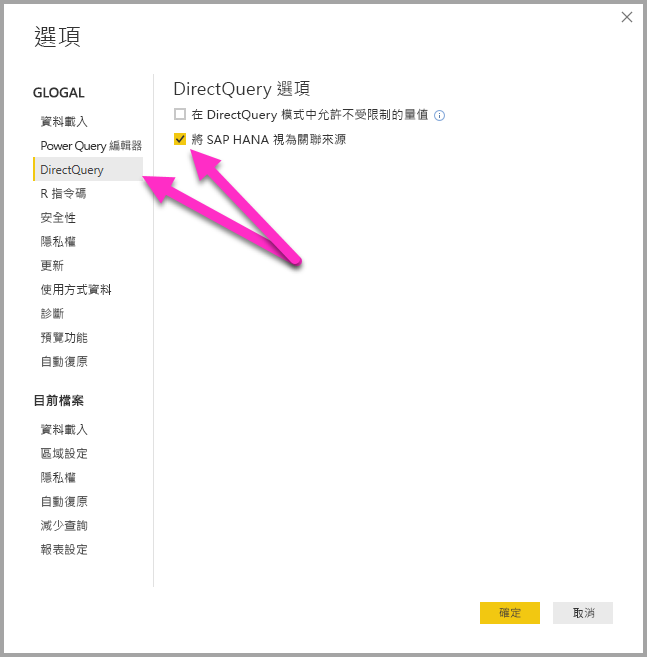

# DirectQuery 和 SAP HANA
您可以使用 **DirectQuery** 來直接連線到 **SAP HANA** 資料來源。 連線到 SAP HANA 時有兩個選項：

* **將 SAP HANA 視為多維度來源 (預設值)：** 在此情況下，行為將會類似於 Power BI 連線到其他多維度來源時，例如 SAP Business Warehouse 或 Analysis Services。 使用此設定連線到 SAP HANA 時，會選取單一分析或計算檢視，而欄位清單中則會提供該檢視的所有量值、階層及屬性。 隨著視覺效果的建立，將會一律從 SAP HANA 擷取彙總資料。 這是建議的方法，也是 SAP HANA 上的新 DirectQuery 報表預設值。

* **將 SAP HANA 視為關聯來源：** 在此情況下，Power BI 會將 SAP HANA 視為關聯來源。 這可提供更大的彈性。 使用此方法時，您必須小心地確保依照預期方式彙總量值，以及避免效能問題。

連線的方法取決於全域工具選項，其設定方式為選取 [檔案] > [選項及設定]  ，接著選取 [選項] > [DirectQuery]  ，然後選取 [將 SAP HANA 視為關聯來源]  選項，如下圖所示。 

將 SAP HANA 視為關聯來源的選項，可控制在 SAP HANA 上使用 DirectQuery 的任何「新」  報表所使用的方法。 此選項對目前報表中任何現有的 SAP HANA 連線，以及任何其他報表中已開啟的連線，都沒有作用。 因此，如果目前未選取此選項，則在使用 [取得資料]  來新增連至 SAP HANA 的連線時，將會把該連線設定為將 SAP HANA 視為多維度來源。 但是，若開啟的不同報表也連線到 SAP HANA，則該報表會繼續依照「建立時」  設定的選項運作，這表示任何在 2018 年 2 月之前建立且連線到 SAP HANA 的報表，都會繼續將 SAP HANA 視為關聯來源。 

這兩個方法會構成不同的行為，且您無法將現有報表從一個方法切換到另一個方法。 

我們將依序更詳細了解這每一個方法。

## 將 SAP HANA 視為多維度來源 (預設值)

所有新的 SAP HANA 連線預設都會使用這個連線方法，將 SAP HANA 視為多維度來源。 若要將連至 SAP HANA 的連線視為關聯來源，您必須選取 [檔案] > [選項及設定] > [選項]  ，然後選取 [Direct Query] > [將 SAP HANA 視為關聯來源]  底下的方塊。 由於此功能目前為**預覽版**，因此您「無法」  將使用多維度方法建立的報表發佈至 Power BI 服務，如果這麼做，將會導致在 Power BI 服務內開啟報表時發生錯誤。  

以多維度來源形式連線到 SAP HANA 時，適用下列考量事項：

* 在 [Get Data Navigator] (取得資料導覽器)  中，可以選取單一 SAP HANA 檢視。 您無法選取個別量值或屬性。 連線時不會定義任何查詢，這與匯入資料或在將 SAP HANA 視為關聯來源的情況下使用 DirectQuery 時不同。 這也意謂著選取此連線方法時，無法直接使用 SAP HANA SQL 查詢。

* 欄位清單中將會顯示所選檢視的所有量值、階層及屬性。 

* 因為在視覺效果中會使用量值，所以將會查詢 SAP HANA 來擷取視覺效果所需彙總層級的量值。 因此，當處理非加法類量值 (計數器、比率等) 時，會由 SAP HANA 執行所有彙總，Power BI 則不會執行任何進一步的彙總。 

* 若要確保一律能從 SAP HANA 取得正確的彙總值，必須強制實施特定限制。 例如，無法新增計算結果欄，或在將來自多個 SAP HANA 檢視的資料合併在同一份報表內。 

與替代的「關聯」  方法相比，將 SAP HANA 視為多維度來源並未提供更大的彈性，但它較為簡單，並可確保在處理較複雜的 SAP HANA 量值時能夠取得正確的彙總值，且通常可提供較高的效能。 

[欄位]  清單將會包含來自 SAP HANA 檢視的所有量值、屬性及階層。 請注意下列使用此連線方法時適用的行為：

* 任何屬性只要至少包含在一個階層中，預設就會隱藏。 不過，如果需要，從欄位清單上的操作功能表中選取 [檢視隱藏項目]  ，即可檢視這些屬性。 從相同的操作功能表中，可以將它們設定為可見。

* 在 SAP HANA 中，可以將一個屬性定義為使用另一個屬性作為其標籤。 例如 **Product** (值為 1、2、3 等) 可以使用 **ProductName** (值為 Bike、Shirt、Gloves 等) 作為其標籤。 在此案例中，單一欄位 **Product** 會顯示在欄位清單中，其值會是 Bike、Shirt、Gloves 等標籤，但其排序及唯一性將取決於索引鍵值 1、2、3。 此外，也會建立一個隱藏欄 **Product.Key**，可讓您視需要存取基礎索引鍵值。 

在連線時，將會顯示基礎 SAP HANA 檢視中定義的所有變數，並可輸入必要的值。 您可以在後續變更這些值，方法是從功能區中選取 [編輯查詢]  ，然後從所顯示的下拉式功能表中選取 [管理參數]  。 

使用 DirectQuery 時，允許的模型化作業比一般案例有更多限制，因為需要確保能夠一律從 SAP HANA 取得正確的彙總資料。 不過，仍然可以進行許多新增和變更，包括定義量值、將欄位重新命名和隱藏，以及定義顯示格式。 在重新整理時會保留所有這類變更，並且會套用對 SAP HANA 檢視所做的所有非衝突變更。 

### 其他模型限制

使用 DirectQuery 來連線到 SAP HANA 時，其他主要的模型化限制如下： 

* **不支援導出資料行：** 已停用建立計算結果欄的功能。 也就是說，建立計算結果欄的群組和叢集將無法使用。
* **量值的其他限制：** 在可於量值中使用的 DAX 運算式上有其他限制，用以反映 SAP HANA 所提供的支援層級。
* **不支援定義關聯性：** 報表內只能查詢單一檢視，因此不支援定義關聯性。
* **資料檢視：** [資料檢視]  通常會顯示資料表中的詳細等級資料。 由於 SAP HANA 等 OLAP 來源本質的緣故，因此無法透過 SAP HANA 使用此檢視。
* **資料行和量值的詳細資料是固定的：** 欄位清單中出現的資料行和量值清單由基礎來源決定，清單是固定的而且無法修改。 例如，您無法刪除資料行，也無法變更其資料類型 (不過可以重新命名)。
* **DAX 中的其他限制：** 可用於量值定義的 DAX 上還有其他限制，以反映來源中的限制。 例如，您無法對資料表使用彙總函式。

### 其他視覺效果限制

使用 DirectQuery 來連線到 SAP HANA (視為多維度來源) 時，在視覺效果方面有限制： 
* **沒有資料行彙總：** 您無法變更視覺效果的資料行彙總，它一律為「不摘要」  。

## 將 SAP HANA 視為關聯來源 

選擇以關聯來源形式連線到 SAP HANA 時，會提供一些額外的彈性。 例如，您可以建立計算結果欄、納入來自多個 SAP HANA 檢視的資料，以及在產生的資料表之間建立關聯性。 不過，以此方式使用 SAP HANA 時，請務必了解連線處理方式的某些層面，以確保下列事項： 

* 當 SAP HANA 檢視包含非加法類量值 (例如相異計數或平均值，而非簡單總和) 時，結果會如預期。
* 產生的查詢有效。

當 [取得資料]  或**查詢編輯器** 中所定義的查詢會執行彙總時，從釐清關聯來源 (例如 SQL Server) 的行為開始著手相當有用。 在接下來的範例中，**查詢編輯器**中所定義的查詢會依 *ProductID* 傳回平均價格。  

如果要將資料匯入至 Power BI (與使用 DirectQuery 比較)，會產生下列情況：

* 將資料匯入彙總層級，而彙總層級是由 [查詢編輯器]  中所建立的查詢所定義。 例如，產品的平均價格。 這會導致表格包含兩個可在視覺效果中使用的資料行 *ProductID* 和 *AveragePrice*。
* 在視覺效果中，會對該匯入的資料執行任何後續彙總 (例如 *Sum*、*Average*、*Min* 等)。 例如，在視覺效果上包括 *AveragePrice* 預設會使用 *Sum* 彙總，而會傳回每個 *ProductID* 之 *AveragePrice* 的總和 – 在此範例案例中為 13.67。 這同樣適用於視覺效果上所使用的任何替代彙總函式 (例如 *Min*、*Average* 等)。 例如，*AveragePrice* 的 *Average* 會傳回 6.66、4 和 3 的平均值 (亦即等同 4.56)，而不是基礎資料表中六筆記錄的 *Price* 平均值 (亦即 5.17)。
  
如果使用 **DirectQuery**(針對相同的關聯來源) 而非 Import，則相同的語意也適用，且結果會完全相同：  

* 如果是相同的查詢，則會向報告層呈現邏輯上完全相同的資料，即使未實際匯入資料也是一樣。

* 在視覺效果中，會再次從查詢對該邏輯資料表執行任何後續彙總 (*Sum*、*Average*、*Min* 等)。 同樣地，包含 *AveragePrice* 之 *Average* 的視覺效果一樣會傳回 4.56。
  
現在，我們將考量將連線視為關聯來源時的 SAP HANA。 Power BI 可以在 SAP HANA 中使用「分析檢視」  和「計算檢視」  ，這兩者都可以包含量值。 不過，現今 SAP HANA 的方法依循本節中先前所述的相同原則：[取得資料]  或**查詢編輯器**中定義的查詢會判斷可用的資料，然後視覺效果中的任何後續彙總都會針對該資料，相同的原則也適用於 Import 和 DirectQuery。  
不過，基於 SAP HANA 的本質，初始 [取得資料]  對話方塊或 [查詢編輯器]  中所定義的查詢一律是彙總查詢，而且一般會包括將使用 SAP HANA 檢視所定義之實際彙總的量值。

上述 SQL Server 範例的對等項就是有一個 SAP HANA 檢視包含 *ID*、*ProductID*、*DepotID*，以及數個包含 *AveragePrice* 的量值 (檢視中定義為「平均價格」  )。  
    
如果在 [取得資料]  體驗中選取的是 [ProductID]  和 [AveragePrice]  量值，則那是在針對檢視定義查詢，用來要求該彙總資料 (在先前的範例中，為求簡化，使用了不符合確切 SAP HANA SQL 語法的虛擬 SQL)。 然後，在視覺效果中定義的任何進一步彙總都會進一步彙總這類查詢的結果。 同樣地，如上面針對 SQL Server 所述，這同時適用於 Import 和 DirectQuery 案例。 在 DirectQuery 案例中，來自 [取得資料]  或 [查詢編輯器]  的查詢將會用於傳送至 SAP HANA 單一查詢內的部分選取；因此在進一步彙總之前，不會實際讀入所有資料。  

所有這些考量和行為使得使用 SAP HANA DirectQuery 時，必須顧及下列重要考量：  

* 只要 SAP HANA 中的量值是非加法類 (例如，非簡單 *Sum*、*Min* 或 *Max*)，就必須注意視覺效果中所執行的任何進一步彙總。

* 在 [取得資料]  或 [查詢編輯器]  中，只應該包括必要資料行來擷取必要資料，並反映結果將是查詢的事實，而查詢必須是可傳送至 SAP HANA 的合理查詢。 例如，如果選取許多資料行，但考量到後續視覺效果上可能需要這些資料行，則甚至針對 DirectQuery，簡單視覺效果將表示部分選取中所使用的彙總查詢將會包含這幾個資料行，而這樣的執行效果一般會很差。
  
以下舉例說明。 在下列範例中，於 [取得資料] 對話方塊中選取五個資料行 (**CalendarQuarter** **Color** **LastName** **ProductLine** **SalesOrderNumber**)   以及量值 *OrderQuantity* 意謂著稍後建立包含 Min OrderQuantity 的簡單視覺效果將會導致對 SAP HANA 進行下列 SQL 查詢。 陰影部分是子選擇，其中包含來自 [取得資料]   / [查詢編輯器]  的查詢。 如果這個部分選取提供相當高的基數結果，則產生的 SAP HANA 效能可能不佳。  

   
由於這個行為，因此建議在仍然能產生合理 SAP HANA 查詢的情況下，將 [取得資料]  或 [查詢編輯器]  中選取的項目限制為所需的項目。  

## 最佳作法 

針對這兩種連線到 SAP HANA 的方法，在使用 DirectQuery 方面的建議也適用於 SAP HANA，特別是與確保良好效能相關的建議。 這些建議在[使用 Power BI 中的 DirectQuery](desktop-directquery-about.md)一文中有詳細的說明。
   
## 限制

以下清單說明未完全支援或使用 Power BI 時會有不同行為的所有 SAP HANA 功能。 

* **父子式階層** - 在 Power BI 中不會顯示父子式階層。
這是因為 Power BI 會使用 SQL 介面來存取 SAP HANA，而透過 SQL 並無法完全存取父子式階層。
* **其他階層中繼資料** - 在 Power BI 中會顯示階層的基本結構，不過有些階層中繼資料 (例如控制不完全階層的行為) 將不會有任何作用。
同樣地，這也是 SQL 介面所加諸的限制所造成。
* **使用 SSL 連線** - 您可以搭配 SSL 使用匯入和多維度進行連線，但無法連線到針對關聯式連接器設為使用 SSL 的 SAP HANA 執行個體。
* **對屬性檢視的支援** - Power BI 可以連線到 [分析] 和 [計算] 檢視，但無法直接連線到 [屬性] 檢視。
* **對目錄物件的支援** - Power BI 無法連線到「目錄」物件。
* **在發佈後對變數進行變更** - 在發佈報表之後，您便無法直接在 Power BI 服務中變更任何 SAP HANA 變數的值。 
 
## 已知問題 
以下清單說明使用 Power BI 來連線到 SAP HANA (DirectQuery) 時所有已知的問題。 

* **查詢計數器及其他量值時的 SAP HANA 問題** - 如果連線到「分析檢視」而「計數器」量值及一些其他比率量值包含在相同的視覺效果中，就會從 SAP HANA 傳回不正確的資料。 此問題涵蓋在「SAP 附註 2128928」(查詢「計算結果欄」和「計數器」時傳回非預期的結果) 中。 在此情況下，比率量值將會不正確。 

* **來自單一 SAP HANA 資料行的多個 Power BI 資料行** - 對於一些在多個階層中使用某個 SAP HANA 資料行的計算檢視來說，SAP HANA 會將此公開為兩個個別的屬性。 這會導致在 Power BI 中建立兩個資料行。  這些資料行預設會隱藏，不過所有涉及這些階層或直接涉及這些資料行的查詢，都會正確運作。 
 
## 後續步驟

如需 DirectQuery 的詳細資訊，請參閱下列資源：

* [Power BI 中的 DirectQuery](desktop-directquery-about.md)
* [DirectQuery 支援的資料來源](desktop-directquery-data-sources.md)
* [DirectQuery 和 SAP BW](desktop-directquery-sap-bw.md)
* [內部部署資料閘道](service-gateway-onprem.md)

