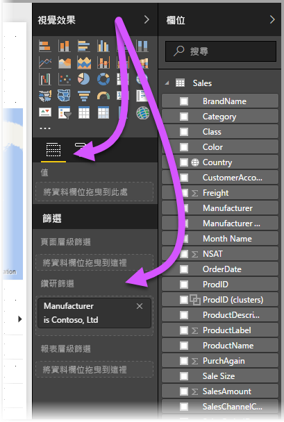
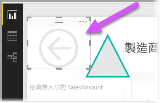
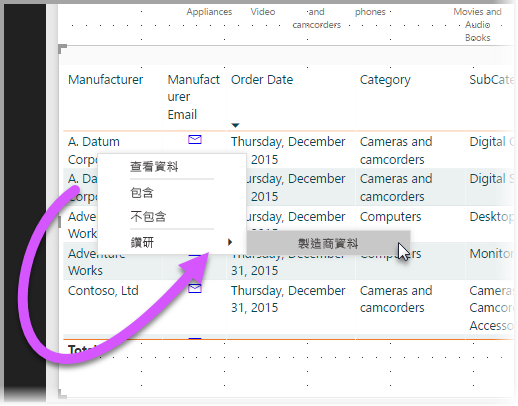
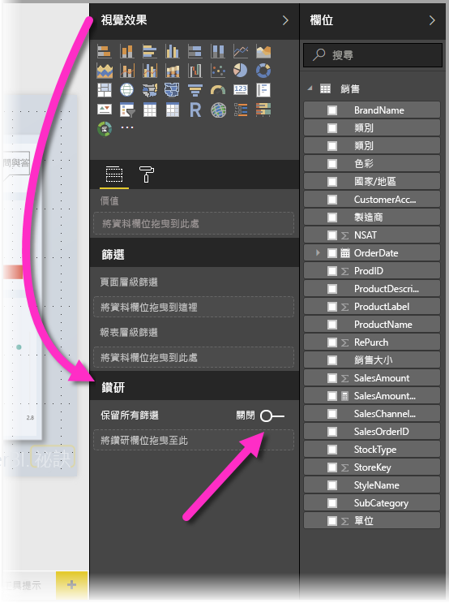
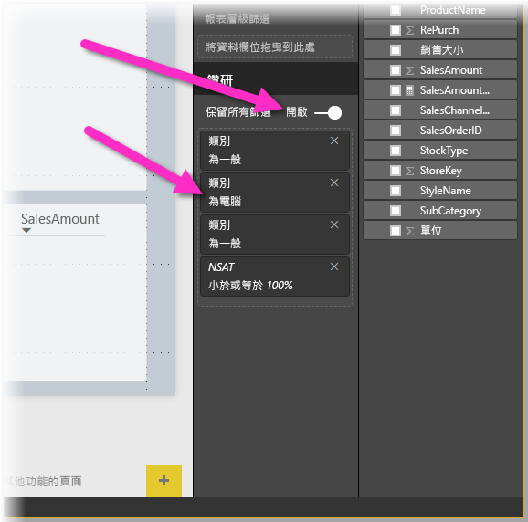
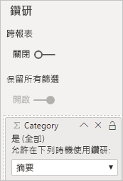

# 在 Power BI 報表中設定鑽研
使用 Power BI 報表中的「鑽研」  ，即可在報表中建立頁面，其聚焦於供應商、客戶或製造商等特定實體。 當報表讀者使用鑽研時，讀者們會以滑鼠右鍵按一下其他報表頁面中的資料點，並鑽研至焦點頁面，以取得經過篩選至該內容的詳細資料。 您也可以[建立鑽研按鈕](desktop-drill-through-buttons.md)，當使用者按一下按鈕時，即會鑽研到詳細資料。

您可以在 Power BI Desktop 或 Power BI 服務的報表中設定鑽研。

## 設定鑽研目的地頁面
1. 若要設定鑽研，請建立報表頁面，其中包含要為其建立鑽研的實體類型視覺效果。 

    例如，假設您想要提供製造商的鑽研。 在此情況下，您所建立鑽研頁面中視覺效果可能會顯示總銷售額、總出貨單位、依類別的銷售額、依區段的銷售額等。 如此一來，當您鑽研至該頁面時，就會顯示所選製造商的特定視覺效果。

2. 然後在該鑽研頁面上的 [視覺效果]  窗格 [欄位]  區段中，將所要啟用鑽研的欄位拖曳到 [鑽研篩選條件]  區段中。

    

    當將欄位新增至 [鑽研篩選條件]  區域時，Power BI Desktop 會自動建立「返回」  按鈕視覺效果。 該視覺效果會成為已發行報表中的按鈕。 在 Power BI 服務中使用報表的使用者可使用此按鈕來返回上一個報表頁面。

    

> [!IMPORTANT]
> 您可以在相同報表中設定並執行頁面鑽研，但是您無法鑽研至不同報表中的頁面。  

## 使用您自己的影像作為返回按鈕    
 因為返回按鈕是影像，所以您可以使用任何您想要的影像來取代該視覺效果的影像。 其仍然會作為返回按鈕運作，讓報表取用者可以返回原本的頁面。 

若要使用自己的影像作為返回按鈕，請遵循下列步驟：

1. 在 [常用]  索引標籤上，選取 [影像]  。 然後找出影像，並將其放在鑽研頁面上。

2. 在鑽研頁面上選取新的影像。 在 [格式化影像]  窗格下，將 [動作]  滑桿設定為 [開啟]  ，然後將 [類型]  設定為 [返回]  。 您的影像現在已當作返回按鈕。

    ![載入影像，並將 [類型] 設定為 [返回]](media/desktop-drillthrough/drillthrough_05.png)

    
     現在使用者能以滑鼠右鍵按一下報表中的資料點，並取得支援鑽研至該頁面的操作功能表。 

    

    當報表使用者選擇要鑽研時，系統將會針對以滑鼠右鍵按一下的資料點，以篩選過的頁面來顯示相關資訊。 例如，假設他們以滑鼠右鍵按一下有關 Contoso (製造商) 的資料點，並選取 [鑽研]。 使用者前往的鑽研頁面會篩選至 Contoso。

## 在鑽研中傳遞所有篩選條件

您可以將所有套用的篩選條件傳遞至鑽研視窗。 例如，您可以只選取特定產品類別以及篩選至該類別的視覺效果，然後選取鑽研。 您可能會對鑽研在套用所有這些篩選條件之後的情況感興趣。

若要保留所有已套用的篩選條件，請在 [視覺效果]  窗格的 [鑽研]  區段中，將 [保留所有篩選]  設定為 [開啟]  。 

當您接著鑽研視覺效果時，可看到套用哪些篩選條件，是根據套用至來源視覺效果的暫時篩選條件而套用的。 在 [視覺效果]  窗格的 [鑽研]  區段中，這些暫時性篩選會顯示為斜體。 

雖然您可以使用工具提示頁面來這麼做，但那會是奇怪的體驗，因為工具提示可能不會正常運作。 因此，不建議您使用工具提示這麼做。

## 將量值新增至鑽研

除了將所有篩選條件傳遞到鑽研視窗之外，您也可以將量值 (或彙總的數值資料行) 新增至鑽研區段。 將鑽研欄位拖曳到 [鑽研]  卡就能加以套用。 

當您新增量值 (或彙總的數值資料行) 時，若該欄位是用於視覺效果的「值」  區域中，即可鑽研至該頁面。

以上就是在報表中使用鑽研的相關資訊。 這是取得為鑽研篩選條件所選取實體資訊展開檢視的好方法。

## 後續步驟

您可能也會對下列文章感興趣：

* [在 Power BI Desktop 報表中使用跨報表鑽研](desktop-cross-report-drill-through.md)
* [使用 Power BI Desktop 交叉分析篩選器](visuals/power-bi-visualization-slicers.md)

