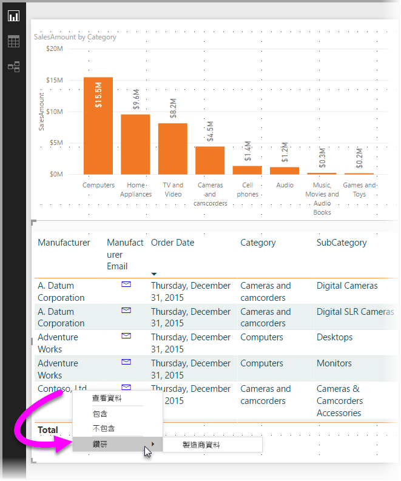
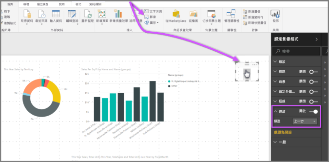

# 在 Power BI Desktop 中使用鑽研
使用 **Power BI Desktop** 中的**鑽研**，您可以在報表中建立頁面，著重於特定的實體 - 例如供應商、客戶或製造商。 使用該焦點報表頁面，使用者可以滑鼠右鍵按一下其他報表頁面中的資料點，然後鑽研至著重頁面，取得經過篩選為該內容的詳細資料。

## 使用鑽研
1. 若要使用**鑽研**，請針對您要鑽研的實體類型，以建立包含所要視覺效果的報表頁面。 

    例如，如果您想要為製造商提供鑽研，您可能會建立鑽研頁面，並使用顯示總銷售額、總出貨單位數、依類別分類的銷售額、依區域分類的銷售額等等的視覺效果。 如此一來，當您鑽研至該頁面時，會顯示您所選取製造商特定的視覺效果。

2. 然後在該鑽研頁面上，[視覺效果] 窗格的 [欄位] 區段中，拖曳您想要鑽研的欄位至 [鑽研篩選]。

    

    當您將欄位新增至 [鑽研篩選] 時，**Power BI Desktop** 會自動建立「返回」按鈕視覺效果。 該視覺效果會變成已發行報表中的按鈕，且讓正在 **Power BI 服務**中使用報表的使用者輕鬆地回到來源報表頁面 (他們在其中選取鑽研的頁面)。

    

## 使用您自己的影像作為返回按鈕    
 因為返回按鈕是影像，您可以使用任何想要的影像來取代視覺效果的影像，它將仍會正常運作為返回按鈕，讓報表使用者能回到其原始頁面。

1. 在 [首頁] 索引標籤上按一下 [映像]，然後找出您的映像，並將它放在 [鑽研] 頁面。
2. 在 [鑽研] 頁面中選取您的新映像，然後在 [格式化映像] 區段下方，將 [連結] 滑桿設成 [開啟]，將 [類型] 設成 [上一步]。 您的影像現在已當作返回按鈕。

    

    **鑽研**頁面完成之後，當使用者以滑鼠右鍵按一下報表中的資料點，且該資料點使用您放入 [鑽研篩選] 的欄位時，隨即出現支援鑽研至該頁面的操作功能表。

    

    當報表使用者選擇鑽研時，將會針對以滑鼠右鍵按一下的資料點，以篩選頁面來顯示相關的資訊。 例如，如果他們以滑鼠右鍵按一下與 Contoso (製造商) 有關的資料點，然後選取要鑽研，則他們到達的鑽研頁面會篩選為 Contoso。

    > [!NOTE]
    > 只有 [鑽研篩選] 中的欄位會傳遞至鑽研報表頁面。 不會傳遞其他任何內容資訊。
    > 
    > 

以上就是在報表中使用**鑽研**的相關資訊。 這是取得您為鑽研篩選選取的實體資訊之展開檢視的好方法。

