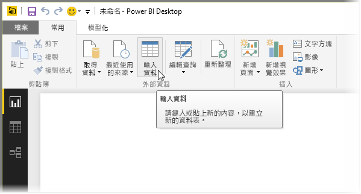
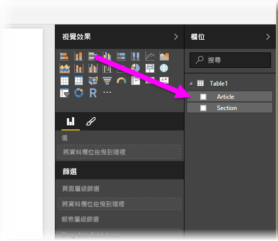

# 直接將資料輸入 Power BI Desktop
使用 Power BI Desktop，您可以直接輸入資料，並在您的報表和視覺效果中使用該資料。 例如，您可以複製部分的活頁簿或網頁，然後將其貼到 Power BI Desktop。

若要直接輸入資料，請從 [主資料夾] 功能區選取 [輸入資料]。

Power BI Desktop 可能會嘗試小幅轉換資料 (如果適當的話)，就像當您從任何來源載入資料時的情況一樣。 例如，在下列情況下其會將第一個資料列升階為標頭。

如果您想要修改輸入的資料 (或貼上)，您可以選取 [編輯] 按鈕，以帶出 [查詢編輯器]，這可以在將資料帶入 Power BI Desktop 之前於其中修改及轉換資料。 您也可以選取 [載入] 按鈕，在資料顯示時將其匯入。

當您選取 [載入] 時，Power BI Desktop 會使用您的資料建立新資料表，並可在 [欄位] 窗格中使用。 下圖中，Power BI Desktop 顯示了我的新資料表 (預設名稱為 *Table1*) 以及在新建立資料表中的兩個欄位。

這樣就大功告成了，將資料輸入 Power BI Desktop 就是這麼簡單。

您現在可以使用 Power BI Desktop 中的資料來建立視覺效果、報表，或與您可能會想要連接和匯入的其他資料進行互動，例如 Excel 活頁簿、資料庫或任何其他資料來源。

### 後續步驟
您可以使用 Power BI Desktop 連接至各式各樣的資料。 如需有關資料來源的詳細資訊，請參閱下列資源︰

* [開始使用 Power BI Desktop](desktop-getting-started.md)
* [Power BI Desktop 中的資料來源](desktop-data-sources.md)
* [使用 Power BI Desktop 合併資料並使其成形](desktop-shape-and-combine-data.md)
* [在 Power BI Desktop 中連接至 Excel 活頁簿](desktop-connect-excel.md)   
* [連接至 Power BI Desktop 中的 CSV 檔案](desktop-connect-csv.md)   

