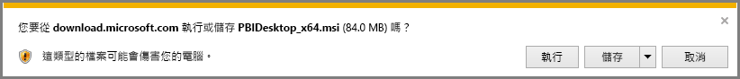
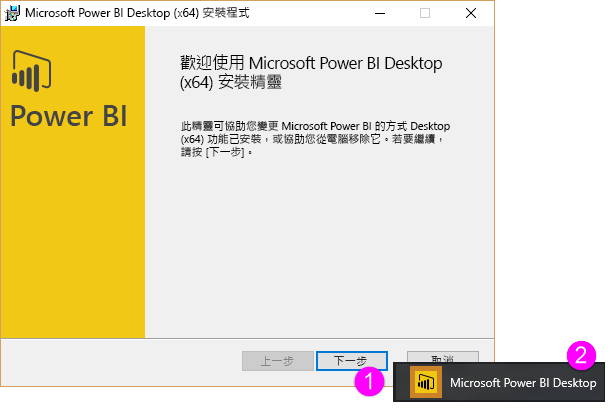
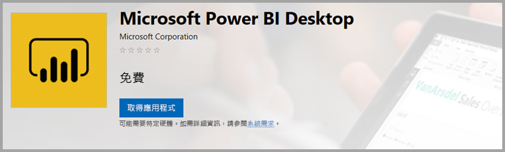

# 取得 Power BI Desktop
**Power BI Desktop** 可讓您建立進階查詢、模型，以及將資料視覺化的報表。 透過 **Power BI Desktop**，您可以建立資料模型、建立報表，並發行到 Power BI 服務以分享您的工作。  **Power BI Desktop** 可免費下載。

有兩種方式可以取得 **Power BI Desktop**，下列各節會一一描述：

* 直接**下載** (將 MSI 套件下載並安裝在電腦上)
* 從 **Microsoft Store** 作為應用程式安裝

任一方法皆可為您的電腦取得最新版的 **Power BI Desktop**，但有些許差異值得注意，下列各節會詳述。

## 下載 Power BI Desktop
若要下載最新版本的 **Power BI Desktop**，您可以從 Power BI 服務右上角選取下載圖示，然後選取 [Power BI Desktop]。

您也可以從以下的下載頁面下載最新版本的 Power BI Desktop：

* [**Power BI Desktop 下載**(包含 32 和 64 位元版本)](https://powerbi.microsoft.com/desktop)。
  
  

不論您選擇何種下載方式，一旦 **Power BI Desktop** 下載完畢後，系統會提示您執行安裝檔案︰

**Power BI Desktop** 會安裝為應用程式，並在您的桌面上執行。

> [!NOTE]
> 不支援將下載的 (MSI) 版本和 **Power BI Desktop** 的 **Microsoft Store** 版本安裝在同一部電腦上 (有時也稱為「並存」安裝)。
> 
> 

## 從 Microsoft Store 作為應用程式安裝
您也可以使用下列連結，從 Microsoft Store 取得 **Power BI Desktop**：

* [從 **Microsoft Store** 安裝 **Power BI Desktop**](http://aka.ms/pbidesktopstore)

從 Microsoft Store 取得 **Power BI Desktop** 有幾個優點：

* **自動更新** - 只要有最新版本，Windows 就會自動在背景下載，所以您的版本一律是最新狀態。
* **較小的下載**：**Microsoft Store** 可確保僅將每個更新中有變更的元件下載到您的電腦，這樣每個更新的下載項目就會比較小。
* **無須管理員權限** - 直接下載和安裝 MSI 時，您必須是系統管理員才能順利完成安裝。 當您從 Microsoft Store 取得 **Power BI Desktop** 時，不需要管理員權限。
* **啟用 IT 推出**：**Microsoft Store** 版本更容易部署或*推出*供您組織中的所有人使用，而且可以透過**商務用 Microsoft Store** 提供 **Power BI Desktop**。
* **語言偵測**：**Microsoft Store** 版本包含所有支援的語言，並會在每次啟動時，檢查電腦上使用的語言。 這也會影響 **Power BI Desktop** 中所建模型的當地語系化；例如，內建日期階層會符合建立 .pbix 檔案時 **Power BI Desktop** 使用的語言。

從 Microsoft Store 安裝 **Power BI Desktop** 有幾項考量與限制，包括下列各項：

* 如果使用 SAP 連接器，您可能需要將 SAP 驅動程式檔案移到 *Windows\System32* 資料夾。
* 從 Microsoft Store 安裝 **Power BI Desktop**，不會從 MSI 版本複製使用者設定。 您可能必須重新連線到您最近的資料來源，然後重新輸入您的資料來源認證。 

> [!NOTE]
> 不支援將下載的 (MSI) 版本和 **Power BI Desktop** 的 **Microsoft Store** 版本安裝在同一部電腦上 (有時也稱為「並存」安裝)。 您應該手動解除安裝 **Power BI Desktop**，然後再從 **Microsoft Store** 下載它
> 
> [!NOTE]
> **Power BI Desktop** 的 Power BI 報表伺服器版本與本文所討論的版本是不同的安裝。 如需 **Power BI Desktop** 報表伺服器版本的資訊，請參閱[建立 Power BI 報表伺服器的 Power BI 報表](report-server/quickstart-create-powerbi-report.md)。
> 
> 

## 使用 Power BI Desktop
當您啟動 **Power BI Desktop** 時，會顯示 [歡迎] 畫面。

如果這是您第一次使用 **Power BI Desktop** (如果安裝不是升級)，系統會提示您填寫表單並回答幾個問題，或登入 **Power BI 服務**，才能夠繼續進行。

在這裡，您可以開始建立資料模型或報表，然後與其他人在 Power BI 服務上共用它們。 簽出本文結尾處的**更多資訊**連結，可協助您開始使用 **Power BI Desktop**。

## 最低需求
下列清單提供執行 **Power BI Desktop** 的最小需求：

* Windows 7 / Windows Server 2008 R2 或更新版本
* .NET 4.5
* Internet Explorer 9 或更新版本
* **記憶體 (RAM)：** 可用量至少為 1 GB，建議量為 1.5 GB 或以上。
* **顯示：** 建議至少為 1440x900 或 1600x900 (16:9)。 不建議像是 1024x768 或 1280x800 等較低的解析度，原因是某些控制項 (例如關閉啟動畫面) 需以更高的解析度顯示。
* **Windows 顯示設定：** 如果您的顯示設定已設定成會將文字、應用程式及其他項目的大小變更為超過 100%，則可能會看不到某些必須關閉或回應以繼續使用 **Power BI Desktop** 的對話方塊。 如果您遇到這項問題，請前往 Windows 中的 [設定] > [系統] > [顯示] 檢查您的 [顯示設定]，並使用滑桿將顯示設定調回 100%。
* **CPU：** 建議為 1 GHz 或更快的 x86 或 x64 位元處理器。

## 考量與限制

我們一直希望能為您提供良好的 Power BI Desktop 體驗。 當您使用 Power BI Desktop 時可能會發生問題，因此本小節包含解決方案或建議以處理可能發生的問題。 

### 使用舊版 Power BI Desktop 時的問題

使用過期的 **Power BI Desktop** 版本時，有些使用者會遇到類似下列的錯誤： 

    "We weren't able to restore the saved database to the model" 

更新至目前版本的 Power BI Desktop 通常會解決此問題。

### 停用通知
建議更新至最新版的 Power BI Desktop，才能使用最新的功能、效能、穩定性和其他改進。 某些組織可能不希望使用者更新至每一個新版本。 您可以使用下列步驟，透過修改登錄來停用通知：

1. 使用 [登錄編輯器]，瀏覽至 *HKEY_LOCAL_MACHINE\SOFTWARE\Microsoft\Microsoft Power BI Desktop*
2. 在那裡建立具有下列設定的新項目：*REG_DWORD :DisableUpdateNotification*
3. 將新項目的值設為 **1**。

您必須重新啟動電腦讓變更生效。

### Power BI Desktop 載入部分畫面

在某些情況下 (包括特定的螢幕解析度設定)，某些使用者可能會看到 Power BI Desktop 轉譯的內容有大型黑色區域。 這通常是因為最新的作業系統更新影響項目轉譯方式而導致，並非 Power BI Desktop 呈現內容的直接結果。 無論如何，大型黑色區域並不像絕佳的視覺效果那麼吸引人，因此若要解決此問題，請採取下列步驟：

1. 按 [開始] 鍵，在顯示的搜尋列中輸入字詞 *blurry*。
2. 在出現的對話方塊中，選取選項：[讓 Windows 修正模糊的應用程式]。
3. 重新啟動 Power BI Desktop。

後續的 Windows 更新發行之後，可能會解決此問題。 
 

## 後續步驟
一旦安裝 **Power BI Desktop**，下列內容能幫助您快速啟動並執行：

* [Power BI Desktop 是什麼？](desktop-what-is-desktop.md)
* [Power BI Desktop 的查詢概觀](desktop-query-overview.md)
* [Power BI Desktop 中的資料來源](desktop-data-sources.md)
* [連接至 Power BI Desktop 中的資料](desktop-connect-to-data.md)
* [使用 Power BI Desktop 合併資料並使其成形](desktop-shape-and-combine-data.md)
* [Power BI Desktop 中的常見查詢工作](desktop-common-query-tasks.md)   

