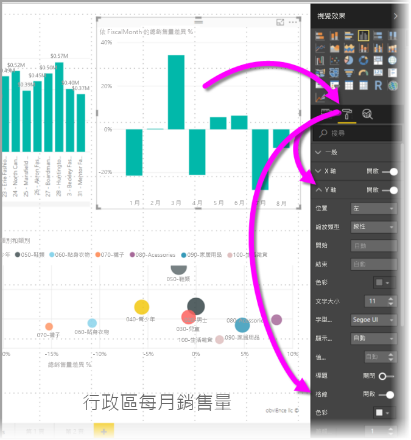
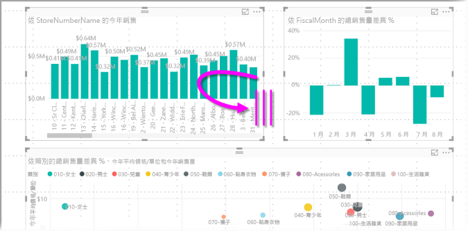
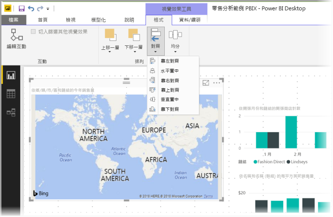

# 在 Power BI Desktop 報表中使用格線與貼齊格線
**Power BI Desktop** 報表畫布提供格線，以便您讓視覺效果在報表頁面上整齊對齊，並提供貼齊格線功能，讓報表中的視覺效果看起來清爽、整齊且間距相等。

在 **Power BI Desktop** 中，您也可以調整報表上物件的堆疊順序 (上移一層、下移一層)，以及讓畫布上選取的視覺效果對齊或間距相等。

### 啟用格線和貼齊格線
若要啟用格線和貼齊格線，請選取 [檢視] 功能區，然後啟用 [顯示格線] 及 [將物件貼齊格線] 的核取方塊。 您可以選取一個方塊或兩者都選；其個別運作。

> [!NOTE]
> 如果 [顯示格線] 及 [將物件貼齊格線] 已停用，連接至任何資料來源即可加以啟用。
> 
> 

### 使用格線
格線為視覺效果輔助線，可讓您查看兩個以上的視覺效果是否確實對齊。 當您嘗試判斷兩個 (或更多) 視覺效果是否水平或垂直度對齊時，可以使用格線透過肉眼判斷視覺效果的框限是否對齊。

您可以使用「CTRL+按一下」一次選取多個視覺效果，這會顯示所有選取的視覺效果框線，讓您輕鬆看出視覺效果是否確實對齊。

#### 使用視覺效果內的格線
Power BI 的視覺效果內也有格線，可提供視覺效果輔助線，以進行資料點和值的比較。 自 2017 年 9 月起的 **Power BI Desktop** 版本開始，您即可使用 [X 軸] 或 [Y 軸] 卡片 (依據視覺效果類型而定，其位於 [視覺效果] 窗格的 [格式] 區段)，來管理視覺效果內的格線。 您可以管理視覺效果內的下列格線項目：

* 開啟或關閉格線
* 變更格線色彩
* 調整格線筆觸 (寬度)
* 選取視覺效果中的格線線條樣式，例如實線、虛線或點線

當報表的視覺效果使用深色背景時，修改格線的特定項目就特別有用。 下圖顯示 [X 軸] 卡片中的 [格線] 區段。

### 使用貼齊隔線
當您啟用 [將物件貼齊格線] 時，您在 **Power BI Desktop** 畫布上移動 (或調整大小) 的所有視覺效果都會自動對齊最近的格線軸，讓您更容易確保兩個以上的視覺效果對齊同一個水平或垂直位置或大小。

光是這樣就能使用**格線**和**貼齊格線**，輕鬆確保報表中的視覺效果妥善對齊。

### 使用堆疊順序、對齊和相等間距
您也可以管理報表中視覺效果由前至後的順序，通常稱為元素的「堆疊順序」。 這可讓您以任何想要的方式重疊視覺效果，然後調整每個視覺效果由前至後的順序。 這種排序方法使用 [上移一層] 和 [下移一層] 按鈕執行，按鈕位於 [格式] 功能區的 [排列] 區段，當您選取頁面上一或多個視覺效果時便會出現 (如果未選取任何視覺效果則無法使用)。

[格式] 功能區也可讓您以許多不同的方式對齊視覺效果。 這可讓您確保視覺效果會以您認為外觀及運作效果最佳的對齊方式顯示在頁面上。

選取一個視覺效果時，使用 [對齊] 按鈕會將該視覺效果對齊報表畫布的邊緣 (或中心)，如下圖所示。

選取兩個或多個視覺效果時，它們會一起對齊，並使用視覺效果的現有對齊邊界來進行對齊。 例如，在選取了兩個視覺效果和 [靠左對齊] 按鈕的情況下，視覺效果會對齊所有所選視覺效果的最左邊界。

您也可以讓視覺效果在報表畫布上間距相等，垂直或水平方式皆可。 只要使用 [格式] 功能區的 [相等間距] 按鈕。

從這些格線、對齊方式和相等間距工具選取數個項目後，您的報表看起來就會符合您的期待。

