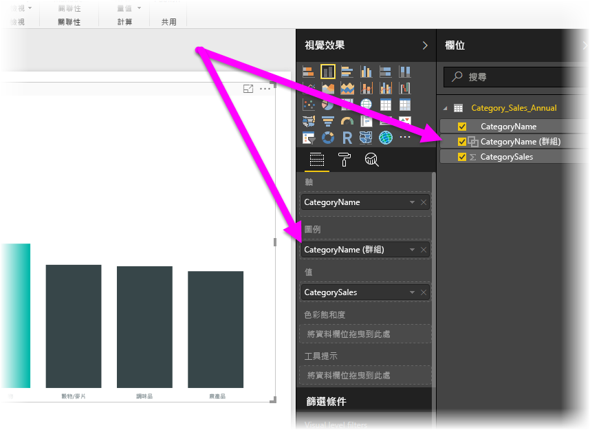
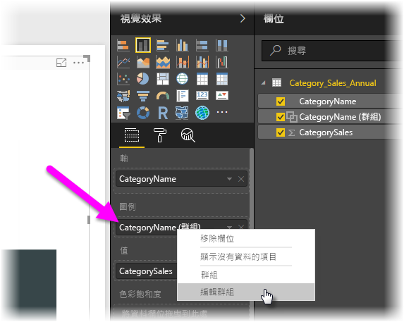
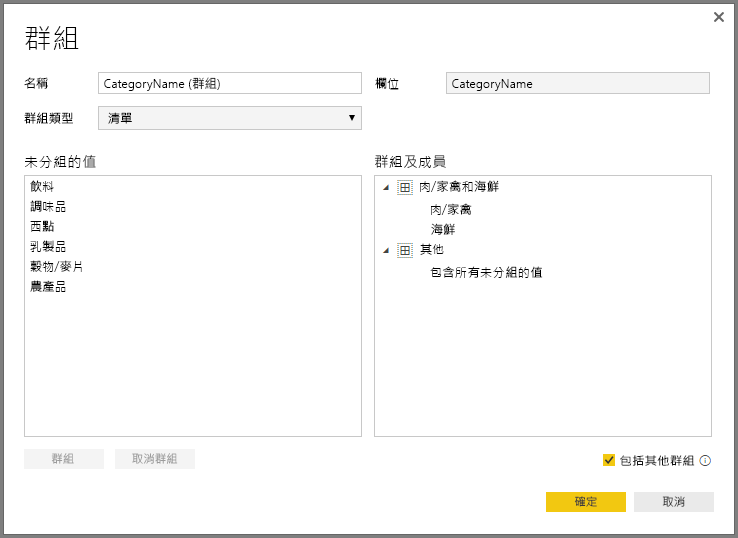
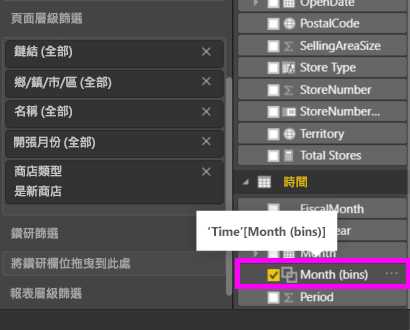

# 在 Power BI Desktop 中使用群組和量化
當 **Power BI Desktop** 建立視覺效果時，會根據在基礎資料中找到的值，將資料彙總成區塊 (或群組)。 通常沒有問題，但您偶爾會想要調整這些區塊的呈現方式。 例如，您可能想要將三種產品類別放在一個較大的類別 (一個「群組」) 中。 或者您可能想要以量化大小 1,000,000 美元來查看銷售數字，而不是等分為 923,983 美元。

在 Power BI Desktop 中，您可以**群組**資料點，以協助您更清楚地檢視、分析及探索視覺效果中的資料和趨勢。 您也可以定義**量化大小** (通常稱為「量化」)，將值放入大小相同的群組，好讓您以有意義的方式將資料視覺化。

### 使用群組
若要使用群組，請按住 Ctrl 鍵再按一下滑鼠來複選項目，以選取視覺效果上的兩個或多個項目。 然後以滑鼠右鍵按一下其中一個複選項目，再從出現的功能表中選取 [群組]。

建立後，群組會加入視覺效果的 [圖例] 貯體，並同時出現在 [欄位] 清單中。

一旦您有一個群組，即可輕鬆地編輯該群組的成員，方法是以滑鼠右鍵按一下 [圖例] 貯體或 [欄位] 清單中的欄位，然後選取 [編輯群組]。

在出現的 [群組] 視窗中，您可以建立新的群組或修改現有的群組。 您也可以「重新命名」任何群組，方法是按兩下 [群組和成員] 方塊中的 [群組] 標題，然後輸入新名稱。

有各式各樣可以用群組變出的花樣。 您可以將 [未分組的值] 清單的項目新增到新的群組，或新增到其中一個現有群組。 若要建立新的群組，請從 [未分組的值] 方塊選取兩個或更多個項目 (使用 CTRL + 按一下)，然後按一下該方塊下方的 [群組] 按鈕。

您可以將未分組的值新增至現有的群組︰只要選取 [未分組的值]，然後選取要新增的目標現有群組，再按一下 [群組] 按鈕。 若要從群組移除項目，請從 [群組及成員] 方塊加以選取，然後按一下 [取消群組]。 您也可以選擇未分組的類別是要放入 [其他] 群組中，還是要維持未分組。

> [!NOTE]
> 您可以在 [欄位] 中建立任何欄位的群組，而不需要從現有的視覺效果中進行複選。 只要以滑鼠右鍵按一下欄位，然後從出現的功能表中選取 [新增群組] 即可。
> 
> 

### 使用量化
您可以在 **Power BI Desktop** 中，設定數值和時間欄位的量化大小。 您可以使用量化，將 **Power BI Desktop** 顯示的資料設定為正確大小。

若要套用量化大小，請以滑鼠右鍵按一下 [欄位]，然後選取 [新增群組]。

從 [群組] 視窗，將 [量化大小] 設定為您要的大小。

當您選取 [確定] 時，您會注意到 [欄位] 窗格中會顯示新欄位，並在名稱後面加上 *(二進位)* 。 然後，您可以將該欄位拖曳到畫布上，以在視覺效果中使用量化大小。

若要查看**量化**的執行方式，請觀賞這段[影片](https://www.youtube.com/watch?v=BRvdZSfO0DY)。

使用**群組**和**量化**可確保報表中的視覺效果只以您要的方式來顯示資料。

