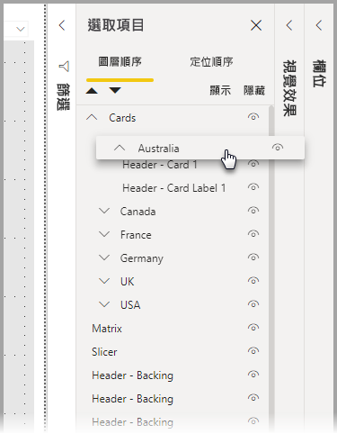

# 在 Power BI Desktop 中使用群組
在 **Power BI Desktop** 中使用**群組**，您可以在報表中為視覺效果分組，例如按鈕、文字方塊、圖形、影像和任何您建立的視覺效果，就跟您在 PowerPoint 中為項目分組一樣。 在報表中為視覺效果分組可讓您透過單一物件的方式處理群組，讓在您的報表中移動、調整大小和使用層變得更簡單、更快且更直覺化。

## 建立群組

若要在 Power BI Desktop 中建立視覺效果群組，請在畫布上選取第一個視覺效果，然後按住 CTRL 按鈕、按一下一或多個您希望放在相同群組內的其他視覺效果，然後以滑鼠右鍵按一下視覺效果集合，並從出現的功能表中選取 [群組]  。

群組會顯示在 [選取項目]  窗格中。 您可以視您報表需求擁有任意數量的視覺效果群組，但您也可以巢狀方式為視覺效果分組。 在下圖中，「澳洲」  群組位於「卡片」  群組下方的巢狀結構中。 您可以選取群組名稱旁邊的插入號來展開群組，並再次選取插入號來摺疊它。 

在 [選取項目]  窗格中，您也可以拖放個別視覺效果來將它們包含在群組中、從群組中移除它們、以巢狀方式分組，或從巢狀結構中移除群組或個別視覺效果。 只需要拖曳您要調整的視覺效果，然後將視覺效果放在您想要的位置即可。 若有重疊，視覺效果層會以它們在 [圖層順序]  清單中的順序決定。

若要取消群組，只需選取群組、以滑鼠右鍵按一下，然後從出現的功能表中選取 [取消群組]  即可。

## 隱藏和顯示視覺效果或群組

您可以使用 [選取項目]  窗格輕鬆隱藏或顯示群組。 若要隱藏群組，請選取群組名稱 (或是個別視覺效果) 旁邊的眼睛按鈕，來切換是否要隱藏或顯示視覺效果或群組。 在下圖中，「澳洲」  群組處於隱藏狀態，其餘在「卡片」  群組中巢狀結構內的群組則處於顯示狀態。

當您隱藏群組時，該群組內的所有視覺效果都會隱藏，而在隱藏時，它們的眼睛按鈕會呈現灰色 (無法在開啟或關閉間切換，因為整個群組皆已隱藏)。 若要隱藏群組內的任何特定視覺效果，只需切換該視覺效果旁邊的眼睛按鈕，該群組內的該視覺效果便會隱藏。

## 選取群組內的視覺效果

有數種方式可以在視覺效果群組中巡覽和選取項目。 下列清單會描述行為：

* 按一下群組內的空白處 (例如視覺效果間的空白處) 不會選取任何項目
* 按一下群組內的視覺效果會選取整個群組，再按一下則會選取個別視覺效果
* 依序選取群組和報表畫布上的另一個物件，然後從按一下滑鼠右鍵所開啟的功能表中選取 [群組]  來建立巢狀群組
* 選取兩個群組，然後以滑鼠右鍵按一下會顯示合併已選取群組的選項，而非為它們建立巢狀結構

## 套用背景色彩

您也可以使用 [視覺效果]  窗格的 [格式化]  區段來將背景色彩套用到群組，如下圖所示。 

在套用背景色彩後，按一下群組中視覺效果間的位置便可選取群組 (請將此行為與按一下群組內視覺效果間的空白處比較，後者不會選取群組)。 

## 後續步驟
如需群組的詳細資訊，請觀看下列影片：

* [在 Power BI Desktop 中進行分組 - 影片](https://youtu.be/sf4n7VXoQHY?t=10)

您可能也會對下列文章感興趣：

* [在 Power BI Desktop 中使用跨報表鑽研](desktop-cross-report-drill-through.md)
* [使用 Power BI Desktop 交叉分析篩選器](visuals/power-bi-visualization-slicers.md)

