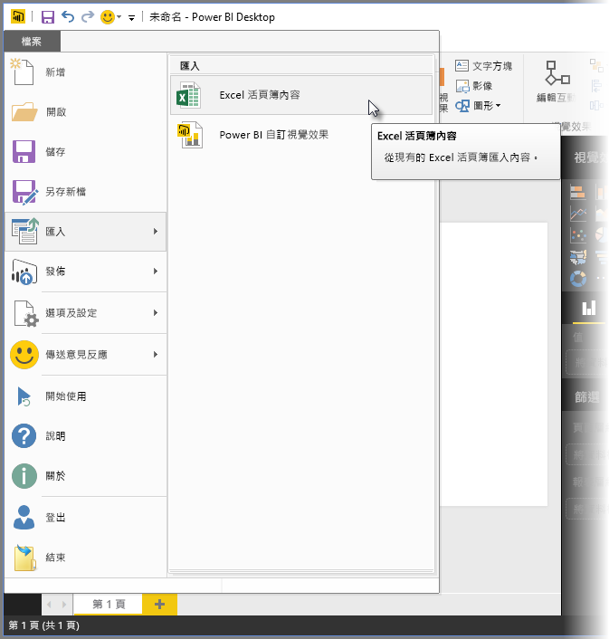
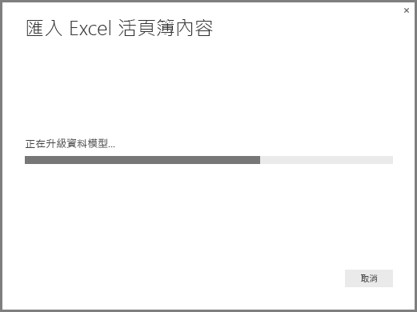
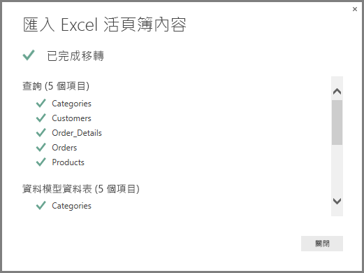

# 將 Excel 活頁簿匯入 Power BI Desktop
透過 **Power BI Desktop**，您可以輕鬆地將內含 Power Query 查詢、Power Pivot 模型和 Power View 工作表的 Excel 活頁簿，匯入 Power BI Desktop。 系統會根據 Excel 活頁簿自動建立報表和視覺效果，一旦匯入，您便可以使用現有功能及隨 Power BI Desktop 每月更新所發行的新功能，持續改進及精簡這些報表。

我們未來計劃提供 Excel 與 Power BI Desktop 之間的其他通訊 (例如匯入/匯出)；目前將活頁簿匯入 Power BI Desktop 的這項功能可讓現有的 Excel 使用者開始使用 Power BI Desktop。

## 如何匯入 Excel 活頁簿？
若要匯入活頁簿，請從 Power BI Desktop 選取 **檔案\>>[匯入] \>Excel 活頁簿內容**.

隨即會出現一個視窗，讓您選取要匯入的活頁簿。 活頁簿中的物件大小或數目目前沒有限制，但針對較大的活頁簿，Power BI Desktop 需要較長的時間進行分析及匯入。

> [!NOTE]
> 若要從 [共用商務用 OneDrive]  資料夾或從 [Office 365 群組]  資料夾載入或匯入 Excel 檔案，請使用 Excel 檔案的 URL，將檔案匯入 Power BI Desktop 中的 **Web** 資料來源。 您需要遵循幾個步驟，才能使用正確的**商務用 OneDrive** URL 格式，因此請查閱 [Power BI Desktop 中的商務用 OneDrive 連結](desktop-use-onedrive-business-links.md)，了解詳細資訊以及正確的步驟順序。
> 
> 

一旦選取活頁簿，Power BI Desktop 即會分析活頁簿，並將其轉換成 Power BI Desktop 檔案 (.pbix)。 這個動作是一次性事件；一旦使用上述步驟建立 Power BI Desktop 檔案，Power BI Desktop 檔案與原始 Excel 活頁簿不會有相依關係，因此您可以進行修改或變更 (以及儲存和共用)，而不會影響原始活頁簿。

匯入完成之後，會顯示 [摘要]  頁面，除了描述已轉換的項目之外，也會列出無法匯入的任何項目。

當您選取 [關閉]  時，報表會載入 Power BI Desktop。 下列影像顯示匯入 Excel 活頁簿之後的 Power BI Desktop：Power BI Desktop 會根據活頁簿內容自動載入報表。

匯入活頁簿之後，您可以使用 Power BI Desktop 中包含的任何特性和功能繼續處理報表，例如建立新的視覺效果、加入資料或建立新的報表頁面。

## 可匯入哪些活頁簿項目？
Power BI Desktop 可匯入 Excel 中的下列項目，通常稱為「物件」  。

| Excel 活頁簿中的物件 | Power BI Desktop 檔案中的最終結果 |
| --- | --- |
| Power Query 查詢 |所有來自 Excel 的 Power Query 查詢都會轉換成 Power BI Desktop 中的查詢。 如果 Excel 活頁簿中已定義查詢群組，則會在 Power BI Desktop 中複寫相同的組織。 除非在 Excel 中設定為 [只建立連線]，否則會載入所有查詢。 您可以在 Power BI Desktop 中，透過 [查詢編輯器]  的 [常用]  索引標籤中的 [屬性]  對話方塊來自訂載入行為。 |
| Power Pivot 外部資料連接 |所有 Power Pivot 外部資料連接都會轉換成 Power BI Desktop 中的查詢。 |
| 連結的資料表或目前的活頁簿資料表 |如果 Excel 中有工作表資料表連結到資料模型，或連結到查詢 (透過 [從資料表]  或 M 中的 *Excel.CurrentWorkbook()* 函式)，則會顯示下列選項： <ol><li>將資料表匯入 Power BI Desktop 檔案。 這份資料表是一次性的資料快照集，之後您便無法在 Power BI Desktop 中編輯資料表中的資料。 使用這個選項建立的資料表有一百萬個字元的大小限制 (結合所有資料行標頭和資料格的總計)。</li><li>保留原始活頁簿的連接。 或者，您可以保留原始 Excel 活頁簿的連接，Power BI Desktop 會在每次重新整理時擷取這個資料表中的最新內容，就像是針對 Power BI Desktop 中的 Excel 活頁簿建立的其他任何查詢一樣。</li></ul> |
| 資料模型的計算結果欄、量值、KPI、資料類別和關聯性 |這些資料模型物件會轉換成 Power BI Desktop 中的對等物件。 請注意，Power BI Desktop 目前不提供某些資料類別，例如**映像**。 在這些情況下，會重設有問題之資料行的資料類別資訊。 |
| Power View 工作表 |您可以針對 Excel 中的每個 Power View 工作表建立新的報表頁面。 這些報表頁面的名稱和順序會符合原始 Excel 活頁簿。 |

## 匯入活頁簿有任何限制嗎？
將活頁簿匯入 Power BI Desktop 有些限制，如下所列：

* **Analysis Services 表格式模型的外部連線：** 在 Excel 2013 中，您可以建立連到 SQL Server Analysis Services 表格式模型的連線，並在這些模型之上建立 Power View 報表，而不需要匯入資料。 目前不支援使用這種連接類型將 Excel 活頁簿匯入 Power BI Desktop。 因應措施是在 Power BI Desktop 中建立這些外部連接。
* **階層：** Power BI Desktop 目前不支援這種資料模型物件類型。 因此，將 Excel 活頁簿匯入 Power BI Desktop 時會略過階層。
* **二進位資料行：** Power BI Desktop 目前不支援這種資料模型資料行類型。 二進位資料行已從 Power BI Desktop 的結果資料表中移除。
* **不支援的 Power View 元素：** Power BI Desktop 不提供 Power View 中的一些功能，例如佈景主題或特定視覺效果類型 (具有播放軸的散佈圖、向下切入行為等)。 這些不支援的視覺效果會導致在 Power BI Desktop 報表中的對應位置出現「視覺效果不受支援」  的訊息，您可以視需要予以刪除或重新設定。
* **使用 Power Query 中的** ***From Table*** **或使用 M 中的**  ***Excel.CurrentWorkbook*** **之具名範圍：** 目前不支援將此具名範圍資料匯入到 Power BI Desktop 中，但它是 Power BI Desktop 的已規劃更新。 目前，這些具名範圍會當做外部 Excel 活頁簿的連接，載入 Power BI Desktop。
* **PowerPivot 至 SSRS：** 由於 Power BI Desktop 目前無法取得該資料來源，因此目前不支援 SQL Server Reporting Services (SSRS) 的 PowerPivot 外部連線。

