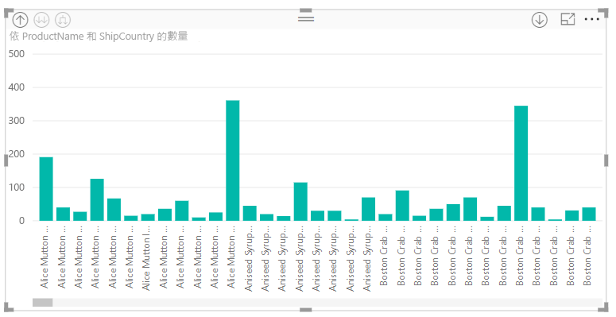

# 在 Power BI Desktop 中使用內嵌階層標籤
**Power BI Desktop** 支援**內嵌階層標籤**，這是兩個階層式切入加強功能的其中一個。 目前處於開發階段的第二個功能，能夠使用巢狀的階層標籤 (敬請期待，我們會經常更新)。   

## 內嵌階層標籤的運作方式
有了內嵌階層標籤，使用 [全部展開] 功能展開視覺效果時，就可以查看階層標籤。 查看這些階層標籤的一大好處是，展開您的階層式資料時，可以選擇依照不同階層標籤來**排序**。

### 使用內建的 [展開] 功能 (不含依階層標籤排序)
觀看內嵌階層標籤如何運作之前，讓我們先複習 [Expand to next level] \(展開至下一個層級\) 功能的預設行為。 這樣有助於我們了解內嵌階層標籤有多麼好用。

下圖顯示年度銷售額的橫條圖視覺效果。 當您以滑鼠右鍵按一下列時，可選擇 [Expand to next level] \(展開至下一個層級\)。

> [!NOTE]
> 除了以滑鼠右鍵按一下列之外，您也可在視覺效果的左上方選取 [展開] 按鈕。

  

選取 [Expand to next level] \(展開至下一個層級\) 之後，該視覺效果會展開從 [年] 至 [季] 的日期階層，如下圖所示。

請注意，[年] 和 [季] 的標籤會一起顯示為內嵌 - [全部展開] 時，這個標籤結構會延續至階層底部。

這是就是與具有 *日期/時間* 資料類型欄位相關聯的內建 [日期] 階層的運作方式。 讓我們前往下一節，看看新的內嵌階層標籤功能有何不同。

### 使用內嵌階層標籤
現在讓我們看看不同的圖表，其中使用的資料具有非正式的階層。 在下列視覺效果中，我們有一個橫條圖，內容為 [Quantity]，並使用 [ProductName] 作為軸。 在此資料中，*ProductName* 和 *ShipCountry* 會構成非正式的階層。 您可從這裡再次選取 [Expand to next level] \(展開至下一個層級\) 以向下切入至階層。

選取 [Expand to next level] \(展開至下一個層級\) 會以階層標籤的內嵌顯示下一個層級。 根據預設，階層會依照量值排序，在此範例中為 [Quantity]。 啟用內嵌階層標籤，您也可以選取右上角的省略符號 (**...**)，然後選取 [Sort by ProductName ShipCountry] \(依 ProductName ShipCountry 排序\)，如下圖所示。

選取 [ShipCountry] 之後，資料會依據選取的非正式階層排序，如下圖所示。

> [!NOTE]
> 內嵌階層標籤功能還不允許依據值排序內建的時間階層，只能依照階層順序排序。
> 
> 

## 疑難排解
您的視覺效果很可能會卡在展開的內嵌階層層級狀態中。 在某些情況下，您可能會發現某些視覺效果會卡在展開的模式中，這樣就無法向上切入階層。 如果您執行下列步驟，可能就會發生此情形 (解決方法是 *下方* 這些步驟)：

可能造成視覺效果卡在展開狀態的步驟：

1. 啟用**內嵌階層標籤**功能
2. 您建立具有階層的視覺效果
3. 然後 [全部展開] 並儲存檔案
4. 接著 *停用* **內嵌階層標籤** 功能，並重新啟動 Power BI Desktop
5. 然後重新開啟檔案

如果您不巧執行了這些步驟，而且視覺效果卡在展開的模式，您可以採取以下動作來針對這些錯誤進行疑難排解：

1. 重新啟用**內嵌階層標籤**功能，並重新啟動 Power BI Desktop
2. 重新開啟您的檔案，並向上切入至受影響的視覺效果頂端
3. 儲存檔案
4. 停用**內嵌階層標籤**功能，然後重新啟動 Power BI Desktop
5. 重新開啟檔案

或者，您可以刪除視覺效果再重新建立。

