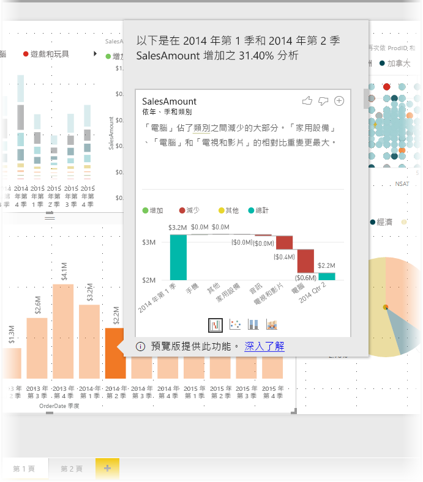
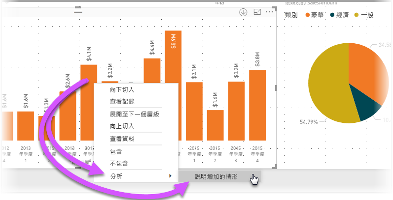
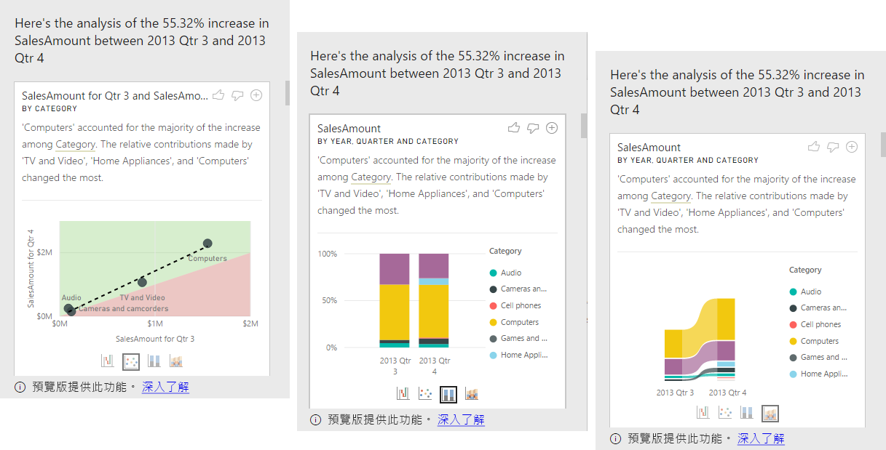

# 使用 Power BI Desktop 中的見解來說明視覺效果中顯示的增減情況 (預覽)

在視覺效果中，您經常會看到值大幅增加，然後急遽下降，並想知道造成此波動的原因。 使用 **Power BI Desktop** 中的**見解**，只要按幾下就能了解原因。

例如，假設下列視覺效果依「年」  和「季」  顯示「銷售額」  。 銷售額在 2014 年大幅減少，並在「第 1 季」  與「第 2 季」  之間急遽下降。 在此情況下，您可以探索資料來協助說明發生的變更。 

您可以要求 **Power BI Desktop** 說明圖表中的增減情況、查看圖表中的分佈因素，並取得快速、自動化、具洞察力的資料分析。 只要以滑鼠右鍵按一下資料點，然後選取 [分析] > [說明減少的情形]  (如果之前的橫條圖較低的話，則為增加情形)，或者 [分析] > [找出此分佈的不同之處]  ，即會以易於使用的視窗形式將深入解析傳遞給您。

這項深入解析的功能與內容相關，並會以正前方的資料點為依據，例如之前的橫條圖或資料行。

> [!NOTE]
> 這項功能目前處於預覽狀態，並可能有所變更。 自 2017 年 9 月起的 **Power BI Desktop** 版本開始，深入解析功能即預設為啟用 (您不需要勾選 [預覽] 方塊即可啟用)。

## 使用深入解析
若要使用見解來說明圖表中顯示的增減情況，只要以滑鼠右鍵按一下橫條圖或折線圖中的任何資料點，然後選取 [分析] > [說明增加的情形]  (或 [說明減少的情形]  ，因為所有見解都是以先前的資料點變更為依據)。

**Power BI Desktop** 即會對這項資料執行機器學習演算法，並於視窗中填入視覺效果與描述，以說明哪些類別對增加或減少情況的影響最大。 深入解析預設會有「瀑布圖」  視覺效果，如下圖所示。

選取瀑布圖視覺效果底部的小圖示，即可選擇要讓深入解析顯示散佈圖、堆疊直條圖，或功能區圖表。

頁面頂端有「喜歡」  和「不喜歡」  圖示，可讓您提供視覺效果和功能的意見反應。 這樣做會提供意見反應，但目前不會定型演算法來影響下次使用此功能時所傳回的結果。

值得注意的是，視覺效果頂端的 **+** 按鈕可讓您將選取的視覺效果新增至報表，就像您手動建立視覺效果一樣。 然後，您可以設定新增視覺效果的格式或進行調整，方法即如您在報表上對任何其他視覺效果的操作。 在 **Power BI Desktop** 中編輯報表時，您只能新增選取的深入解析視覺效果。

當報表在閱讀模式或編輯模式中時，您都可以使用深入解析，讓分析資料與建立可輕鬆新增至報表之視覺效果的作業更加多元。

## 所傳回結果的詳細資料

見解所傳回的詳細資料是為了指出兩個時段之間的差異，以協助您了解之間的變更。  

例如，如果從「第 3 季」  到「第 4 季」  的整體「銷售額」  增加 55%，而且產品的每個「類別」  會等量增加 (「電腦」、「音訊裝置」等銷售額增加 55%)，每個國家/地區和每種客戶類型也一樣，則資料中可找到來協助說明變更的內容並不多。 不過，這種情況一般很罕見，而且我們通常可以找到發生的差異，例如在「電腦」  和「家用設備」  類別之間大幅成長 63%，但「電視和音訊裝置」  只成長 23%，因此「電腦」  和「家用設備」  佔「第 4 季」  總金額的比重會大於「第 3 季」  。  在此範例中，此增加情形的合理解釋會是：「電腦以及電視和音訊裝置的銷售特別出色」  。 

因此演算法不會只傳回佔最大變更金額的值。 例如，如果銷售額大部分 (98%) 來自美國，在常見的情況下，增加情形大部分也會發生在美國。 但除非美國或其他國家/地區會大幅變更總金額的相對比重，否則在此內容中，「國家/地區」  並不重要。  

簡單來說，您可以將此演算法想成擷取模型中的所有其他資料行，並依資料行計算時段「之前」  與「之後」  的明細，判斷該明細中發生的變更量，然後傳回具有最大變更的資料行。 例如，在上述範例中已選取「類別」  ，因為「電視和視訊裝置」  所佔的比重從 33%　降至 26% (降幅 7%)，而「家用設備」  的比重從無成長超過 6%。 

針對傳回的每個資料行，可能會顯示四個視覺效果。 其中三個視覺效果是為了指出兩個時段之間的比重變更。 例如，用於說明從「第 2 季」  到「第 3 季」  的增加情形。

### 散佈圖

散佈圖視覺效果會針對資料行 (在本例中為「類別」  ) 的每個值，顯示第一個時段的量值 (x 軸上) 與第二個時段的量值 (y 軸上) 比較。 因此，如下圖所示，值增加的任何資料點會在綠色區域中，而值減少的任何資料點則會在紅色區域中。 

虛線顯示最佳擬合；因此，此線條上方的資料點相較於整體趨勢呈現增加，而此線條下方的資料點則呈現減少。  

請注意，其值在任一時段為空白的資料項目不會出現在散佈圖上 (例如本例中的「家用設備」  )

### 100% 堆疊直條圖

100% 堆疊直條圖視覺效果會顯示所選資料行之前和之後的量值，如 100%堆疊直條圖所示。 這可並排比較之前和之後的比重。 工具提示會顯示所選值的實際比重。

### 功能區圖表

功能區圖表視覺效果也會顯示之前和之後的量值。 這在顯示比重變更方面特別有用，發生此情況時，比重的「順序」  會變更 (例如，如果「電腦」  之前是比重最高的項目，但落到第三名)。 

### 瀑布圖

第四個視覺效果是瀑布圖，顯示不同時段之間的主要實際增減情況。 此視覺效果會清楚顯示實際變更，但不會單獨指出比重程度的變更，以實際指出為何選擇該資料行作為相關資料行。 

當排名資料行以指出哪個資料行在相對比重方面的差異最大時，請考慮下列事項： 

* 當資料行具有很大的基數時，會將基數列入考量，因為差異較不具統計顯著性且較不相關。 

* 這些類別的差異若原始值很高或非常接近零，則其加權會比其他類別高。 例如，如果某個類別僅佔銷售額的 1%，之後變更為 6%，則相較於其比重從 50% 變更為 55% 的類別，該類別會更具統計顯著性，因此會視為更相關。 

* 採用各種不同的啟發學習法來選取最有意義的結果，例如考慮資料之間的其他關聯性。
 
查看不同的資料行之後，會選擇並輸出相對比重變更最大的資料行。 針對每個資料行，會在描述中指出比重變更幅度最大的值。 此外，也會指出實際增減情況最大的值。

## 考量與限制
因為這些見解都是以先前的資料點變更為依據，所以選取視覺效果中的第一個資料點時，就無法使用此功能。 

下列清單是目前不支援的**增減情況說明**案例集合：

* TopN 篩選
* 包含/排除篩選
* 量值篩選
* 非數字量值
* 使用「顯示值為」
* 篩選的量值 - 所篩選量值為已套用特定篩選的視覺效果層級計算 (例如「法國總銷售額」  )，並用於見解功能所建立的其中一些視覺效果
* X 軸上的類別資料行 (除非它定義純量的依資料行排序作業)。 如果使用階層，則在使用中階層內的每個資料行皆必須符合此條件

此外，深入解析目前不支援下列模型類型和資料來源：

* DirectQuery
* Live connect
* 內部部署的 Reporting Services
* 內嵌

## 後續步驟
如需 **Power BI Desktop** 的詳細資訊，以及如何開始使用，請參閱下列文章。

* [Power BI Desktop 是什麼？](desktop-what-is-desktop.md)
* [Power BI Desktop 的查詢概觀](desktop-query-overview.md)
* [Power BI Desktop 中的資料來源](desktop-data-sources.md)
* [連接至 Power BI Desktop 中的資料](desktop-connect-to-data.md)
* [使用 Power BI Desktop 合併資料並使其成形](desktop-shape-and-combine-data.md)
* [Power BI Desktop 中的常見查詢工作](desktop-common-query-tasks.md)   

